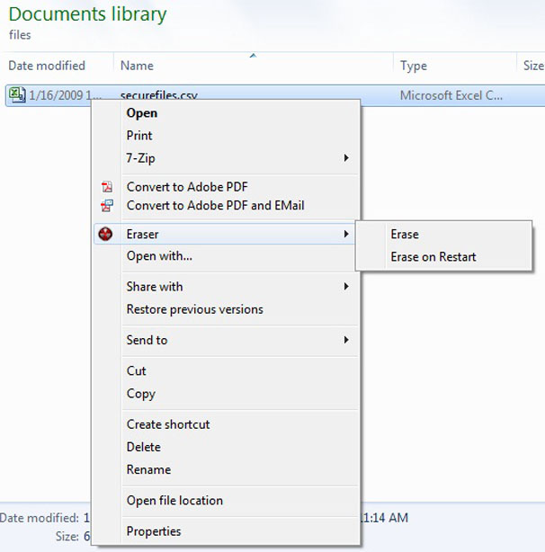
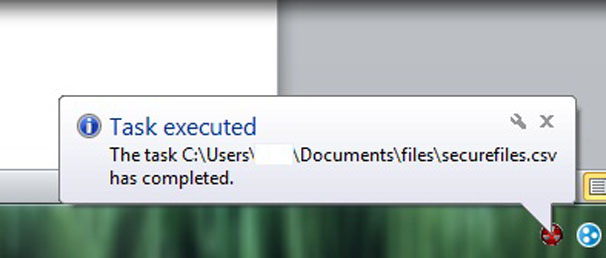

+++
title = "قبل التخلص من جهازك.. تعرف علي كيفية حذف البيانات بشكل نهائي"
date = "2015-05-17"
description = "هل تعلم عزيزي القارئ أنه عندما تقوم بحذف أي ملف من على جهاز فإنه لا يزال موجودا على القرص الصلب، فالبيانات المحذوفة مهما كان نوعها يمكن استرجاعها بقليل من الجهد، فإذا كنت ترغب ببيع جهازك أو تغييره فيجب عليك عزيزي القارئ محو بياناتك بشكل آمن لضمان عدم استرجاعها، إليك الطريقة."
categories = ["مهارات رقمية",]
tags = ["موقع لغة العصر"]

+++

هل تعلم عزيزي القارئ أنه عندما تقوم بحذف أي ملف من على جهاز فإنه لا يزال موجودا على القرص الصلب، فالبيانات المحذوفة مهما كان نوعها يمكن استرجاعها بقليل من الجهد، فإذا كنت ترغب ببيع جهازك أو تغييره فيجب عليك عزيزي القارئ محو بياناتك بشكل آمن لضمان عدم استرجاعها، إليك الطريقة.

أداة Eraser هي أداة أمنية متقدمة تعمل على نظام الويندوز، وتستطيع بواسطة هذه الأداة حذف أي بيانات بشكل دائم بحيث لا يمكن استرجاعها عن طريقة الكتابة عليها عدة مرات.

بطبيعة نظام الويندوز فإنه لا يقوم بحذف الملفات من القرص الصلب، ولكنه يقوم بحذف المرجع الخاص من الملف من جدول النظام، فيبقى الملف موجودا إلى أن يقوم الويندوز بكتابة ملف آخر في نفس مكان الملف القديم.

1. قم بتحميل أداة Eraser [من الموقع الرسمي من هنا](http://eraser.heidi.ie/download.php).
2. قم بتثبيت الأداة، ستجد الاختيار الخاص بها قد تمت اضافته إلى قائمة زر الفأرة الأيمن.
3. لكي تحذف أي ملف أو مجلد بشكل نهائي قم بالضغط بزر الفأرة الأيمن ثم من قائمة Eraser قم باختيار Erase.

4. ستبدأ الأداة بحذف الملف كما بالصورة:

ملاحظة: يستغرق الحذف بواسطة أداة Eraser وقتا أطول من الحذف بالطريقة العادية فعلى سيبل المثال ستستغرق الأداة حوالي 30 دقيقة لحذف ملف بحجم 4-5 جيجا. 5. بعد انتهاء الأداة من الحذف سيظهر لك الإشعار كما بالصورة.

---

هذا الموضوع نٌشر باﻷصل على موقع مجلة لغة العصر.

http://aitmag.ahram.org.eg/News/15545.aspx
