+++
title = "التطبيقات اللامركزية تعيد رسم ملامح الإنترنت"
date = "2019-12-01"
description = "إحدى السمات المميزة لمجال التكنولوجيا هي الحيوية الكبيرة وسرعة التغييرات. ففي لحظة تجد العالم يتوجه إلى تقنية معينة، ثم فجأة تجد هذه التقنية أصبحت بالية وانتهي زخمها كما تنفجر الفقاعة. وكذلك هو الحال مع التطبيقات والبرامج، فهناك عدد لا حصر له من لغات البرمجة والتقنيات المختلفة وأطر العمل المستخدمة في تطوير التطبيقات، لكن لا يستطيع أحد الجزم أن أحدها يمكن أن يوفر أفضل النتائج. ومع تحول العالم نحو التطبيقات تستمر التقنيات في التطور، لتظهر تقنيات جديدة واعده في شتى المجالات. والتطبيقات اللامركزية DApps هي أحد تلك التقنيات التي يُتوقع لها مستقبل باهر، وقد تعيد تشكيل ملامح الإنترنت من جديد. فهي سلالة جديدة من التطبيقات التي لا تخضع لتحكم أو ملكية سلطة واحدة، ولا يمكن أن يتم إيقافها أو أن يكون هناك وقت تعطل."
categories = ["تقارير",]
tags = ["مجلة لغة العصر"]
images = ["images/0.jpg"]

+++
إحدى السمات المميزة لمجال التكنولوجيا هي الحيوية الكبيرة وسرعة التغييرات. ففي لحظة تجد العالم يتوجه إلى تقنية معينة، ثم فجأة تجد هذه التقنية أصبحت بالية وانتهي زخمها كما تنفجر الفقاعة. وكذلك هو الحال مع التطبيقات والبرامج، فهناك عدد لا حصر له من لغات البرمجة والتقنيات المختلفة وأطر العمل المستخدمة في تطوير التطبيقات، لكن لا يستطيع أحد الجزم أن أحدها يمكن أن يوفر أفضل النتائج. ومع تحول العالم نحو التطبيقات تستمر التقنيات في التطور، لتظهر تقنيات جديدة واعده في شتى المجالات. والتطبيقات اللامركزية DApps هي أحد تلك التقنيات التي يُتوقع لها مستقبل باهر، وقد تعيد تشكيل ملامح الإنترنت من جديد. فهي سلالة جديدة من التطبيقات التي لا تخضع لتحكم أو ملكية سلطة واحدة، ولا يمكن أن يتم إيقافها أو أن يكون هناك وقت تعطل.

قبل أن نخوض في غمار تفاصيل التطبيقات اللامركزية نحتاج إلى أن نعطي لمحة سريعة عن تقنية البلوك تشين:

## البلوك تشين

**البلوك تشين** أو سلسلة الكتل هي قاعدة بيانات موزعة تمتاز بقدرتها على إدارة عدد لا نهائي من السجلات التي تسمي الكتلة (block)، وتحتوي كل كتلة على طابع زمني خاص بها مع رابط يربطها بالكتلة السابقة لها في السلسلة المتصلة. صُممت البلوك تشين بحيث يمكنها المحافظة على البيانات المخزنة بها ومنع تعديلها، فعندما تخزن معلومة ما في كتلة يتم ربطها بسلسلة الكتل السابقة لها، وبالتالي لا يمكن لاحقًا تعديل تلك المعلومة. وفي حالة الرغبة في تعديل معلومة يتم إنشاء كتلة جديدة بها المعلومات الجديدة، أي أننا يمكننا الحصول على تسلسل كامل بجميع التعديلات التي تمت على السجل.

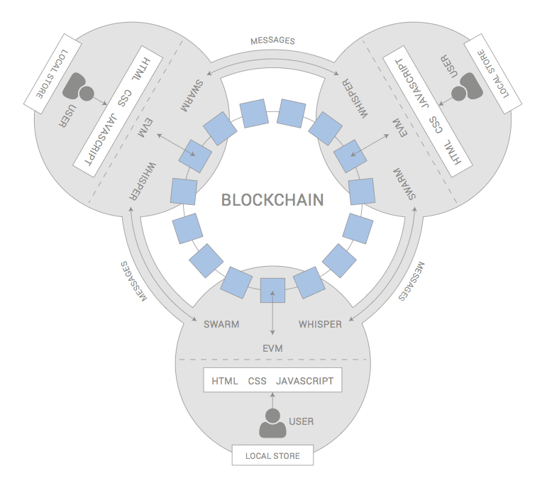

تتميز البلوك تشين بأنها لامركزية، حيث يتم توزيع سجل كل معاملة على العشرات من الأجهزة عن طريق تقنية "الند للند" Peer to Peer أو P2P اختصارا، وعندما يتم دخول البيانات وتسجيلها لا توجد حاجة إلى وجود طرف ثالث؛ وبالتالي تكون معالجة البيانات وتخزينها أسرع. إضافة إلى أنه يتم تشفير البيانات قبل إرسالها أو انتقالها من مكان إلى آخر.

### استخدامات تقنية البلوك تشين

تعد العملات الرقمية كـ البيتكوين وغيرها من العملات المشفرة أحد أشهر تطبيقات تقنية البلوك تشين، حيث يمتاز هذا الشكل من الأموال الرقمية بكونه على قدر عالي من الأمان والموثوقية حيث يصعب التلاعب بالعملة الرقمية المشفرة وتزييفها.

أيضا يمكن استخدام البلوك تشين في العقود الذكية التي تحدث تلقائيا بمجرد استيفاء شروط محددة مسبقا، مما يوفر الكثير من الجهد والوقت والتكاليف، وعلى الرغم من الاعتماد القليل على العقود الذكية حاليًا، من المتوقع أن يزداد الطلب عليها بسبب ازدياد حجم التجارة باستخدام العملات الرقمية في جميع أنحاء العالم.

ولم تعد البلوك تشين محصورةً في المجالات المالية والتحويلات والعملات الرقمية فقط، بل توسعت إمكانياتها بشكلٍ كبير في الفترة الماضية وأصبحت تستخدم في عدد من المجالات المختلفة، وأحد هذه الاستخدامات هي التطبيقات اللامركزية.

## التطبيقات اللامركزية

التطبيقات اللامركزية Decentralized Applications (DApps) هي التطبيقات التي تعمل بالاعتماد على تقنية بلوك تشين أو شبكة ند للند P2P بدلاً من جهاز كمبيوتر وحيد أو مجموعة أجهزة مركزية. ونظرا لأن المفهوم لا يزال حديث العهد فمن الصعب إعطاء تعريف محدد ودقيق له، لكن يمكننا وضع الخطوط العريضة لهذا المفهوم بتحديد الأربعة جوانب الرئيسية التي تمثله كالأتى.

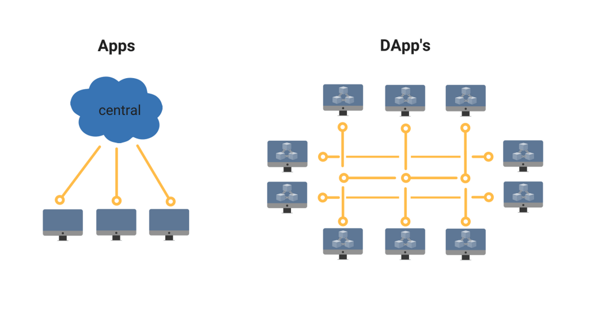

### 1- المصدر المفتوح

السمة الأولي والرئيسية للتطبيقات اللامركزية هي أنها مفتوحة المصدر، فينبغي أن يكون الكود المصدري الأساسي متاحا للجميع للاستفادة منه أو تعديله. وذلك لأن أحد الخصائص الأساسية ل DApps هي الاستقلالية والاتفاق بالإجماع، حيث تحتاج التغييرات الجديدة إلى موافقة كل أو غالبية المستخدمين ليتم اعتمادها.

### 2- اللامركزية

كما يوحي اسمهما، تعمل هذه التطبيقات بشكل لا مركزي بخلاف الشكل الشائع للتطبيقات الشهيرة حاليا، بمعني التطبيقات اللامركزية تخزن كل شيء على سلاسل بلوك تشين لامركزية أو باستخدام أي تقنية تشفير أخرى لحماية التطبيق من مخاطر السلطة المركزية وضمان الطبيعة المستقلة.

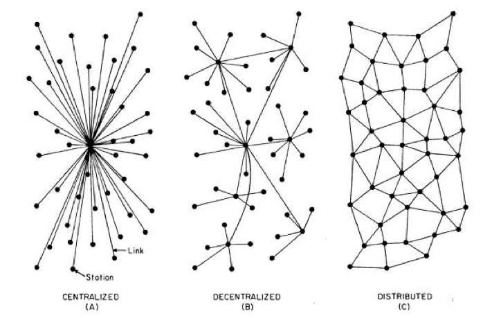

وهذا على النقيض مع المركزية التي تعتمدها أغلب التطبيقات الحالية، فمثلا الفيس بوك هو نظام مركزي يعمل لدى عدد كبير من المستخدمين حول العالم في نفس الوقت، لكن هذا التطبيق مملوك ويدار من قبل جهة وحيدة فقط. وفي حالة كان الفيس بوك لامركزيا، فالمنشورات ستصبح مملوكة لأصحابها فقط ولا يمكن لأي كان حذفها حتى مؤسسي التطبيق أنفسهم.

توفر اللامركزية حلًا ممتازا لمشكلة "نقطة العطل المفردة" وهي مشكلة وجود جزء من نظام ما، إذا فشل هذا الجزء فإن كامل النظام سوق يتوقف عن العمل. فالتطبيقات اللامركزية لا يمكن إغلاقها لأنه لا يوجد خادم واحد أو مجموعة خوادم عند إطفائها يتعطل النظام. وذلك لأن البيانات موزعة بشكل لامركزي عبر عقد الأجهزة التي تستخدم التطبيق، وكل عقدة مستقلة بذاتها، حتى إذا فشلت واحدة تظل العقد الأخرى قادرة على تشغيل على الشبكة.

### 3- التحفيز

يقصد بها عملية مكافأة من يقوم بالتصديق على سجلات الشبكة، وذلك نظرًا لأن التطبيق يعتمد على سلاسل بلوك تشين اللامركزية. وتتم المكافأة بإعطاء رموز تشفير (cryptographic tokens) أو أي شكل من أشكال الأصول الرقمية التي لها قيمة.

### 4- الخوارزمية أو البروتوكول

يحتاج أي تطبيق لامركزي إلى الاتفاق على آلية تمثل إثبات للقيمة proof of value في نظام التشفير. ويمنح هذا الأسلوب بشكل أساسي القيمة لرموز التشفير، كما يسمح بإنشاء بروتوكول توافقي يقره المستخدمون لتوليد رموز مشفرة ذات قيمة فعلية.

بتطبيق هذه السمات الأربع تكون عملة البتكوين نفسها هي أول تطبيق لامركزي فعليا، فهي تستخدم تقنية البلوك تشين وتحل مشكلة المركزية وتعطي المستخدمين القدرة على تنفيذ المعاملات دون أي وسيط أو سلطة مركزية عن طريق دفاتر حسابات عامة مكتفية ذاتيا.

ويمكنك الاطلاع على دليل التطبيقات اللامركزية والذي يحتوي على أكثر من 1000 تطبيق حاليا من خلال الرابط [https://app.co](https://app.co/)

وبينما مهدت البتكوين الطريق للعملات الرقمية وتقنية البلوك تشين فإن إيثريوم كانت أول من أظهر الإمكانات الحقيقية لتقنية البلوك تشين عن طريق تمكين المطورين من جميع أنحاء العالم من تشغيل تطبيقاتهم اللامركزية بالاعتماد على منصتهم.

### أنواع التطبيقات اللامركزية

يمكن تقسيم التطبيقات اللامركزية بحسب حالات استخدامها إلى ثلاثة أقسام:

#### 1- إدارة ونقل الأموال

يمكن أن تستخدم التطبيقات اللامركزية لجعل تحويل الأموال حول العالم أكثر سهولة. وقد رأينا بالفعل نجاح البيتكوين وبعض العملات الرقمية الأخرى. فباستخدام شبكة البلوك تشين ورمز تشفير خاص يمكن للتطبيقات اللامركزية زيادة سرعة تعاملات نقل وتحويل وإدارة وإقراض الأموال بشكل كبير عن طريق الاستغناء عن وجود الوسيط بالإضافة لتعزيز الأمان من خلال آلية الإجماع المتبعة التي لا يمكن تغييرها دون موافقة الغالبية.

#### 2- إدارة الأعمال

تستطيع الشركات الاستفادة من التطبيقات اللامركزية لتبسيط العمليات بدون تدخل بشري، وذلك بفضل العقود الذكية Smart Contracts التي تستخدم لحل المشاكل الحرجة وتحسين كفاءة المهام. فعلي سبيل المثال يمكن لشركات نقل البضائع من مناطق الإنتاج إلى مناطق الاستهلاك دمج شرائح تحديد الهوية بموجات الراديو (RFID) في الشحنات، ومن ثم مسح الشرائح في منافذ التسلم لتتم تسوية الدفع تلقائيا عبر عقد ذكي بين البائع والمشتري.

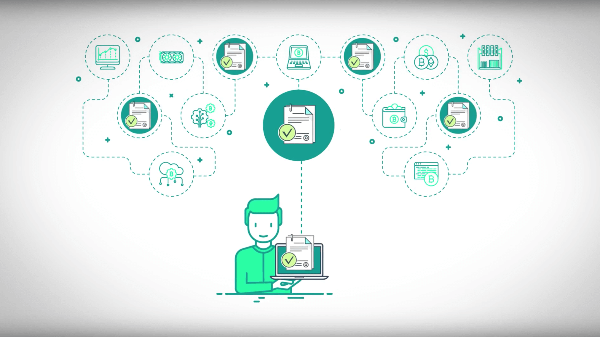

#### 3- المنظمات الذاتية اللامركزية DAO

تعد بداية انتشار منظمات مجهولة الهوية دون قادة يمكنها أن تعمل كشركات من خلال القواعد التي تحددها لغات البرمجة على بلوك تشين ظاهرة جديدة كليًا. وتشمل هذه القواعد من يمكن أن يكون عضوًا في هذه المنظمة وعدد الأعضاء الذين لهم حق التصويت وأي قطاع أعمال ستعمل فيه وكيف سيتم تبادل قيم رموز التشفير، حيث يتم برمجة كل هذه المعلومات في البلوك تشين التي ستشغل المنظمة.

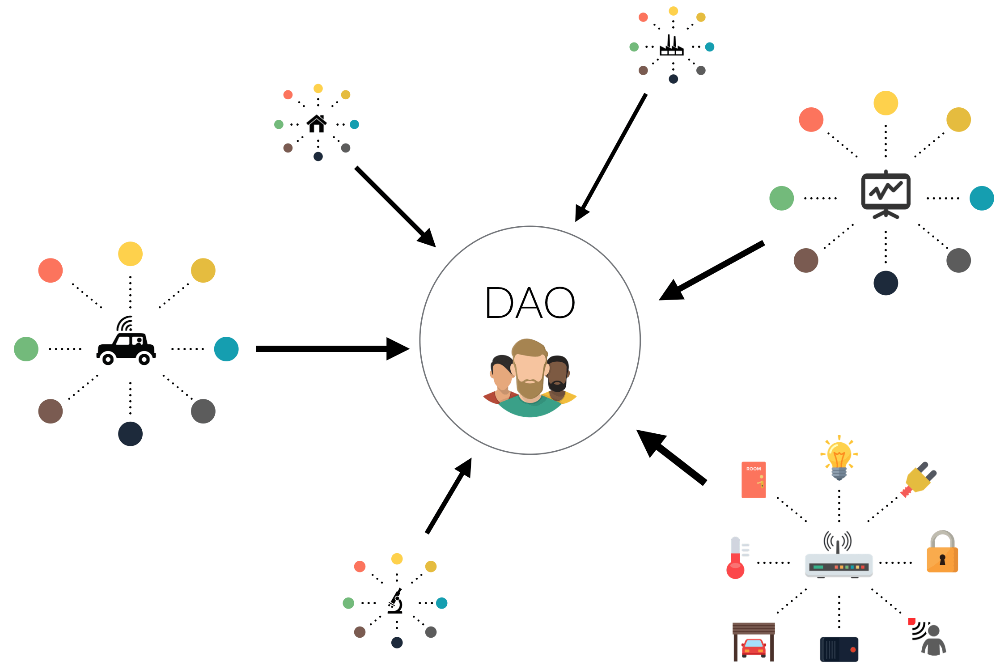

## كيف ستؤثر التطبيقات اللامركزية في الإنترنت؟

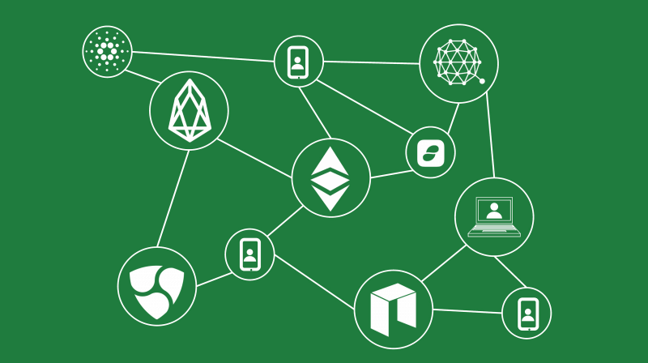

خلال العصر الثاني للإنترنت، الذي بدأ منذ منتصف العقد الماضي وحتى الوقت الحالي، عملت بعض شركات التقنية، خاصة الرباعي العملاق جوجل وآبل وفيسبوك وأمازون على بناء برمجيات وخدمات مختلفة مما أدي إلى أن مليارات الأشخاص حول العالم باتوا يتمتعون بتكنولوجيات مذهلة أغلبها مجانية. لكن المشكلة اللي بدت جلية أنه أصبح من الصعب جدا بالنسبة للشركات الناشئة والمبتكرين تطوير تواجدهم على الشبكة دون التخوف من قيام المنصات المركزية بتغيير قواعد اللعبة بشكل مفاجئ، والظفر بجمهور المستخدمين والعائدات المالية.

ونتيجة لذلك، تم تضييق الخناق على الابتكار، وباتت الإنترنت فضاء أقل ديناميكية وإثارة. كما تسببت مركزية الشركات المتحكمة في الإنترنت في تفاقم التوترات الاجتماعية التي تظهر اليوم في شكل ظواهر مثل الأخبار المضللة، والحسابات الآلية التي تتلاعب بالرأي العام، واستخدام خوارزميات غير محايدة للتحكم في نتائج البحث.

أما التطبيقات اللامركزية التي تعتمد على التشفير وآليات الإجماع مثل البلوك تشين ولنأخذ الإيثريوم مثالا فهي منصة للبرمجة العامة يمكن استخدامها لكل الأغراض تقريباً، تستطيع حل العديد من المشاكل التي تواجه التطبيقات المركزية عبر تقديم تشجيعات مالية للمطورين، والمشرفين، وبقية المستخدمين في الشبكة، كما تعد أكثر صلابة من الناحية التقنية لكونها قادرة على تخزين المعلومات مع منع إدخال تغييرات اعتباطية عليها. وتستخدم التطبيقات اللامركزية آليات متعددة لضمان المحافظة على الحيادية أثناء نموها، وبالتالي تجنب توظيفها في عمليات التحايل والدعاية التي تمارسها المنصات المركزية. ويعود هذا بالأساس إلى أن العقد بين التطبيقات اللامركزية والأشخاص المشاركين فيها مفروض من خلال كود مفتوح المصدر.

## التطبيقات اللامركزية أم التطبيقات التقليدية

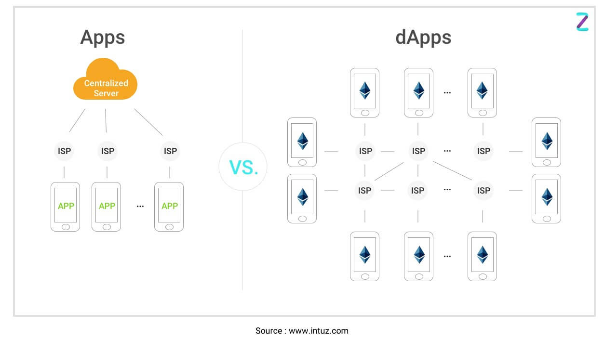

باعتماد اللامركزية نموذجا للعمل في التطبيقات اللامركزية يتم ضمان الأمان والسرعة. ونظرا لطبيعة تقنية البلوك تشين تصبح البيانات غير قابلة للتلاعب والسجلات غير قابلة للتعديل. فعلى عكس التطبيقات المركزية التقليدية تتمتع هذه التطبيقات بمستوى عالي من الأمان وغير قابل للتغيير عبر الاختراقات، ويمكن إجمال أسباب تفضيل التطبيقات اللامركزية فيما يلي:

- أسرع من نظيرتها التقليدية.

- دعم عمليات الدفع بسهولة وسرعة دون الحاجة إلى بوابات دفع لقبول الأموال.

- مستويات أمان عالية بسبب العقود الذكية المرتبطة بمفاتيح خاصّة مما يجعل عملية اختراقها أمرًا في غاية الصعوبة.

- يمكن إخفاء الهوية بسهولة دون أي مشاكل في إتمام العمليات المختلفة.

- سجلات بيانات موثوقة، حيث يمكن للمستخدمين الوصول إلى سلسلة الكتل العامة للتحقق من كافة المعلومات.

- عدم وجود وقت تعطل بسبب عدم الاعتماد على سيرفرات مركزية.

## منصة Blockstack للتطبيقات اللامركزية

Blockstack هي منصة حوسبة لامركزية مفتوحة المصدر توفر للمطورين مكتبات برمجية لبناء التطبيقات اللامركزية كما توفر أيضا بروتوكولات لامركزية للمصادقة وتخزين الملفات وتوزيع البرمجيات. تهدف المنصة إلى إعطاء المستخدمين التحكم الكامل في هويتهم وبياناتهم. تدعم المنصة حاليا أكثر من 270 تطبيق حاليا، ويشارك بها أكثر من 8 آلاف مطور نشط.

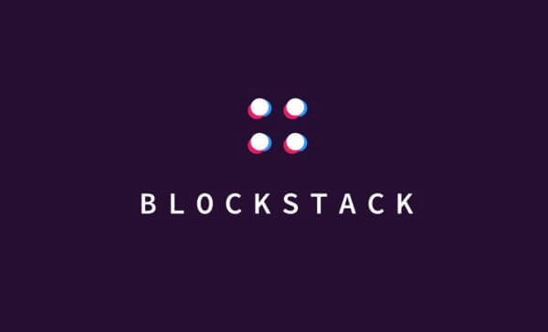

وتحتوي المنصة على العديد من التطبيقات اللامركزية البديلة للخدمات المنتشرة على الإنترنت مثل البريد الإلكتروني، وخدمات المراسلة، ونقل الملفات، وتحرير ومشاركة المستندات، وتحرير الصور، والتخزين السحابي، وإدارة المهام، وحفظ الملاحظات، وتنظيم الوقت. وجميعها متاحة على الموقع الرسمي [https://browser.blockstack.org](https://browser.blockstack.org/)

### 4 طبقات من الحوسبة اللامركزية

تعتمد المنصة على 4 طبقات من الحوسبة اللامركزية:

#### 1- أكوام سلسلة الكتل Blockchain Stacks

إن الأساس لشبكة Blockstack هو أكوام سلسلة الكتل والتي تمكن المستخدمين من التسجيل والتحكم في الأصول الرقمية مثل أسماء المستخدمين الموحدة، وأيضا تسجيل وتنفيذ العقود الذكية. تمكن الأصول الرقمية المستخدمين من التحكم في تخزين البيانات وربط اعتماديات الوصول لخزن البيانات الخاصة باسم المستخدم الموحد.

#### 2- نظام التخزين Gaia

وهو نظام تخزين يتحكم فيه المستخدم يمكن التطبيقات من التفاعل مع خزن البيانات الخاصة، أو التخزين عن بعد. جميع البيانات المخزنة على النظام مشفرة وموقعه بواسطة مفاتيح التشفير الخاصة بالمستخدم.

#### 3- مصادقة Blockstack

بروتوكول المصادقة المعتمد للمصادقة بشكل لامركزي مع التطبيقات المختلفة، ويسمح هذا البروتوكول للمستخدمين باستخدام هوياتهم وتوفير المعلومات حول مكان التخزين ضمن نظام Gaia الذي سيتم استخدام لتخزين بيانات المستخدم الخاصة بالتطبيق.

#### 4- المكتبات وحزم تطوير البرمجيات

والتي تمكن مطوري التطبيقات من التفاعل مع المكونات المختلفة لشبكة Blockstack. فعلى سبيل المثل، يسمح برنامج خادم Blockstack للمستخدمين بالتسجيل وإدارة هوياتهم، بينما تجعل مكتبات التطوير بتاء تطبيقات جديدة أمرا سهلا تمام مثل بناء تطبيقات الويب التقليدية.

## Dmail.. الجيل الجديد من البريد الإلكتروني

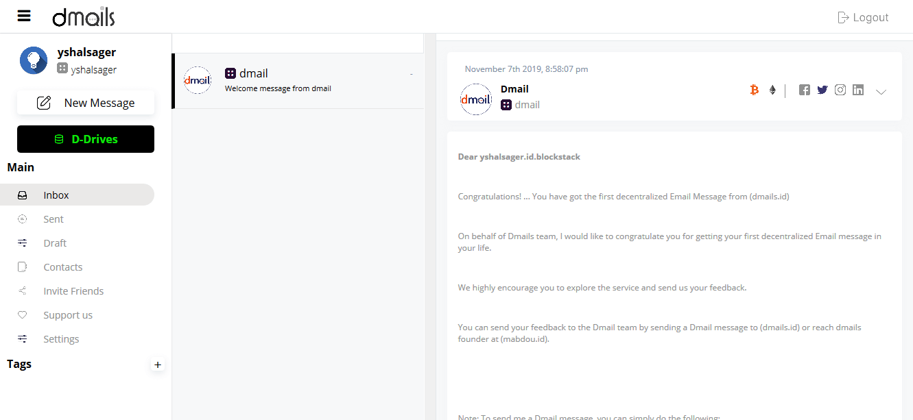

من التطبيقات اللامركزية الجديرة بالذكر تطبيق Dmail المصري الذي تم إطلاق النسخة الأولى منه خلال فعاليات معرض جيتكس دبي للتقنية 2019، وذلك في إطار المشاركة الأولى لشركة Dmail المصرية المنتجة للتطبيق، تحت مظلة مركز الإبداع التكنولوجي وريادة الأعمال TIEC بهيئة تنمية صناعة تكنولوجيا المعلومات "إيتيدا"، التابعين لوزارة الاتصالات وتكنولوجيا المعلومات.

ويعتمد التطبيق على تقنية البلوك تشين في تأمين المراسلات الخاصة وتشفيرها بين المرسل والمستقبل، بالإضافة لتخزين محتويات الرسائل لامركزيا بهدف حماية خصوصية المستخدمين لأقصى درجة، حيث يحصل المستخدم لهذه المنصة على أعلى درجات تأمين وتشفير البيانات لرسائل البريد الإلكتروني الخاصة به مع ضمان عدم التعرض لخصوصية الرسائل أو الاطلاع عليها من قِبل الشركة المطورة للنظام كما هو الحال في خدمات أخرى مشابهة تنتهك خصوصية المستخدمين.

يرمز الحرف D إلى Decentralized أي لا مركزي، أي أن البيانات سواء كانت نصوص أو ملفات، ورسائل البريد الإلكتروني يتم تخزينها بصورة لا مركزية ولا يتحكم فيها أي جهة أو مؤسسة ولا حتى مطوري التطبيق، بل هي مملوكة بالكامل لصاحبها ويستطيع في أي وقت يريد مسح أي شيء من بياناته الخاصة لأنها ببساطه لا يتم تخزينها في خوادم خاصة.

ونجح التطبيق في الحصول على المركز الأول للشهر الرابع على التوالي خلال شهر سبتمبر 2019 في المسابقة الدولية التي تنظمها شركة Blockstack، وسط منافسة قوية تضم أكثر من 200 تطبيق حول العالم.

لاستخدام التطبيق الجديد تحتاج إلى إنشاء حساب جديد من خلال الرابط https://app.dmail.online/create-new أو يمكنك التسجيل باستخدام حساب Blockstack الخاص بك.

بعد ذلك ستتمكن من إرسال واستلام رسائل البريد الإلكتروني عبر الخدمة الجديدة. ولاحظ أن Dmail يتعامل مع العناوين بواسطة Blockstack ID، بمعني أنه يمكنك إرسال الرسائل إلى مستخدمي الخدمة فقط باستخدام المعرف الفريد ل Blockstack الخاص بالمستخدم، فمع Dmail انتهي عصر ال@.

## طريقة أفضل لبناء خدمات اﻹنترنت

إذا، عندما ظلت المنصات المركزية مسيطرة لوقت طويل، نسي المستخدمين أن هناك طريقة أفضل لبناء خدمات الإنترنت. ومن هذا المنطلق، تمثل التطبيقات اللامركزية طريقة فعالة لتطوير برمجيات مملوكة للمستخدمين بشكل جماعي، وتوفير أسس عادلة لعمل المطورين، والمبتكرين، والشركات. ولقد شهد العالم قيمة الأنظمة اللامركزية في العصر الأول للإنترنت، ونأمل أن تتمكن التطبيقات اللامركزية من إعادة رسم ملامح الإنترنت في العصر المقبل.

---

هذا الموضوع نُشر باﻷصل في مجلة لغة العصر العدد 228 شهر 12-2019 ويمكن الإطلاع عليه [هنا](https://drive.google.com/file/d/1X4O2E4YzAfb5wKQH0UmY_KtiAi_i0h3E/view?usp=sharing).

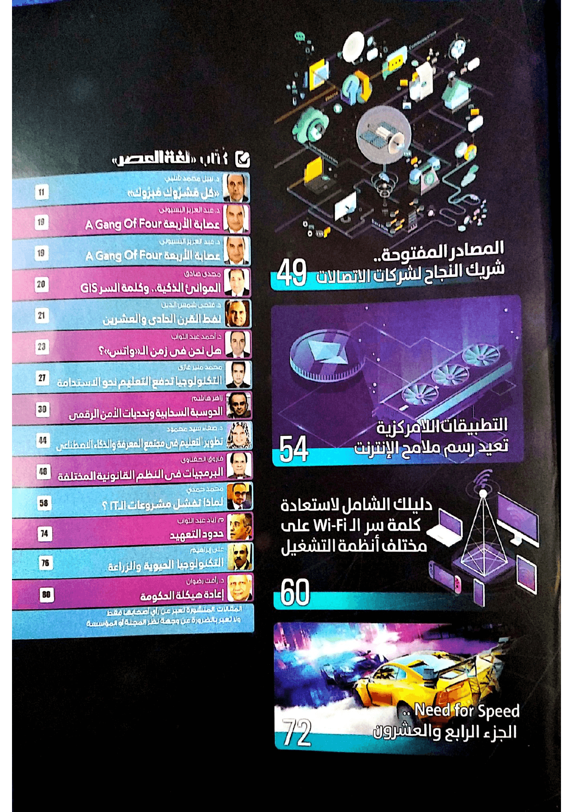

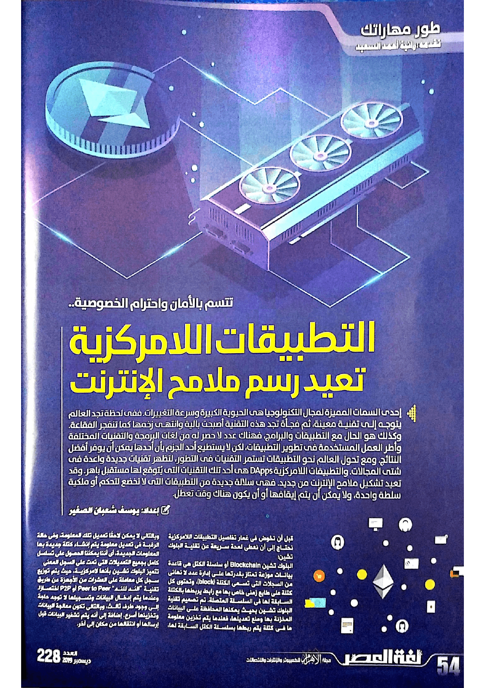

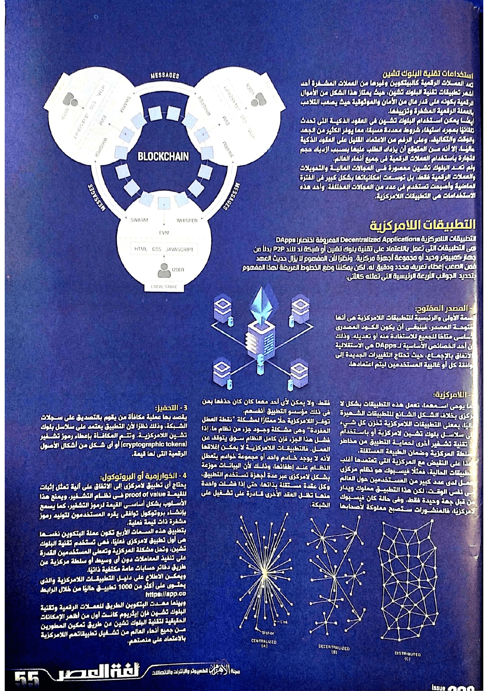

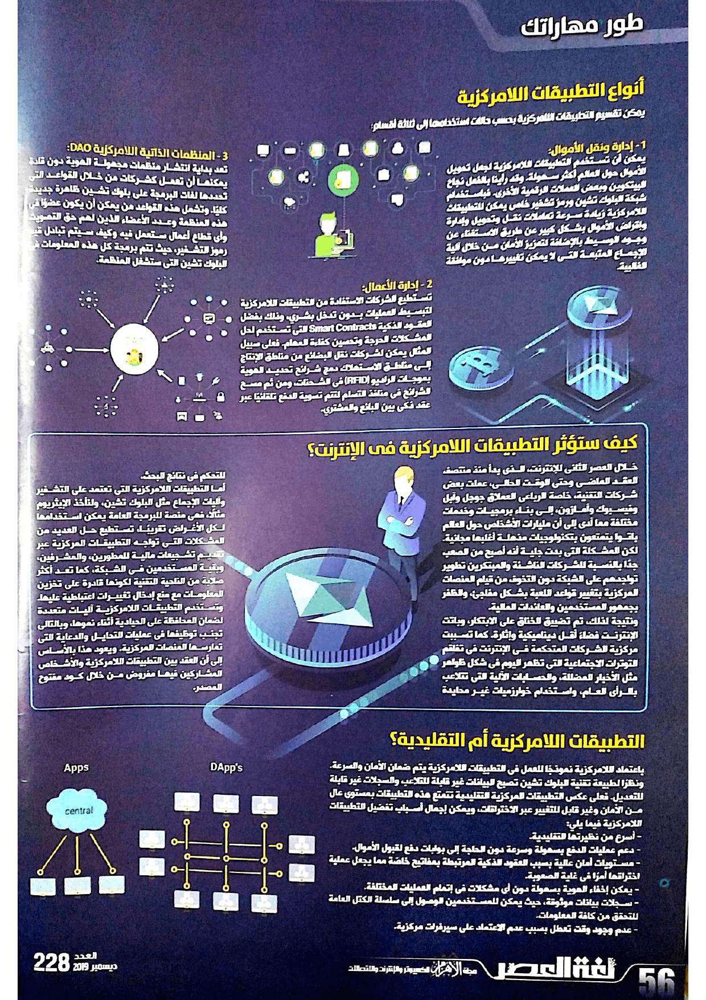

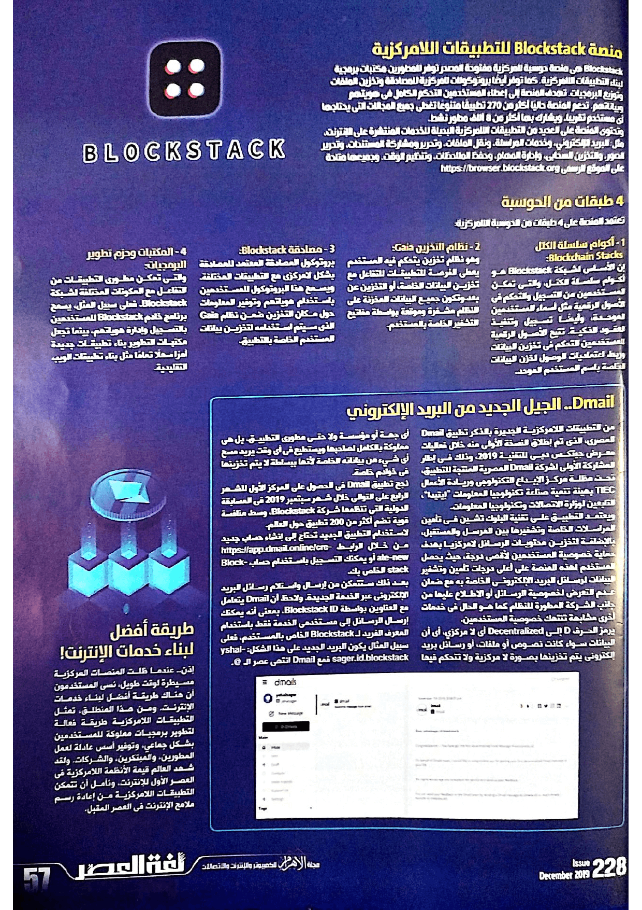

