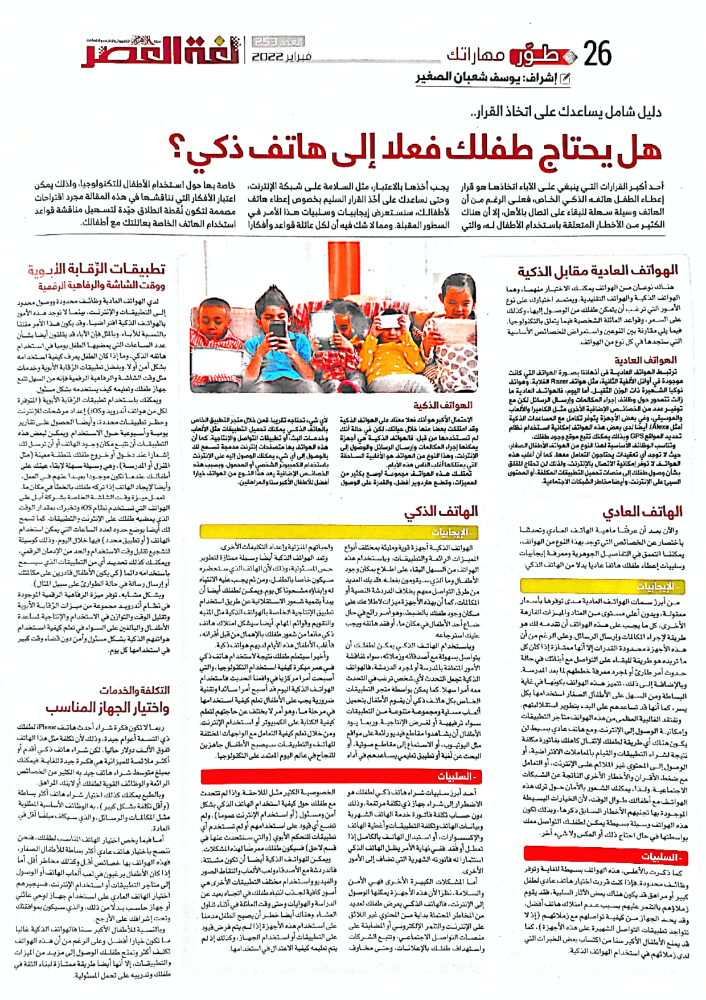

+++
title = "هل يحتاج طفلك فعلًا إلى هاتف ذكي؟"
date = "2022-02-01"
description = "أحد أكبر القرارات التي ينبغي على الآباء اتخاذها هو قرار إعطاء الطفل هاتفه الذكي الخاص، فعلى الرغم من أن الهاتف وسيلة سهلة للبقاء على اتصال بالأهل، إلا أن هناك الكثير من الأخطار المتعلقة باستخدام الأطفال له، والتي يجب أخذها بالاعتبار، مثل السلامة على شبكة الإنترنت. وحتى نساعدك على أخذ القرار السليم بخصوص إعطاء هاتف لأطفالك، سنستعرض إيجابيات وسلبيات هذا الأمر في السطور المقبلة. ومما لا شك فيه أن لكل عائلة قواعد وأفكار خاصة بها حول استخدام الأطفال للتكنولوجيا، ولذلك يمكن اعتبار الأفكار التي نناقشها في هذه المقالة مجرد اقتراحات مصممة لتكون نُقطة انطلاق جيّدة لتسهيل مناقشة قواعد استخدام الهاتف الخاصة بعائلتك مع أطفالك."
categories = ["مهارات رقمية",]
tags = ["مجلة لغة العصر"]
images = ["images/gaelle-marcel-FLdK5N-YGf4-unsplash.jpg"]

+++

أحد أكبر القرارات التي ينبغي على الآباء اتخاذها هو قرار إعطاء الطفل هاتفه الذكي الخاص، فعلى الرغم من أن الهاتف وسيلة سهلة للبقاء على اتصال بالأهل، إلا أن هناك الكثير من الأخطار المتعلقة باستخدام الأطفال له، والتي يجب أخذها بالاعتبار، مثل السلامة على شبكة الإنترنت. وحتى نساعدك على أخذ القرار السليم بخصوص إعطاء هاتف لأطفالك، سنستعرض إيجابيات وسلبيات هذا الأمر في السطور المقبلة. ومما لا شك فيه أن لكل عائلة قواعد وأفكار خاصة بها حول استخدام الأطفال للتكنولوجيا، ولذلك يمكن اعتبار الأفكار التي نناقشها في هذه المقالة مجرد اقتراحات مصممة لتكون نُقطة انطلاق جيّدة لتسهيل مناقشة قواعد استخدام الهاتف الخاصة بعائلتك مع أطفالك.

|       |
| -----------------------------------------------------------: |
| الصورة بواسطة [Gaelle Marcel](https://unsplash.com/@gaellemarcel?utm_source=unsplash&utm_medium=referral&utm_content=creditCopyText) من موقع [Unsplash](https://unsplash.com/?utm_source=unsplash&utm_medium=referral&utm_content=creditCopyText) |

##  الهواتف العادية مقابل الذكية 

هناك نوعان من الهواتف يمكنك الاختيار منهما، وهما الهواتف الذكية والهواتف التقليدية. ويعتمد اختيارك على نوع الأمور التي ترغب أن يتمكن طفلك من الوصول إليها، وكذلك على السعر، وقواعد العائلة الشخصية فيما يتعلق بالتكنولوجيا. فيما يلي مقارنة بين النوعين واستعراض للخصائص الأساسية التي ستجدها في كل نوع من الهواتف.

### الهواتف العادية

ترتبط الهواتف العادية في أذهاننا بصورة الهواتف التي كانت موجودة في أوائل الألفية الثانية، مثل هواتف Razer القلابة، وهواتف نوكيا الشهيرة ذات الوزن الثقيل. أما اليوم، فالهواتف العادية ما زالت تتمحور حول وظائف إجراء المكالمات وإرسال الرسائل لكن مع توفير عدد من الخصائص الإضافية الأخرى مثل الكاميرا والألعاب والموسيقي، وفي بعض الأجهزة يتوفر تكامل مع المساعدات الذكية (مثل Alexa). أيضًا لدى بعض هذه الهواتف إمكانية استخدام نظام تحديد المواقع GPS وبذلك يمكنك تتبع موقع وجود طفلك.

وتناسب الوظائف الأساسية لهذا النوع من الهواتف الأطفال الصغار، حيث لا توجد أي تعقيدات يحتاجون للتعامل معها. كما أن أغلب هذه الهواتف لا توفر إمكانية الاتصال بالإنترنت ولذلك لن تحتاج للقلق بشأن وصول طفلك إلى منصات تحميل التطبيقات المكلفة، أو المحتوى السيئ على الإنترنت، وأيضًا مخاطر الشبكات الاجتماعية.

### الهواتف الذكية

الاحتمال الأكبر هو أنك فعلًا معتاد على الهواتف الذكية وقد امتلكت بعضّا منها خلال حياتك، لكن في حالة أنك لم تستخدمها من قبل، فالهواتف الذكية هي أجهزة يمكنها إجراء المكالمات وإرسال الرسائل والوصول إلى الإنترنت، وهذا النوع من الهواتف هو الأغلبية الساحقة التي يمتلكها أغلب الناس هذه الأيام.

تمتلك هذه الهواتف مجموعة أوسع بكثير من المميزات، وقطع هاردوير أفضل، والقدرة على الوصول لأي شيء تحتاج تقريبًا. قمن خلال متجر التطبيق الخاص بالهاتف الذكي يمكنك تحميل التطبيقات مثل الألعاب وخدمات البث، أو تطبيقات التواصل والإنتاجية. كما أن هذه الهواتف بها متصفحات إنترنت مدمجة تسمح لك بالوصول إلى أي شيء يمكنك الوصول إليه على الإنترنت باستخدام الكمبيوتر الشخصي أو المحمول. وبسبب هذه الخصائص الإضافية يعد هذا النوع من الهواتف خيارًا أفضل للأطفال الأكبر سنًا والمراهقين.

##  إيجابيات وسلبيات الهاتف العادي 

والآن بعد أن عرفّنا ماهية الهاتف العادي وتحدثنا باختصار عن الخصائص التي توجد بهذا النوع من الهواتف، يمكننا التعمق في التفاصيل الجوهرية ومعرفة إيجابيات وسلبيات إعطاء طفلك هاتفًا عاديًا بدلا من الهاتف الذكي:

### الإيجابيات

من أبرز سمات الهواتف العادية مدى توفرها بأسعار معقولة. وبدون أعلى مستوى من العتاد والميزات الفارهة الأخرى، كل ما يجب على هذه الهواتف أن تقدمه لك هو طريقة لإجراء المكالمات وإرسال الرسائل. وعلى الرغم من أن هذه الأجهزة محدودة القدرات إلا أنها ممتازة إذا كان كل ما تريده هو طريقة للبقاء على التواصل مع أبناءك في حالة حدوث أمر طارئ أو لمجرد معرفة خططهم لما بعد المدرسة. وبالإضافة إلى ذلك، تتميز هذه الهواتف بكونها في غاية البساطة ومن السهل على الأطفال الصغار استخدامها بكل يسر، كما أنها قد تساعدهم على البدء بتطوير استقلاليتهم.

وتفتقد الغالبية العظمى من هذه الهواتف متاجر التطبيقات وإمكانية الوصول إلى الإنترنت. ومع هاتف عادي بسيط لن يكون هناك أي طريقة لطفلك لإثقال كاهلك بفاتورة مكلفة نتيجة لشراء التطبيقات والقيام بالمعاملات الافتراضية، أو الوصول إلى المحتوي غير الملائم على الإنترنت، أو التعامل مع ضغط الأقران والأخطار الأخرى الناتجة عن الشبكات الاجتماعية. ولذا، يمكنك الشعور بالأمان حول ترك هذه الهواتف مع أطفالك طوال الوقت، لأن الخيارات البسيطة الموجودة بها تجنبهم الأخطار السابق ذكرها، وبذلك تكون هذه الهواتف وسيلة بسيطة يمكن لطفلك التواصل معك بواسطتها في حال احتاج ذلك أو العكس ولا شيء آخر.

### السلبيات

كما ذكرت بالأعلى، هذه الهواتف بسيطة للغاية وتوفر وظائف محدودة. فإذا كنت قررت اختيار هاتف عادي لطفل كبير أو مراهق قد يكون هناك بعض الآثار السلبية. فقد يقوم زملائهم بالتنمر عليهم بسبب عدم امتلاك هاتف أفضل، وقد يحد الجهاز من كيفية تواصلهم مع زملائهم (إذ لا تتواجد تطبيقات التواصل الشهيرة على هذه الأجهزة)، كما قد يمنع الأطفال الأكبر سنًا من اكتساب بعض الخبرات التي لدى زملائهم في استخدام الهواتف الذكية. 

## إيجابيات وسلبيات الهاتف الذكي 

### الإيجابيات

الهواتف الذكية أجهزة قوية ومليئة بمختلف أنواع المميزات الرائعة والتطبيقات. وباستخدام هذه الهواتف من السهل البقاء على اطّلاع بمكان وجود الأطفال وما الذي سيقومون بفعله. فلديك العديد من طرق التواصل معهم بخلاف الدردشة النصية أو المكالمات، كما أن بهذه الأجهزة ميزات لاطلاعك على مكان وجود طفلك بالضبط، وهو أمر رائع في حال ضاع أحد الأطفال في مكان ما، أو فقد هاتفه ويجب عليك استرجاعه. 

وباستخدام الهاتف الذكي يمكن لطفلك أن يتواصل بسهولة مع أصدقائه وزملائه، سواء لمناقشة الأمور المتعلقة بالمدرسة أو لمجرد الدردشة، فالهواتف الذكية تجعل التحدث لأي شخص ترغب في التحدث معه أمرًا سهلًا. كما يمكن بواسطة متجر التطبيقات الخاص بكل هاتف ذكي أن يقوم الأطفال بتحميل ألعاب مسلية ومجموعة متنوعة من التطبيقات سواء ترفيهية أو لغرض الإنتاجية. وربما يود الأطفال أن يشاهدوا مقاطع فيديو رائعة على مواقع مثل اليوتيوب، أو الاستماع إلى مقاطع صوتية، أو البحث عن لُعْبَة أو تطبيق تعليمي يساعدهم في أداء واجباتهم المنزلية وإعداد التكليفات الأخرى. 

وتعد الهواتف الذكية أيضًا وسيلة ممتازة لتطوير حس المسؤولية، وذلك لأن الهاتف الذي ستحضره سيكون خاص بالطفل ومن ثم يجب عليه الانتباه له وإبقاءه مشحونا كل يوم. ويمكن لطفلك أيضًا أن يبدأ بتنمية شعور الاستقلالية عن طريق استخدام تطبيق الإنتاجية الخاصة بالهواتف الذكية مثل المنبه والتقويم وقوائم المهام. أيضًا سيشكل امتلاك هاتف ذكي مانعًا من شعور طفلك بالإهمال من قبل أقرانه، فأغلب الأطفال هذه الأيام لديهم هواتف ذكية. 

وأخيرًا سيتعلم طفلك نتيجة لاستخدام هاتف ذكي في عمر مبكرة كيفية استخدام التكنولوجيا والتي أصبحت أمرًا مركزيًا في واقعنا الحديث. فاستخدام الهواتف الذكية اليوم قد أصبح أمرًا سائدًا وتقنية ضرورية يجب على الأطفال تعلم كيفية استخدامها في مرحلة ما، وهو أمر لا يختلف عن حاجتهم لتعلم كيفية الكتابة على الكمبيوتر أو استخدام الإنترنت. ومن خلال تعلم كيفية التعامل مع الواجهات المختلفة للهاتف والتطبيقات سيصبح الأطفال جاهزين للنجاح في عالم اليوم المعتمد على التكنولوجيا. 

### السلبيات

أحد أبزر سلبيات شراء هاتف ذكي لطفلك هو الإضرار إلى شراء جهاز ذو تكلفة مرتفعة، وذلك دون حساب تكلفة فاتورة خدمة الهاتف الشهرية وبيانات الهاتف وتكلفة التطبيقات وأغطية الهاتف والإكسسوارات، أو استبدال الهاتف بالكامل إذا تعطل أو فُقد. ففي نهاية الأمر يظل الهاتف الذكي استثمارًا له فاتورته الشهرية التي تضاف إلى الأمور الأخرى.

أما المشاكل الكبيرة الأخرى فهي الأمن والسلامة نظرًا لأن هذه الأجهزة يمكنها الوصول إلى الإنترنت. فالهاتف الذكي يعرض طفلك لعديد من المخاطر المحتملة بداية من المحتوي غير اللائق على الإنترنت والتنمر الإلكتروني أو المضايقة على منصات التواصل الاجتماعي، وتتبع الشركات واستهداف طفلك بالإعلانات، وحتى مخاوف الخصوصية الكثير مثل الملاحقة. وإذا لم تتحدث مع طفلك حول كيفية استخدام الهاتف الذكي بشكل آمن ومسؤول (أو استخدام الإنترنت عمومًا)، ولم تضع أي قيود على استخدامهم أو لم تستخدم أي تطبيقات للتحكم الأبوي (والتي سنتحدث عنها في قسم لاحق) فسيكون طفلك معرضًا لهذه المشاكل.

ويمكن للهواتف الذكية أيضًا أن تكون مشتتة، فالدردشة مع الأصدقاء ولعب الألعاب والتقاط الصور والفيديو واستخدام مختلف التطبيقات الأخرى هي أمور كافية لجذب انتباه طفلك في اتجاه بعيد عن الدراسة والهوايات وحتى وقت العائلة في أثناء تناول العشاء. وهناك أيضًا خطر أن يصبح الطفل مدمناً على استخدام هذه الأجهزة إذا لم يتم فرض قيود على التطبيقات أو استخدام الجهاز، وكذلك إذ لم يتم تعليمه كيفية الاعتدال في استخدامها.

## تطبيقات الرِّقابة الأبوية ووقت الشاشة والرفاهية الرقمية 

 لدي الهواتف العادية وظائف محدودة ووصولًا محدود إلى التطبيقات والإنترنت، بينما لا توجد هذه الأمور بالهواتف الذكية افتراضيًا، وقد يكون هذا الأمر مقلقًا بالنسبة للآباء. وبالمثل فإن الآباء قد يقلقون أيضًا بشأن عدد الساعات التي يمضيها الطفل يوميًا في استخدام هاتفه الذكي، وما إذا كان الطفل يعرف كيفية استخدامه بشكل آمن أو لا. وبفضل تطبيقات الرِّقابة الأبوية وخدمات مثل وقت الشاشة والرفاهية الرقمية فإنه من السهل تتبع جهاز طفلك وتعليمه كيف يستخدمه بشكل مسؤول.

ويمكنك باستخدام تطبيقات الرِّقابة الأبوية (المتوفرة لكل من هواتف أندرويد وiOS) إعداد مرشحات للإنترنت وحظر تطبيقات محددة، وأيضًا الحصول على تقارير يومية وأسبوعية حول الاستخدام. ويمكن لبعض هذه التطبيقات أن تتبع مكان وجود الهاتف أو أن ترسل لك إشعارًا عند دخول أو خروج طفلك لمنطقة معينة (مثل المنزل أو المدرسة)، وهي وسيلة سهلة لإبقاء عينك على أطفالك عندما تكون متواجدًا بعيدًا عنهم في العمل، وأيضًا لإيجاد الهاتف إذا تركه طفلك بالخطأ في مكان ما.

تعمل مِيزة وقت الشاشة الخاصة بشركة أبل على الهواتف التي تستخدم نظام iOS وتخبرك بمقدار الوقت الذي يمضيه طفلك على الإنترنت والتطبيقات. كما تسمح لك أيضًا بوضع حدود لعدد الساعات التي يمكن استخدام الهاتف (أو تطبيق محدد) فيها خلال اليوم، وذلك كوسيلة لتشجيع تقليل وقت الاستخدام والحد من الإدمان الرقمي، ويمكنك كذلك تحديد أي من التطبيقات الذي سيسمح باستخدامه دائمًا (كي يكون الأطفال قادرين على مكالمتك أو إرسال رسالة في حالة الطوارئ على سبيل المثال).

وبشكل مشابه، توفر مِيزة الرَفَاهيَة الرقمية الموجودة في نظام أندرويد مجموعة من ميزات الرِّقابة الأبوية وتقليل الوقت والتوازن في الاستخدام والإنتاجية لمساعدة الأطفال والبالغين على السواء في تعلم كيفية استخدام هواتفهم الذكية بشكل مسؤول وآمن دون قضاء وقت كبير في استخدامها كل يوم.

## التكلفة والخدمات واختيار الجهاز المناسب

ربما لا تكون فكرة شراء أحدث هاتف iPhone لطفلك ذو التسعة أعوام جيدة، وذلك لأن تكلفة مثل هذا الهاتف تفوق الألف دولار حاليًا، لكن شراء هاتف ذكي أقدم أو أكثر ملائمة للميزانية هي فكرة جيدة للغاية. فيمكنك بمبلغ متوسط شراء هاتف جيد به الكثير من الخصائص الرائعة والوظائف القوية لطفلك أو لابنك المراهق.

وبالطبع يمكنك كذلك اختيار شراء هاتف أكثر بساطة (وأقل تكلفة بشكل كبير)، به الوظائف الأساسية المطلوبة مثل المكالمات والرسائل، والذي سيكلف مبلغًا أقل في العادة.

أما فيما يخص اختيار الهاتف المناسب لطفلك، فنحن ننصح باختيار هاتف عادي أكثر بساطة للأطفال الصغار، فهذه الهواتف بها خصائص أقل وكذلك مخاطر أقل. أما إذا كان الأطفال يرغبون في لعب ألعاب الهاتف أو الوصول إلى متاجر التطبيقات أو استخدام الإنترنت، فسيجبرهم اختيار الهاتف العادي على استخدام جهاز لوحي عائلي أو جهاز حاسب بدلًا من ذلك، والذي سيكون بموافقتك وتحت إشرافك على الأرجح.

وبالنسبة للأطفال الأكبر سنًا فالهواتف الذكية غالبا ما تكون خيارًا أفضل. وعلى الرغم من أن هذه الهواتف تكلف أكثر وتمنح طفلك الوصول إلى مزيد من الميزات والتطبيقات، إلا أنها أيضًا طريقة ممتازة لبناء الثقة في طفلك وتدريبه على تحمل المسؤولية.

---

هذا الموضوع نُشر باﻷصل في مجلة لغة العصر العدد 254 شهر 02-2022 ويمكن الإطلاع عليه [هنا](https://drive.google.com/file/d/108JQTkZsU_PoXu51_-Ul1GStqss3YGrY/view?usp=sharing).

