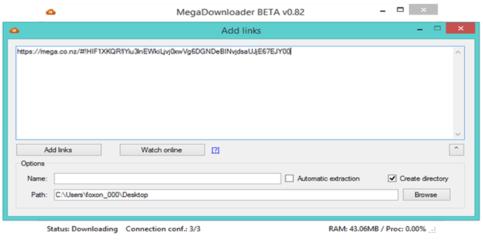
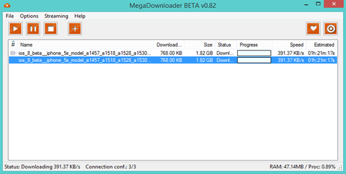
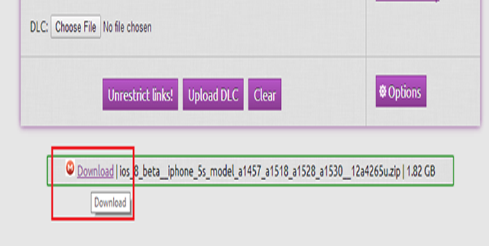

+++
title = "كيفية التحميل من موقع ميجا باستخدام إنترنت داونلود مانجر"
date = "2014-10-16"
description = "من منا لا يعرف موقع ميجا ولكن رغم شهرة هذا الموقع إلا أن معظم المستخدمين يكرهون نظام التحميل المتبع فيه نظرًا لأنه لا يسمح بالتحميل إلا من خلاله لذا نقدم لك عزيزي القارئ طريقة التجميل من موقع ميجا باستخدام برنامجانترنت داونلود مانجر."
categories = ["مهارات رقمية",]
tags = ["موقع لغة العصر"]
+++
## عيوب نظام التحميل الحالي بموقع ميجا

-  لا يمكنك استئناف التحميل في حالة فقدان الاتصال بالإنترنت لديك.
-  لا يمكنك الوصول لسرعة التحميل القصوى الخاصة بك.

## الطريقة الأولى: التحميل باستخدام ميجا داونلود مانجر

 1. قم بتحميل البرنام مج من هنا :[https://mega.co.nz/#](https://mega.co.nz/#!nU8GnQzT!0RaJAcxouaHqfYAh-kFLPQp3GkXxLRTjVkpKwC6GDH4) 
 2. بعد انتهاء التحميل قم بتثبيت البرنامج وتشغيله.
  3. قم بإضافة رابط الملف الذى تريد تحميله عن طريق الزر add links.
 4.  سيظهر الملف المراد تحميله، اضغط OK ثم Start لبدء التحميل.

## الطريقة الثانية: التحميل باستخدام إنترنت داونلود مانجر

 تأخذ هذه الطريقة بعض الوقت، ولكن التحميل يكون بالسرعة القصوى.
 عيب هذه الطريقة:أن التحميل لا يمكن إيقافه(pause).

1. قم بتحميل وتثبيت برنامج(Internet Download Manager) من هنا [http://www.internetdownloadmanager.com/](http://www.internetdownloadmanager.com/download.html).

2. قم بالذهاب إلى هذا الموقع وانشئ حسابًا جديدًا.
3. بعد تفعيل الحساب قم بالانتقال الى صفحة [Download](https://unrestrict.li/download).
 4. قم بلصق رابط ميجا فى مربع الكتابة ثم اضغط Unrestrict links.

5. اضغط Download.

6. قم بكتابة الكود ثم اضغط Download.

7. اضغط بزر الفأرة الأيمن واختر Download with IDM.

---
هذا الموضوع نٌشر باﻷصل على موقع مجلة لغة العصر.

http://aitmag.ahram.org.eg/News/1829.aspx