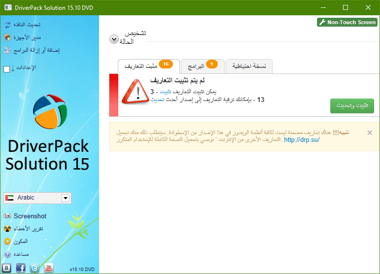
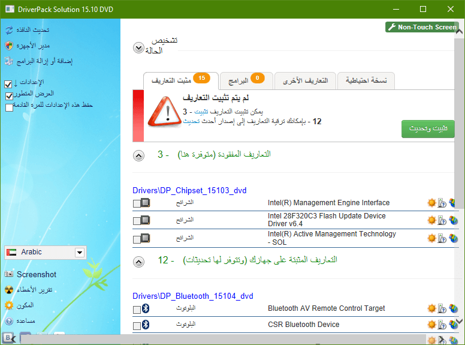
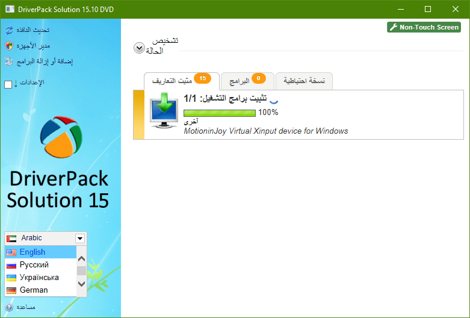
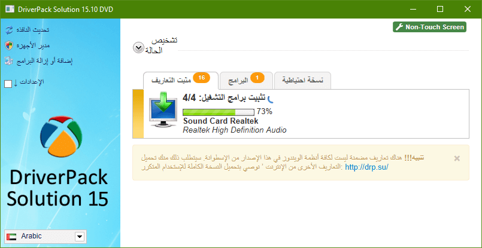
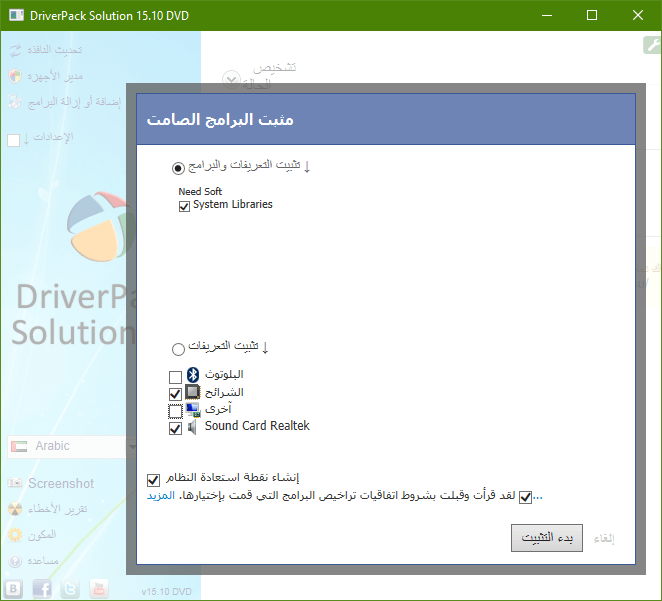
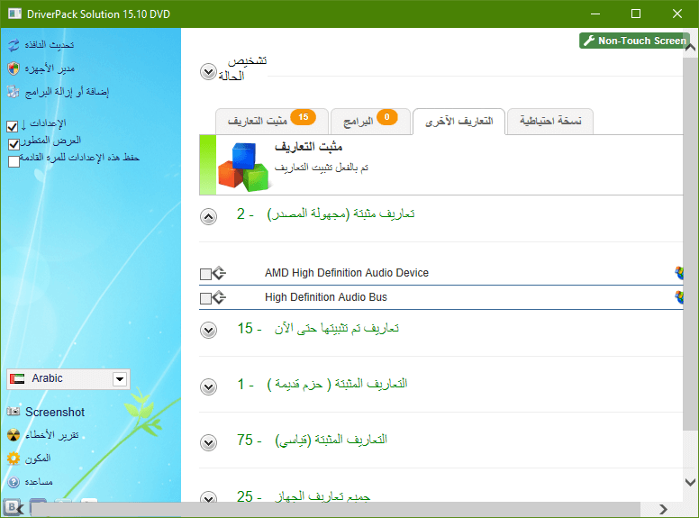
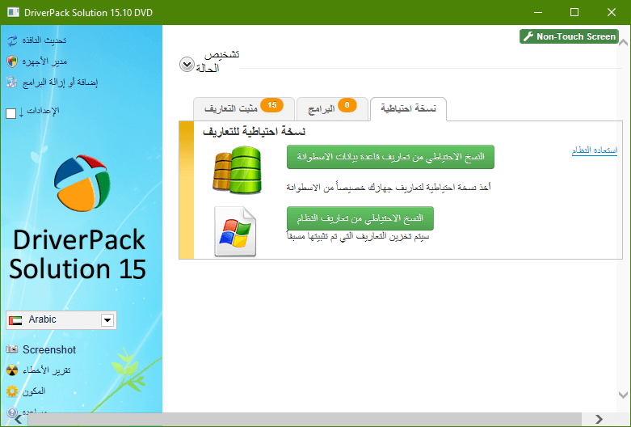
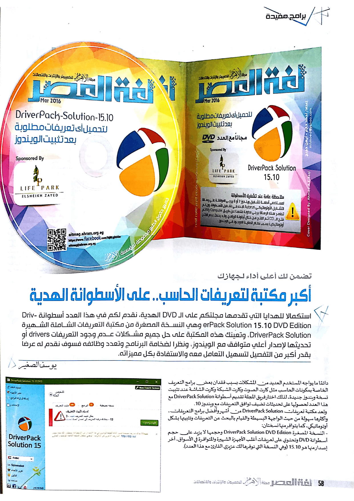
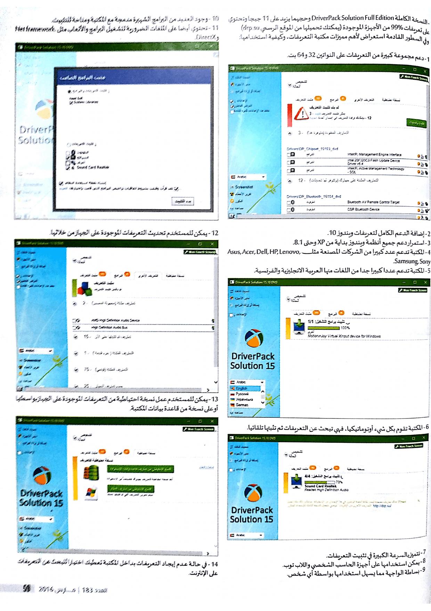

+++
title = "برنامج DriverPack Solution.. أكبر مكتبة لتعريفات الحاسب"
date = "2016-03-01"
description = "DriverPack Solution 15.10 DVD Edition هي النسخة المصغرة من مكتبة التعريفات الشاملة الشهيرة DriverPack Solution، وتعينك هذه المكتبة على حل جميع مشاكل عدم وجود التعريفات drivers أو تحديثها لإصدار أعلي متوافق مع الويندوز، ونظرا لضخامة البرنامج وتعدد وظائفه فسوف نقدم له عرض بقدر أكبر من التفصيل لتسهيل التعامل معه والاستفادة بكل مميزاته."
categories = ["مهارات رقمية",]
tags = ["مجلة لغة العصر"]

+++
DriverPack Solution 15.10 DVD Edition هي النسخة المصغرة من مكتبة التعريفات الشاملة الشهيرة DriverPack Solution، وتعينك هذه المكتبة على حل جميع مشاكل عدم وجود التعريفات drivers أو تحديثها لإصدار أعلي متوافق مع الويندوز، ونظرا لضخامة البرنامج وتعدد وظائفه فسوف نقدم له عرض بقدر أكبر من التفصيل لتسهيل التعامل معه والاستفادة بكل مميزاته.

دائما ما يواجه المستخدم العديد من المشكلات بسبب فقدان بعض برامج التعريف الخاصة بمكونات الحاسب مثل كارت الصوت وكارت الشبكة وكارت الشاشة عند تثبيت نسخة ويندوز جديدة، لذلك اختار فريق المجلة تقديم أسطوانة DriverPack Solution مع هذا العدد لحصولها على تحديثات تضيف توافق التعريفات مع ويندوز 10.

تعد مكتبة تعريفات DriverPack Solution من أشهر وأفضل برامج التعريفات، وأكثرها سهولة من حيث الواجهة البسيطة والقيام بالبحث عن التعريفات وتثبيتها بشكل أوتوماتيكي، كما يتوافر منها نسختين:

- النسخة المصغرة DriverPack Solution DVD Edition وحجمها لا يزيد عن حجم أسطوانة DVD وتحتوي على تعريفات أغلب الأجهزة الشهيرة والمتوافرة في الأسواق، اخر اصدار منها هو 15.10 (وهي النسخة التي نوفرها لك عزيزي القارئ مع هذا العدد).

  

-  النسخة الكاملة DriverPack Solution Full Edition وحجهما يزيد عن 11 جيجا وتحتوي على تعريفات 99% من الأجهزة الموجودة (يمكنك تحميلها من الموقع الرسمي drp.su)

 وفي السطور القادمة استعراض لأهم مميزات مكتبة التعريفات، وكيفية استخدامها:

1. دعم مجموعة كبيرة من التعريفات على النواتين 32 و64 بت.

2. إضافة الدعم الكامل لتعريفات ويندوز 10.

3. استمرار دعم جميع أنظمة ويندوز بداية من XP وحتى 8.1.

4. المكتبة تدعم عدد كبيرا من الشركات المصنعة مثل Asus, Acer, Dell, HP, Lenovo, Samsung, Sony.

5. المكتبة تدعم عددا كبيرا جدا من اللغات منها العربية الانجليزية والفرنسية.

6. المكتبة تقوم بكل شيء أوتوماتيكيا، فهي تبحث عن التعريفات ثم تثبتها تلقائيا.

7. تتميز بالسرعة الكبيرة في تثبيت التعريفات.

8. يمكن استخدامها على أجهزة الحاسب الشخصي واللاب توب.

9. بساطة الواجهة مما يسهل استخدامها بواسطة أي شخص.

10. وجود العديد من البرامج الشهيرة مدمجة مع المكتبة ومتاحة للتثبيت.

11. تحتوي أيضا على الملفات الضرورية لتشغيل البرامج والألعاب مثل .Net framework وDirectX.

12. يمكن للمستخدم تحديث التعريفات الموجودة على الجهاز من خلالها.

13. يمكن للمستخدم عمل نسخة احتياطية من التعريفات الموجودة على الجهاز بواسطتها أو على نسخة من قاعدة بيانات المكتبة.

14. في حالة عدم إيجاد التعريفات بداخل المكتبة تعطيك اختيارا للبحث عن التعريفات على الانترنت.

---

هذا الموضوع نُشر باﻷصل في مجلة لغة العصر العدد 183 شهر 03-2016 ويمكن الإطلاع عليه [هنا](https://drive.google.com/file/d/1PlVnxrTkEQg_4q1u-ozKiCx1rdsXIqvq/view?usp=sharing).

