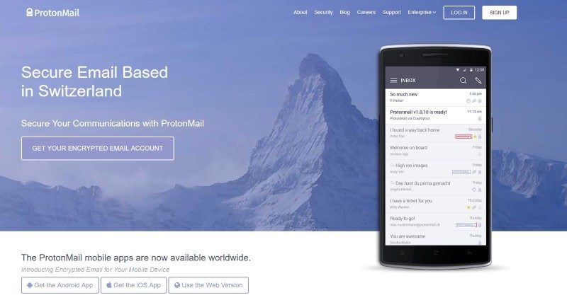
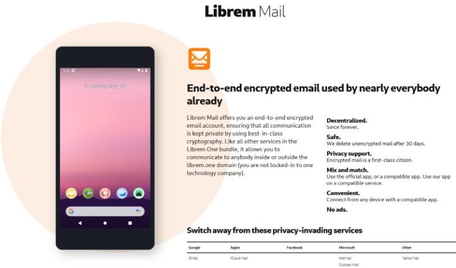

+++
title = "أفضل خدمات البريد الإلكتروني التي تحترم الخصوصية"
date = "2019-10-01"
description = "يستخدم أغلبنا خدمات البريد الإلكتروني المشهورة مثل Gmail وOutlook التي توفر العديد من الميزات المختلفة، لكن على الرغم من كون هذه الخدمات آمنة فإنها لا توفر الخصوصية للمستخدم بنسبة 100% فإذا كنت تريد مشاركة بعض الملفات السرية بشكل آمن، أو كنت تريد ضمانا أن مزود خدمة البريد الإلكتروني لا يتطفل على رسائلك بهدف استهدافك بالإعلانات، يجب عليك تجربة خدمات البريد الإلكتروني التي نقترحها عليك اليوم."
categories = ["الخصوصية",]
tags = ["مجلة لغة العصر"]
images = ["images/tutanota.jpg"]

+++
يستخدم أغلبنا خدمات البريد الإلكتروني المشهورة مثل Gmail وOutlook التي توفر العديد من الميزات المختلفة، لكن على الرغم من كون هذه الخدمات آمنة فإنها لا توفر الخصوصية للمستخدم بنسبة 100% فإذا كنت تريد مشاركة بعض الملفات السرية بشكل آمن، أو كنت تريد ضمانا أن مزود خدمة البريد الإلكتروني لا يتطفل على رسائلك بهدف استهدافك بالإعلانات، يجب عليك تجربة خدمات البريد الإلكتروني التي نقترحها عليك اليوم.

## 1- ProtonMail

ProtonMail هي خدمة بريد إلكتروني سويسرية شهيرة، تستخدم التشفير التام بين الطرفين وتقدم خدماتها بشكل خالي من الإعلانات لحماية خصوصية المستخدم. كما تتيح لك تحديد وقت صلاحية انتهاء البريد الإلكتروني لتدميره ذاتيا. وبالإضافة إلى جميع ميزات الأمان الموجودة بها مثل دعم المصادقة الثنائية، فإن الخدمة مفتوحة المصدر، فيمكن للمطورين مراجعة مكتبات التشفير مفتوحة المصدر أو البرمجيات أخرى للتأكد من خلوها من أي نوع من التلاعب.

توفر الخطة المجانية عنوان بريد واحد ومساحة تخزينية 500 ميجا بايت وحد أقصي للرسائل 150 رسالة يوميا.

[https://protonmail.com](https://protonmail.com/)

## 2- Tutanota

خدمة بريد إلكتروني أخري مفتوحة المصدر تناسب كلا من الاستخدام الشخصي والتجاري. توفر الخطة المجانية للخدمة 1 جيجا بايت مساحة تخزينية بعكس ProtonMail التي توفر النصف. تدعم الخدمة التشفير التام بين الطرفين والنطاقات المخصصة (في الخطة المدفوعة)، وتوفر تطبيقات أندرويد وiOS للمستخدمين.

[https://tutanota.com](https://tutanota.com/)

## 3- Librem Mail

اختيار آخر لمحبي الخصوصية يختلف عن سابقيه بأنه مدفوع، وهي جزء من مجموعة خدمات Librem One المقدمة من شركة Purism التي توفر للمستخدم بيئة كاملة من التطبيقات والخدمات المختلفة التي تحترم الخصوصية، مثل البريد وشبكة تواصل اجتماعي وخدمة VPN وخدمة تخزين سحابي. وتتميز خدمة Librem Mail بأنها لا مركزية وتستخدم التشفير التام بين الطرفين افتراضيا.

[https://librem.one](https://librem.one/)

## 4- Criptext

خدمة بريد مفتوحة المصدر تستخدم بروتوكول Signal للتشفير (نفس التشفير المستخدم في تطبيق المراسلات الأمنة Signal)، تتميز بكونها مجانية تماما، وتدعم التشفير التام بين الطرفين والنطاقات المخصصة. تحتوي الخدمة على ميزات عديدة مثل إلغاء الإرسال وتتبع البريد في الوقت الفعلي.

كما توفر الخدمة للمستخدمين تطبيقات سطح المكتب لأنظمة ويندوز ولينكس وماك.

[https://criptext.com](https://criptext.com/)

##  5- Mailfence

تتميز خدمة Mailfence عن الخدمات الأخرى بأنها تفرض استخدام تشفير OpenPGP والتشفير التام بين الطرفين معا. مما يجعلها أحد أقوي خيارات خدمات البريد التي تحترم الخصوصية. تتوفر خطط استخدام مجانية ومدفوعة، تتيح المجانية صندوق بريد بحجم 500 ميجا بايت، وحتى 1000 حدث مسجل في التقويم، إضافة إلى ميزة التحقق بخطوتين. أما المدفوعة فتوفر مساحة 5 جيجا بايت وحتى 10000 حدث مقابل اشتراك شهري.

يعيب هذه الخدمة عدم توفر تطبيقات هاتف، فللدخول إلى بريدك الإلكتروني تحتاج إلى استخدام المتصفح.

[https://mailfence.com](https://mailfence.com/)

## 6- Disroot

مقارنة بسابقاتها فإن Disroot خدمة حديثة نسبيا، لكنها مع ذلك قد استطاعت خلال الأعوام الماضية إثبات نفسها كأحد أبرز خدمات البريد الإلكتروني المستقلة والمشفرة.

تقدم Disroot بريد خالي من الإعلانات وغير قابل للتتبع ولا يطلب معلوماتك الشخصية. وتوفر للمستخدم برنامج خادم مبنى على المتصفح (Rainloop) يسهل تثبيته واستخدامه، كما أنه يدعم تشفير GPG مفتوح المصدر.

https://disroot.org/en

## 7- Hushmail

تستهدف خدمة Hushmail الشركات ورجال الأعمال، حيث توفر خططا مدفوعة تبدأ من 50 دولار سنويا للفرد ضمن الخطة الفردية، أو 6 دولار سنويا للفرد ضمن خطة الشركات.

توفر Hushmail بريد إلكتروني آمن ونظيف وخالي من الإعلانات بسعة تخزين 10 جيجا بايت، يمكنك الوصول إليه عبر المتصفح أو الهاتف المحمول أو برنامج سطح المكتب. وبسبب اعتماد التشفير التام بين الطرفين، ليس لدى Hushmail نفسها إمكانية الوصول إلى محتويات بريدك الإلكتروني.

تستطيع عن طريق بريد Hushmail إرسال الرسائل المشفرة إلى الخدمات البريدية الأخرى مثل Gmail وOutlook، كما تستطيع استخدام تشفير OpenPGP أيضا.

لسوء الحظ، لم تعد النسخة المجانية من الخدمة متاحة منذ فترة قريبة، لكن لا يزال بإمكانك تجربة الخدمة لمدة 14 يوم مجانا.

[https://www.hushmail.com](https://www.hushmail.com/)

قد تضطر إلى مواجهة بعض المنغصات عند استخدامك أحد خدمات البريد الإلكتروني التي تركز على الخصوصية، مثل ضعف واجهة المستخدم أو نقص خيارات التخصيص. ومع ذلك، فهذه هي الضريبة التي يجب عليك تحملها إذا كنت ترغب في إعطاء الأولوية لخصوصيتك على أي شيء آخر، حيث أن أغلب هذه الخدمات تدار بواسطة فرق صغيرة أو شركات ناشئة، بخلاف الخدمات الشهيرة التي لديها مئات من المطورين للعمل على واجهة المستخدم والتحسينات وإضافة الميزات الجديدة.

---

هذا الموضوع نُشر باﻷصل في مجلة لغة العصر العدد 226 شهر 10-2019 ويمكن الإطلاع عليه [هنا](https://drive.google.com/file/d/1NAvPlQ1pTZFGSqS05qfD9mrYHnRamRHd/view?usp=sharing).

