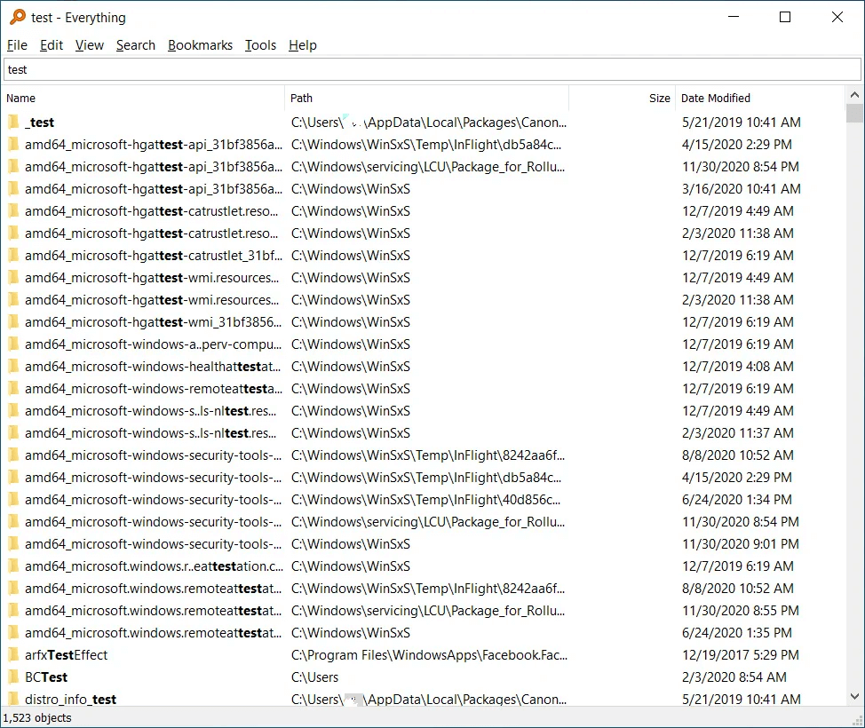
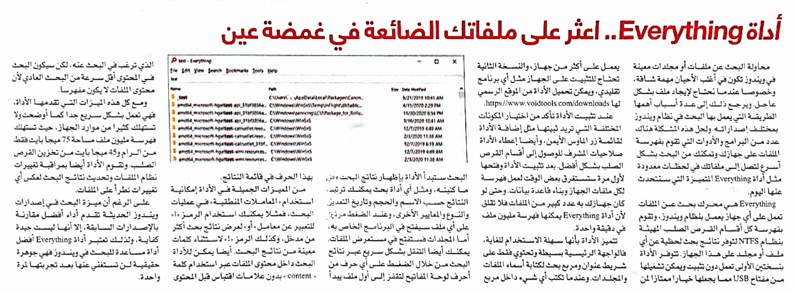

+++
title = "أداة Everything.. اعثر على ملفاتك الضائعة في غمضة عين"
date = "2022-01-01"
description = "محاولة البحث عن ملفات أو مجلدات معينة في ويندوز تكون في أغلب اﻷحيان مهمة شاقة، وخصوصا عندما نحتاج لإيجاد ملف بشكل عاجل. ويرجع ذلك إلى عدة أسباب أهمها الطريقة التي يعمل بها البحث في نظام ويندوز بمختلف إصداراته. ولحل هذه المشكلة هناك عدد من البرامج واﻷدوات التي تقوم بفهرسة الملفات على جهازك وتمكنك من البحث بشكل أسرع لتصل إلى ملفاتك في لحظات معدودة مثل أداة Everything المتميزة التي سنتحدث عنها اليوم."
categories = ["مهارات رقمية",]
tags = ["مجلة لغة العصر"]

+++

محاولة البحث عن ملفات أو مجلدات معينة في ويندوز تكون في أغلب اﻷحيان مهمة شاقة، وخصوصا عندما نحتاج لإيجاد ملف بشكل عاجل. ويرجع ذلك إلى عدة أسباب أهمها الطريقة التي يعمل بها البحث في نظام ويندوز بمختلف إصداراته. ولحل هذه المشكلة هناك عدد من البرامج واﻷدوات التي تقوم بفهرسة الملفات على جهازك وتمكنك من البحث بشكل أسرع لتصل إلى ملفاتك في لحظات معدودة مثل أداة Everything المتميزة التي سنتحدث عنها اليوم.

Everything هي محرك بحث عن الملفات تعمل على أي جهاز يعمل بنظام ويندوز، وتقوم بفهرسة كل أقسام القرص الصلب المهيئة بنظام NTFS لتوفر نتائج بحث لحظية عن أي ملف أو مجلد على هذا الجهاز. تتوفر اﻷداة بنسختين اﻷولى تعمل دون تثبيت ويمكن تشغيلها من مفتاح USB مما يجعلها خيار ممتاز لمن يعمل على أكثر من جهاز، والنسخة الثانية تحتاج للتثبيت على الجهاز مثل أي برنامج تقليدي، ويمكن تحميل اﻷداة من الموقع الرسمي لها https://www.voidtools.com/downloads.

عند تثبيت اﻷداة تأكد من اختيار المكونات المختلفة التي تريد ثبيتها مثل إضافة الأداة لقائمة زر الماوس اﻷيمن، وأيضًا إعطاء اﻷداة صلاحيات المشرف للوصول إلى أقسام القرص الصلب بشكل أفضل. بعد تثبيت اﻷداة وفتحها لأول مرة ستستغرق بعض الوقت لعمل فهرسة لكل ملفات الجهاز وبناء قاعدة بيانات. وحتى لو كان جهازك به عدد كبير من الملفات فلا تقلق لأن أداة Everything يمكنها فهرسة مليون ملف في دقيقة واحدة!

تتميز اﻷداة بأنها سهلة الاستخدام للغاية، فالواجهة الرئيسية بسيطة وتحتوي فقط على شريط عنوان ومربع بحث لكتابة أسماء الملفات والمجلدات. وعندما تكتب أي شيء داخل مربع البحث ستبدأ اﻷداة بإظهار نتائج البحث وفق ما كتبته، ومثل أي أداة بحث يمكنك ترتيب النتائج حسب الاسم والحجم وتاريخ التعديل والنوع والمعايير اﻷخرى، وعند الضغط مرتين على أي ملف سيفتح في البرنامج الخاص به، أما المجلدات فستفتح في مستعرض الملفات. يمكنك أيضًا التنقل بشكل سريع عبر نتائج البحث من خلال الضغط على أي حرف من أحرف لوحة المفاتيح لتقفز إلى أول ملف يبدأ بهذا الحرف في قائمة النتائج.

من المميزات الجميلة في اﻷداة إمكانية استخدام "المعاملات المنطقية" في عمليات البحث، فمثلا يمكنك استخدام الرمز "|" للتعبير عن معامل "أو" لعرض نتائج بحث أكثر من مدخل، وكذلك الرمز "!" لاستثناء كلمات معينة من نتائج البحث. أيضًا يمكن للأداة البحث داخل محتوى الملفات عبر استخدام كلمة " content:" بدون علامات اقتباس قبل المحتوى الذي ترغب في البحث عنه، لكن سيكون البحث في المحتوى أقل سرعة من البحث العادي ﻷن محتوى الملفات لا يكون مفهرسًا.

ومع كل هذه الميزات التي تقدمها اﻷداة، فهي تعمل بشكل سريع جدًا كما أوضحت ولا تستهلك كثيرًا من موارد الجهاز، حيث تستهلك فهرسة مليون ملف مساحة 75 ميجا بايت فقط من الرام و45 ميجا بايت من تخزين القرص الصلب. وتقوم اﻷداة أيضًا بمراقبة تغييرات نظام الملفات وتحديث نتائج البحث لعكس أي تغييرات تطرأ على الملفات.

**خاتمة**

على الرغم أن ميزة البحث في إصدارات ويندوز الحديثة تقدم أداءا أفضل مقارنة بالإصدارات السابقة، إلا أنها ليست جيدة كفاية، ولذلك تعتبر أداة Everything أفضل أداة مساعدة للبحث في ويندوز فهي جوهرة حقيقية لن تستغني عنها بعد تجربتها لمرة واحدة.

---

هذا الموضوع نُشر باﻷصل في مجلة لغة العصر العدد 253 شهر 01-2022 ويمكن الإطلاع عليه [هنا](https://drive.google.com/file/d/1sG1Z8Uukgy41SQ1QoiFK27BM7iXO25MS/view?usp=sharing).

