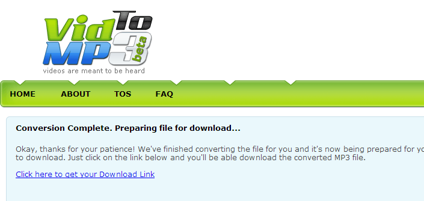
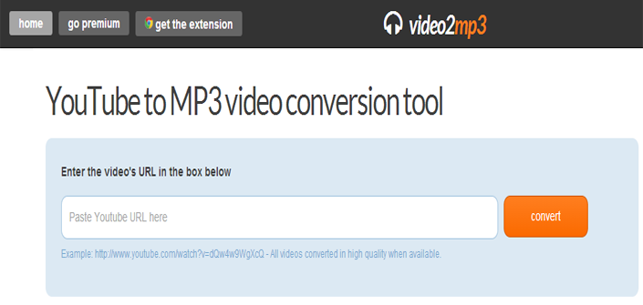
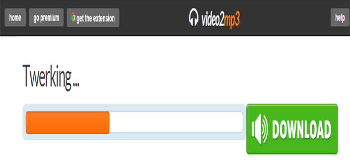
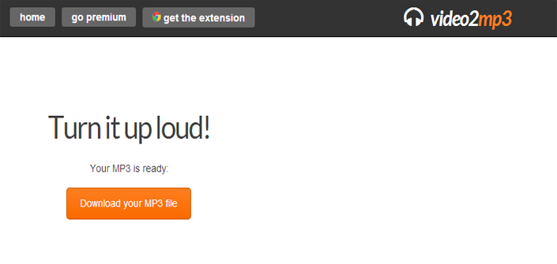
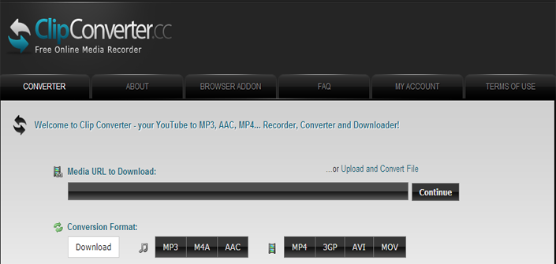
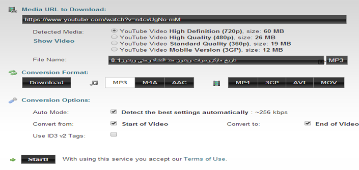
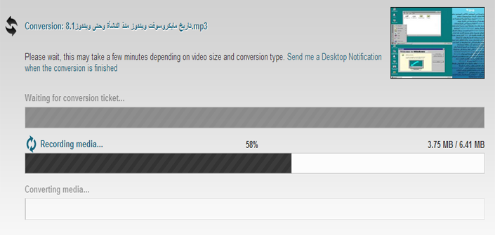
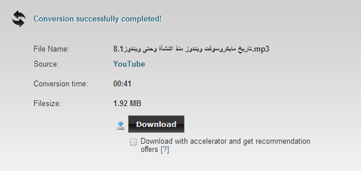
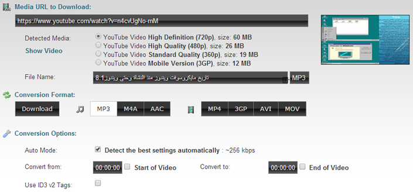

+++
title = "أفضل ثلاثة مواقع لاستخراج الصوت من الفيديو"
date = "2014-09-15"
description = "نحتاج في كثير من الأحيان إلى استخراج الصوت من مقاطع الفيديو الموجودة على اليوتيوب أو أي موقع آخر بغرض استخدامها فيما بعد أو سماعها لاحقا، لذلك نقدم لك أفضل ثلاثة مواقع لتحويل ملفات الفيديو إلى ملفات صوتة بصيغة MP3."
categories = ["مهارات رقمية",]
tags = ["موقع لغة العصر"]
images = ["images/2.png"]
+++

نحتاج في كثير من الأحيان إلى استخراج الصوت من مقاطع الفيديو الموجودة على اليوتيوب أو أي موقع آخر بغرض استخدامها فيما بعد أو سماعها لاحقا، لذلك نقدم لك أفضل ثلاثة مواقع لتحويل ملفات الفيديو إلى ملفات صوتيه بصيغة MP3.

الموقع الأول:[Vid2mp3.com](http://www.vidtomp3.com/)

يتميز هذا الموقع بالحفاظ على الجودة العالية لملفات الصوت بعد استخراجها من ملفات الفيديو، قد تكون الواجهة مربكة شيئا ما ولكن مع الوقت سيكون الأمر سهلا.

العيب الوحيد بهذا الموقع هو الإعلانات الكثيرة الموجودة به.

في خانة Enter Video url below to convert into MP3 قم بإدخال رابط الفيديو المراد تحويله ثم اضغط Download.

بعد ذلك انتظر حتى يتم تحويل الملف وإعطائك رابط التحميل.

تظهر لك كلمة Click here to get your Download Link اضغط عليها كما بالصورة.

بعد ذلك قم بإزالة العلامة عن Download with accelerator and get recommendation offers لتجنب تحميل أي برمجيات خبيثة غير مرغوب فيها، ثم اضغط Download Mp3.

الموقع الثاني:[video2mp3.net](http://www.video2mp3.net)

من أفضل مميزات هذا الموقع السرعة العالية في التحميل مع الحفاظ على الجودة المتوسطة للصوت، كما أنه يتميز بالواجهة السهلة التي لا تحتاج أي شرح، ولا يختلف هذا الموقع كثيرا عن سابقه في حجم ملف الصوت الناتج بعد التحميل.

قم بإدخال رابط الفيديو المراد تحويله في مكان الكتابة ثم اضغط Convert.

ننتظر حتى ينتهي الموقع من التحويل.

قم بالضغط على Download your MP3 file ليبدأ التحميل.

الموقع الثالث:[clipconverter.cc](http://www.clipconverter.cc/)

هذا الموقع لا يقوم فقط بالتحويل الى MP3 ولكنه أيضا يدعم التحويل الى ACC وM4A

وكذلك فإنه يمكنك من تحميل الفيديوهات من اليوتيوب بعدة صيغ أو تحويلها إلى MP4.3GP-AVI-MOV.

أيضا يمكنك رفع ملفات وتحويلها من خلال الموقع.

في خانة Media URL to Download قم بإدخال رابط الفيديو المراد تحويله ثم اضغط Continue.

تظهر لك الخيارات التي يمكنك التعامل بها مع الفيديو، ما يهمنا في هذه الخيارات هو الضغط على كلمة MP3 ثم Start!.

ننتظر حتى ينتهي الموقع من التحويل.

بعد ذلك قم بإزالة العلامة عن Download with accelerator and get recommendation offers لتجنب تحميل أي برمجيات خبيثة غير مرغوب فيها، ثم اضغط Download.

**ملاحظة:**للتحكم في بداية ونهاية مقطع الصوت وهذه ميزة لا تتوافر إلا في هذا الموقع:

قم بإزالة العلامات عن Start of Video**و** End of Video، ثم قم بإدخال وقت بداية الصوت ووقت نهايته.

---
هذا الموضوع نٌشر باﻷصل على موقع مجلة لغة العصر.

http://aitmag.ahram.org.eg/News/1783.aspx
