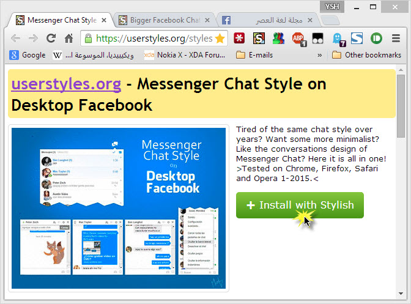
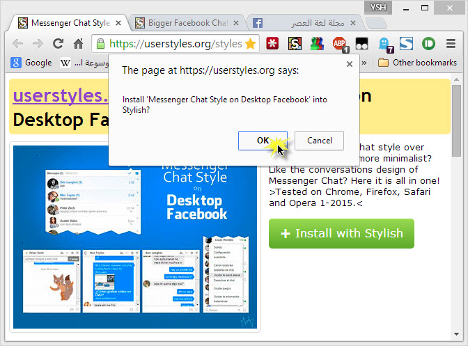
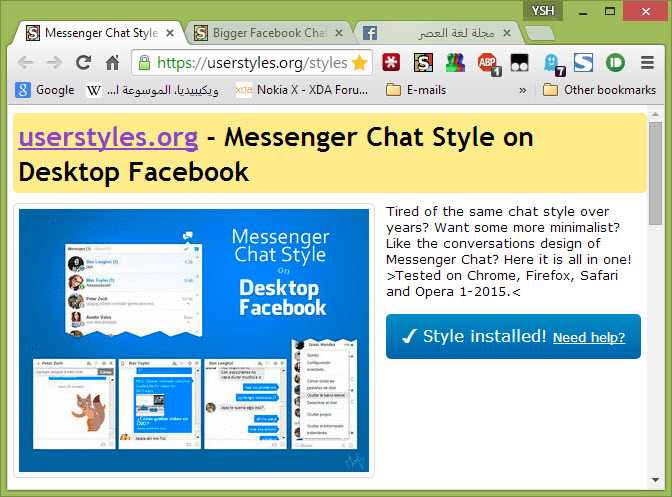

+++
title = "تحويل شكل دردشة الفيسبوك الى Facebook Messenger"
date = "2015-01-26"
description = "ظى تطبيق فيسبوك ماسنجر للهواتف الذكية بـ 500 مليون مستخدم شهرياً حيث قال تقرير إحصائي لشركة الفيسبوك أن التطبيق يحظى بشعبية كبيرة هي الأقوى في تاريخ تطبيقات الدردشة الفورية نقدم لك عزيزي القارئ طريقة لتجربة شكل فيسبوك ماسنجر على أي متصفح."
categories = ["مهارات رقمية",]
tags = ["موقع لغة العصر"]

+++

يحظى تطبيق فيسبوك ماسنجر للهواتف الذكية بـ 500 مليون مستخدم شهرياً حيث قال تقرير إحصائي لشركة الفيسبوك أن التطبيق يحظى بشعبية كبيرة هي الأقوى في تاريخ تطبيقات الدردشة الفورية. نقدم لك عزيزي القارئ طريقة لتجربة شكل فيسبوك ماسنجر على أي متصفح.

كانت فيسبوك قد أطلقت تطبيق فيسبوك ماسنجر في العام 2011 ليكون أول تطبيق تابع للشركة ومنفصل عن تطبيق فيسبوك الرسمي، وقد أرجع مارك زوكربيرغ سبب إنشاء تطبيق خاص بالدردشة لمستخدمي الشبكات من أجل توفير وتقديم تجربة استخدام أفضل للمُستخدمين، ولأنه يُتيح للشركة التركيز على تقديم المزيد من ميزات الدردشة وتحسينها ضمن التطبيق.

ولكن لم تتح الشركة تجربه فيسبوك ماسنجر على الكمبيوتر، ولكن هناك طريقة بسيطة لتحويل شكل الدردشة في موقع الفيسبوك إلى شكل تطبيق فيسبوك ماسنجر.

أولا: قم بتثبيت إضافة Stylish على المتصفح الذي تستخدمه
لمستخدمي جوجل كروم [من هنا](https://chrome.google.com/webstore/detail/stylish/fjnbnpbmkenffdnngjfgmeleoegfcffe?hl=ar)، ولمستخدمي فايرفوكس [من هنا](https://addons.mozilla.org/ar/firefox/addon/stylish/).

ثانيا: قم بتثبيت هذا الاسكربت [من هنا](https://userstyles.org/styles/107284/messenger-chat-style-on-desktop-facebook).
اضغط على Install with stylish.

ستظهر لك رسالة تأكيد اضغط OK.

ستظهر لك كلمة Style installed وهذا معناه أن التركيب قد نجح.

ثالثا: قم بتثبيت هذا الاسكربت أيضا بنفس الطريقة السابقة [من هنا](https://userstyles.org/styles/94297/bigger-facebook-chat).

رابعا: قم بالدخول الى موقع الفيسبوك وتسجيل الدخول ستجد شكل الدردشة أصبح كما بالصورة:

---

هذا الموضوع نٌشر باﻷصل على موقع مجلة لغة العصر.

http://aitmag.ahram.org.eg/News/4553.aspx
