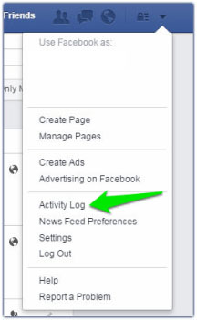
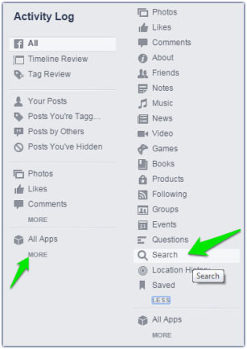
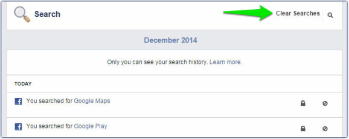

+++
title = "كيف تحذف سجلات البحث التي قمت بها على فيس بوك"
date = "2015-04-23"
description = "هل تعلم أنه في كل مرة تبحث فيها عن شخص، مكان أو حتى صفحة على الفيس بوك يتم تسجيل هذا البحث في سجل خاص؟ بالطبع لا يمكن لأي شخص الاطلاع على ما قمت بالبحث عنه ولكن إذا كنت تبحث عن المزيد من الخصوصية وتريد حذف سجلات البحث إليك هذا الموضوع."
categories = ["مهارات رقمية",]
tags = ["موقع لغة العصر"]
images = ["images/2015-635654193032930920-293.jpg"]

+++

هل تعلم أنه في كل مرة تبحث فيها عن شخص، مكان أو حتى صفحة على الفيس بوك يتم تسجيل هذا البحث في سجل خاص؟
بالطبع لا يمكن لأي شخص الاطلاع على ما قمت بالبحث عنه ولكن إذا كنت تبحث عن المزيد من الخصوصية وتريد حذف سجلات البحث إليك هذا الموضوع.

1. قم بالضغط على سهم الخيارات (الذي من خلاله تستطيع الدخول على الاعدادات وتسجيل الخروج) ثم قم باختيار الأمر Activity Log.

2. سيظهر لك سجل النشاطات، أسفل "كل التطبيقات All Apps" ستجد كلمة MORE قم بالضغط عليها لتجد كلمة "البحث Search" قم باختيارها.

3. ستجد هنا كل عمليات البحث التي قمت بها، إذا أردت حذفها قم بالضغط على "حذف عمليات البحث Clear Searches".

---
هذا الموضوع نٌشر باﻷصل على موقع مجلة لغة العصر.

http://aitmag.ahram.org.eg/News/17692.aspx