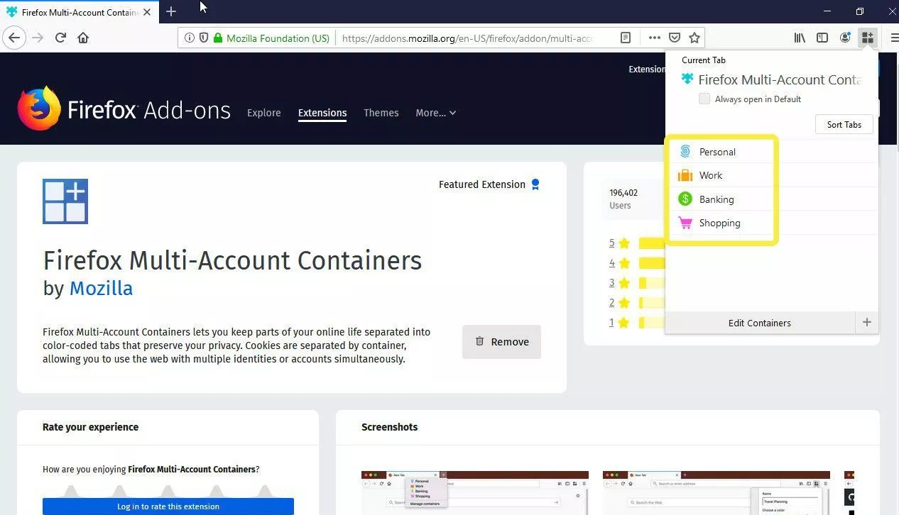
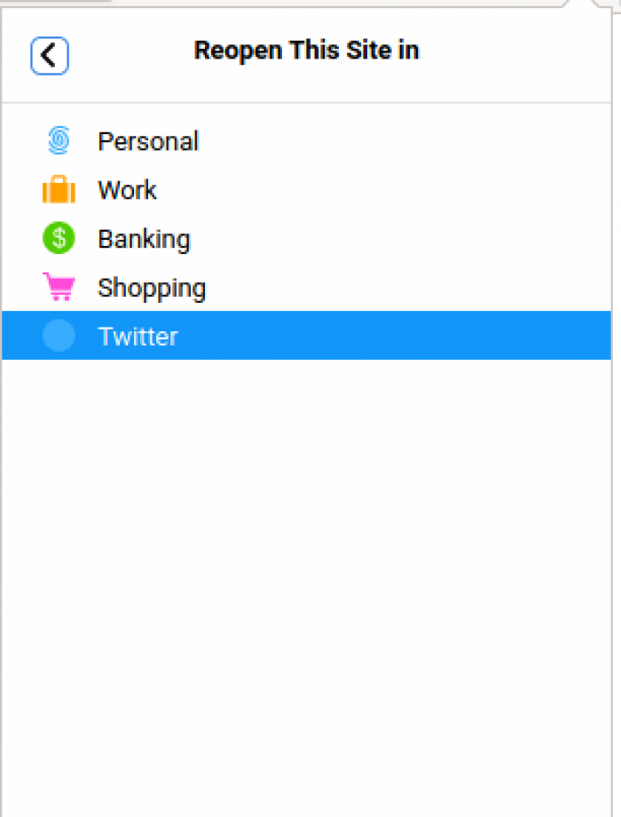
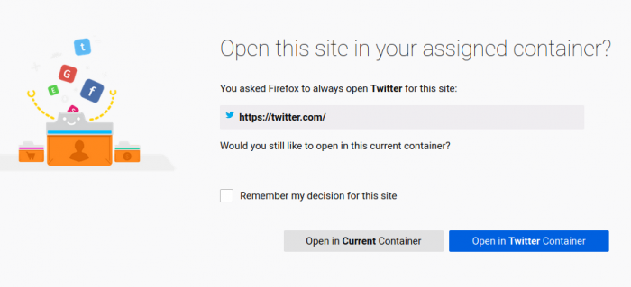
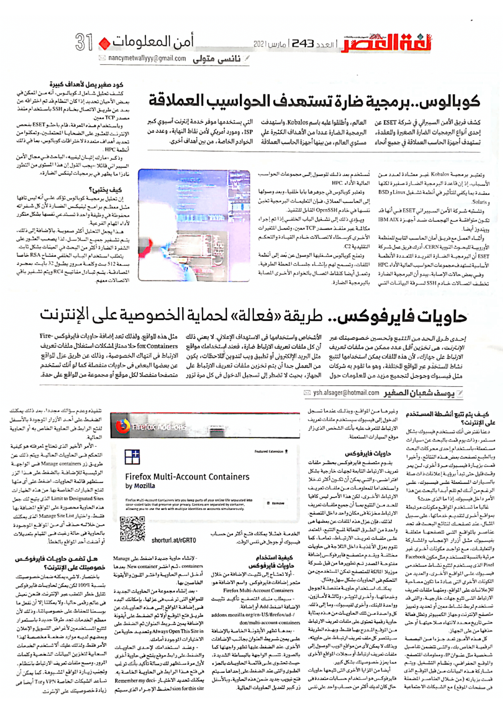

+++
title = "حاويات فايرفوكس.. طريقة بسيطة وفعالة لحماية الخصوصية على الإنترنت"
date = "2021-03-01"
description = "إحدى طرق الحد من التتبع وتحسين خصوصيتك عبر الإنترنت هي تخزين أقل عدد ممكن من ملفات تعريف الارتباط على جهازك وذلك لأن هذه الملفات يمكن استخدامها لتتبع نشاط المستخدم عبر المواقع المختلفة، وهو ما تقوم به شركات مثل فيس بوك وجوجل لتجميع مزيد من المعلومات حول الأشخاص واستخدام هذه المعلومات في الاستهداف الإعلاني. ومع ذلك فليست كل ملفات تعريف الارتباط ضارة، فعند استخدامك مواقع مثل البريد الإلكتروني أو تطبيق ويب لتدوين الملاحظات سيكون من العملي جدًا أن يتم تخزين ملفات تعريف الارتباط على الجهاز بحيث لا تضطر إلى تسجيل الدخول في كل مرة تزور مثل هذه المواقع. ولذلك تعد إضافة حاويات فايرفوكس Firefox Containers حلاً ممتازة لمشاكل استغلال ملفات تعريف الارتباط في انتهاك الخصوصية وذلك عن طريق عزل المواقع عن بعضها البعض في حاويات منفصلة كما لو أنك تستخدم متصفحًا منفصلًا لكل موقع أو مجموعة من المواقع على حدى."
categories = ["الخصوصية",]
tags = ["مجلة لغة العصر"]
images = ["images/0.jpg"]

+++
إحدى طرق الحد من التتبع وتحسين خصوصيتك عبر الإنترنت هي تخزين أقل عدد ممكن من ملفات تعريف الارتباط على جهازك وذلك لأن هذه الملفات يمكن استخدامها لتتبع نشاط المستخدم عبر المواقع المختلفة، وهو ما تقوم به شركات مثل فيس بوك وجوجل لتجميع مزيد من المعلومات حول الأشخاص واستخدام هذه المعلومات في الاستهداف الإعلاني. ومع ذلك فليست كل ملفات تعريف الارتباط ضارة، فعند استخدامك مواقع مثل البريد الإلكتروني أو تطبيق ويب لتدوين الملاحظات سيكون من العملي جدًا أن يتم تخزين ملفات تعريف الارتباط على الجهاز بحيث لا تضطر إلى تسجيل الدخول في كل مرة تزور مثل هذه المواقع. ولذلك تعد إضافة حاويات فايرفوكس Firefox Containers حلاً ممتازة لمشاكل استغلال ملفات تعريف الارتباط في انتهاك الخصوصية وذلك عن طريق عزل المواقع عن بعضها البعض في حاويات منفصلة كما لو أنك تستخدم متصفحًا منفصلًا لكل موقع أو مجموعة من المواقع على حدى.

## كيف يتم تتبع أنشطة المستخدم على الإنترنت؟

دعنا نفترض أنك تستخدم فيسبوك بشكل مستمر، وذات يوم قمت بالبحث عن "سيارات مستعملة" باستخدام إحدى محركات البحث وبالطبع تصفحت بعض هذه النتائج، وأخيرًا قمت بزيارة فيسبوك مرة أخرى. لن يمر وقت قليل حتى تبدأ برؤية إعلانات ذات صلة بالسيارات المستعملة على فيسبوك على الرغم من أنك لم تقم أبدًا بالبحث عن هذا الأمر داخل فيسبوك. إذًا ما الذي حدث؟

غالبا ما تستخدم المواقع مكونات مرتبطة بمواقع أخرى لتقديم خدماتها، فعلى سبيل المثال عند تصفحك لنتائج البحث قد تجد عناصر بالمواقع التي تتصفحها متعلقة بفيسبوك مثل أزرار الإعجاب والمشاركة والتعليقات. كما قد تتواجد مكونات أخرى غير مرئية بالنسبة للمستخدم مثل مكون Facebook Pixel الذي يستخدم لتتبع نشاط مستخدمي فيسبوك على المواقع الأخرى، والعديد من المكونات الأخرى التي عادة ما تكون مصاحبة للإعلانات على المواقع ومنها ملفات تعريف الارتباط التي تتبع جهات خارجية والتي قد تستخدم لربط نشاط معين أو تحديد وتمييز متصفح الإنترنت وجهاز الكمبيوتر وتظل فعالة حتى تاريخ محدد لانتهاء صلاحيتها أو حتى حذفها من على الجهاز.

كل هذه الأمور تعد جزءًا من البصمة الرقمية الخاص بك والتي قد تتضمن تفاصيل شخصية مثل عنوان IP، ومعلومات المتصفح، والموقع الجغرافي، ونظام التشغيل. ويتم مشاركة هذه البيانات من قبل الموقع الذي قمت بزيارته (من خلال العناصر المضمنة في صفحات الموقع) مع الشبكات الاجتماعية وغيرها من المواقع، وبذلك ذلك عندما تسجل الدخول إلى الفيسبوك، سيستخدم ملفات تعريف الارتباط للتعرف عليه بأنك الشخص الذي زار موقع السيارات المستعملة.

## حاويات فايرفوكس

يقوم متصفح فايرفوكس بحظر ملفات تعريف الارتباط التابعة لجهات خارجية بشكل افتراضي حيث إنها يمكن أن تكون أكثر تدخلا واستخدامًا المعلومات من ملفات تعريف الارتباط الأخرى، لكن هذه الأمر ليس كافيًا للحد من التتبع بما أن جميع ملفات تعريف الارتباط مخزنة في مكان واحد داخل المتصفح.

ولذلك فإن عزل هذه الملفات عن بعضها هي واحدة من الطرق الفعالة لمنع التتبع الذي يعتمد على ملفات تعريف الارتباط، تمامًا كما تقوم بعزل الأغذية داخل الثلاجة في حاويات مختلفة. ويقدم متصفح فايرفوكس إضافة مفتوحة المصدر تم تطويرها من قبل شركة موزيلا المالكة للمتصفح تمكن المستخدمين من التحكم في الحاويات بشكل سهل وفعّال.

فيمكنك استخدام حاوية منفصلة لجوجل وخدماتها، وأخرى لتويتر، وثالثة لأمازون، وواحدة للبنك، وأخرى للفيس بوك، وما إلى ذلك. كل واحدة من تلك الحاويات من هذه بمثابة حاوية رقمية تحتوي على ملفات تعريف الارتباط من الموقع المدرج بها فقط. وبهذه الطريقة سيقتصر كل ملف تعريف ارتباط على حاويته، وبذلك لا يمكن لأي من مواقع الويب الوصول إلى ملفات تعريف ارتباط أو سجلات المواقع الأخرى مما يعزز خصوصيتك بشكل كبير.

أيضًا من المزايا الأخرى التي تتيحها حاويات فايرفوكس هو استخدام حسابات متعددة في حال كان لديك أكثر من حساب واحد على نفس الخدمة. فمثلا يمكنك فتح أكثر من حساب فيس بوك أو جوجل في نفس الوقت.

## كيفية استخدام حاويات فايرفوكس

- أولًا تحتاج إلى تثبيت الإضافة من خلال متجر إضافات فايرفوكس. سيطلب منك المتصفح تأكيد تثبيت الإضافة اضغط Add أو إضافة.
https://addons.mozilla.org/en-US/firefox/addon/multi-account-containers
- بعدها ستظهر لك الأيقونة الخاصة بالإضافة على يمين شريط العنوان بجانب الإضافات الأخرى. عند الضغط على هذه الأيقونة ستظهر واجهتها كما بالصورة. تتسم الواجهة بالبساطة الشديدة حيث تحتوي على قائمة الحاويات بالجزء العلوي والتي عند الضغط على إحداها سيتم فتح تبويب جديد ضمن هذه الحاوية، وبالأسفل وزر كبير لتعديل الحاويات الحالية.

- لإنشاء حاوية جديدة قم بالضغط على Manage containers ثم اختيار New container. بعدها أدخل اسم الحاوية واختر اللون والأيقونة الخاصين بها.

- بعد إنشاء مجموعة من الحاويات الجديدة للمواقع التي ترغب في عزلها بإمكانك البدء في إضافة المواقع إلى هذه الحاويات عن طريق فتح الموقع أولًا ثم الضغط على أيقونة الإضافة يمين شريط العنوان ثم الضغط على Always Open This Site in... وتحديد حاوية من الاختيارات الموجودة أمامك.

- وعند استخدامك لإحدى الحاويات والضغط على رابط موقع يفتح في حاوية أخرى لأول مرة ستظهر لك رسالة تأكيد بأنك ترغب في فتح هذا الرابط في الحاوية الخاصة به. يمكنك تحديد الاختيار Remember my decision for this site لحفظ الإجراء الذي سيتم تنفيذه وعدم سؤالك مجددًا، بعد ذلك يمكنك الضغط على أحد الأزرار الموجودة بالأسفل لفتح الرابط في الحاوية الخاص به أو الحاوية الحالية.

- الأمر الأخير الذي تحتاج لمعرفته هو كيفية التحكم في الحاويات الحالية. ويتم ذلك عن طريق زر Manage containers في الواجهة الرئيسية للإضافة. بالضغط على هذا الزر ستظهر قائمة الحاويات، اضغط على أي منها لفتح الخيارات الخاصة بها. من هذه الخيارات Limit to Designated Sites الذي يتيح لك جعل هذه الحاوية محصورة على المواقع المضافة بها فقط، واختيار Manage Site List الذي يمكنك من خلاله حذف أي من المواقع الموجودة بالحاوية في حالة رغبت في القيام بتعديلات أو أضفت أحد المواقع بالخطأ.

**ملاحظة**: يمكنك مزامنة الحاويات والمواقع المدرجة بكل حاوية مع حسابك الشخصي على فايرفوكس حتى لا تحتاج إلى إعادة تهيئة الإضافة كل مرة تعيد تثبيت المتصفح فيها عن طريقة الدخول إلى إعدادات الإضافة ثم التبويب Preferences وتفعيل الاختيار Enable Sync.

## هل تضمن حاويات فايرفوكس خصوصيتك على الإنترنت؟

باختصار، لا. لا شيء يمكنه أن يضمن خصوصيتك بنسبة 100% لكن يمكن لحاويات فايرفوكس تقليل خطر التعقب عبر الإنترنت. فنحن نعيش في عالم رقمي حاليًا، ولا يمكننا إلا أن نفعل ما بوسعنا للحفاظ على خصوصياتنا وذلك لأن معظم الخدمات تجد طرقًا جديدة باستمرار لتتبع المستخدمين لأغراض التسويق والإعلان وبعضهم لديه موارد ضخمة مخصصة لهذا الأمر فقط. ولذلك عليك ألا تستخدم الخدمات السحابية لتخزين البيانات الشخصية وكلمات المرور، ومسح ملفات تعريف الارتباط بانتظام، وتجنب زيارة المواقع المشبوهة، كما يمكن أن تساعد الشبكات الخاصة VPN وTor أيضًا في زيادة خصوصيتك على الإنترنت.

---

هذا الموضوع نُشر باﻷصل في مجلة لغة العصر العدد 243 شهر 03-2021 ويمكن الإطلاع عليه [هنا](https://drive.google.com/file/d/1TgLMN-xxxN60ASG7Vqyr8ZZltasb_oM_/view?usp=sharing) أو [هنا](https://gate.ahram.org.eg/News/2696323.aspx).

