+++
title = "الهواتف القابلة للطي.. هل تكون بداية عصر جديد؟"
date = "2019-02-01"
description = "ظهرت فكرة الأجهزة القابلة للطي منذ وقت مبكر للغاية، وتحديدا في أواخر 2013، حيث عرضت سامسونج خططها للبدء في إنتاج أجهزة قابلة للطي. ومع مضى العديد من السنوات أصبح من المعتاد أن نسمع كل عام عن نية إحدى الشركات الكبرى لإطلاق أجهزة قابلة للطي. لكن الوضع أصبح مختلفًا الآن، وخاصة بعد أن أعلنت سامسونج عن جهازها القابل للطي في مؤتمر المطورين الخاص بها في 2018. ويبدو أن سامسونج ليست الوحيدة التي تنوي اقتحام هذا السوق الجديد. فهل سيكتب النجاح لهذه التقنية العائدة؟"
categories = ["تقارير",]
tags = ["مجلة لغة العصر"]
images = ["images/samsung_2019.jpg"]

+++

ظهرت فكرة الأجهزة القابلة للطي منذ وقت مبكر للغاية، وتحديدا في أواخر 2013، حيث عرضت سامسونج خططها للبدء في إنتاج أجهزة قابلة للطي. ومع مضى العديد من السنوات أصبح من المعتاد أن نسمع كل عام عن نية إحدى الشركات الكبرى لإطلاق أجهزة قابلة للطي. لكن الوضع أصبح مختلفًا الآن، وخاصة بعد أن أعلنت سامسونج عن جهازها القابل للطي في مؤتمر المطورين الخاص بها في 2018. ويبدو أن سامسونج ليست الوحيدة التي تنوي اقتحام هذا السوق الجديد. فهل سيكتب النجاح لهذه التقنية العائدة؟

> فكرة تعود مرة أخرى بعد غياب دام لسنوات...

تعتقد الشركات (وربما بعض المستخدمين) أن تصاميم الهاتف أصبحت مملة. مستطيلات سوداء مملة ظلت لمدة طويلة للغاية وفقدت بريقها. ومع شيوع التصميم الأخير الذي قد يكون غير جذاب للبعض (النوتش أو قطع الشاشة)، تحاول الشركات إيجاد مخرج لأزمة الابتكار التي تعاني منها. فشاهدنا خلال الأشهر السابقة خروج سامسونج بفكرة "حفرة الشاشة" التي تحتوي على الكاميرا، وبذلك توفر مساحة أكبر شاشة الهاتف وتصبح الحواف غير موجودة إطلاقا. لكن العديد من الشركات كان لها رأى آخر ويبدو أننا على أعتاب ثورة في تصميم الهواتف، وقد تكون الهواتف القابلة للطي.

## 2014.. الفكرة لا تموت

عام 2014 كان بمثابة شرارة البدء لإعلان الشركات عن التقنية الجديدة، حيث حصلت سامسونج على براءة اختراع لجهاز ذكي بشاشة قابلة للطي تحمل الرقم "US D696,693 S" يظهر فيها تصميم لجهاز يشبه التابلت، يمكن طيه كالكتاب، واقتصرت البراءة على رسومات حول التصميم فقط، دون أي مواصفات أُخرى.

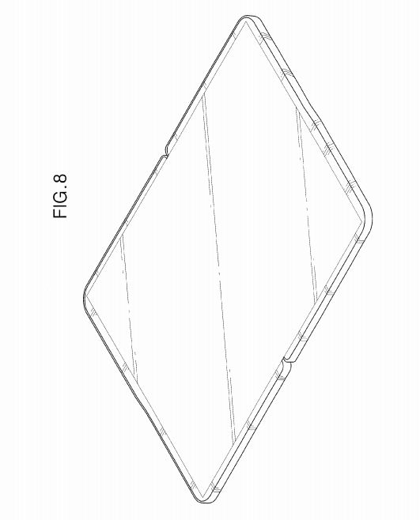

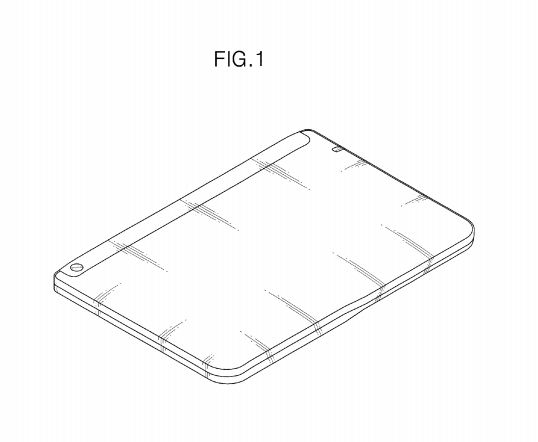

 ثم انتشر فيديو على اليوتيوب يستعرض هذا المفهوم من سامسونج https://youtu.be/MguV4zQc3L0
ثم كشفت شركة نوكيا عن شاشات OLED قابلة للطي، لكنها لسوء الحظ لم تر النور بعد استحواذ مايكروسوفت على نوكيا في نفس العام.

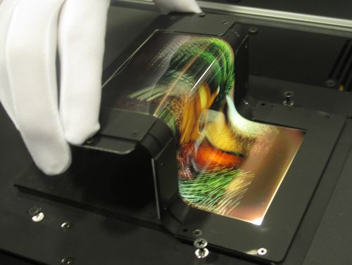

## 2015-2016

أما 2015 و2016 فقد شهدتا حصول مايكروسوفت على براءة اختراع لشاشة قابلة للطي، إضافة لظهور تقارير عن بدء شركة "ال جي" في الإنتاج الفعلي لشاشات OLED قابلة للطي للاستخدام التجاري من قبل شركاءها. دون حدوث أي ظهور فعلى للأجهزة.

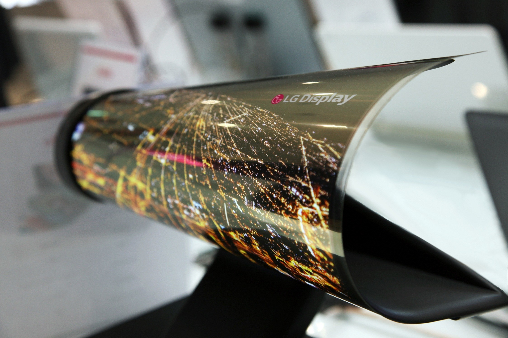

## 2017

وفى 2017 ظهرت دلائل قوية وعدد من التسريبات تشير إلى إطلاق سامسونج جهاز قابل للطي تحت اسم "Galaxy X"، لكن سامسونج نفت، بل وصرحت أن الأجهزة القابلة للطي قد لا تري النور قبل 2019!
وكانت مفاجأة هذا العام هي إطلاق شركة ZTE لأول جهاز قابل للطي، تحت اسم ZTE Axon M والذي أتى بشاشتين 5.2 بوصة ومعالج سناب دراجون 821 وبطارية 3180 مللي أمبير، ويعمل بأندرويد 7.1.2.

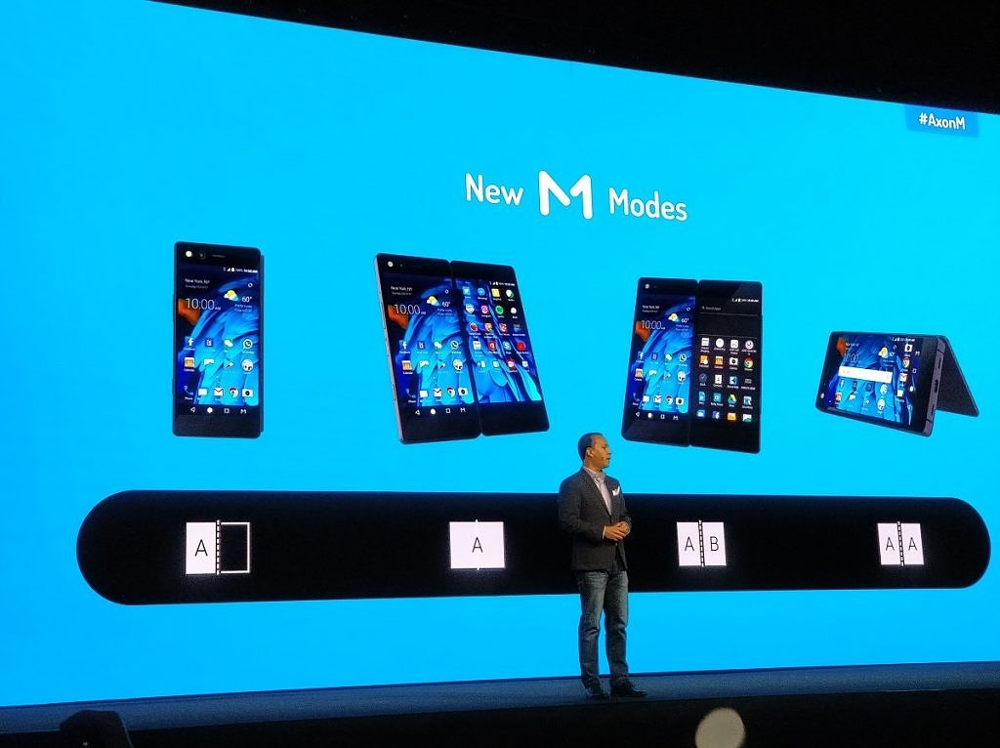

كما ظهرت العديد من التقارير عن عمل مايكروسوفت وهواوي وسامسونج عن أجهزتها الخاصة القابلة للطي. وحصلت أبل على براءة اختراع خاصة بها هي أيضا.

## 2018.. البداية الحقيقة

بعد الضجة التي أحدثها هاتف ZTE الجديد، أصبح من الواضح لجميع الشركات أن السوق الجديد يحتاج لدخول المنافسين.

فمع بداية العام أكدت سامسونج على وجود جهازها القابل للطي "Galaxy X"، وحصلت "ال جي" على براءتي اختراع لهواتف قابلة للطي، وكذلك موتورولا. 

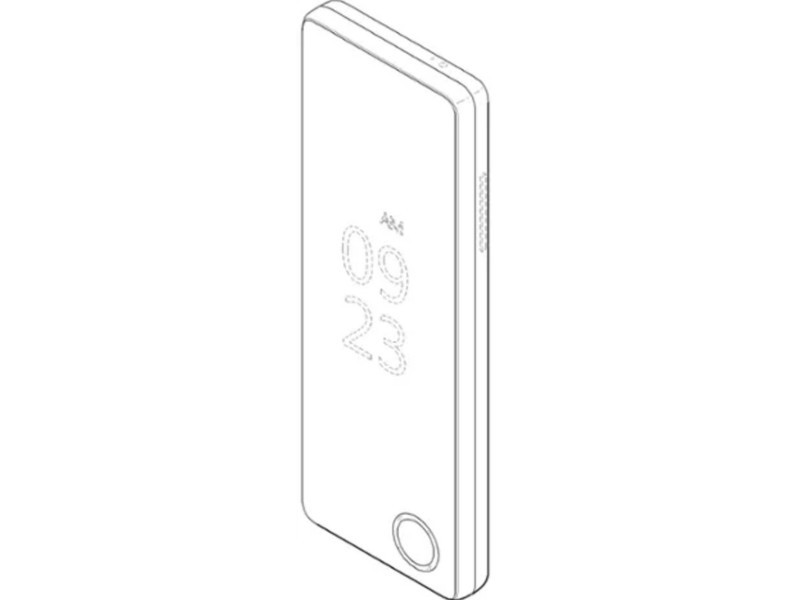

وفى منتصف العام انتشرت صور مسربة لجهاز سامسونج تم إلغاءه على تويتر https://twitter.com/MMDDJ_/status/1007948316775071744 
ويظهر فيها جهاز مشابه بشكل كبير لهاتف ZTE

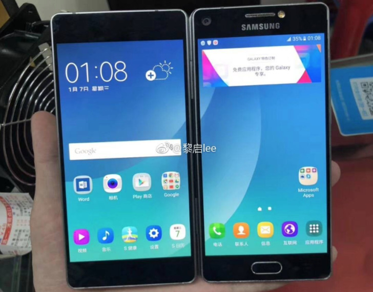

إضافة الى ظهور شائعات قوية عن تابلت مايكروسوفت Surface Andromeda الذي قد يكون بمثابة بوابة عودة مايكروسوفت إلى الأجهزة المحمولة. وفى نفس التوقيت أيضا صدرت تقارير من سامسونج تؤكد اعتزامها بدء تزويد الشركات الأخرى بالشاشات القابلة للطي مثل شاومي وأوبو.

ومرة أخرى مع تسريبات تويتر، حيث تم نشر فيديو لجهاز قابل للطي من لينوفو، يعرض نموذج أولي لهاتف قابل للطي يظهر أنه يعمل بشكل جيد.

https://twitter.com/bang_gogo_/status/1044934487404994561

وفى أكتوبر، صرح الرئيس التنفيذي لشركة هواوي أن الشركة ستطلق هاتف قابل للطي، يدعم شبكات الجيل الخامس في صيف 2019.

ثم كانت المفاجأة، حيث قامت شركة صينية تسمي "Royole Corporation" بحركة لم تتوقعها سامسونج، وقدمت للعالم أول هاتف بشاشة قابلة للطي "فعليا" تحت اسم FlexPai، حيث أن ZTE Axon M كان يعتمد على الشاشتين مع هيكل قابل للطي.
ويأتي هذا الجهاز بمواصفات رائدة: معالج سناب دراجون 855 ومساحة داخلية 128 جيجا ورام 8 جيجا وشاشة 7.8 AMOLED، إضافة لكاميرتين 16 و20 ميجا بيكسل، وبطارية 3800 مللي أمبير.

وأتاحت الشركة الصينية إمكانية الطلب المسبق لجهازها الجديد لاحقا في ديسمبر بأسعار تبدأ من 1320 دولار، كما تم عرض الجهاز بمعرض CES 2019.

http://www.royole.com/flexpai-specs

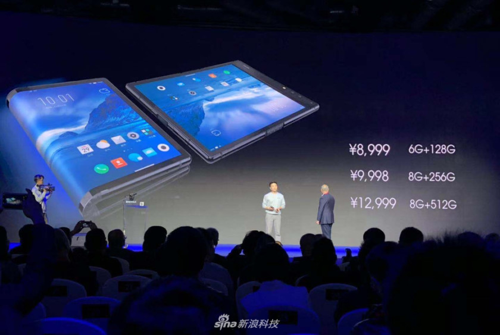

لم يتأخر الرد من سامسونج، ففي 7 نوفمبر عقدت الشركة الكورية الجنوبية مؤتمر المطورين الخاص بها، وكشفت فيه عن نسخة أولية من جهاز قابل للطي بشاشة 7.3 بوصة يحمل الاسم Infinity Flex.

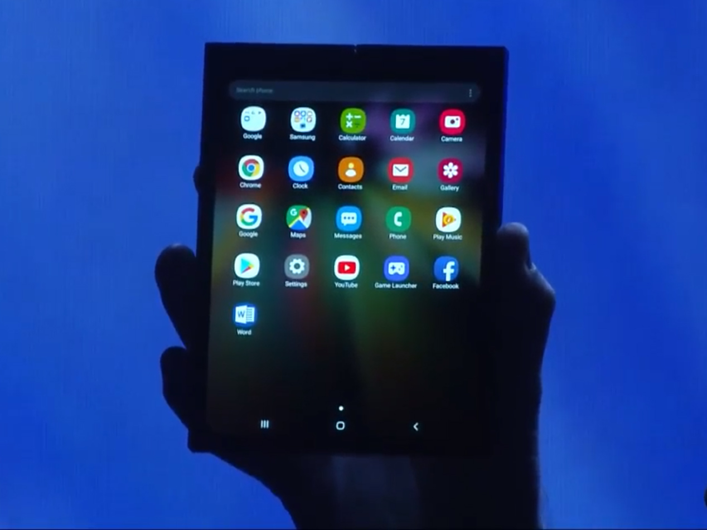

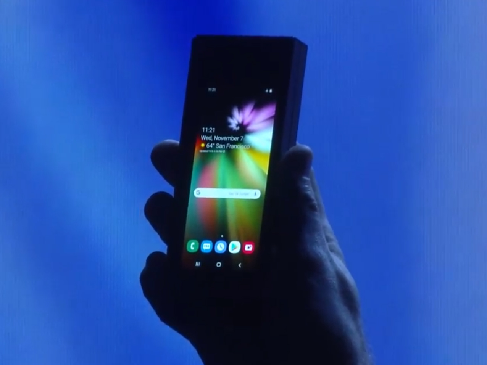

وفى نفس الأسبوع أعلنت جوجل عن إضافة دعم الشاشات القابلة للطي لنظام أندرويد بشكل رسمي، مما يعني أن التقنية الجديدة ستكون على أجهزة أندرويد أولا.
https://t.co/NAfOmCOY26

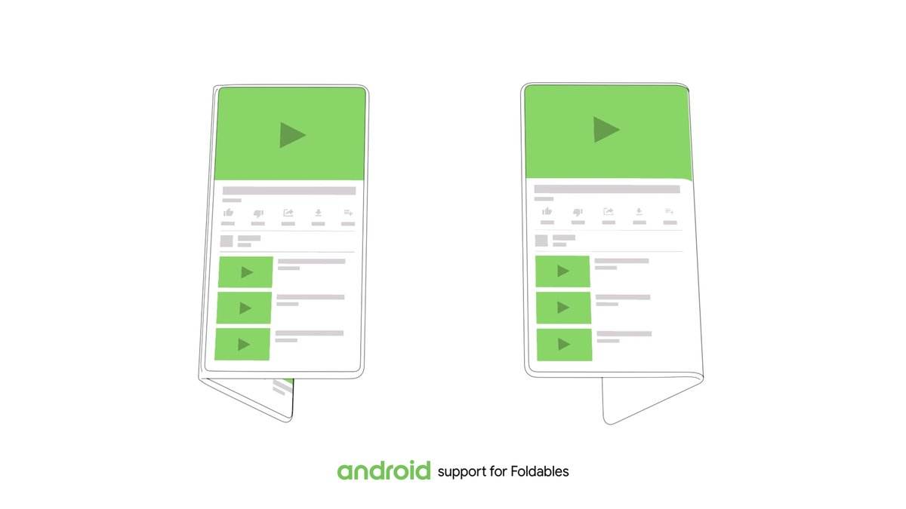

## 2019.. بدء استهداف المستخدمين

مع الرهان من Google على مستقبل الأجهزة القابلة للطي العاملة بنظام أندرويد، يبدو أن جميع الشركات المصنعة للهواتف تنوى اقتحام هذا السوق الواعد، حتى أن شركة أبل تبحث إطلاق نسخة قابلة للطي من أيفون في 2020. فيبدو أننا سنشهد إطلاق مزيد من هذه الأجهزة في المستقبل القريب وخاصة 2019:

### 1- سامسونج جلاكسي إف

بعد أن استعرضت سامسونج تقنية "إنفينيتي فليكس" في أوائل شهر نوفمبر، ظهرت تقارير جديدة تفيد بأن جهاز سامسونج الجديد Galaxy F (أو Galaxy X كما أشارت الإشاعات السابقة) سيأتي بشاشة 7.3 بوصة ودقة تبلغ 2152 × 1536 بكسل، وكاميرتين بواجهة خلفية 12 ميجا بيكسل، وعند طي الجهاز، ستكون الشاشة بحجم 4.58 بوصة ودقة تبلغ 1960 × 480 بكسل.
ويتوقع التقرير تكلفة الهاتف قد تصل إلى 1800 دولار.
لم تكشف شركة سامسونج عن تفاصيل أخرى حتى الآن، ولكننا نعرف أن الجهاز سيكون قادرًا على تشغيل ثلاث تطبيقات على الشاشة في وقت واحد، وذلك بفضل واجهة One UI الجديدة. ومن المنتظر أن تقوم الشركة الكورية بعرض الهاتف بشكل رسمي أثناء الإعلان عن هاتفها الجديد S10.

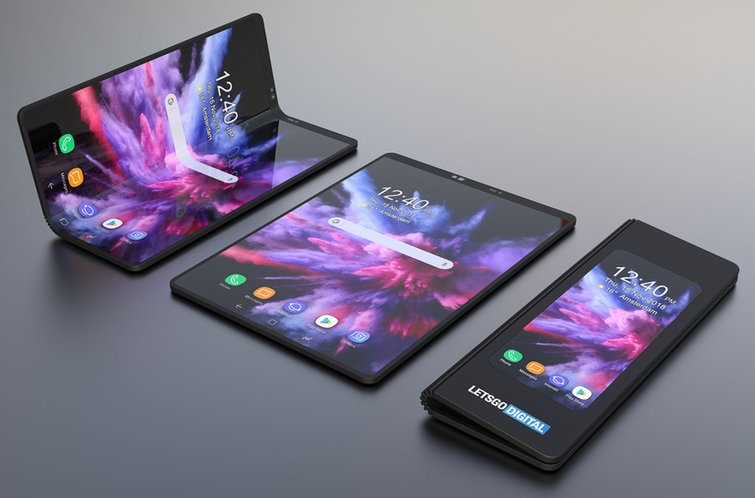

> واجهة One UI هي الواجهة الجديدة لهواتف سامسونج والتي تأتي خلفا للواجهة المعروفة TouchWiz، وهي مبنية على أندرويد باي 9، وتهدف إلى أن تكون واجهة سريعة ونظيفة وبها مجموعة من الميزات التي ترضي كل المستخدمين. وتتوفر حاليا لبعض الأجهزة فقط مثل S9 - S9+ - Note 9
>

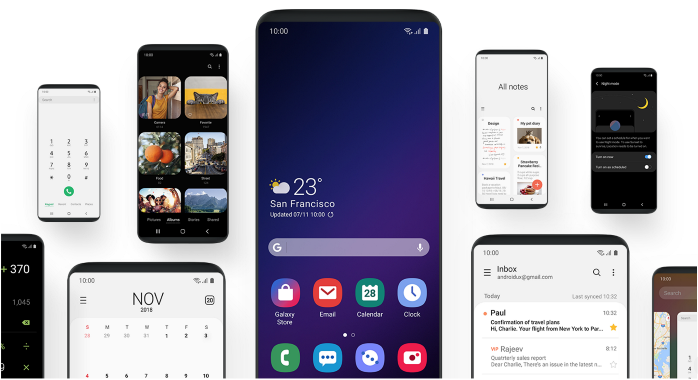

## 2- هاتف هواوي القابل للطي

يبدو أن هاتف هواوي القابل للطي هو الأكثر إثارة للإعجاب حتى الآن. فسيأتي بدعم شبكات الجيل الخامس وشاشة كاملة 5 بوصة (عند الطي) و 8 بوصة في الوضع العادي، مع إمكانية التعرف على هوية الوجه. وقد صرح كين هو الرئيس التنفيذي لشركة هواوي أن الجهاز القابل للطي سيكون قويا للغاية، لدرجة أنه سيكون قادرا على "استبدال الكمبيوتر".

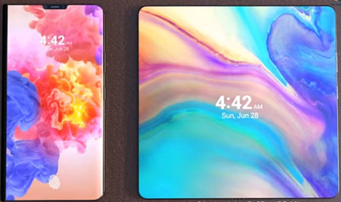

### 3- جهاز جديد من ال جي

جهاز آخر قابل للطي من المتوقع أن يظهر في MWC 2019، وقد يكون هذا الهاتف هو الذي ظهر في براءة اختراع حديثة كشف عنها Letsgodigital. 

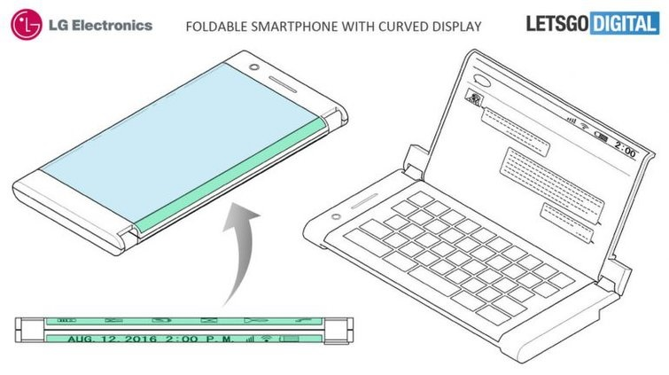

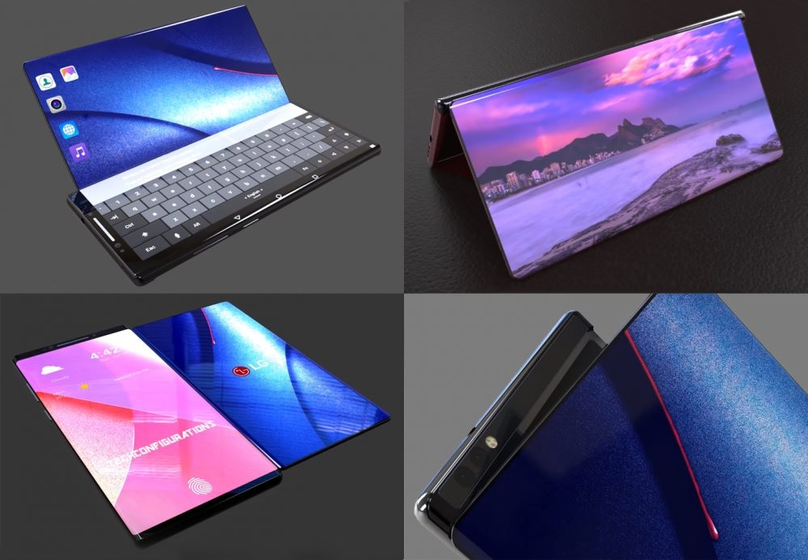

### 4- عودة ZTE

كان جهاز Axon M 2017 من أوائل الهواتف القابلة للطي، بفضل تصميم الشاشة المزدوجة. لكنه لن يكون نهاية المطاف بالنسبة لـ ZTE. ففي مقابلة مع نائب رئيس التسويق لشركة ZTE، جيف يي صرح أنهم يعملون على "شيء قابل للانحناء حقًا". ولا توجد تفاصيل أخرى حول هذا الجهاز الحقيقي القابل للطي حتى الآن.

### 5- أول جهاز قابل للطي من أوبو

أكد مسؤول تنفيذي من شركة Oppo أن الشركة ستطلق هاتف قابل للطي في MWC 2019. حيث قال: "نحن نعلم أن سامسونج وسوني تعملان على هاتف قابل للطي، يمكنك أيضًا توقع المزيد من الأخبار من أوبو حول هذا الموضوع، ربما في MWC".

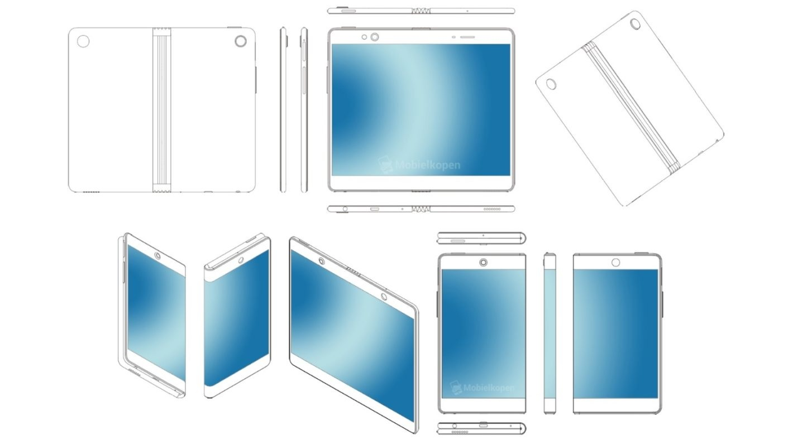

### 6- شاومي تعمل على جهازها الخاص أيضا

وفي بداية 2019 قام المسرب الشهير Evan Blass بنشر فيديو على تويتر لجهاز شاومي قابل للطي، يظهر فيه الجهاز يعمل بشكل ممتاز في وضع التابلت والوضع العادي بعد الطي من الجانبين. ويتضح من الفيديو أن الجهاز يعمل بواجهة MIUI، مما يعني أن تطوير الجهاز قد اقترب من نهايته وقد نراه في وقت قريب خلال 2019.

فيديو الجهاز https://twitter.com/evleaks/status/1080870489990590464/video/

وبعدها ببضعة أيام ظهر أخيرا أول فيديو رسمي للجهاز، يظهر فيه رئيس شركة شاومي وهو يستخدم الجهاز الجديد ويستعرض إمكانية طيه من الجانبين مع عمل الجهاز بشكل طبيعي، ويظهر من هذا الفيديو أن زر الطاقة موجود بأعلى الجهاز.
https://twitter.com/donovansung/status/1087945772639891462

## رأي المستخدمين

قامت بعض المواقع الأجنبية المتخصصة في نظام أندرويد بعمل استطلاعات للرأي حول الأجهزة القابلة للطي، ومدي تقبل المستخدمين لها.
استطلاع موقع AndroidPit يظهر أن 6% من المصوتين أعجب بشكل الأجهزة، و15% يعتقد أنها فكرة عملية، بينما سيرفض 42% امتلاك أي جهاز قابل للطي، و38% فقط يتقبل الفكرة وقد يقوم بالشراء في الأعوام القادمة.

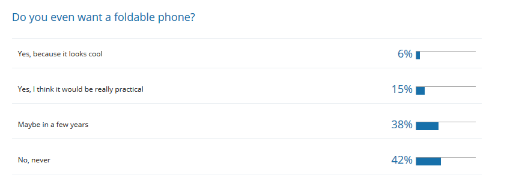

موقع SamMobile أيضا قد عقد استطلاع رأي لمستخدميه، حول مدي تطلعهم لشراء هاتف سامسونج القابل للطي عندما يصدر، وكانت النتائج شبيهة بالاستطلاع السابق، حيث رفض 502 مستخدم فكرة الشراء، و501 مستخدم سيفكر بعد معرفة مواصفات وسعر الجهاز، أما المستخدمين المستعدين للشراء فقط كانوا 294 فقط.

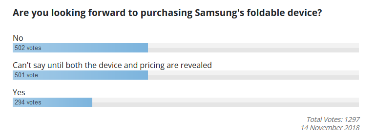

إذا، سيشهد العالم في 2019 توجه أغلب الشركات لتقديم هواتف قابلة للطي، لكن هل ستستطيع الأجهزة الجديدة إثبات فاعليتها وحصولها على نسبة جيدة من المستخدمين؟ لا أحد يستطيع توقع ذلك، فقد يكتب لها النجاح، وخاصة بعد دعم جوجل لها بشكل رسمي في نظام أندرويد، وقد تكون الأسعار أو عدم رضا المستخدمين "ضربة في مقتل" بالنسبة لها. لكن المؤكد أن هذه التقنية الجديدة ستصنع أثرا كبيرا في تطوير الأجهزة المحمولة.

---

هذا الموضوع نُشر باﻷصل في مجلة لغة العصر العدد 218 شهر 02-2019 ويمكن الإطلاع عليه [هنا](https://drive.google.com/file/d/1FTbE9MDcqwYb7zo29KhhHdFgvlP7ldZo/view?usp=sharing).

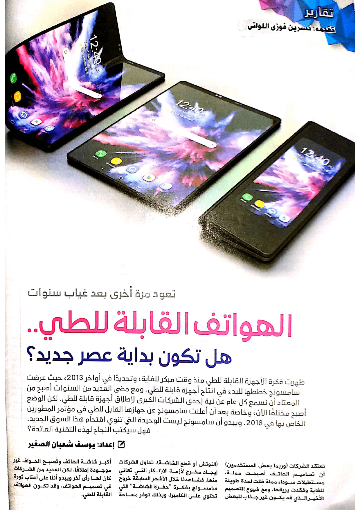

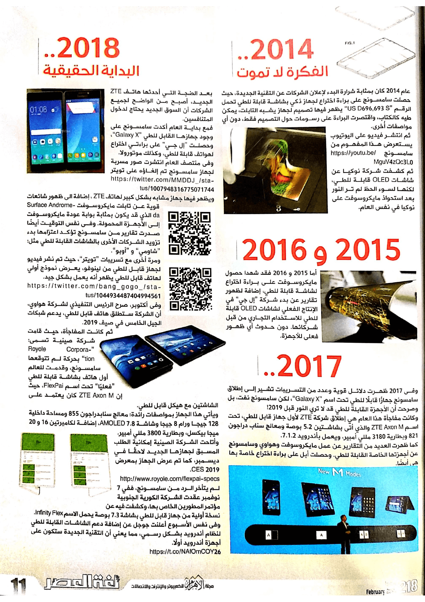

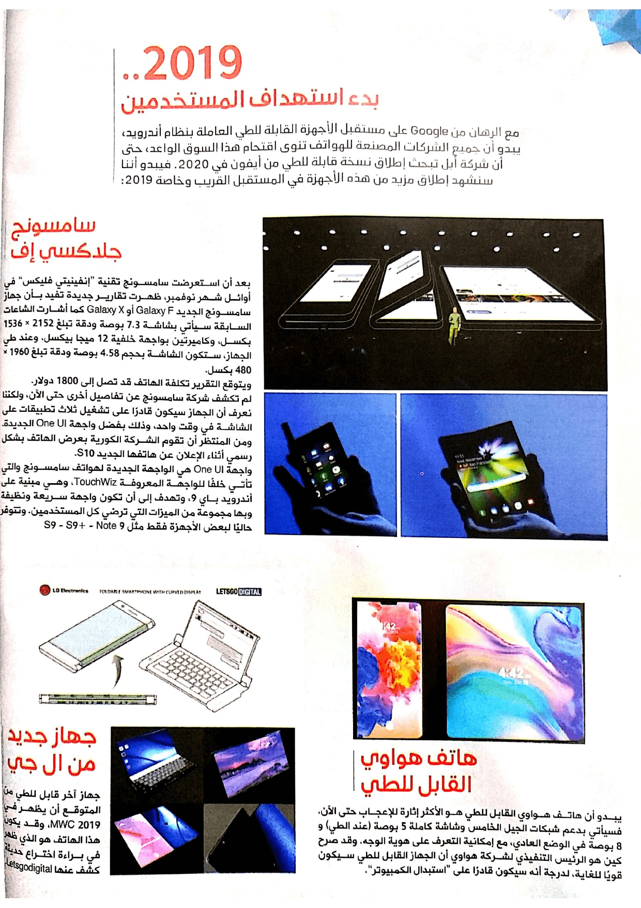

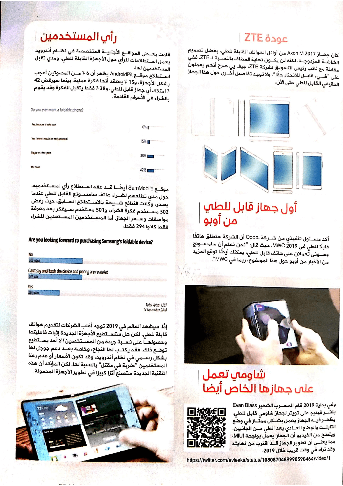
