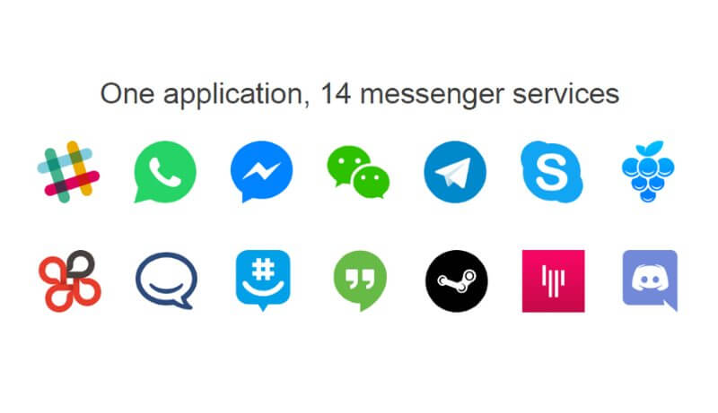
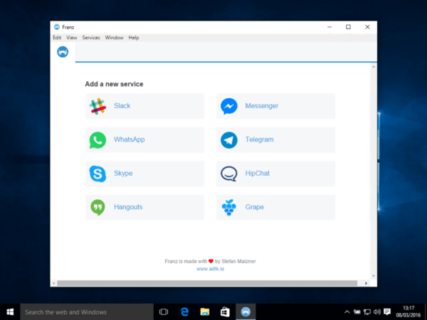
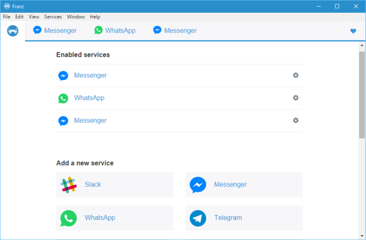
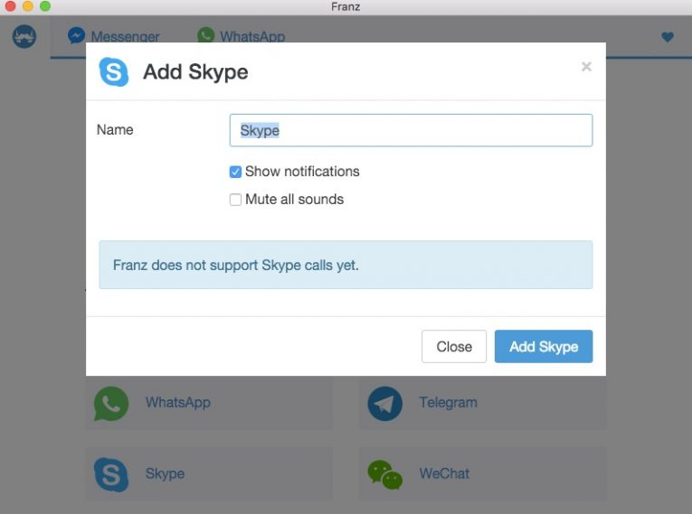
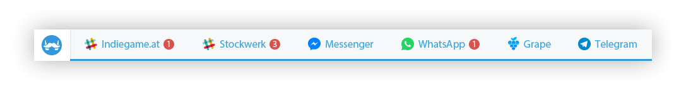
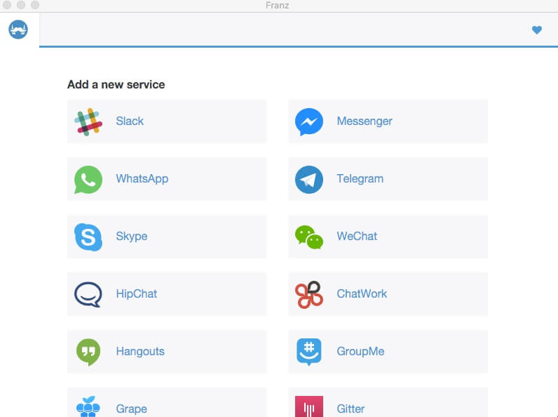

+++
title = "تعرف على برنامج Franz لتشغيل كل برامج الدردشة من مكان واحد!"
date = "2016-05-27"
description = "برنامج Franz هو برنامج مدهش يمكنك من فتح أكثر من 14 خدمة دردشة مختلفة، فمن خلاله يمكنك فتح الواتس اب، الماسنجر، والسكايب والعديد من الخدمات الأخرى التي سنتعرف عليها في هذا الموضوع"
categories = ["مهارات رقمية",]
tags = ["موقع لغة العصر"]
+++

برنامج Franz هو برنامج مدهش يمكنك عزيزي القارئ من فتح أكثر من 14 خدمة دردشة من خلاله دون الحاجة لتثبيت أي برامج إضافية، فمن خلاله يمكنك فتح الواتس اب، الماسنجر، السكايب والعديد من الخدمات الأخرى التي سنتعرف عليها في هذا الموضوع.

يتيح لك برنامج Franz استخدام كل خدمات الدردشة الموجودة به مثل واتس اب، تيليجرام، فيس بوك ماسنجر، سكايب، هانج آوتس والعديد من الخدمات الأخرى (14 خدمة دردشة) من مكان واحد وهو داخل البرنامج وليس هذا فقط بل مع امكانية تفعيل الاشعارات لسطح المكتب لتصل لك بمجرد وصول رسالة لك على أحد هذه الخدمات.

كما يعمل البرنامج أيضا على كل من الويندوز واللينكس والماك.

أيضا يمكنك اضافة أكثر من حساب لأي من خدمات الدردشة فيمكنك فتح أكثر من حساب واتس اب مع اضافة عدة نوافذ لكل خدمة نافذة مستقلة بها إلى جانب امكانية تسمية كل نافذة كما تريد لمزيد من التنظيم.

لتحميل البرنامج قم بالدخول إلى [هذا الرابط](http://meetfranz.com/#download).
بعد ذلك بفتح الملف الذي قمت بتحميله ليقوم البرنامج بالتثبيت التلقائي بمجرد الضغط عليه مرتين.

عند فتح البرنامج ستظهر الواجهة كما بالصورة:

- لإضافة خدمة جديدة اضغط على اسم الخدمة التي تريد استخدامها.
الخدمات التي يدعمها البرنامج حتى الان هي:
Slack, Facebook Messenger, WhatsApp, Telegram, Skype, WeChat, HipChat, ChatWork, Hangouts, GroupMe, Grape, Gitter, Steam Chat, و Discord.
- قم بكتابة اسم التبويب او اتركه كما هو، وقم باختيار تفعيل الاشعارات او اغلاقها ثم اضغط Add.

- بعد إضافة الخدمة التي تود استعمالها تقوم بتسجيل دخول حسابك بالطريقة العادية.
- يمكنك الانتقال بين الخدمات بدون مشاكل من القائمة الظاهرة في الأعلى كأنك تستخدم المتصفح.

حسب [احصائيات](https://blog.meetfranz.com/franz-for-windows-and-linux-is-here-99cc49a5f6db#.hcrzyrpzl) الموقع الرسمي فإن لدي البرنامج 55 ألف تثبيت و35 ألف مستخدم نشط يوميا.

في حالة رغبت في إضافة أي خدمات دردشة أخري إلى البرنامج يمكنك مراسلة فريق التطوير [من هنا](https://franz.zendesk.com/hc/en-us/requests/new).

---
هذا الموضوع نٌشر باﻷصل على موقع مجلة لغة العصر.

http://aitmag.ahram.org.eg/News/50083.aspx