+++
title = "5 وسائل لتحرير مساحة القرص الصلب في ويندوز 10 وأوبنتو"
date = "2017-02-01"
description = "بينما تتزايد سعة أجهزة التخزين يوما بعد يوم، وفى نفس الوقت يقل سعر كل جيجابايت، نواصل نحن المستخدمين ملء الأقراص الصلبة Hard disks بالبيانات، من ملفات فيديو وصور التقطت من هواتفنا، أو الملفات التي نقوم بتحميلها من الإنترنت، وهنا تأتى المشكلة عندما يكون لديك جهاز ذو سعة تخزين محدودة أو قرص من نوعية SSD."
categories = ["ويندوز", "لينكس",]
tags = ["مجلة لغة العصر"]
series = ["ويندوز 10"]

+++

بينما تتزايد سعة أجهزة التخزين يوما بعد يوم، وفى نفس الوقت يقل سعر كل جيجابايت، نواصل نحن المستخدمين ملء الأقراص الصلبة Hard disks بالبيانات، من ملفات فيديو وصور التقطت من هواتفنا، أو الملفات التي نقوم بتحميلها من الإنترنت، وهنا تأتى المشكلة عندما يكون لديك جهاز ذو سعة تخزين محدودة أو قرص من نوعية SSD.

إذا كنت بدأت تلاحظ أن المساحة لديك تنقص بسرعة، فلا تتسرع وتشتري وحدة تخزين جديدة، بدلا من ذلك يجب تحليل وحذف هذه الملفات التي تشغل مساحة القرص الصلب بلا فائدة.
في هذا الموضوع ستتعرف عزيزي القارئ على 5 طرق في ويندوز 10 ومثلها في أوبنتو لينكس للتخلص من الملفات الزائدة وتحرير أكبر مساحة ممكنه من القرص الصلب على جهازك.

## أولا: تحرير مساحة القرص الصلب في ويندوز 10

### 1- حذف الملفات الغير ضرورية

أغلب المستخدمين في هذه الحالة يميل لإنقاذ الكثير من الملفات، حتى ولو لم يكن بحاجة إليها، وعلاوة على ذلك فإن بعضنا يقوم بتخزين الملفات في مجلدات متداخلة بدون تنظيم، وبهذا لا يستطيع أن يفهم المساحة التي تهدر في القرض الصلب، وذلك لأن مستعرض الملفات Windows Explorer لا يقوم بعرض مساحة المجلدات افتراضيا.

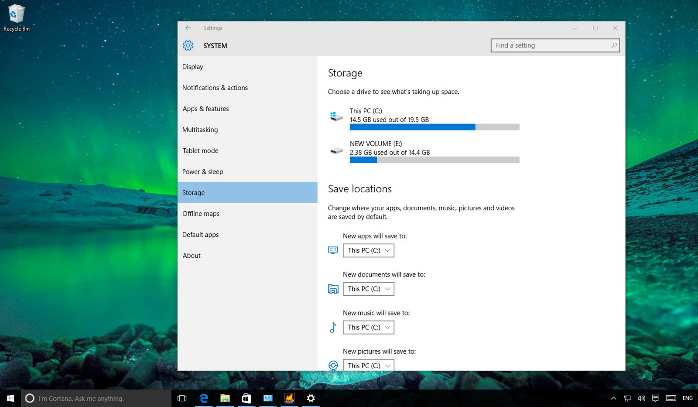

ومع ذلك، يمكننا استخدام إعدادات التخزين في ويندوز 10 للحصول على لمحة عامة عن الكيفية التي يتم بها استخدام مساحة على القرص الصلب، والأهم من ذلك يمكنك أن ترى المجلدات التي تستخدم المساحة الأكبر والتي يمكن أن تساعدك على تحديد واتخاذ قرار بشأن الملفات التي يمكن حذفها لتحرير بعض مساحة التخزين.

1. قم بفتح تطبيق الإعدادات، يمكنك استخدام الاختصار Windows key + I.
2. انتقل إلى القسم System ثم التبويب Storage.
3. أسفل Storage ستجد جميع أقسام القرص الصلب في جهازك (حيث This PC هو القسم المثبت عليه الويندوز)، اختر القسم الذي تريد تحليله.

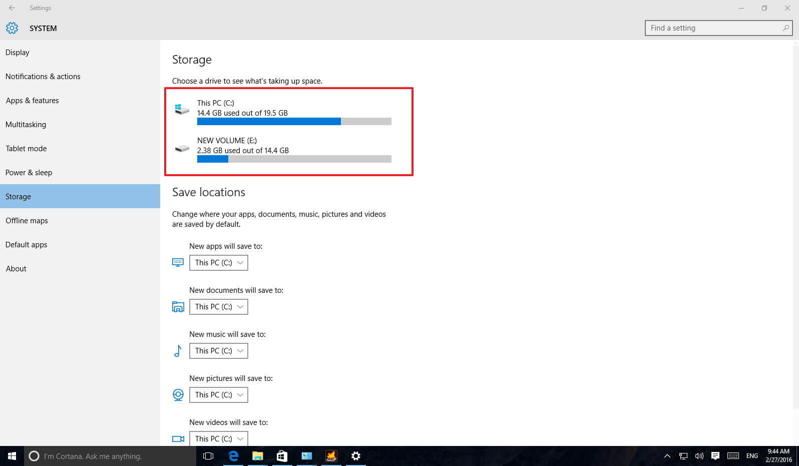

4. بعد اختيارك للقسم ستجد أن ويندوز 10 يقسم المحتوى حسب النوع، حيث ستجد المجلدات الافتراضية Documents, Pictures, Music ثم التطبيقات والألعاب وبعد ذلك ملفات النظام، اضغط على أي قسم لعرض معلومات مفصلة عنه.

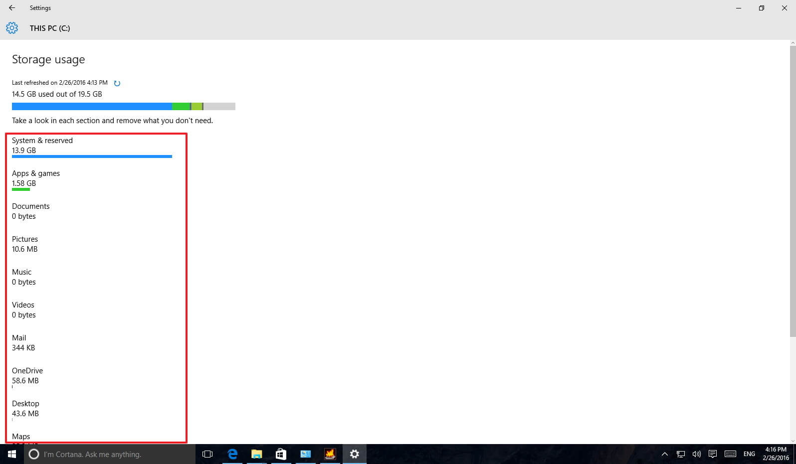

5. عند اختيارك لمجلد ما مثل الصور أو التحميلات، ستجد أسفل حجم المجلد زر للانتقال إليه، حيث يمكنك رؤية محتواه ومسح ما تريد من الملفات.

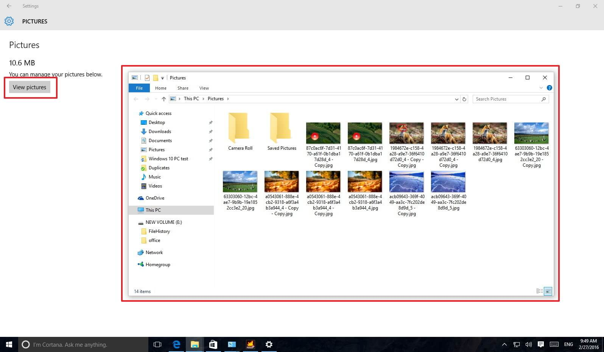

6. قم بالرجوع إلى الخلف واختيار الملفات المؤقتة Temporary files، في هذا القسم ستجد كل الملفات المؤقتة التي قد تريد حذفها، قم باختيار ما تريد حذفه ثم اضغط Remove Files.

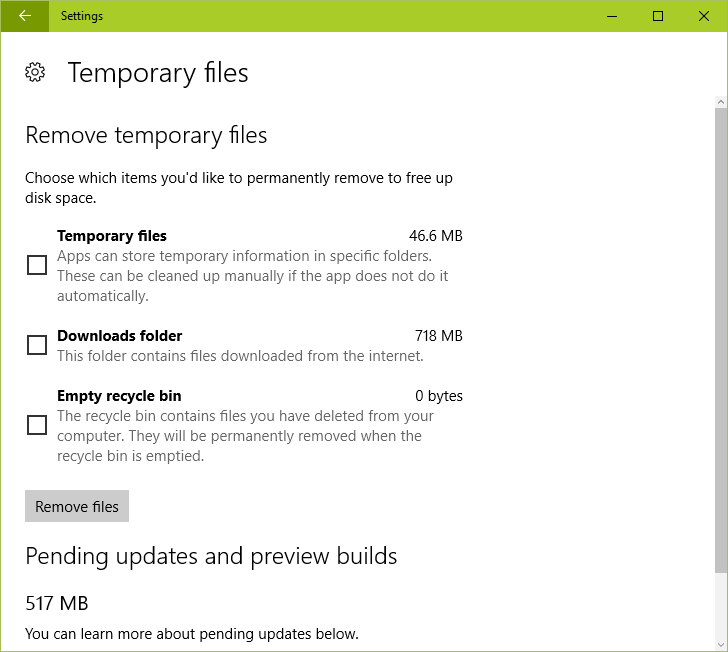

7. قم بالرجوع إلى الخلف مرة أخرى واختيار الملفات الأخرى Other، وفى هذا القسم ستجد كل المجلدات التي ليست ضمن الأقسام الأخرى.

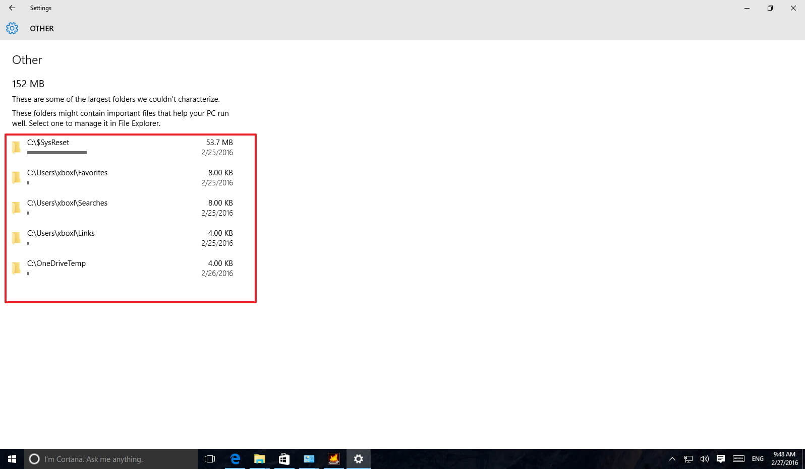

8. بمجرد الضغط على أي مجلد سيتم فتحه، إذا تعرفت إلى ما بداخل المجلد يمكنك حذفه.

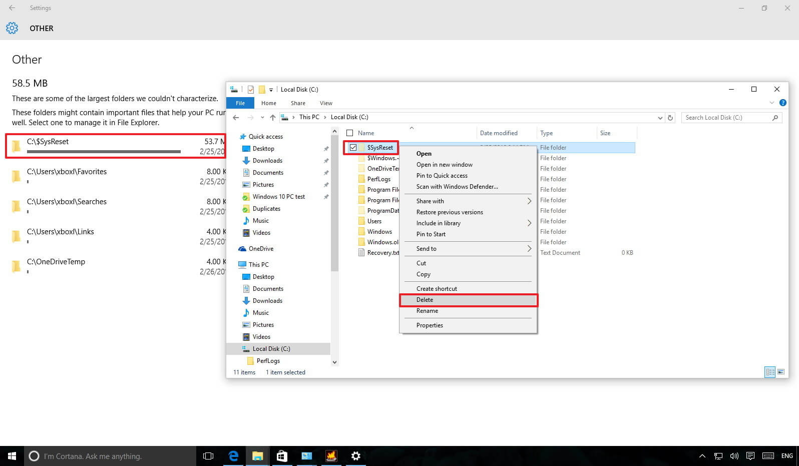

### 2- حذف الإصدارات القديمة من الملفات

إذا كانت المساحة التي تنفذ من القرص الخارجي external hard drive فربما تكون قد أعددت ميزة File History للاحتفاظ بنسخة احتياطية من ملفاتك الشخصية.
من الإعدادات التي تشملها ميزة File History عمل نسخة احتياطية من ملفاتك كل مدة زمنية محددة (ساعة مثلا) والاحتفاظ بها للأبد، وبهذا يتم استنزاف مساحة التخزين لديك.

1. قم بفتح لوحة التحكم Control Panel ثم اختر File History.

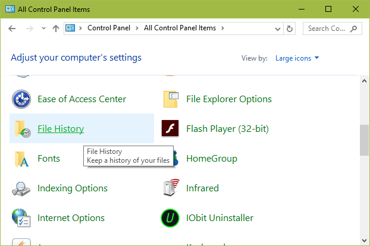

2. من اللوحة على يسار الشاشة اضغط على Advanced settings.

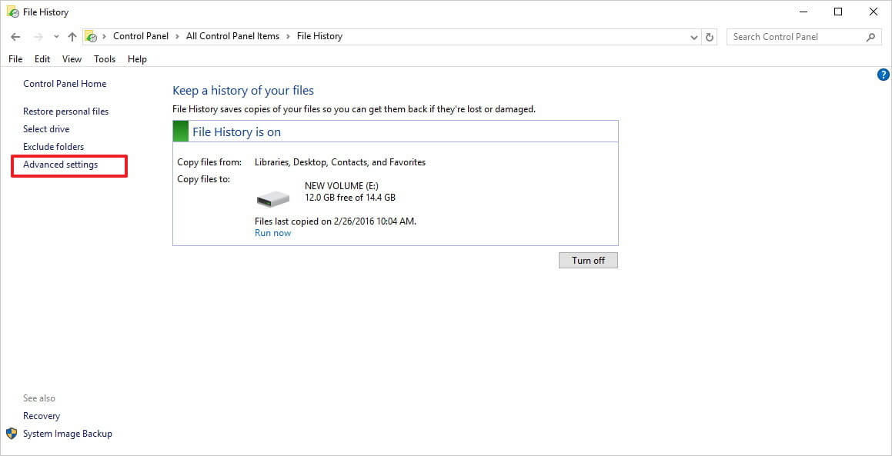

3. أسفل الاختيار Versions قم بتغيير الإعدادات الافتراضية Save copies of files وKeep saved versions إلى الاختيارات التي تفضلها، على سبيل المثال كل 3 شهور.

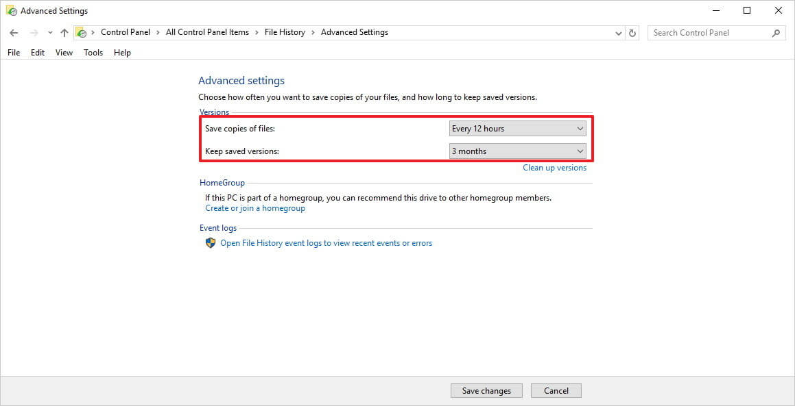

4. بعد ذلك اضغط على رابط Clean up versions، من خلال أداة File History Cleanup tool اختر إصدارات الملفات التي تريد حذفها، ويمكنك اختيار All but the latest one للاحتفاظ بنسخة واحدة على الأقل من هذه الملفات.

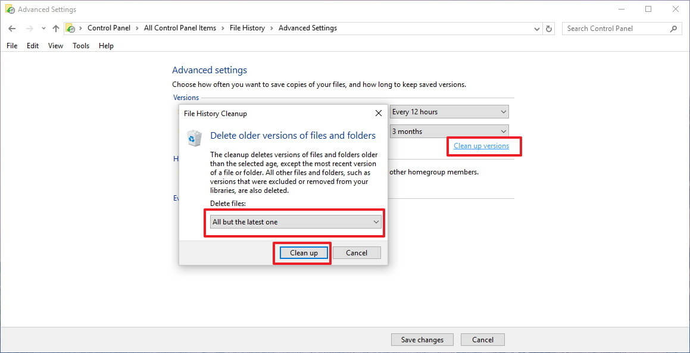

5. اضغط زر Clean up لإكمال عملية التنظيف ثم اضغط على زر Save changes لحفظ هذه التغييرات.

### 3- إزالة البرامج التي لا تحتاج:

عند إزالتك للبرامج التي تستخدمها نادرا فذلك يساعد أيضا في توفير مزيد من المساحة الفارغة، وفى ويندوز 10 تستطيع من خلال تطبيق الإعدادات إزالة البرامج وتطبيقات الويندوز أيضا.

1. قم بفتح تطبيق الإعدادات، انتقل إلى القسم System ثم التبويب Apps & features.
2. ستجد كل البرامج المثبتة على جهازك وتاريخ التثبيت وحجم كل برنامج.
3. اضغط على زر Uninstall لإزالة تثبيت أي برنامج ثم اضغط زر Uninstall مرة أخرى للتأكيد.

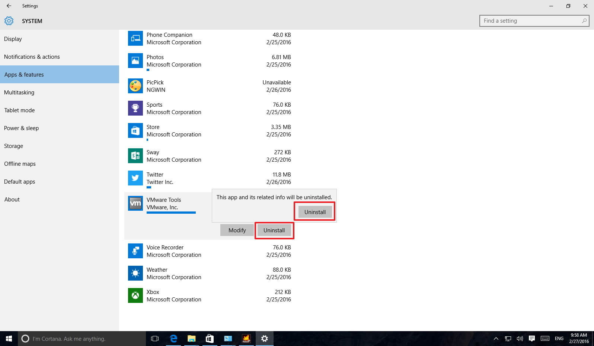

4. قم بإعادة هذه الخطوات مجددا لإزالة أي برنامج آخر.

### 4- حذف الصور المكررة

الصور من أكبر الملفات التي تشغل مساحة على القرص الصلب، ولهذا يفضل الاستعانة ببرامج إيجاد الصور المكررة لتوفير مساحة القرص الصلب عن طريق حذف الصور المتطابقة.

1. قم بتحميل برنامج Duplicate Photo Finder وهو برنامج محمول يعمل بدون تثبيت من هنا (اختر portable version)
   http://www.duplicate-finder.com/photo-download.html
2. قم بفك ضغط الملف ثم تشغيل من خلال AwesomePhotoFinder.exe.
3. اضغط على زر + لتحدد المجلد الذي سيتم البحث فيه عن الصور المكررة، ثم اضغط زر Start Search لبدء الفحص.

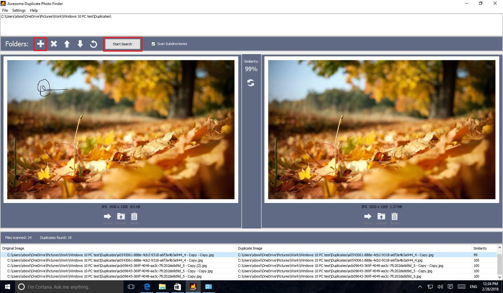

4. بعد اكتمال الفحص اختر النسخة التي تريد حذفها من الصورة ثم اضغط Yes لنقلها إلى سلة المحذوفات.

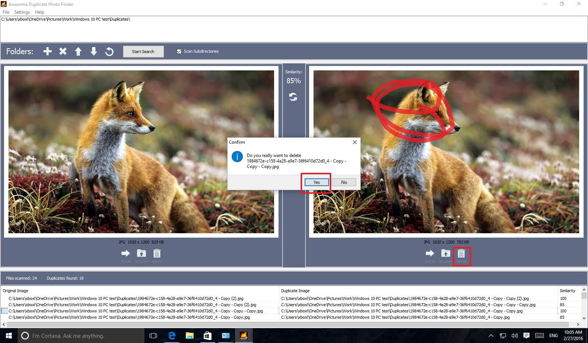

5. قم بحذف أغلب الصور بنفس الطريقة السابقة، وبعد ذلك قم بتفريغ سلة المحذوفات.

### 5- حذف ملفات تثبيت الويندوز السابقة:

عند قيامك بالترقية من أي إصدار ويندوز إلى ويندوز 10، أو الترقية من بناء ويندوز 10 قديم إلى أحدث بناء أو حتى مجرد تثبيت تحديث رئيسي للويندوز مثل تحديث الذكرى السنوية، ستحتاج إلى مسح ملفات مجلد Windows.old والذي يحتوي على ملفات التثبيت القديمة التي تتيح لك استرجاع النسخة القديمة، لكن قد يصل حجم هذه الملفات إلى أكثر من 20 جيجابايت، ولحذفها قم بالخطوات التالية.

1. قم بفتح File Explorer (يمكنك استخدام الاختصار Windows key + E)، ثم انتقل إلى This PC.
2. قم بالضغط بزر الماوس الأيمن على القسم C ثم اختر Properties.

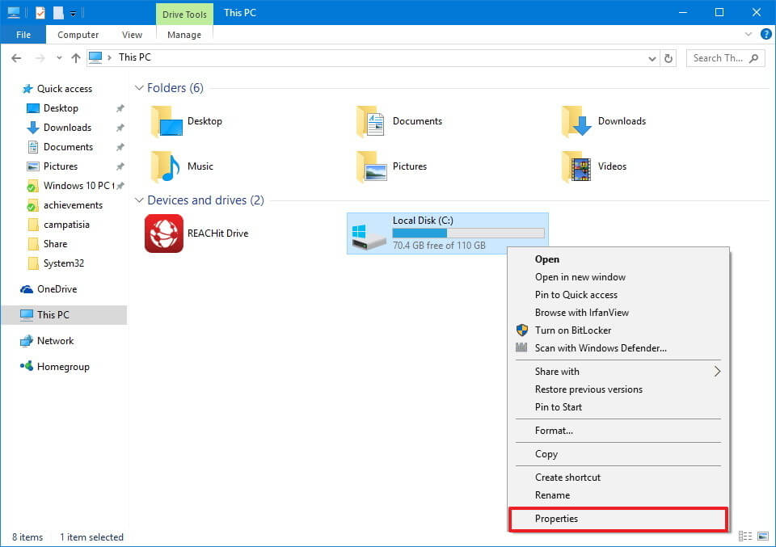

3. اضغط على زر Disk Cleanup.

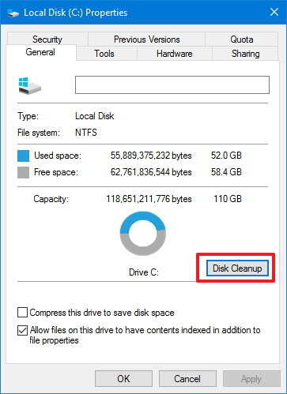

4. ثم اضغط زر Clean up system.

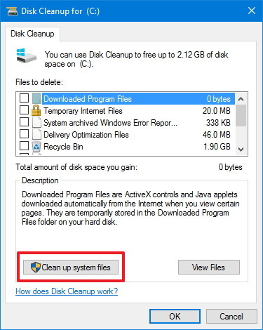

5. قم باختيار Previous Windows Installation(s) وWindows upgrade log files وأيضا Temporary Windows installation files.

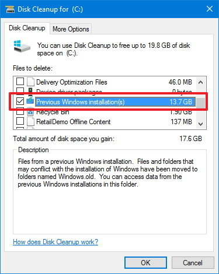

6. الآن اضغط OK ثم Delete Files وأخيرا اضغط Yes.

## ثانيا: تحرير مساحة القرص الصلب في أوبنتو

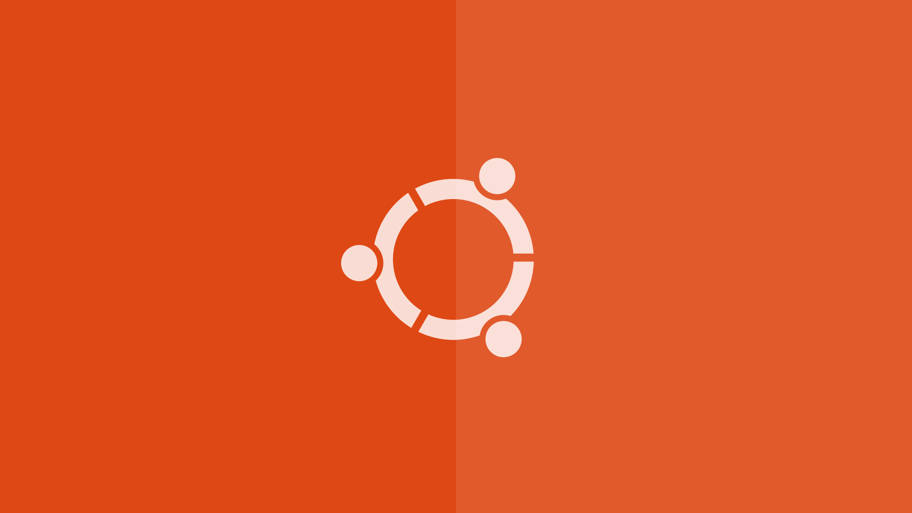

### 1- حذف ملفات APT المؤقتة:

بالتأكيد لم تقم عزيزي القارئ بهذه الخطوة من قبل، ولكن منذ الآن فصاعدا قم بتنفيذ هذه الحيلة بشكل دوري، وذلك لأن نظام أوبنتو يحتفظ بكل التحديثات التي يقوم بتنزيلها في صورة ذاكرة مؤقتة على القرص الصلب حتى يستطيع إيجادها في حالة كنت بحاجة إليها مرة أخرى.
وهذا مفيد إذا قمت بإضافة أو إزالة برمجيات ووجدت نفسك بحاجة إلى عمل إعادة تكوين أو إعادة تثبيت لبعض الحزم، ولكن من ناحية أخرى فإن ذاكرة التخزين المؤقت هذه تأخذ جزء كبير من مساحة القرص الصلب.

-   لمعرفة مقدار المساحة التي تشغلها الذاكرة المؤقتة يمكنك كتابة هذا الأمر:
    du -sh /var/cache/apt/archives

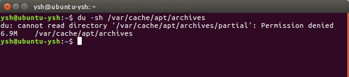

-   أما لحذف كل ذاكرة ملفات APT المؤقتة قم بكتابة هذا الأمر ثم ادخل كلمة المرور كما هي العادة في جميع أوامر Sudo:
    sudo apt-get clean

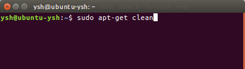

### 2- حذف ملفات Kernel (النواة) القديمة – إذا لم تكن تحتاج لها

وجود مجموعة من الإصدارات المختلفة من النواة هو بالتأكيد شيء جيد في أوبنتو، فهو ينقذك في حالة لاحظت حصول مشاكل عند استخدام الإصدار الأحدث من النواة، ولكن إذا كان كل شيء مستقر إذن أنت لست بحاجة لملفات النواة القديمة.

-   لإزالة ملفات النواة القديمة قم بكتابة هذا الأمر:
    `sudo apt-get autoremove --purge`

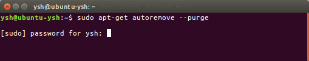

لاحظ أن هذا الأمر سوف يقوم بحذف ملفات النواة القديمة التي تم تثبيتها من خلال تحديثات النظام فقط، أما إذا قمت بتثبيت أي إصدار نواة من مصدر خارجي يتوجب عليك بإزالته بنفسك.

### 3- إزالة البرمجيات والألعاب التي لا تستخدمها:

هناك العديد منا من محبي تثبيت البرامج والألعاب بإعداد كبيرة، ومع تراكم البرامج ستجد أن هناك العديد منها لم تقم باستخدامه أبدا أو توقفت عن استخدامه، لذلك إذا كان هناك أي برنامج أو لعبة لا ستخدمه قم بإزالتها فورا وستلاحظ الفرق في مسحاة الجهاز قبل وبعد هذه العملية.

-   لحذف برنامج محدد من خلال الطرفية Terminal قم بكتابة أمر
    `sudo apt-get remove package-name1 package-name2`

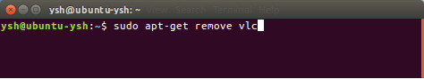

حيث package-name هو اسم حزمة البرنامج.

-   يمكنك أيضا استخدام Synaptic Package Manager للقيام بهذه المهمة:
    بعد فتح الأداة اضغط على Status ثم من القائمة أعلى اليسار اختر Installed بعد ذلك قم باختيار الحزمة التي تريد إلغاء تثبيتها ثم اضغط بزر الماوس الأيمن واختر Mark for removal.

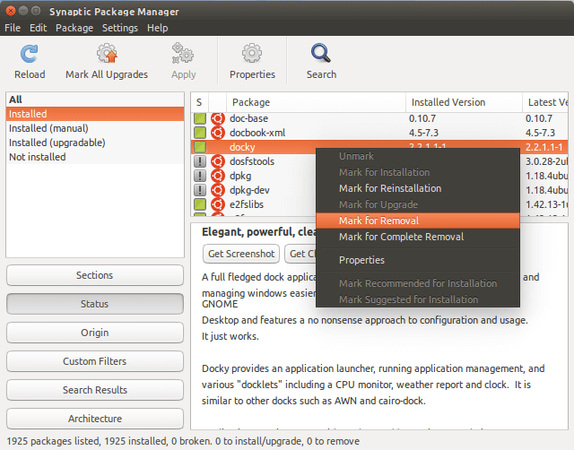

-   لإزالة الحزم التي لا يحتاجها النظام قم بكتابة هذا الأمر
    `sudo apt-get autoremove`

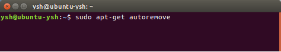

### 4- استخدام برنامج لتنظيف النظام مثل BleachBit

كما هو الحال في ويندوز مع برنامج CCleaner، لدينا في أوبنتو برنامج BleachBit المجاني، فعن طريق هذا البرنامج يمكنك إزالة كل الملفات المؤقتة ومخلفات النظام والبرامج المختلفة.
يمكنك تحميل البرنامج من متجر برمجيات أوبنتو، بعد ذلك قم بتشغيله، ويمكنك استخدامه في وضع الجذر أيضا (لا ينصح به للمبتدئين).

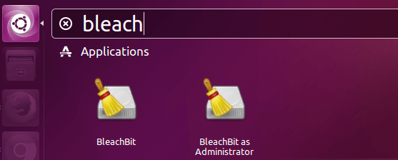

بعد ذلك حدد ما تريد أن يقوم البرنامج بتنظيفه ثم اضغط على زر Preview، سيقوم البرنامج بعرض قائمة المخلفات ثم اضغط زر Clean لحذف الملفات.

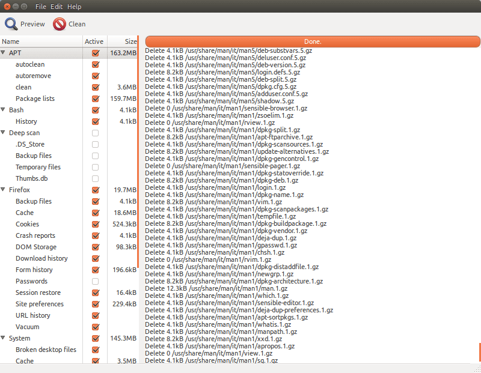

### 5- أبقي جهازك محدثا دائما

بخلاف الويندوز وتحديثاته التي تضيف مزيدا من الحمل على الجهاز، في أوبنتو أغلب التحديثات تقلل من حجم الحزم مما يوفر المساحة بشكل كبير.

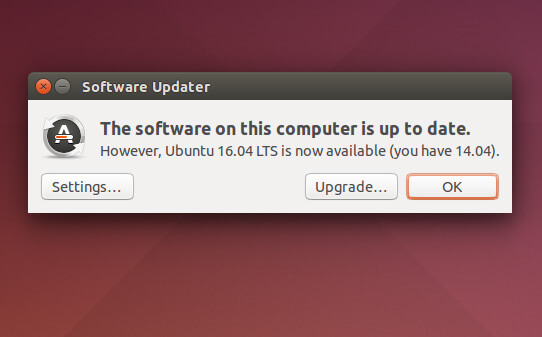

بهذه الخطوات ستكون قد وفرت أكبر كمية ممكنة من مساحة التخزين، كما يمكنك أيضا أن تقوم بحذف الملفات المكررة، أو نقل الملفات التي لا تستخدمها كثيرا إلى قرص صلب آخر لتوفير المزيد من المساحة.

---

هذا الموضوع نُشر باﻷصل في مجلة لغة العصر العدد 194 شهر 02-2017 ويمكن الإطلاع عليه [هنا](https://drive.google.com/file/d/1glovmsoy_pANesP6nirfh1Lfyj-dfQrX/view?usp=sharing).

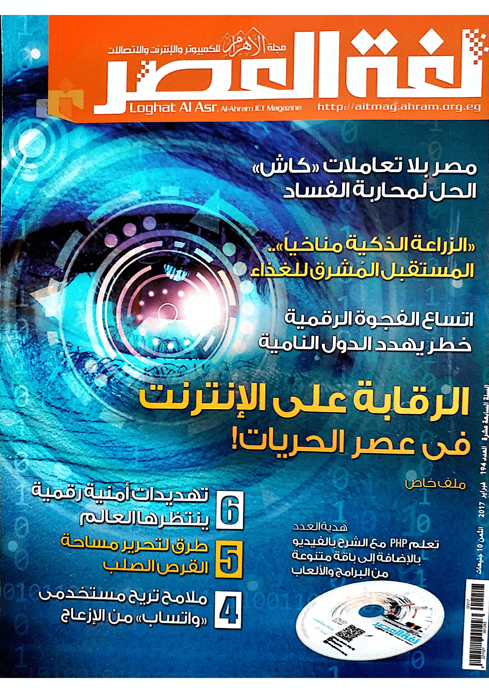

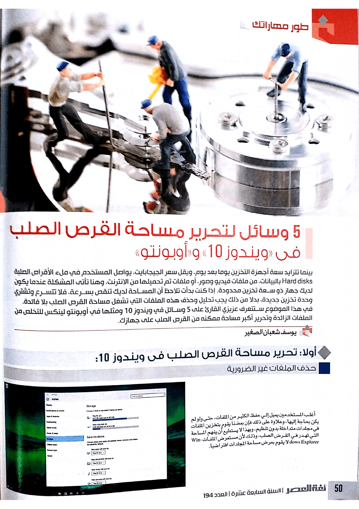

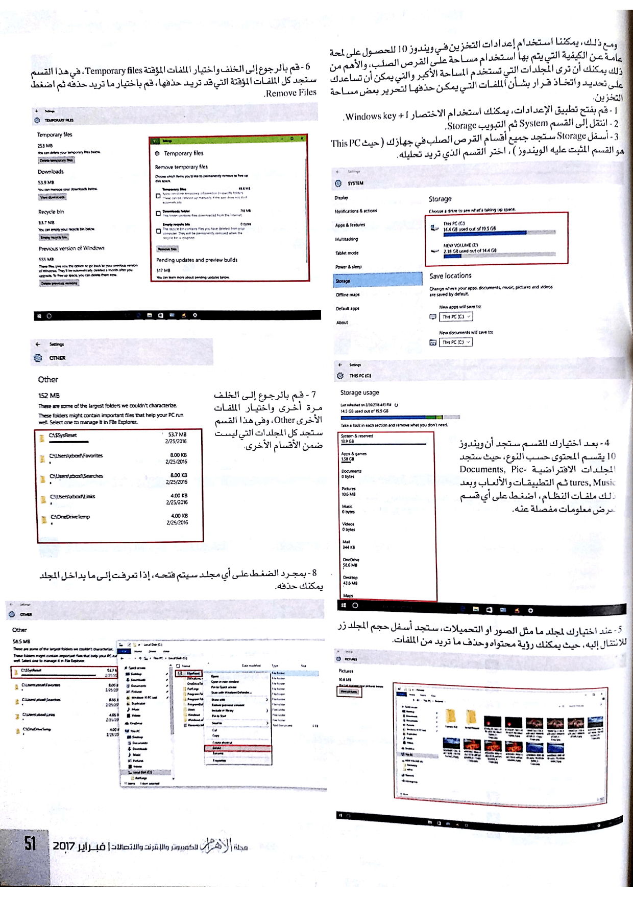

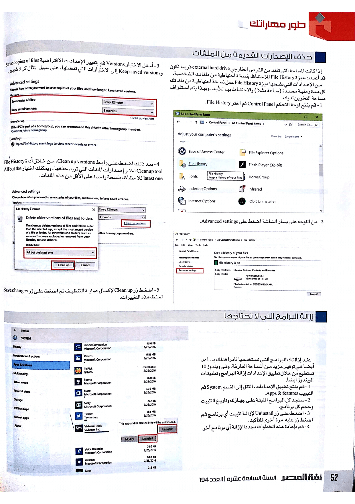

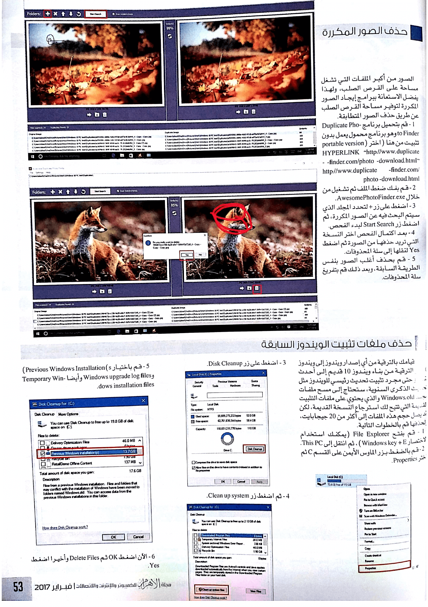

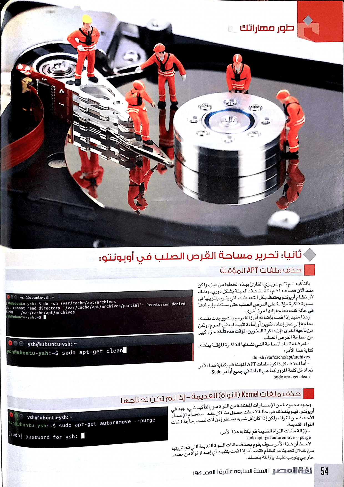

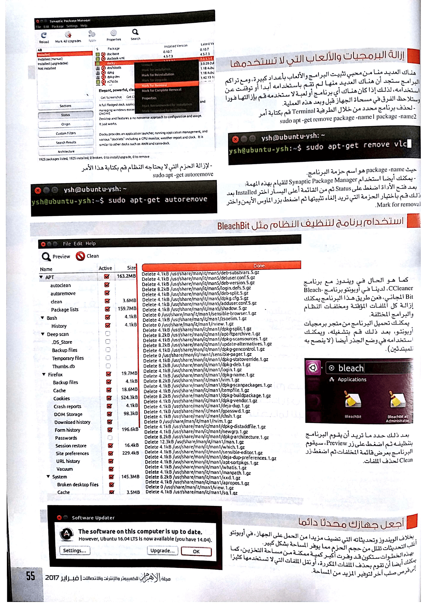
