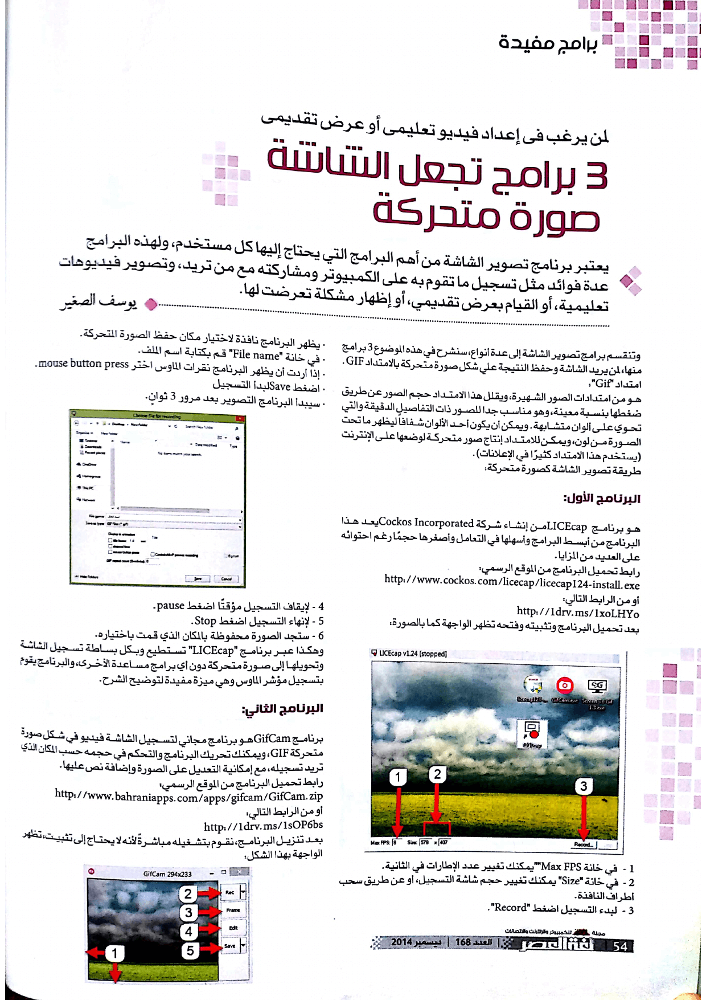

+++
title = "طريقة تصوير الشاشة كصورة متحركة"
date = "2014-12-01"
description = "تعدّ برامج تصوير الشاشة من أهم البرامج التي يحتاج إليها كل مستخدم ولهذه البرامج عدة فوائد مثل تسجيل ما تقوم به على حاسوبك ومشاركته مع من تريد، تصوير فيديوهات تعليمية، أو إنشاء عرض تقديمي، أو إظهار مشكلة تعرضنا لها، وتنقسم هذه البرامج إلى عدة أنواع، النوع الذي سنتناوله في هذا الموضوع هو النوع الأبسط وهو تصوير الشاشة كصورة متحركة بالامتداد GIF."
categories = ["مهارات رقمية",]
tags = ["مجلة لغة العصر"]

images = ["images/0.jpg"]

+++

تعدّ برامج تصوير الشاشة من أهم البرامج التي يحتاج إليها كل مستخدم ولهذه البرامج عدة فوائد مثل تسجيل ما تقوم به على حاسوبك ومشاركته مع من تريد، تصوير فيديوهات تعليمية، أو إنشاء عرض تقديمي، أو إظهار مشكلة تعرضنا لها، وتنقسم هذه البرامج إلى عدة أنواع، النوع الذي سنتناوله في هذا الموضوع هو النوع الأبسط وهو تصوير الشاشة كصورة متحركة بالامتداد GIF.

### الامتداد GIF

هو الامتداد الأشهر في الإنترنت ويأتي بعد امتداد JPG بالشهرة، ويعطي هذا الامتداد ضغطا مناسبا للصور حيث يضغط الصور بمقدار 40% من حجمها الأصلي، وهو مناسب جدا للصور ذات التفاصيل الدقيقة التي تحوي ألوان متشابهة. ويمكن أن يكون أحد الألوان شفافاً ليظهر ما تحت الصورة من لون، ويمكن للامتداد إنتاج صور متحركة لوضعها على الإنترنت (يستخدم هذا الامتداد كثيرا في الإعلانات).

## طريقة تصوير الشاشة كصورة متحركة

### البرنامَج الأول

هو برنامَج LICEcap من إنشاء شركة Cockos Incorporated يعد هذا البرنامَج من أبسط البرامج وأسهلها في التعامل وأصغرها حجما بالرغْم من احتوائه على العديد من المزايا.

رابط تحميل البرنامَج من الموقع الرسمي:

http://www.cockos.com/licecap/licecap124-install.exe

أو من الرابط التالي:

http://1drv.ms/1xoLHYo

بعد تحميل البرنامَج وتثبيته وفتحه تظهر الواجهة كما بالصورة:

1. ​	في خانة Max FPS يمكنك تغيير عدد الإطارات في الثانية.
2. ​	في خانة Size يمكنك تغيير حجم شاشة التسجيل، أو عن طريق سحب أطراف النافذة.
3. ​	لبدء التسجيل اضغط Record.

- ​	يظهر البرنامَج نافذة لاختيار مكان حفظ الصورة المتحركة.
- ​	في خانة File name اكتب اسم المِلَفّ.
- ​	إذا أردت أن يظهر البرنامَج نقرات الماوس اختر mouse button press.
- ​	اضغط Save لبدأ التسجيل
- ​	سيبدأ البرنامَج التصوير بعد مرور 3 ثواني.

1. ​	لإيقاف التسجيل مؤقتا اضغط pause.
2. ​	لإنهاء التسجيل اضغط Stop.
3. ​	ستجد الصورة محفوظة بالمكان الذي اخترته.

وهكذا عبر برنامَج LICEcap تستطيع وبكل بساطة تسجيل الشاشة وتحويلها إلى صورة متحركة دون أي برامج مساعدة الأخرى، والرائع في البرنامَج أنه يسجل مؤشر الفأرة وهي مِيزة مفيدة جدا لتوضيح الشرح.

### البرنامَج الثاني

برنامَج GifCam هو برنامَج مجاني لتسجيل الشاشة فيديو في شكل صورة متحركة GIF. ويمكنك تحريك البرنامَج والتحكم في حجمه حسب المكان الذي تريد تسجيله، مع إمكانية التعديل على الصورة وإضافة نص عليها.

رابط تحميل البرنامَج من الموقع الرسمي:

http://www.bahraniapps.com/apps/gifcam/GifCam.zip

أو من الرابط التالي:

http://1drv.ms/1sOP6bs

بعد تنزيل البرنامَج يمكنك تشغيله مباشرةً لأنه لا يحتاج إلى تثبيت، تظهر الواجهة بهذا الشكل:

1. ​	يكبر نافذة البرنامَج ويحركها ليصبح ما نريد تسجيله بداخل إطار البرنامَج.
2. ​	بعدها نضغط على زر التسجيل "Rec" ليبدأ التصوير.
3. ​	بعد الانتهاء نضغط على زر الإيقاف "Stop" لإيقاف التسجيل.
4. ​	وبعدها نضغط على زر الحفظ "Save" ونحدد مكان حفظ المِلَفّ الناتج
5. ​	يمكن تحديد نوع الألوان مثل Grey-scale أو 265 Color بواسطة الضغط على السهم بجانب زر الحفظ.
6. ​	عند الضغط على الزر Frame يضيف البرنامَج Frame فارغ.
7. ​	يمكن تعديل الصورة وإضافة نص أو تأثيرات بواسطة الزر Edit.

### البرنامَج الثالث

برنامَج Screen To GIF هو أحدث برنامَج من بين الثلاثة برامج وأفضلهم على الإطلاق بسبب دِقَّة التسجيل الرائعة والحجم الصغير للصور المتحركة مقارنة بالبرنامجين السابقين.

رابط تحميل البرنامَج من الموقع الرسمي:

https://screentogif.codeplex.com/downloads/get/922737

أو من الرابط التالي:

http://1drv.ms/1vdGbal

حمل البرنامَج وافتحه، تظهر واجهة البرنامَج كما بالصورة:

1. ​	معلومات عن البرنامَج: يظهر بها اسم صانع البرنامَج والمترجمين للبرنامج والموقع وهكذا.
2. ​	إعدادات الصورة المتحركة:

- ​	يمكنك تحديد إذا ما كانت الصورة ستعمل بتكرار لا نهائي أم لا، وكذلك التحكم في جودة الصورة الناتجة.

1. ​	إعدادات البرنامَج:

- ​	للتحكم في خيارات إظهار مؤشر الفأرة، إظهار نقرات الماوس، تحرير الفريمات بعد التسجيل، الحفظ أوتوماتيكيا إلى مجلد معين، تغيير شكل البرنامج، وتحديد اختصارات بدء التسجيل (F7) وإيقافه (F8).

1. ​	عدد الفريمات لكل ثانية.
2. ​	حجم شاشة التسجيل.
3. ​	زر بَدْء التسجيل.
4. ​	زر إيقاف التسجيل.

- ​	لبدء التسجيل حدد حجم شاشة التسجيل ثم اضغط Record، سيبدأ التسجيل بعد ثانيتين.
- ​	لإيقاف التسجيل اضغط Stop، انتظر حتى ينتهي البرنامَج من إعداد الصورة للتحرير.
- ​	تظهر نافذة التحرير كما بالصورة:

1. ​	تشغيل الصورة المسجلة.
2. ​	خيارات التعديل على الصورة:

- ​	تحتوي هذه الخيارات على: إضافة نص - إضافة صورة - إعادة تحجيم الفريمات – تدويرها - عمل حدود للصورة - تغيير سرعة الصورة - حذف الفريمات.

1. ​	تطبيق بعض المؤثرات على الصورة.
2. ​	إرجاع الصورة كما كانت عليه دون تعديلات.
3. ​	التراجع خطوة واحدة للوراء.
4. ​	حذف الفريم.
5. ​	إنهاء التحرير.
6. ​	إلغاء التحرير.
7. ​	شريط الفريمات الجانبي لتحديد بعضها أو كلها.
8. ​	شريط الفريمات السفلى للتبديل بينها.
9. ​	إضافة نص.
10. ​	رسم حر على الفريم المحدد.
11. ​	الانتقال فريم للخلف.
12. ​	الانتقال فريم للأمام.

- ​	بعد تحرير الصورة اضغط على Done ستظهر لك نافذة حفظ الصورة:

- ​	اختر المكان الذي تريد حفظ الصورة فيه واكتب اسمها ثم اضغط Save.
- ​	انتظر حتى ينتهي البرنامج من الحفظ وتظهر لك هذه النافذة:

- ​	اضغط على Close this page أو Open the .GIF file لعرض الصورة.

---

هذا الموضوع نشر باﻷصل في مجلة لغة العصر العدد 168 شهر 12-2014 ويمكن الإطلاع عليه [هنا](https://drive.google.com/file/d/1phgmKYbo9njwesQrd6qrHUpEkEtg359X/view?usp=sharing).

