+++

title = "دليلك الشامل للبدء في تعلم البرمجة"
date = "2024-09-22"
description = "في عصرنا الحالي أصبحت البرمجة من أكثر المهارات المطلوبة في سوق العمل في العديد من المجالات، فتعلّم البرمجة يفتح آفاقًا واسعة للفرص الوظيفية، ويمكّنك من بناء مشاريعك الخاصة. وسواء كنت ترغب في تطوير تطبيقات الويب، أو إنشاء تطبيقات الهواتف الذكية، أو العمل في مجال الذكاء الاصطناعي، فإن تعلم البرمجة الخطوة الأولى نحو تحقيق هذه الأهداف. نستعرض في هذا المقال خطوات عملية لمساعدتك في رحلتك لتعلم البرمجة، ونناقش العديد من النِّقَاط التي يجب مراعاتها عند بَدْء رحلتك في عالم البرمجة بداية من اختيار اللغة المناسبة حتى بناء مشروعات حقيقية."
featured = true
categories = ["مهارات رقمية"]
tags = ["مجلة لغة العصر"]

+++

## مقدمة

في عصرنا الحالي أصبحت البرمجة من أكثر المهارات المطلوبة في سوق العمل في العديد من المجالات، فتعلّم البرمجة يفتح آفاقًا واسعة للفرص الوظيفية، ويمكّنك من بناء مشاريعك الخاصة. وسواء كنت ترغب في تطوير تطبيقات الويب، أو إنشاء تطبيقات الهواتف الذكية، أو العمل في مجال الذكاء الاصطناعي، فإن تعلم البرمجة الخطوة الأولى نحو تحقيق هذه الأهداف. نستعرض في هذا المقال خطوات عملية لمساعدتك في رحلتك لتعلم البرمجة، ونناقش العديد من النِّقَاط التي يجب مراعاتها عند بَدْء رحلتك في عالم البرمجة بداية من اختيار اللغة المناسبة حتى بناء مشروعات حقيقية.

## لماذا تتعلم البرمجة؟

- مسار مهني جيد من حيث العائد المادي وفرص التطور
- مهارة تضيف قيمة كبيرة للعاملين في مجالات البحث العلمي وتقنيات التعلم وبعض فروع الهندسة
-  مهنة عالمية عابرة للقارات يمكن توظيفها في أيّ مكان مهما كانت ثقافته أو لغته
- تمكّنك من العمل الحر عبر المنصات المختلفة دون التقيد بجهة معينة كما يمكنك العمل من أي مكان
- توسيع المعرفة وأفق التفكير وتعلم تصميم حلول لأي مشكلة تواجهك وتسهل عليك عمل بأمور أخرى في الكمبيوتر
- حتى تستطيع تعليمها لأطفالك أو الصغار الذين حولك

## قبل أن تبدأ

### أساسيات التعامل مع الكمبيوتر

معرفة أساسيات التعامل مع الكمبيوتر تسهل بشكل كبير تعلم البرمجة حيث تساعدك في التركيز على تعلم البرمجة نفسها بدلًا من التعثر في مشكلات تقنية بسيطة.

فيجب عليك الإلمام بمهارات التعامل مع نظام التشغيل وإدارة الملفات والمجلدات، واستخدام متصفح الإنترنت ومحركات البحث بكفاءة، والتعامل مع برامج معالجة النصوص وجداول البيانات، والفهم المجمل لأساسيات أمن الكمبيوتر والإنترنت.

وإذا كانت خبرتك في استخدام الكمبيوتر محدودة فاستثمر بعض الوقت في تعلم أساسيات استخدام الكمبيوتر، ولا تخف من التجربة والاستكشاف والفشل فهما أفضل طريقة للتعلم، ومع ممارسة البرمجة ستتحسن مهاراتك في استخدام الكمبيوتر بشكل طبيعي.

### هل تحتاج جهازًا قويًا؟

لا تحتاج جهاز كمبيوتر قوي للبدء في تعلم البرمجة بخلاف مجالات الجرافيك والمونتاج، فيكفيك جهاز متوسط المواصفات ومع التقدم في المستوى والعمل على مشروعات كبيرة يمكنك ترقية الجهاز لجهاز ذو معالج أقوى وذاكرة أكبر.

### اللغة الإنجليزية

يمكن البدء في تعلم البرمجة باللغة العربية، لكن الاقتصار عليها فقط سيحد من فرصك وتطورك في المجال على المدى الطويل. 

وقد تكون الاستراتيجية الأفضل لبعض الأشخاص البَدْء بالمصادر العربية ثم التدرج نحو استخدام الموارد الإنجليزية، مما يفتح لك آفاقًا أوسع في عالم البرمجة والتطوير خصوصًا أن المراجع التقنية المتقدمة والوثائق الرسمية للغات البرمجة والأطر البرمجية غالبًا ما تكون باللغة الإنجليزية فقط، كما أن مجال التكنولوجيا وخصوصًا البرمجة يتطور بسرعة كبيرة والمعلومات الجديدة تتوفر أولًا باللغة الإنجليزية.

### الرياضيات

تساعد الرياضيات في تطوير مهارات التفكير المنطقي وحل المشكلات، وهي مهارات أساسية في البرمجة. وإذا كنت ستعمل في مجال برمجي عام مثل تطوير المواقع والتطبيقات فيكفيك المبادئ الأساسية للرياضيات حتى تبدأ في تعلم البرمجة.

وهناك بعض مجالات البرمجة تتطلب معرفة رياضية أعمق، مثل: الذكاء الاصطناعي وتعلم الآلة الذي يحتاج إلى الإحصاء والاحتمالات والجبر خطي، وتطوير الألعاب الذي يتطلب معرفة بالهندسة وحساب المثلثات.

إذن يمكنك البَدْء في تعلم البرمجة دون خلفية رياضية متقدمة، ومع تقدمك يمكنك تعلم المفاهيم الرياضية اللازمة حسب المجال الذي تختاره.

## كيف تبدأ؟

### تعلم البرمجة عبر الجامعة

قد يكون دخول إحدى التخصصات الجامعية التي تدرس البرمجة مثل علوم الحاسب أو هندسة البرمجيات متاحًا لك إذا كنت في سن الجامعة، وبذلك تحصل على شهادة جامعية رسمية معترف بها في سوق العمل بغض النظر عن الخبرة العملية المكتسبة خلال الدراسة.

مِيزة هذه الطريقة دراسة الكثير من المواد بعمق مثل الرياضيات المتقدمة وقواعد البيانات وأنظمة التشغيل والأنظمة المتقدمة، مما يعطي سالك هذا الطريق مِيزة التأسيس القوي مقارنة بالدراسة الذاتية.

أما سلبيات هذا الطريق فأولًا وجود معدل دراسي مطلوب لدخول الكلية نظرًا لعدد أماكن الدراسة المحدود، وطول مدة الدراسة حيث تكون 4-5 سنوات غالبا، والحاجة إلى التفرغ في الأغلب وأخيرًا دراسة تقنيات قديمة إما لم تعد مستخدمة أو تغيرت بشكل كبير حاليًا.

### التعلم الحر

الطريق الآخر لتعلم البرمجة هو التعلم الذاتي، وهو الطريق الأسرع والأنسب لكثير من الناس خصوصا مع توفر العديد من المصادر من دورات وفيديوهات وكتب على الإنترنت سواء بشكل مجاني أو مدفوع. 

يمتاز هذا الطريق بانتظار الوقت الطويل مقارنة بالمسار الجامعي، لكنه يحتاج إلى ضبط شديد للنفس والتنظيم الجيد للوقت ووضع خُطَّة واضحة شاملة لا تخل بأحد جوانب التأسيس المطلوبة لتكون مبرمجًا قويا.

ويجدر الإشارة هنا إلى مبادرة جامعة المجتمع المفتوح المصدر OSSU على الإنترنت التي توفر منهجًا تعليمًا كاملًا في علوم الحاسب يمكن دراسته خلال عامين لمن يستطيع توفير 20 ساعة أسبوعيًا، وهو منهج مخصص لمن يريد التأسيس الشامل والعميق في للمفاهيم الأساسية لجميع تخصصات الحوسبة، حيث صمم هذا المنهج وفق نفس متطلبات درجة البكالوريوس في تخصصات علوم الكمبيوتر، ويحتوي على دورات تدريبية هي في الأصل مقررات من جامعات هارفارد وبرينستون ومعهد ماساتشوستس للتكنولوجيا وغيرهم وكذلك العديد من الكتب المنتقاة بعناية.

### اختيار المجال

تحديد هدفك من تعلم البرمجة يسهل عليك تحديد التخصص الذي تريد الدخول إليه ومن ثم اللغة المستعملة في هذا التخصص الأمر، فاللغات التي تُستخدم في مجال الويب تختلف عن المستخدمة في تطوير تطبيقات الهاتف المحمول.

كما أن الطريق الذي ستسير فيه يختلف باختلاف الهدف فالشخص الذي يتعلم حتى يحصل على وظيفة ذات دخل عالي سيختلف طريقه عن الشخص الذي يتعلم لبناء نظام أو برمجية خاصة به أو بعمل خاص، وكذلك عمّن يستهدف العمل في بلاده محليًا أو يستهدف العمل عن بعد مع شركات أجنبية.

وهناك العديد من المجالات البرمجية مثل:

- تطوير المواقع ويندرج تحته ثلاث أقسام:
  - مطور واجهات أمامية Front-end: مسؤول عن شكل وتصميم الموقع، والألوان والخطوط وغيره.
  - مطور واجهات خلفية Back-end: مسؤول عن التعامل مع قواعد البيانات والتعامل مع السيرفر وكل الأمور التي تحدث في الخلفية.
  - Full-stack: تطوير كلا من الواجهة الأمامية والخلفية للتطبيقات.
- تطوير برامج سطح المكتب
- تطوير تطبيقات الهواتف المحمولة
- تطوير الألعاب
- الأنظمة المدمجة
- الذكاء الاصطناعي وعلوم البيانات
- الأمن السيبراني Cyber Security
- اختبار الجودة QA Testing
- عمليات التطوير DevOps

### اختيار لغة البرمجة

> من الأخطاء التي يقع فيها كثير من الناس الخلط بين العلم والأداة، فالبرمجة علم أما لغة البرمجة أداة ننفذ بها ما تعلمناه من معرفة برمجية، ومن هنا فهناك فرق بين تعلم البرمجة بصفتها تخصص أكاديمي أو مهارة.

بعد اختيار التخصص البرمجي يمكنك البَدْء في تعلم الأساسيات والمفاهيم الموجودة في كل لغات بالبرمجة بأحد اللغات المناسبة للبدء، مثل مفاهيم التعابير expressions والمتغيرات والثوابت variables وأنواع البيانات data types والعمليات وحلقات التكرار والتعابير الشرطية والدوال والأصناف …إلخ، ثم تطبيق هذه المفاهيم بلغة البرمجة التي تريد استخدامها والتقنيات والمكتبات المرتبطة بها، فتعلم المفاهيم البرمجية الأساسية يضمن لك عند إتقانها القدرة على تطبيقها مهما اختلفت الأدوات وكثرت.

وعلى الرغم من تشابه لغات البرمجة من حيث المفهوم إلا أنّ لكل لغة بنية لغوية syntax تختلف عن غيرها، لذلك تجنب تعلم أكثر من لغة على التوازي حتى لا تتشتت وتستطيع إتقان اللغة التي تتعلمها.

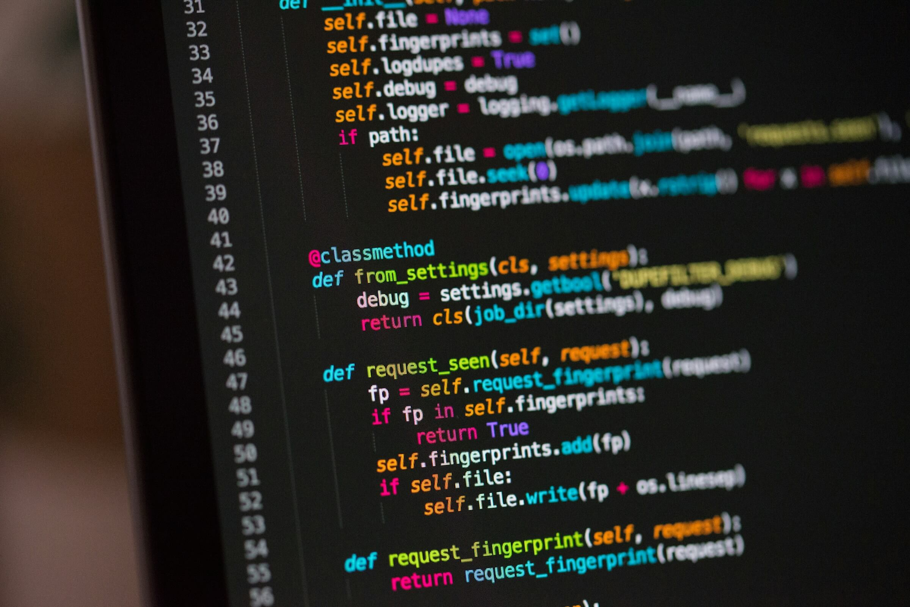

ولكل مجال لغات برمجة وأدوات مختلفة. فمثلا:

- تطوير الويب: HTML, CSS, JavaScript, PHP, Python
- تطوير تطبيقات الهاتف المحمول: Java, Kotlin, Swift
- علوم البيانات: Python, R
- تطوير الألعاب: C++, C#, Unity

فعند اختيارك للغة البرمجة الأولى ضع في اعتبارك عوامل سهولة التعلم، وتوفر الموارد التعليمية، ومدى الطلب في سوق العمل، ومدى ملاءمتها للمجال الذي تريد التخصص فيه.

### التأسيس المطول أم المعسكرات المكثفة

تُعد معسكرات البرمجة (Bootcamps) خيارًا جذابًا للراغبين في تعلم البرمجة بشكل مكثف في مدّة زمنية قصيرة - من ستة أشهر إلى سنة - خصوصًا الراغبين في الانتقال من مجال آخر إلى البرمجة، حيث تُقدم تدريبًا عمليًا يركز على المهارات الأساسية وبعض التخصصات المطلوبة في سوق العمل.

لكن معسكرات البرمجة ليست مناسبة للجميع، فهي تتطلب التفرغ التام، وقد تكون مكلفة ماديًا. كما أنها نظرًا لطبيعتها السريعة قد لا تمنحك فهمًا عميقًا كافيًا للعديد من المفاهيم البرمجية النظرية.

أما التعلم طويل المدى، فهو خِيار مناسب لمن يرغب في بناء أساس قوي في البرمجة وهضم المفاهيم بشكل متعمق، ولا مشكلة لديه من ناحية تأخر الدخول في وظيفة. ويمكن تحقيق ذلك عبر الالتحاق بدورات تدريبية عبر الإنترنت أو في مكان ما، أو قراءة الكتب المتخصصة، أو الدراسة الجامعية.

### الأساسيات

هناك مجموعة من المهارات الأساسية لا غني عن تعلمها وإتقانها أيا كان التخصص البرمجي مثل:

- التفكير المنطقي وحل المشاكل 
- بِنَى التحكم والشروط
- التعاود Recursion
- البرمجة الكائنة Object-oriented programming 
- البرمجة الوظيفية functional programming
- أنواع لغات البرمجة والفروق بينها
- الخوارزميات وهياكل البيانات
- المكتبات والحزم وأطر العمل

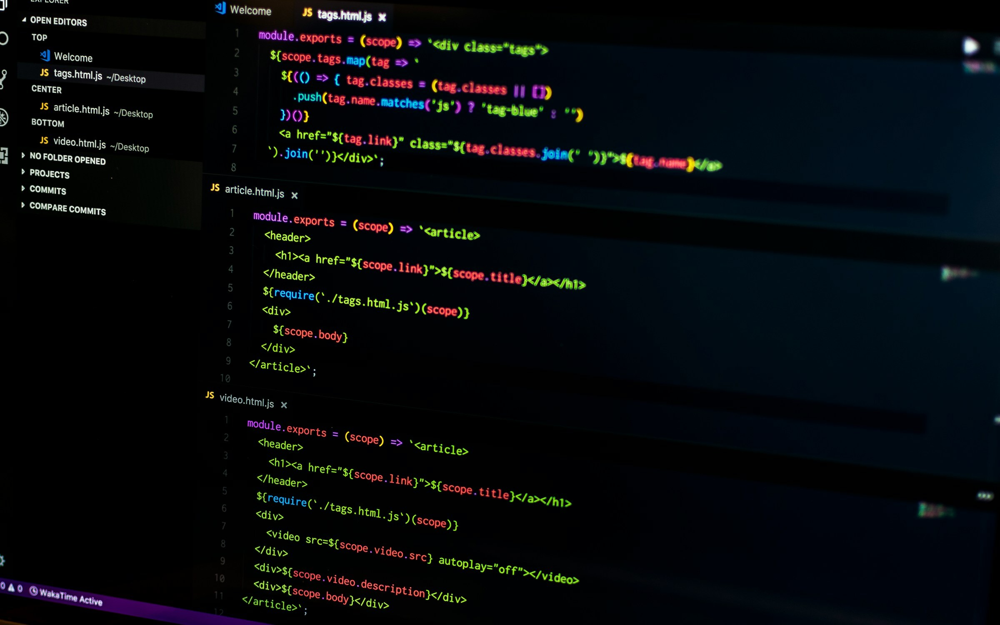

### مصادر التعلم

#### الدورات التعليمية

من أشهر الطرق التي يعتمد عليها من يرغب في تعلم البرمجة الدورات التعليمية سواءًا على أرض الواقع أو عبر الإنترنت، وميزة هذه الدورات أنها  تأخذ بيد المتعلم من الصفر في طريق ذو تسلسل مدروس ينتج عنه في ختام الدورة تعلم الأساسيات والتمكن جزئيًا فيمَا تقدمه ليتابع بعدها المتعلم رحلة تعلمه عبر  مصادر أخرى أو دورة جديدة ذات مستوى أعلى.

وغالبًا ما تحتوي الدورات التعليمية على جانب تطبيقي عملي يبني المتعلم خلاله مشروعات عملية تحاكي المشروعات المطلوبة في سوق العمل مما يفيده كذلك في بناء مَعْرِض أعمال يغنيه عن عرض الشهادات النظرية.

ومن الجدير بالذكر توفر العديد من المبادرات الرسمية أو المدعومة من الدولة لتعليم البرمجة مثل منحة معهد تكنولوجيا المعلومات ITI التابع لوزارة الاتصالات وتكنولوجيا المعلومات المتوفرة في نسختين مدتهما 3 و9 أشهر، ومبادرة مستقبلنا رقمي FWD، ومنصة مهارة-تك.

كما توجد العديد من الجامعات العالمية والمواقع المعتمدة التي تقدم دورات لتعلم البرمجة على الإنترنت مثل جامعة هارفارد التي تقدم دورة مقدمة في علوم الحاسب CS50 الشهيرة، ومواقع رواق وإدراك باللغة العربية، ومواقع إنجليزية مثل EDX - Coursera - Udemy -  Pluralsight - Codecademy - freeCodeCamp - LinkedIn Learning - The Odin Project.

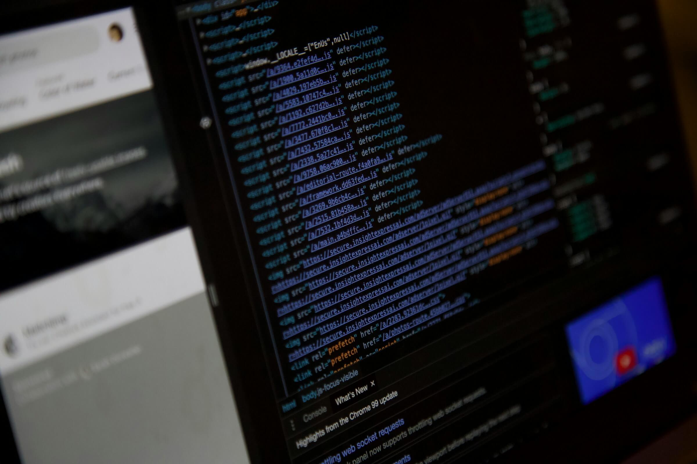

#### الكتب والمقالات

يعتمد 50.3% من المتعلمين على الكتب وفقًا لإحصائية موقع StackOverFlow لعام 2024، ويوفر التعلم عبر الكتب أساسًا قويًا ويمكن المتعلم من السير بوتيرته الخاصة دون ضغط. وهناك العديد من الكتب العربية المميزة لتعلم البرمجة مثل التي توفرها أكاديمية حسوب مجانًا، والكثير من الإنجليزية التي يُنصح بها مثل سلسلة Head First.

#### قنوات اليوتيوب

هناك العديد من قنوات اليوتيوب المتخصصة في تعليم البرمجة باللغة العربية والإنجليزية بما يرضى جميع الأذواق ودون أي تكلفة مالية، فيمكنك البحث واختيار المعلم الذي ترتاح له وتعلم العديد من المواضيع النظرية والعملية، لكن احرص على التعلم وفق منهجية منضبطة حتى يكون أساس بناءك سليمًا، فيمكنك مثلا الاطّلاع على محتوى إحدى الدورات المدفوعة على منصة ما والبحث عن نفس هذا المحتوى على اليوتيوب.

#### الذكاء الاصطناعي

مع التقدم السريع الذي نشهده حاليًا في مجال الذكاء الاصطناعي، ظهرت نماذج لغوية كبيرة (LLMs) مثل ChatGPT و Gemini و Claude تُتيح فرصًا لم تكن موجودة من قبل لتعزيز وتسريع عملية تعلم البرمجة. فيمكنك مثلا:

- السؤال عن مفهوم برمجي مُعين، مثل "ما هي البرمجة كائنيه التوجه؟" أو "كيف تعمل حلقة for؟" وستحصل على إجابة واضحة ومُبسطة.
- توليد أمثلة برمجية توضح كيفية استخدام دالة مُعينة أو تنفيذ خوارزمية مُحددة.
- المساعدة في تحديد الأخطاء في الكود واقتراح حلول مُمكنة.
- إعادة صياغة الكود وتحسينه ليكون أكثر فعالية مع شرح التغييرات التي تم إجراؤها.
- مُناقشة الأفكار البرمجية وطرح أسئلة حول تصميم برنامَج مُعين أو مناقشة أفضل الممارسات البرمجية في أمر محدد.

ومن المهم الانتباه لأمور مثل التحقق من صحة المعلومات التي تقدمها النماذج من مصادر موثوقة، وعدم الاعتماد الكلي عليها واستخدامها كأداة مُساعدة في رحلة التعلم فقط، وليس بديلًا عن الدراسة والممارسة الفعلية.

### خرائط التعلم

لا شك أن تعلم البرمجة قد يبدو مُربكًا في البداية، خاصةً مع كثرة اللغات وأدوات التطوير المتوفرة. وهنا يأتي دور خرائط التعلم Roadmaps التي تسهل عليك هذه الرحلة وتُرشدك نحو الطريق الصحيح.

ومن أفضل الأماكن التي تجد بها خرائط تعلم موثوقة موقع roadmaps.sh، وهو منصة مفتوحة المصدر تقدم خرائط طريق تعليمية شاملة لمختلف مجالات تطوير البرمجيات ومسارات تعلم منظمة للمبرمجين المبتدئين والمتقدمين على حد سواء.

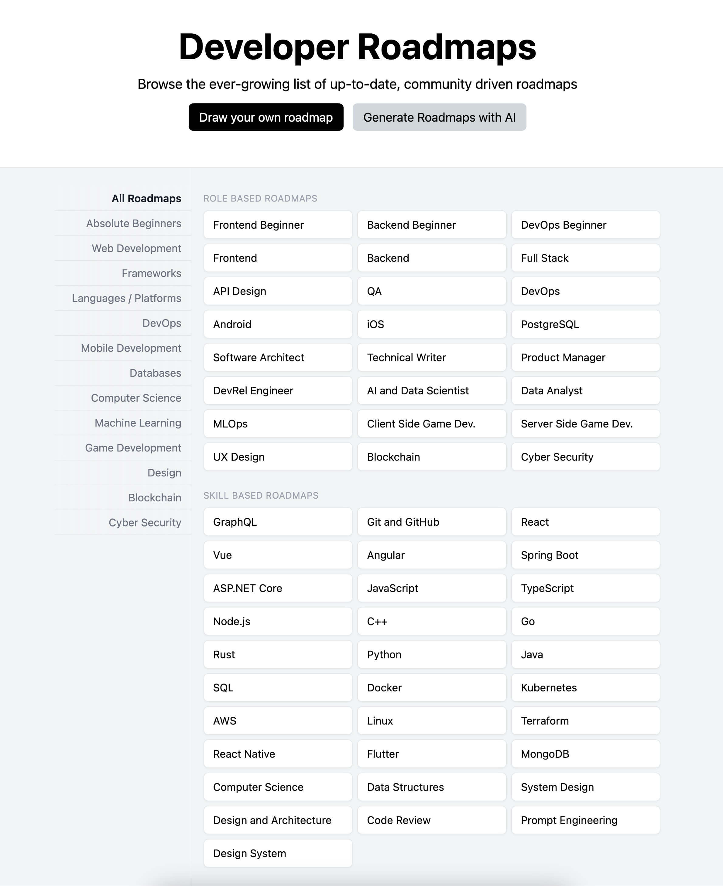

وتكمن أهمية الاعتماد على خرائط الطريق خلال تعلم البرمجة من موقع مثل roadmaps.sh في:

1. التنظيم: توفر هيكلًا واضحًا للمواضيع والمهارات التي يجب تعلمها، مما يساعد المتعلمين على التركيز وعدم التشتت.
2. الرؤية الشاملة: تمنح المتعلمين نَظْرَة عامة على المجال كُلََّه، مما يساعدهم على فهم كيفية ترابط المفاهيم المختلفة.
3. تحديد الأولويات: تساعد في تحديد المهارات الأساسية والمتقدمة، مما يمكن المتعلمين من التركيز على الأساسيات أولًا.
4. التحفيز: توفر إحساسًا بالتقدم والإنجاز مع اكتساب كل مهارة جديدة.
5. المرونة: تسمح للمتعلمين بالتنقل بين المواضيع وفقًا لاحتياجاتهم واهتماماتهم.
6. التحديث المستمر: تتطور باستمرار لتواكب التغيرات السريعة في عالم التكنولوجيا.
7. المجتمع: توفر نقطة مرجعية مشتركة للمناقشة والتعاون بين المتعلمين.

فبعد تحديدك لمجال التخصص، يمكنك الرجوع إلى الموقع والاطّلاع على خريطة التعلم للتأكد من سيرك في الطريق الصحيح.

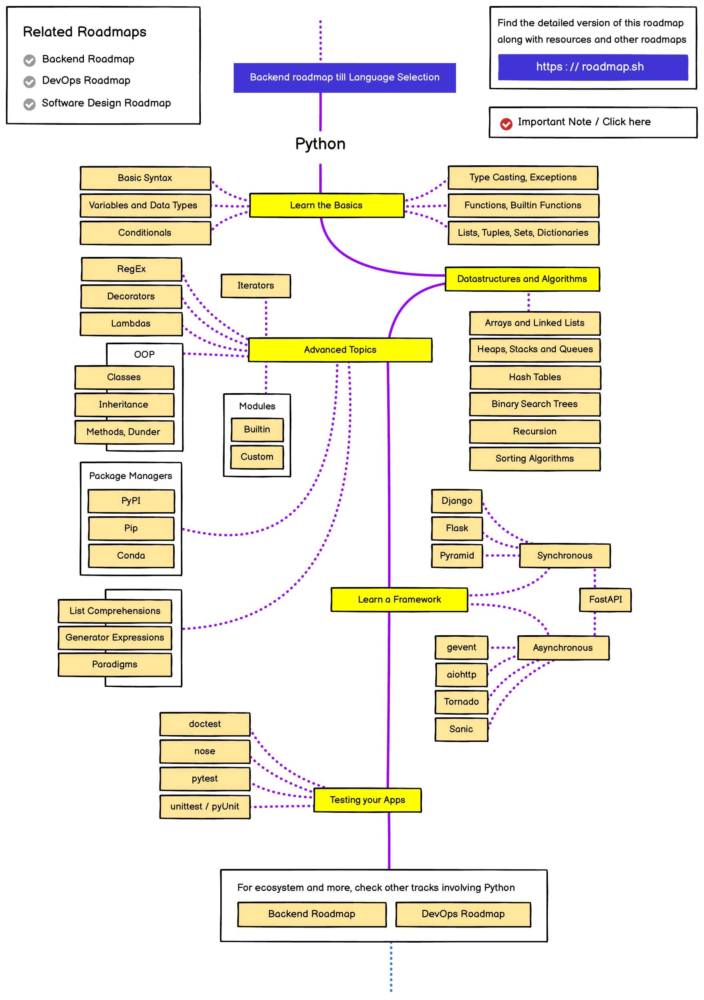

## خاتمة

تعلم البرمجة حاليًا أصبح أسهل من أي وقت مضى مع توفر العديد من المصادر والدورات التدريبية المناسبة لمختلف الأشخاص، وبالرغم من أنه قد يبدو أمرًا شاقًا في البداية، لكن مع الصبر والمثابرة والاستراتيجية الصحيحة يمكن لأي شخص أن يتقن هذه المهارة القيمة.

لا تقارن تقدمك بالآخرين وتذكر أن الرحلة تختلف من شخص لآخر، وتذكر أن أهم عامل للنجاح هو الاستمرارية والمثابرة فاحرص على تخصيص وقت يومي للبرمجة ولو كان قليلًا، ومن المهم أيضًا تطبيق ما تعلمته عمليًا عبر بناء مشروعات صغيرة أو شخصية حقيقة، فبناء المشروعات يساعدك على ترسيخ المفاهيم وفهم كيفية استخدامها في حل مشكلات حقيقية لاحقًا.

حاول أيضًا المشاركة في التحديات البرمجية على مواقع مثل HackerRank وLeetCode التي توفر مسائل برمجية لتحسين مهاراتك، وانضم إلى المجتمعات البرمجية وتواصل مع مبرمجين آخرين، وشارك في النقاشات، واطرح الأسئلة. واحرص على قراءة المدونات والمقالات المتخصصة والنشرات البريدية لتبقى على اطّلاع بأحدث التقنيات والتطورات في مجال البرمجة.

وأخيرًا لا تخف من ارتكاب الأخطاء فهي جزء لا يتجزأ من عملية التعلم، واستمتع برحلة التعلم فالبرمجة ليست مجرد مهارة بل أداة قوية للإبداع والابتكار.

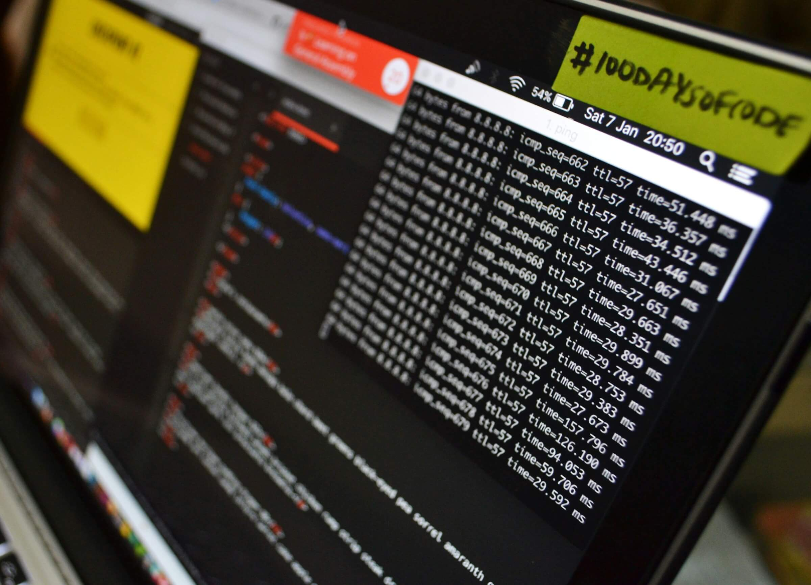

---

هذا الموضوع نُشر باﻷصل في مجلة لغة العصر العدد 367 شهر 09-2024 ويمكن الإطلاع عليه [هنا](https://drive.google.com/file/d/1EDom5PEPChxUgJh6IvsKrOPXHumVknJx/view?usp=drive_link).

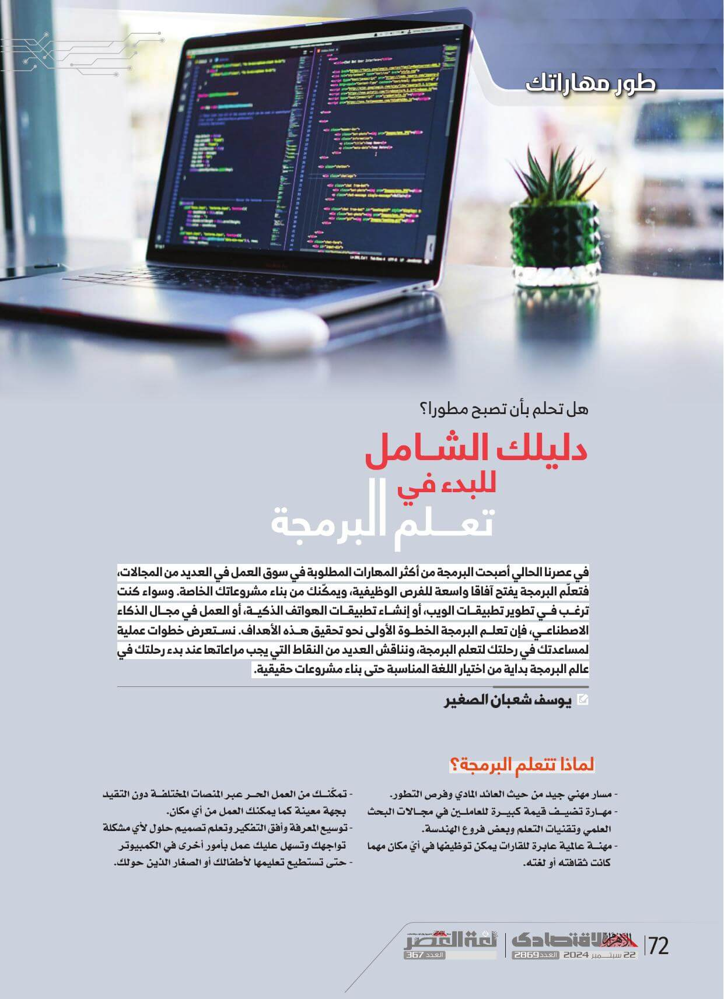

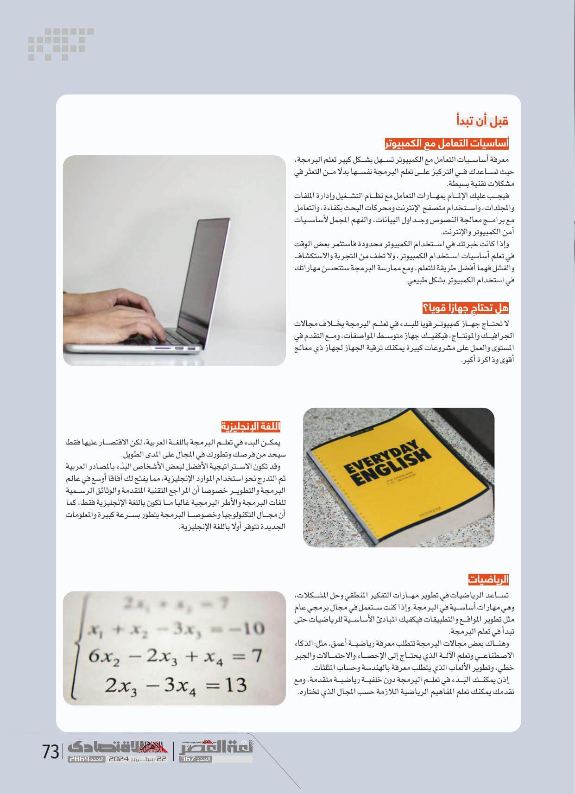

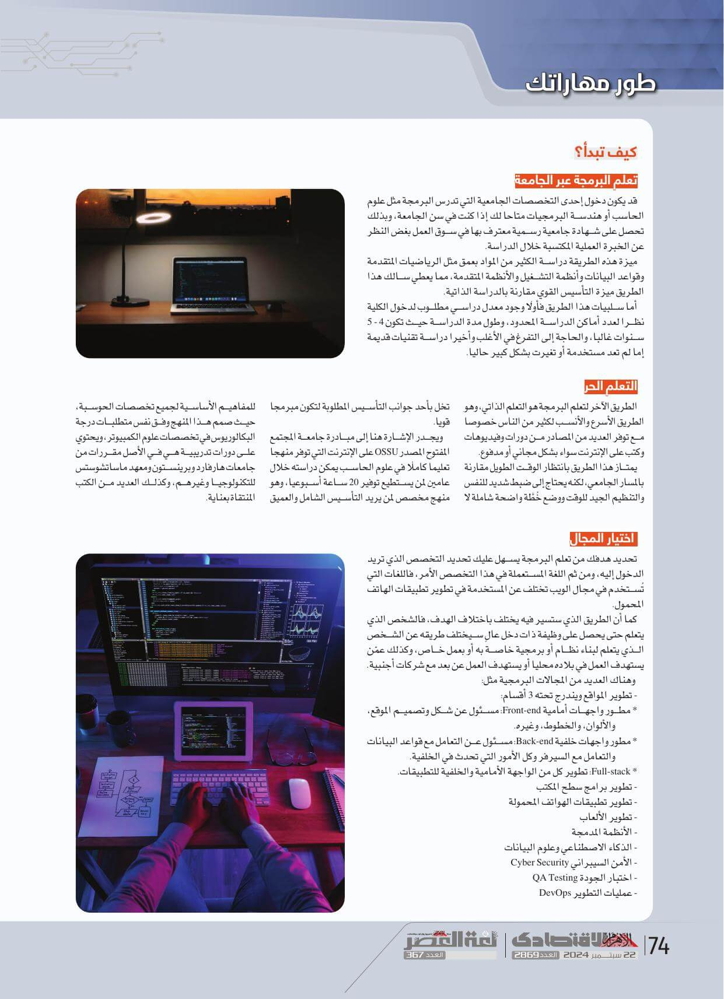

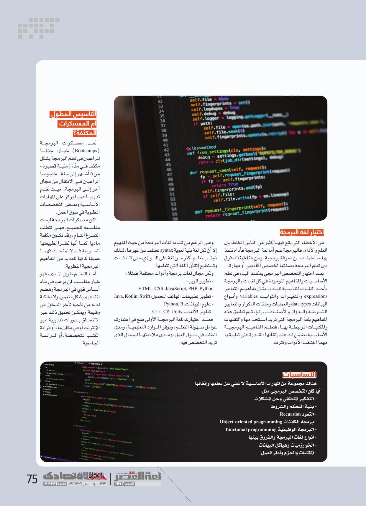

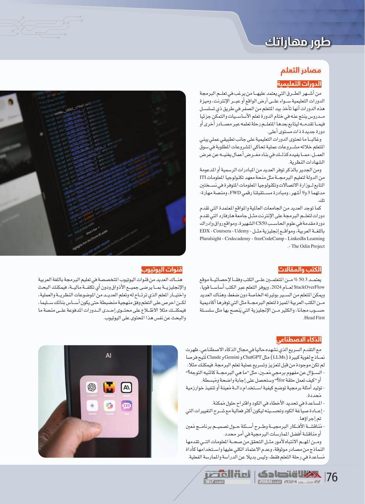

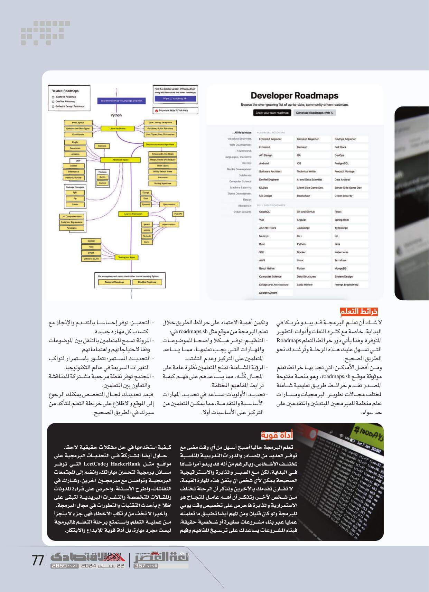
