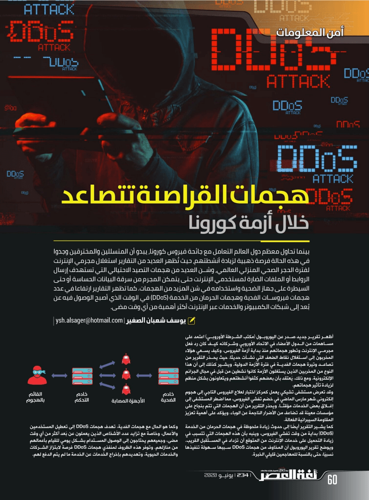

+++
title = "وتيرة هجمات القراصنة تتصاعد خلال أزمة فيروس كورونا"
date = "2020-06-01"
description = "بينما تحاول معظم دول العالم التعامل مع جائحة فيروس كورونا، يبدو أن المتسللين والمخترقين وجدوا في هذه الحالة فرصة ذهبية لزيادة أنشطتهم، حيث تُظهر العديد من التقارير استغلال مجرمو الإنترنت لفترة الحجر الصحي المنزلي العالمي وشن العديد من هجمات التصيد الاحتيالي التي تستهدف إرسال الروابط أو الملفات الضارة لمستخدمي الإنترنت حتى يتمكن المجرم من سرقة البيانات الحساسة أو حتى السيطرة على جهاز الضحية واستخدامه في شن المزيد من الهجمات. كما تظهر التقارير ارتفاعا في عدد هجمات فيروسات الفدية وهجمات الحرمان من الخدمة (DDoS) في الوقت الذي أصبح الوصول فيه عن بُعد إلى شبكات الكمبيوتر والخدمات عبر الإنترنت أكثر أهمية من أي وقت مضى."
categories = ["تقارير",]
tags = ["مجلة لغة العصر"]

+++

بينما تحاول معظم دول العالم التعامل مع جائحة فيروس كورونا، يبدو أن المتسللين والمخترقين وجدوا في هذه الحالة فرصة ذهبية لزيادة أنشطتهم، حيث تُظهر العديد من التقارير استغلال مجرمو الإنترنت لفترة الحجر الصحي المنزلي العالمي وشن العديد من هجمات التصيد الاحتيالي التي تستهدف إرسال الروابط أو الملفات الضارة لمستخدمي الإنترنت حتى يتمكن المجرم من سرقة البيانات الحساسة أو حتى السيطرة على جهاز الضحية واستخدامه في شن المزيد من الهجمات. كما تظهر التقارير ارتفاعا في عدد هجمات فيروسات الفدية وهجمات الحرمان من الخدمة (DDoS) في الوقت الذي أصبح الوصول فيه عن بُعد إلى شبكات الكمبيوتر والخدمات عبر الإنترنت أكثر أهمية من أي وقت مضى.

أظهر تقرير جديد صدر عن اليوروبول (مكتب الشرطة الأوروبي) أعتمد على مساهمات من الدول الأعضاء في الاتحاد الأوروبي وشركاءه كيف كان رد فعل مجرمي الإنترنت وتطور هجماتهم منذ بداية أزمة الفيروس وكيف يسعي هؤلاء المخربون إلى استغلال نقاط الضعف التي نشأت حديثا. حيث يحذر التقرير من تصاعد وتيرة هجمات الفدية في فترة الأزمة الدولية. ويشير كذلك إلى أن هذا النوع من المخربين الذين يستغلون الأزمة كانوا نشطين من قبل في مجال الجرائم الإلكترونية. ومع ذلك، يُعتقد بأن بعضهم كثفوا أنشطتهم ويتعاونون بشكل منظم لزيادة تأثير هجماتهم.

وقد تعرض مستشفى تشيكي يعمل كمركز اختبار لعلاج الفيروس التاجي إلى هجوم إلكتروني شهر مارس الماضي في خضم تفشي الفيروس، مما اضطر المستشفى إلى إغلاق بعض الخدمات مؤقتًا. ويحذر التقرير من أن الهجمات التي تتم بنجاح على مؤسسات معينة قد تضاعف من الأضرار الناجمة عن الوباء، ويؤكد على أهمية تعزيز المقاومة السيبرانية الفعالة.

كما يشير التقرير أيضًا إلى حدوث زيادة ملحوظة في هجمات الحرمان من الخدمة (DDoS) بداية من وقت تفشي الفيروس، وينبه بأن هذه الهجمات التي تتسبب في زيادة التحميل على خدمات الإنترنت من المتوقع أن تزداد في المستقبل القريب. ويوضح تقرير اليوروبول أن المخاوف من هجمات DDoS سببها سهولة تنفيذها نسبيًا، حتى بالنسبة للمهاجمين قليلي الخبرة.

وكما هو الحال مع هجمات الفدية، تهدف هجمات DDoS إلى تعطيل المستخدمين والأعمال، وخاصة مع تزايد عدد الأشخاص الذين يعملون عن بُعد أكثر من أي وقت مضى، وجميعهم يحتاجون إلى الوصول المستدام بشكل يومي للقيام بأعمالهم من منازلهم. وتوفر هذه الظروف لمنفذي هجمات DDoS فرصة لابتزاز الشركات والخدمات الحيوية، وتهديدهم بإخراج الخدمات عن الخدمة ما لم يتم الدفع لهم.

كما أشار تقرير آخر صادر عن منظمة الصحة العالمية في شهر أبريل الماضي إلى تزايد الهجمات الإلكترونية بخمسة أضعاف منذ بدء تفشي الفيروس. حيث تعرضت المنظمة أواخر شهر أبريل إلى عملية اختراق استهدفت خدمات البريد الإلكتروني الخاص بالمنظمة، ونتج عنها تسريب بيانات تسجيل الدخول الخاصة ب 450 حساب بريد تابع للمنظمة. ونبه التقرير أيضا إلى وجود محتالين ينتحلون صفة منظمة الصحة العالمية في رسائل البريد الإلكتروني، حيث يستهدفون الجمهور بشكل متزايد لغرض توجيه التبرعات إلى صندوق وهمي لا علاقة له بمنظمة الصحة.

كما تم الإبلاغ عن هجمات تصيد في منغوليا استهدفت موظفي القطاع العام شهر مارس الماضي. حيث توصل جهاز الضحية برسالة بريد إلكتروني تتضمن مستند يحتوي معلومات حول الإصابات الجديدة بالفيروس التاجي، وتظهر معلومات المرسل بالبريد الإلكتروني على أنه وزارة الخارجية. وبينما أشارت التحقيقات إلى أن البريد الإلكتروني والمستند حقيقان ويوفران المعلومات المدعاة، إلا أن فتح الملف ينتج عنه تثبيت تعليمات برمجية ضارة على جهاز الضحية يتم تشغيلها في كل مرة يُفتح فيها برامج معالجة النصوص (مثل Microsoft Word). وتسمح هذه البرمجية الضارة لجهاز كمبيوتر آخر بالوصول إلى جهاز الضحية والتحكم به عن بُعد وتحميل المزيد من البرامج الضارة، مما يسمح للمتسللين بعد ذلك بالتجسس على الجهاز المصاب واستخدامه لسرقة البيانات أو تنفيذ المزيد من الهجمات.

فمع وجود عدد كبير من الأشخاص الذين يعملون عن بُعد من المنزل على أجهزة تحتوي غالبًا على أنظمة أمنية قديمة، تزداد فرص تعرضهم للأنشطة الإجرامية عبر الإنترنت، حيث يجد مجرمو الإنترنت في هذا الوضع الصعب فرصة لتنفيذ الهجمات سواء لإيذاء المستخدمين والأعمال أو سرقة البيانات أو الابتزاز. ولذلك أثناء فترة العمل من المنزل حاول إبقاء جهاز العمل آمنا عن طريق تثبيت التحديثات الأمنية وقت صدورها، والتأكد من عمل مضاد الفيروسات بكفاءة، وعدم فتح أي روابط أو ملفات لا تثق في مصدرها.

---

هذا الموضوع نُشر باﻷصل في مجلة لغة العصر العدد 234 شهر 06-2020 ويمكن الإطلاع عليه [هنا](https://drive.google.com/file/d/13i7pxRXJA4Jngu5SAuP2_c3D7V0ZSuaA/view?usp=sharing).

