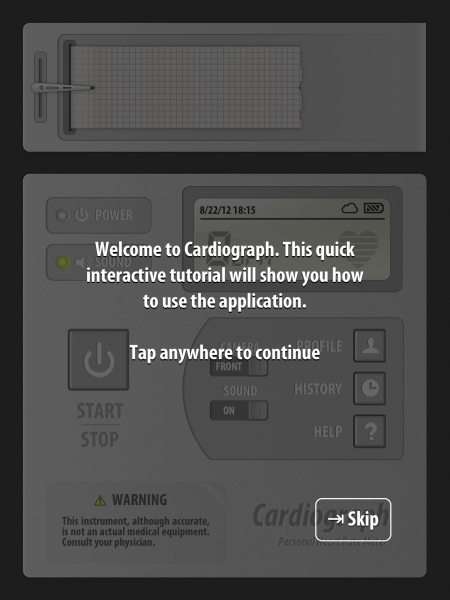
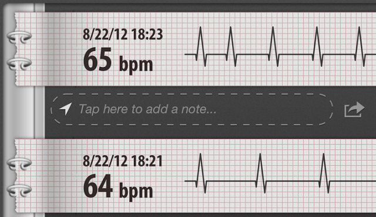

+++
title = "طريقة قياس نبضات قلبك عن طريق هاتفك"
date = "2015-03-04"
description = "هل تعلم أنه يمكنك قياس سرعة نبضات قلبك عن طريق هاتفك الأندرويد أو الأيفون؟ والأكثر من ذلك أن النتيجة تكون دقيقة مقارنة بأجهزة cardiograph الحديثة، نقدم لك عزيزي القارئ طريقة قياس سرعة نبضات قلبك عن طريق هاتفك."
categories = ["مهارات رقمية",]
tags = ["موقع لغة العصر"]

+++

هل تعلم أنه يمكنك قياس سرعة نبضات قلبك عن طريق هاتفك الأندرويد أو الأيفون؟ 

والأكثر من ذلك أن النتيجة تكون دقيقة مقارنة بأجهزة cardiograph الحديثة، نقدم لك عزيزي القارئ طريقة قياس سرعة نبضات قلبك عن طريق هاتفك.

يقوم تطبيق قياس نبضات القلب للهواتف بأخذ صورة للإصبع ومعايرة لونها قبل وبعد ضخ الدم، الأمر الذي يمكن التطبيق من قياس سرعة نبضات القلب عن طريق الاستعانة بالفلاش الموجود في الهاتف، فإذا كان هاتفك لا يحتوي على فلاش فلن يمكنك استخدام هذا التطبيق.

* إذا كنت من مستخدمي هواتف الأندرويد قم بتحميل هذا التطبيق من [متجر جوجل بلاي](https://play.google.com/store/apps/details?id=com.macropinch.hydra.android).

قم بتثبيت التطبيق ثم فتحه ستظهر لك واجهه التطبيق كما بالصورة:

قم بالضغط على أي مكان في الشاشة ثم اضغط على الزر Start/Stop لبدأ القياس.

بعد ذلك ضع أصبعك أمام كاميرا الهاتف لمدة 20 ثانية قبل إعطائك رقم تقريبي لنبضات القلب، كما انه توجد نسبة خطأ قليلة مقارنة مع اجهزة قياس نبضات القلب الحقيقية.

* أما إذا كنت من مستخدمي هواتف الأيفون قم بتحميل هذا التطبيق من [متجر اى تونز](https://itunes.apple.com/us/app/heartbeat-counter-free/id326168000?mt=8).

---
هذا الموضوع نٌشر باﻷصل على موقع مجلة لغة العصر.

http://aitmag.ahram.org.eg/News/6585.aspx