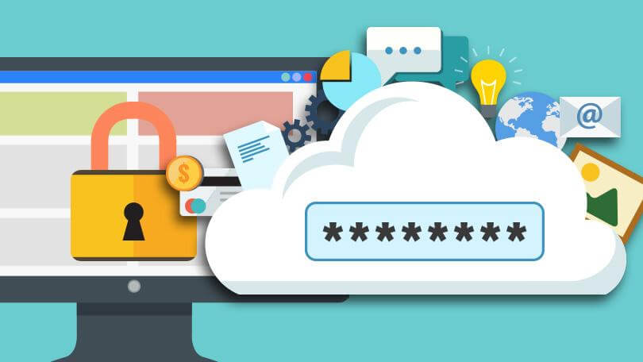

+++
title = "كيف تخفي هويتك الرقمية لمنع استغلال بياناتك؟"
date = "2017-10-01"
description = "من منا لم يسمع عن تسريبات vault 7 الأخيرة التي كشفت عن العديد من أدوات التجسس التي تستخدمها الاستخبارات الأمريكية لاختراق الأنظمة، وليس هذا فحسب بل إن هناك العديد من التطبيقات التي تزايدت حولها الشكوك في الآونة الأخيرة عن استغلالها لبيانات المستخدمين و تخزينها ومن ثم بيعها لاستخدامها في الأنشطة الإعلانية، لذلك نقدم لك عزيزي القارئ دليل تفصيلي عن كيفيه إخفاء هويتك على الإنترنت وإبقاء بياناتك آمنة."
categories = ["الخصوصية",]
tags = ["مجلة لغة العصر"]

+++
من منا لم يسمع عن تسريبات vault 7 الأخيرة التي كشفت عن العديد من أدوات التجسس التي تستخدمها الاستخبارات الأمريكية لاختراق الأنظمة، وليس هذا فحسب بل إن هناك العديد من التطبيقات التي تزايدت حولها الشكوك في الآونة الأخيرة عن استغلالها لبيانات المستخدمين و تخزينها ومن ثم بيعها لاستخدامها في الأنشطة الإعلانية، لذلك نقدم لك عزيزي القارئ دليل تفصيلي عن كيفيه إخفاء هويتك على الإنترنت وإبقاء بياناتك آمنة.

PRISM هو برنامج وكالة الأمن القومي العالمي لمراقبة البيانات والذي يهدف إلى جلب أي معلومات تحتاج إليها المخابرات الأمريكية عن أي مستخدم لأحد أكبر الشركات الأمريكية التي تورطت في أخطر وسائل التجسس الإلكتروني وعلى رأس قائمة هذه الشركات Yahoo,Google,Skype,Microsoft,Apple,FaceBook والعديد من شركات الكبيرة التي تملك أعداد ضخمة من مستخدمين والأعضاء، والذي تم تسريب معلومات عنه في مارس الماضي، وقد تضمن هذا البرنامج المثير للجدل العديد من الأدوات والثغرات التي يمكن استغلالها في العديد من أنظمة التشغيل للتجسس على بيانات المستخدمين والأنشطة التي يقومون بها على الإنترنت.

وليس هذا فحسب بل إن هناك العديد من الخدمات الموجودة على الإنترنت التي تستغل بيانات المستخدمين بدون علمهم مثل موقع unroll.me، و بالمثل هناك برامج سطح المكتب أيضا تقوم بمثل هذا الأمر مثل برنامج AVG الشهير، والأمر نفسه بالنسبة لإضافات المتصفح مثل Web Of Trust التي تبين أنها تبيع بيانات المستخدمين،  لذلك يجب عليك  أن تنتبه إلى مثل هذا الفخ الخطير الذي يقع فيه اغلب مستخدمي الإنترنت. 

**إذن ما الحل للبقاء آمنا؟**

قد يبدو أن الأمر لا مفر منه لكن صدقني عزيزي القارئ، إن الموضوع يحتاج فقط إلى  القرارات الجريئة في التخلي عن بعض الخدمات والانتقال إلى استخدام خدمات أخري لا تقوم بسرقه بيانات المستخدمين واستغلالها، وإذا كنت قد تابعت الموضوع الذي تناولناه في العدد 200 الذي تحدثنا فيه عن [البرمجيات الحرة والبدائل للبرامج المغلقة](/ar/posts/why-should-you-use-open-source-software/) فستعرف أن هناك مجموعة كبيره من البرمجيات الحرة القادرة على تلبيه متطلبات المستخدم وفي نفس الوقت تضمن له الأمان و الخصوصية دون خوف من التجسس أو سرقة البيانات واستغلالها. ويمكنك الرجوع إلى قائمة البرمجيات الحرة [هنا](/ar/posts/why-should-you-use-open-source-software/).

## 9 خطوات لإبقاء هويتك الرقمية مجهولة

### 1- انتقل إلى البرمجيات الحرة

وقد أوضحنا أسباب فعل ذلك في العدد 200 [هنا](/ar/posts/why-should-you-use-open-source-software/).
أيضا أنصحك بزيارة هذا الموقع https://prism-break.org/ar الذي يوضح لك البرمجيات الحرة الآمنة من التجسس والبرمجيات الاحتكارية الخاضعة لبرنامج PRISM التجسسي.

### 2- استخدم لينكس

وبذلك تتخلص من مراقبة مايكروسوفت وتضمن عدم استغلال نظام التشغيل لبياناتك، فمن المعروف أن ويندوز 10 يقوم بتجميع العديد من البيانات عنك بما في ذلك كل ما تقوم بكتابته باستخدام لوحه المفاتيح.

### 3- توقف عن استخدام حساب جوجل وخدماته على هاتفك الأندرويد

قد تختلف معي عزيزي القارئ في هذه النقطة، لكن هل تعرف أن جوجل قد قد ذكرت صراحة في سياسة الخصوصية أنها تقوم بتسجيل رقم الهاتف و أرقام المتصلين وقت وتاريخ المكالمات و مده المكالمات وحتى عناوين الآي بي الخاص بك عند تسجيل الدخول بحساب جوجل على هاتفك الأندرويد، وحتى تتحقق بنفسك من مقدار ما تقوم جوجل بجمعه من بيانات عنك قم بتصفح الروابط التالية بعد تسجيل الدخول بحسابك:

- إعدادات الإعلانات https://www.google.com/ads/preferences/
- سجل عمليات البحث https://history.google.com/
- سجل الموقع الجغرافي https://maps.google.com/locationhistory
- سجل مشاهدات اليوتيوب https://www.youtube.com/feed/history
- سجل البحث على اليوتيوب https://www.youtube.com/feed/history/search_history
- الأجهزة المرتبطة بحسابك https://security.google.com/settings/security/activity
- التطبيقات المرتبطة بحسابك https://security.google.com/settings/security/permissions
- لوحة بيانات جوجل https://www.google.com/settings/dashboard
- تنزيل نسخة عن بياناتك https://www.google.com/takeout

أيضا قم بتعطيل تطبيقات جوجل التي لا تقوم باستخدامها، وحاول استخدام البدائل الحرة المتوفرة لكل تطبيقات جوجل والتي يمكنك الإطلاع عليها هنا https://prism-break.org/ar/categories/android/

### 4- قم بإعداد متصفح الإنترنت جيدا

يوجد العديد من محتوي الإنترنت الذي يمكنه تسريب معلومات عنك، مثل الإعلانات، الجافا سكريبت، والفلاش، لذلك أنصحك بتثبيت الإضافات التالية لتصفح الإنترنت بأمان.

- مانع الإعلانات، يمكنك الاختيار بين إضافة Adblock Plus https://adblockplus.org/ وإضافة uBlock https://www.ublock.org وإن كنت أفضل الأخيرة.

- إضافة لمنع التعقب بواسطة منع الscripts داخل صفحات الويب، مثل Disconnect https://disconnect.me/disconnect أو NoScript https://noscript.net

- إضافات أخري:
HTTPS Everywhere للبقاء دائما متصلا بالإنترنت من خلال اتصال https المشفر.
https://www.eff.org/https-everywhere
أيضا قم بإيقاف ملفات تعريف الارتباط cookies و WebRTC وأخيرا قم بتفعيل طلبات عدم التعقب do-not-request.
ويجب عليك أيضا استخدام محرك بحث لا يقوم بتتبعك مثل https://duckduckgo.com

### 5- لا تقم بحفظ كلمات المرور باستخدام المتصفح

كثير منا يقوم بهذا الأمر، لكن بسبب هذا قد تخترق حساباتك أو يتم تسريب كلمه المرور الخاصة بك إلى جهات أخرى، وبدلا من التخزين داخل المتصفح يمكنك استخدام برنامج لإدارة كلمات المرور، مثل KeePassX https://www.keepassx.org أو Password Safe http://pwsafe.org 

### 6- استخدام Proxy

البروكسي باختصار هو خدمة تقدمها العديد من المزودات على الإنترنت تعمل كوكيل بينك وبين الموقع حيث تقوم بطلب المعلومات من تلك المواقع ثم إرسالها لك، وبالتالي فأنت لا تستخدم عنوانك الحقيقي لطلب الوصول للمواقع طالما تستخدم خدمة proxy وهذا ما يعطيك طبقة إضافية من الحماية.
ويمكنك إيجاد العديد من الخدمات المجانية والمدفوعة على الإنترنت بمجرد البحث عن proxy.

### 7- استخدام VPN

الشبكات الافتراضية أو VPN تعد من أفضل أدوات تحقيق الخصوصية، حيث يتيح لك ال VPN تصفح الإنترنت بطريقة آمنة عن طريق خوادم مع تشفير كافة البيانات، إلى جانب تغيير عنوان ال IP الخاص بك، وحمايتك أثناء استخدامك للشبكات العامة. وعلي الرغم من أن استخدام ال VPN قد لا يضمن عدم الكشف عن هويتك إلا أنه ينصح به وبشدة للتصفح بشكل آمن.
ويوجد على الإنترنت العديد من مزودي خدمة VPN، منها ما هو مجاني ومفتوح المصدر مثل VPNGate ومنها خدمات مدفوعة باشتراك شهري للحصول على خدمة ذات جودة عالية.

### 8- استخدام TOR

TOR هي اختصار للمصطلح (The Onion Router) أو ما يعرف بالتوجيه البصلي وبدأت كشبكة من مجموعة خوادم حول العالم تم تطويرها من قبل البحرية الأمريكية لإخفاء هوية متصفحي الإنترنت، وهي الآن عبارة عن منظمة غير ربحية تعمل في مجال أبحاث وتطوير أدوات حماية الخصوصية على الإنترنت، وتقوم هذه الشبكة بإخفاء هويتك عن طريق تبادل البيانات باستخدام الخوادم الخاصة بالشبكة وليس بالخوادم المعتادة الخاصة بالإنترنت وتقوم أيضاً الشبكة بتشفير تلك البيانات حتى لا يقوم أحد بتتبعها، وبالتالي تضمن لك درجة عالية من الأمان والخصوصية.
ويمكنك استخدام شبكة TOR بكل سهولة عن طريق المتصفح الخاص بها https://www.torproject.org/download/download-easy.html.en
أو نسخة الأندرويد تطبيق Orbot و وتطبيقOrfox (تحتاج تثبيت كلاهما معا من أي متجر تطبيقات).

### 9- استخدام الأنظمة المخصصة للتصفح الآمن

توجد العديد من توزيعات لينكس التي تعمل كنسخة live فقط (تعمل داخل الذاكرة العشوائية ولا تستخدم القرص الصلب) والمصممة خصيصا لحماية الخصوصية وعدم الكشف عن هوية مستخدميها. حيث يسمح باستخدام الإنترنت بصفة مجهولة الهوية في أي مكان تقريبا على شبكة الإنترنت وعلى أي جهاز كمبيوتر بسهولة شديدة، من ضمن تلك التوزيعات:

- Tails https://tails.boum.org
- Whonix https://www.whonix.org
- Anonym.OS https://sourceforge.net/projects/anonym-os

وختاما، تذكر أن تستخدم الخدمات البديلة مفتوحة المصدر إذا أردت ضمان الخصوصية والأمان، لأن البرامج المغلقة يمكن أن تقوم بجمع بيانات عنك واستغلالها دون علمك!

---

هذا الموضوع نُشر باﻷصل في مجلة لغة العصر العدد 202 شهر 10-2017 ويمكن الإطلاع عليه [هنا](https://drive.google.com/file/d/1AFutlN-xbW3nLIunnP3WyM6E0W9Dy2bc/view?usp=sharing).
