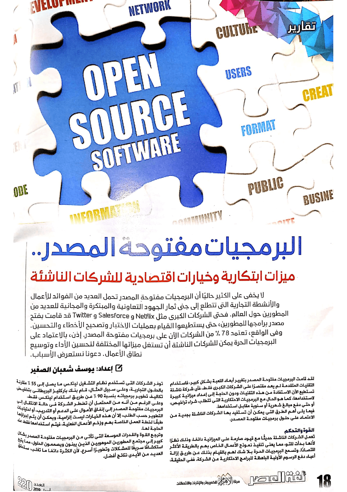

+++
title = "كيف يمكن للبرمجيات مفتوحة المصدر أن تساعد الشركات الناشئة؟"
date = "2019-04-01"
description = "لا يخفي على الكثير حاليا أن البرمجيات مفتوحة المصدر تحمل العديد من الفوائد للأعمال والأنشطة التجارية التي تتطلع إلى جني ثمار الجهود التعاونية والمبتكرة والمجانية للعديد من المطورين حول العالم. فحتى الشركات الكبرى مثل Netflix وSalesforce وTwitter قد قامت بفتح مصدر برامجها للمطورين، حتى يستطيعوا القيام بعمليات الاختبار وتصحيح الأخطاء والتحسين. وفي الواقع، تعتمد 78% من الشركات الآن على برمجيات مفتوحة المصدر. إذن، بالاعتماد على البرمجيات الحرة يمكن للشركات الناشئة أن تستغل ميزاتها المختلفة لتحسين الأداء وتوسيع نطاق الأعمال. دعونا نستعرض الأسباب."
categories = ["برمجيات حرة",]
tags = ["مجلة لغة العصر"]
images = ["images/0.png"]

+++
لا يخفي على الكثير حاليا أن البرمجيات مفتوحة المصدر تحمل العديد من الفوائد للأعمال والأنشطة التجارية التي تتطلع إلى جني ثمار الجهود التعاونية والمبتكرة والمجانية للعديد من المطورين حول العالم. فحتى الشركات الكبرى مثل Netflix وSalesforce وTwitter قد قامت بفتح مصدر برامجها للمطورين، حتى يستطيعوا القيام بعمليات الاختبار وتصحيح الأخطاء والتحسين. وفي الواقع، تعتمد 78% من الشركات الآن على برمجيات مفتوحة المصدر. إذن، بالاعتماد على البرمجيات الحرة يمكن للشركات الناشئة أن تستغل ميزاتها المختلفة لتحسين الأداء وتوسيع نطاق الأعمال. دعونا نستعرض الأسباب.

لقد قامت البرمجيات مفتوحة المصدر بتغيير أبعاد اللعبة بشكل كبير، فاستخدام التقنيات المتقدمة لم يعد مقتصرا على الشركات الكبرى فقط، فأي شركة ناشئة تستطيع الآن الاستفادة من هذه التقنيات ودون الحاجة إلى إعداد ميزانية كبيرة لاستخدامها كما هو الحال مع البرمجيات الاحتكارية التي تتطلب شراء تراخيص أو حتى دفع مبالغ شهرية أو سنوية مقابل استخدامها.
فيما يلي أهم الطرق التي يمكن أن تستفيد بها الشركات الناشئة بجدية من الاعتماد على حلول برمجيات مفتوحة المصدر:

## القوة والتحكم

تعمل الشركات الناشئة حديثا مع قيود صارمة على الميزانية دائمًا، وذلك نظرًا لأنها بدأت للتو، مما يعني تنفيذ نموذج الأعمال الخاص بهم بالطريقة الأكثر اقتصادا. وتسمح البرمجيات الحرة بلا شك لهم بالقيام بذلك عن طريق إزالة أعباء دفع الرسوم الأولية الباهظة للبرامج الاحتكارية عن الشركة. ففي الحقيقة، توفر الشركات التي تستخدم نظام التشغيل لينكس ما يصل إلى 55% مقارنة بالحلول التجارية، وعلى سبيل المثال قام بنك باركليز البريطاني بتخفيض تكاليف تطوير البرمجيات الخاصة به بنسبة 90% عن طريق استخدام لينكس فقط.

وعلى الرغم من أنه من المحتمل أن تضطر الشركة في حالة الانتقال إلى البرمجيات مفتوحة المصدر إلى إنفاق الأموال على الدعم أو التدريب أو احتياجات التطوير حسب الطلب، إلا أن هذه الخيارات ليست إلزامية، ويمكن أن يتم إجراءها طبقا لخطة العمل الخاصة بهم وزخم الأعمال الفعلية، فيتم استخدامها فقط عند الحاجة لها.

وترجع القوة والقدرات الموسعة التي تأتي من البرمجيات مفتوحة المصدر بشكل كبير إلى مجتمع المطورين الموهوبين الذين يبنون ويصممون الحلول، مما يتيح استكشاف سريعا للمشاكل وتطويرا أسرع. لأن الكثرة دائما ما تغلب، ستحقق العديد من الأيدي نتائج أفضل.

## الابتكار والإنتاجية والمرونة

تحتاج الشركات الناشئة أن تكون قادرة على التجربة بشكل حر، حتى تتمكن من فهم ما يصلح لأعمالها وما لا يصلح. وإذا كانت الحاجة لتجربة الخيارات المختلفة مقيدة بالتكاليف الباهظة أو التزامات التعاقدات، فإن الشركات لن تقوم بتجربة المسارات الجديدة أو ارتكاب الأخطاء الضرورية لفهم ما هو أفضل طريق للمضي عبره. أضف إلى ذلك عدم القدرة على الاستفادة من الأدوات الجديدة بمجرد توفرها، وخاصة قبل اللاعبين الكبار الآخرين، الذين يطورون برمجياتهم الاحتكارية الخاصة.

تسمح البرمجيات مفتوحة المصدر بهذا النوع من المرونة والرشاقة، والذي يولد الابتكار. فيمكن للشركات الناشئة استكشاف جميع السبل التي يحتاجون إليها حتى يعرفوا الطريق الصحيح بالنسبة لهم دون الحاجة إلى اتباع ما يمليه عليهم مورد معين.

على سبيل المثال، تحتاج الشركات الناشئة التي تعمل في مجال الذكاء الاصطناعي إلى تحديد أفضل خوارزمية تناسب احتياجات العمل الخاصة بهم. ولتحديد هذه الخوارزمية يتعين على علماء البيانات إجراء العديد من عمليات المحاولة والخطأ. ويتبع ذلك عادةً تحليل تفصيلي للبيانات ومرحلة الاكتشاف. وبعد المرور بكل هذه المراحل لمرات عديدة، سيكون لدي علماء البيانات فهم كامل لخوارزمية الاستخدام، ومعرفة أفضل طريقة لتقطيع وتشريح البيانات للحصول على النتائج المتوقعة للأعمال.

وفي حالة البرمجيات الاحتكارية، ستكون تكلفة إجراء هذه الدورات باهظة للغاية. وهذه هي الطريقة التي كان على الشركات الكبرى استخدامها لإنشاء خوارزميات الذكاء الاصطناعي في الماضي، وبالطبع مع استهلاك نفقات ضخمة على كل من القوى البشرية والموارد. أما الآن، فقد أصبحت للتقنيات مفتوحة المصدر ناضجة بما يكفي للاعتماد عليها وتشغيل تطبيقات الذكاء الاصطناعي بشكل أسهل وأرخص.

كما تساعد البرامج مفتوحة المصدر الشركات الناشئة على لتخاذ خطوات هائلة في مستويات الإنتاجية أيضًا. فهناك عدد متزايد من الشركات تستخدم برامج مفتوحة المصدر كعنصر رئيسي. وفي دراسة توضح تأثير البرمجيات الحرة المفتوحة المصدر على الإنتاجية، قام بها فرانك ناغل الأستاذ المساعد في الاستراتيجية في كلية مارشال لإدارة الأعمال في جامعة جنوب كاليفورنيا، نجد أن الإنتاجية تزداد أو تظل محايدة دائمًا كنتيجة للبرمجيات مفتوحة المصدر، لكن التأثير لم يكن سالبًا أبدًا. فكل زيادة بنسبة 1% في استخدام البرمجيات الحرة مفتوحة المصدر، يمكن للأرباح أن ترتفع بمبلغ مائة ألف دولار. يعلق ناغل قائلا: " إن هذا مبلغ ضخم بالنسبة للشركات الصغيرة".

## الأمان والموثوقية

نظرا لطبيعتها العامة، تكون الشفرة المصدرية للبرنامج في أغلب الأحيان أكثر موثوقية من أي شيء تم تطويره بواسطة مجموعات مستقلة من المطورين. وعلى الرغم من البرمجيات مفتوحة المصدر ليست أكثر أمانا من البرمجيات الاحتكارية بشكل تلقائي، فإنها بخلاف تلك الأخيرة شفافة ومتاحة للفحص من قبل الجميع. لذلك، من خلال فتح مصدر البرنامج والسماح لأي شخص بتصليح الأكواد التي تسبب مشاكل وقد تعرض البرنامج للخطأ، يمكن للشركات الاستفادة من روح المبادرة لدي المجتمع لتعزيز أمان برمجياتهم.

قد تكون الشركات الناشئة التي بدأت للتو خائفة من كمية خيارات البرامج مفتوحة المصدر المتاحة، لكن لا ينبغي لذلك أن يؤدي إلى إيقافها، فهناك قدر كبير من الأرباح يمكن الحصول عليه عن طريق اختيار التقنيات مفتوحة المصدر.

بين الاقتصاد في التكاليف والموارد، وزيادة القدرة على الابتكار والمرونة، وضمان أمان الأنظمة من قبل مجتمع البرمجيات مفتوحة المصدر، وإخلاصهم للبرامج المميزة، فإن الخيارات التي توفر نتائج جيدة لا حصر لها وتستحق التفكير فيها من قبل الشركات الناشئة المستقبلية أو حتى الحالية.

---

هذا الموضوع نُشر باﻷصل في مجلة لغة العصر العدد 220 شهر 04-2019 ويمكن الإطلاع عليه [هنا](https://drive.google.com/file/d/1TRP4UQVpJul4F4tLGDnIv8iY44Y4t5WA/view?usp=sharing).

