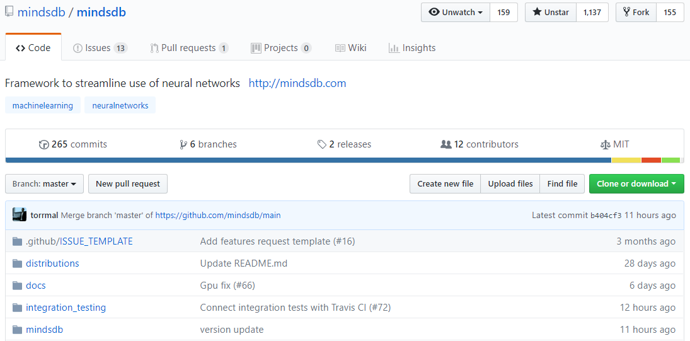
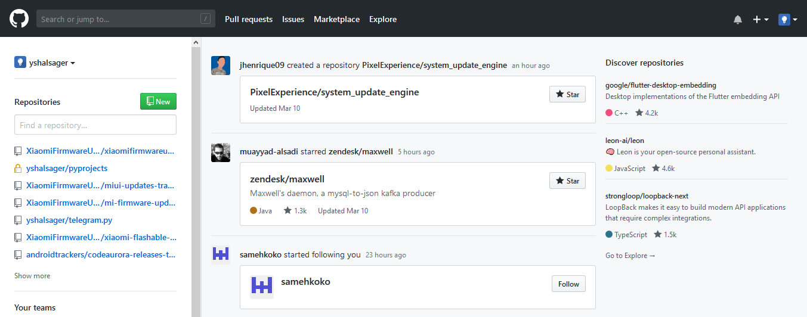
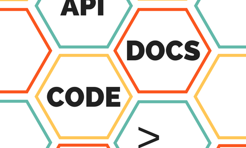
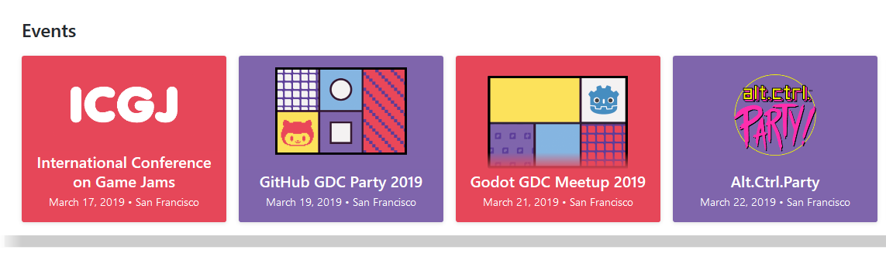
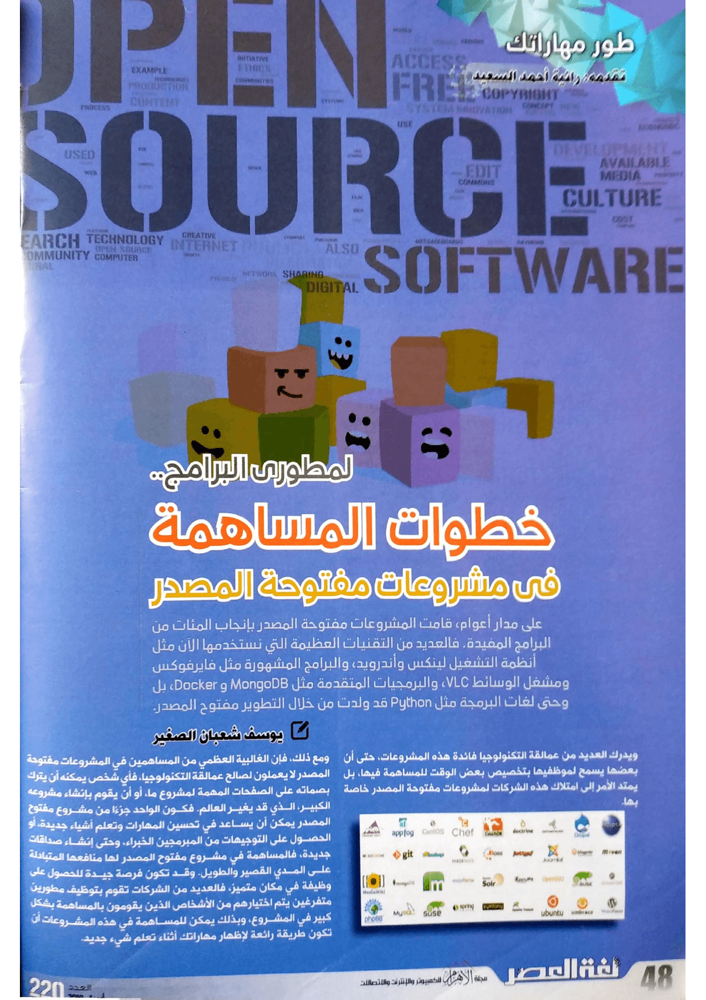
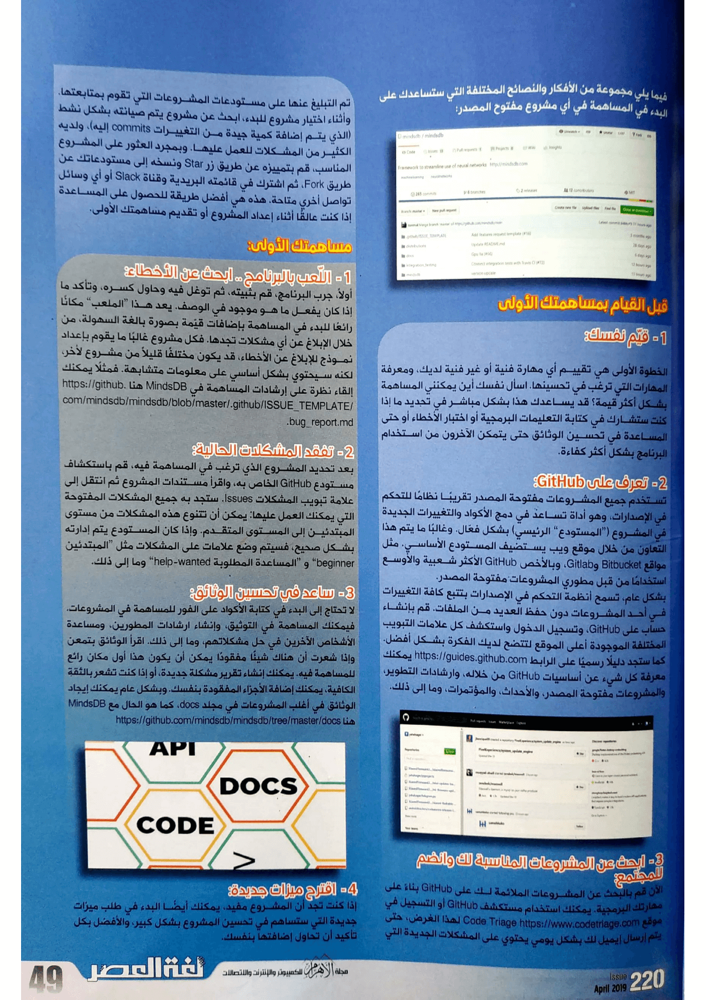
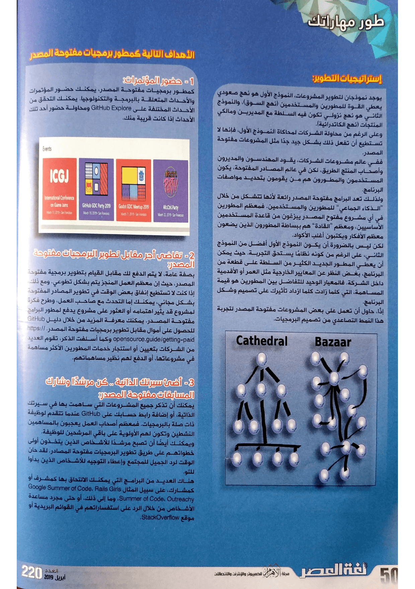

+++
title = "كيف تبدأ المساهمة في المشاريع مفتوحة المصدر؟"
date = "2019-04-02"
description = "على مدار أعوام، قامت المشروعات مفتوحة المصدر بإنجاب المئات من البرامج المفيدة. فالعديد من التقنيات العظيمة التي نستخدمها الآن مثل أنظمة التشغيل لينكس وأندرويد، والبرامج المشهورة مثل فايرفوكس ومشغل الوسائط VLC، والبرمجيات المتقدمة مثل MongoDB وDocker، بل وحتى لغات البرمجة مثل Python قد ولدت من خلال التطوير مفتوح المصدر."
categories = ["برمجيات حرة",]
tags = ["مجلة لغة العصر"]

+++
على مدار أعوام، قامت المشروعات مفتوحة المصدر بإنجاب المئات من البرامج المفيدة. فالعديد من التقنيات العظيمة التي نستخدمها الآن مثل أنظمة التشغيل لينكس وأندرويد، والبرامج المشهورة مثل فايرفوكس ومشغل الوسائط VLC، والبرمجيات المتقدمة مثل MongoDB وDocker، بل وحتى لغات البرمجة مثل Python قد ولدت من خلال التطوير مفتوح المصدر.

ويدرك العديد من عمالقة التكنولوجيا فائدة هذه المشروعات، حتى أن بعضها يسمح لموظفيها بتخصيص بعض الوقت للمساهمة فيها، بل يمتد الأمر إلى امتلاك هذه الشركات لمشروعات مفتوحة المصدر خاصة بها.

ومع ذلك، فإن الغالبية العظمي من المساهمين في المشاريع مفتوحة المصدر لا يعملون لصالح عمالقة التكنولوجيا، فأي شخص يمكنه أن يترك بصماته على الصفحات الهامة لمشروع ما، أو أن يقوم بإنشاء مشروعه الكبير، الذي قد يغير العالم. فكون الواحد جزءا من مشروع مفتوح المصدر يمكن أن يساعد في تحسين المهارات وتعلم أشياء جديدة، أو الحصول على التوجيهات من المبرمجين الخبراء، وحتى إنشاء صداقات جديدة، فالمساهمة في مشروع مفتوح المصدر لها منافعها المتبادلة على المدي القصير والطويل. وقد تكون فرصة جيدة للحصول على وظيفة في مكان متميز، فالعديد من الشركات تقوم بتوظيف مطورين متفرغين يتم اختيارهم من الأشخاص الذين يقومون بالمساهمة بشكل كبير في المشروع، وبذلك يمكن للمساهمة في هذه المشاريع أن تكون طريقة رائعة لإظهار مهاراتك أثناء تعلم شيء جديد.

فيما يلي مجموعة من الأفكار والنصائح المختلفة التي ستساعدك على البدء في المساهمة في أي مشروع مفتوح المصدر:

## قبل القيام بمساهمتك الأولى

### 1- قيّم نفسك

الخطوة الأولى هي تقييم أي مهارة فنية أو غير فنية لديك، ومعرفة المهارات التي ترغب في تحسينها. اسأل نفسك أين يمكنني المساهمة بشكل أكثر قيمة؟ قد يساعدك هذا بشكل مباشر في تحديد ما إذا كنت ستشارك في كتابة التعليمات البرمجية أو اختبار الأخطاء أو حتى المساعدة في تحسين الوثائق حتى يتمكن الآخرون من استخدام البرنامج بشكل أكثر كفاءة.

### 2- تعرف على GitHub

تستخدم جميع المشاريع مفتوحة المصدر تقريبًا نظام للتحكم في الإصدارات، وهو أداة تساعد في دمج الأكواد والتغييرات الجديدة في المشروع ("المستودع" الرئيسي) بشكل فعّال. وغالبا ما يتم هذا التعاون من خلال موقع ويب يستضيف المستودع الأساسي. مثل مواقع Bitbucket وGitlab، وبالأخص GitHub الأكثر شعبية والأوسع استخداما من قبل مطوري المشروعات مفتوحة المصدر.

بشكل عام، تسمح أنظمة التحكم في الإصدارات بتتبع كافة التغييرات في أحد المشروعات دون حفظ العديد من الملفات. قم بإنشاء حساب على GitHub، وتسجيل الدخول واستكشف كل علامات التبويب المختلفة الموجودة أعلى الموقع لتتضح لديك الفكرة بشكل أفضل. كما ستجد دليل رسمي على الرابط https://guides.github.com يمكنك معرفة كل شيء عن أساسيات GitHub من خلاله، وإرشادات التطوير، والمشاريع مفتوحة المصدر، والأحداث، والمؤتمرات وما إلى ذلك.

### 3- ابحث عن المشاريع المناسبة لك وانضم للمجتمع

الآن قم بالبحث عن المشاريع الملائمة لك على GitHub بناءً على مهارتك البرمجية. يمكنك استخدام مستكشف GitHub أو التسجيل في موقع Code Triage https://www.codetriage.com لهذا الغرض، حتى يتم إرسال رسالة بريد إلكتروني لك بشكل يومي يحتوي على المشاكل الجديدة التي تم التبليغ عنها على مستودعات المشاريع التي تقوم بمتابعتها. وأثناء اختيار مشروع للبدء، ابحث عن مشروع يتم صيانته بشكل نشط (الذي يتم إضافة كمية جيدة من التغييرات commits إليه)، ولديه الكثير من المشكلات للعمل عليها. وبمجرد العثور على المشروع المناسب، قم بتمييزه عن طريق زرStar ونسخه إلى مستودعاتك عن طريق Fork، ثم اشترك في قائمته البريدية وقناة Slack أو أي وسائل تواصل أخري متاحة. هذه هي أفضل طريقة للحصول على المساعدة إذا كنت عالقًا أثناء إعداد المشروع أو تقديم مساهمتك الأولى.

## مساهمتك الأولى

### 1- اللّعب بالبرنامج: ابحث عن الأخطاء

أولاً، جرب البرنامج، قم بتثبيته، ثم توغل فيه وحاول كسره، وتأكد ما إذا كان يفعل ما هو موجود في الوصف. يعد هذا "الملعب" مكانًا رائعًا للبدء في المساهمة بإضافات قيّمة بصورة بالغة السهولة، من خلال الإبلاغ عن أي مشكلات تجدها. فكل مشروع غالبا ما يقوم بإعداد نموذج للإبلاغ عن الأخطاء، قد يكون مختلف قليلاً من مشروع لأخر، لكنه سيحتوي بشكل أساسي على معلومات متشابهة. فمثلا يمكنك إلقاء نظرة على إرشادات المساهمة في MindsDB هنا https://github.com/mindsdb/mindsdb/blob/master/.github/ISSUE_TEMPLATE/bug_report.md.

### 2- تفقد المشكلات الحالية

بعد تحديد المشروع الذي ترغب في المساهمة فيه، قم باستكشاف مستودع GitHub الخاص به، واقرأ مستندات المشروع ثم انتقل إلى علامة تبويب المشكلات Issues. ستجد به جميع المشكلات المفتوحة التي يمكنك العمل عليها. يمكن أن تتنوع هذه المشكلات من مستوى المبتدئين إلى المستوى المتقدم. وإذا كان المستودع يتم إدارته بشكل صحيح، فسيتم وضع علامات على المشكلات مثل "المبتدئين beginner" و "المساعدة المطلوبة help-wanted" وما إلى ذلك.

### 3- ساعد في تحسين الوثائق

لا تحتاج إلى البدء في كتابة الأكواد على الفور للمساهمة في المشروعات. فيمكنك المساهمة في التوثيق، وإنشاء إرشادات المطورين، ومساعدة الأشخاص الآخرين في حل مشكلاتهم، وما إلى ذلك. اقرأ الوثائق بتمعن وإذا شعرت أن هناك شيء مفقود، يمكن أن يكون هذا أول مكان رائع للمساهمة فيه. يمكنك إنشاء تقرير مشكلة جديدة، أو إذا كنت تشعر بالثقة الكافية، يمكنك إضافة الأجزاء المفقودة بنفسك. وبشكل عام يمكنك إيجاد الوثائق في أغلب المشاريع في مجلد docs، كما هو الحال مع MindsDB هنا https://github.com/mindsdb/mindsdb/tree/master/docs

### 4- اقترح ميزات جديدة

إذا كنت تجد أن المشروع مفيد، يمكنك أيضًا البدء في طلب ميزات جديدة التي ستساهم في تحسين المشروع بشكل كبير، والأفضل بكل تأكيد أن تحاول إضافتها بنفسك.

## استراتيجيات التطوير

يوجد نموذجان لتطوير المشاريع، النموذج الأول هو نهج صعودي يعطي القوة للمطورين والمستخدمين (نهج السوق)، والنموذج الثاني هو نهج نزولي تكون فيه السلطة مع المديرين ومالكي المنتجات (نهج الكاتدرائية).

وعلى الرغم من محاولة الشركات لمحاكة النموذج الأول، فإنها لا تستطيع أن تفعل ذلك بشكل جيد جدا مثل المشاريع مفتوحة المصدر.

ففي عالم مشاريع الشركات، يقود المهندسون والمديرون وأصحاب المنتج الطريق. لكن في عالم المصادر المفتوحة، يكون المستخدمون والمطورون هم من يقومون بتحديد مواصفات البرنامج.

ولذلك تعد البرامج مفتوحة المصدر رائعة لأنها تتشكل من خلال "الذكاء الجماعي" للمطورين والمستخدمين. فمعظم المطورين في أي مشروع مفتوح المصدر يبزغون من قاعدة المستخدمين الأساسيين، ومعظم "القادة" هم ببساطة المطورين الذين يضعون معظم الأفكار ويكتبون أغلب الأكواد.

لكن ليس بالضرورة أن يكون النموذج الأول أفضل من النموذج الثاني، على الرغم من كونه نظام يستحق التجربة. حيث يمكن أن يعطي المطور الجديد الكثير من السلطة على قطعة من البرنامج، بغض النظر عن المعايير الخارجية مثل العمر أو الأقدمية داخل الشركة. فالمعيار الوحيد للتفاضل بين المطورين هو قيمة المساهمة، التي كلما زادت، كلما ازداد تأثيرك على تصميم وشكل البرنامج.

إذا، حاول أن تعمل على بعض المشاريع مفتوحة المصدر لتجربة هذا النمط التصاعدي من تصميم البرمجيات.

## الأهداف التالية كمطور برمجيات مفتوحة المصدر

### 1- حضور المؤتمرات

كمطور برمجيات مفتوحة المصدر، يمكنك حضور المؤتمرات والأحداث المتعلقة بالبرمجة والتكنولوجيا. يمكنك التحقق من الأحداث المختلفة على GitHub Explore ومحاولة حضور أحد تلك الأحداث إذا كانت قريبة منك.

### 2- تقاضي أجر مقابل تطوير البرمجيات مفتوحة المصدر

بصفة عامة، لا يتم الدفع لك مقابل القيام بتطوير برمجية مفتوحة المصدر، حيث أن معظم العمل المنجز يتم بشكل تطوعي. ومع ذلك، إذا كنت لا تستطيع إنفاق بعض الوقت في تطوير المصادر المفتوحة بشكل مجاني، يمكنك إما التحدث مع صاحب العمل، وطرح فكرة لمشروع قد يثير اهتمامه أو العثور على مشروع يدفع لمطور البرامج مفتوحة المصدر. يمكنك معرفة المزيد من خلال دليل GitHub للحصول على أموال مقابل تطوير برمجيات مفتوحة المصدر. https://opensource.guide/getting-paid وكما أسلفت الذكر، تقوم العديد من الشركات بتعيين أو استئجار خدمات المطورين الأكثر مساهمة في مشاريعها، أو الدفع لهم نظير مساهماتهم.

### 3- أضئ سيرتك الذاتية، كن مرشدًا وشارك المسابقات مفتوحة المصدر

يمكنك أن تذكر جميع المشاريع التي ساهمت بها في سيرتك الذاتية أو إضافة رابط حسابك على GitHub عندما تتقدم لوظيفة ذات صلة بالبرمجيات. فمعظم أصحاب العمل يعجبون بالمساهمين الناشطين وتكون لهم الأولوية على باقي المرشحين للوظيفة.

ويمكنك أيضًا أن تصبح مرشدًا للأشخاص الذين يتخذون أول خطواتهم على طريق تطوير البرمجيات مفتوحة المصادر. لقد حان الوقت لرد الجميل للمجتمع وإعطاء التوجيه للأشخاص الذين بدؤوا للتو.

هناك العديد من البرامج التي يمكنك الالتحاق بها كمشرف أو كمشارك، على سبيل المثال Google Summer of Code، Rails Girls Summer of Code، Outreachy، وما إلى ذلك، أو حتى مجرد مساعدة الأشخاص من خلال الرد على استفساراتهم في القوائم البريدية أو موقع StackOverflow.

---

هذا الموضوع نُشر باﻷصل في مجلة لغة العصر العدد 220 شهر 04-2019 ويمكن الإطلاع عليه [هنا](https://drive.google.com/file/d/1TRP4UQVpJul4F4tLGDnIv8iY44Y4t5WA/view?usp=sharing).

