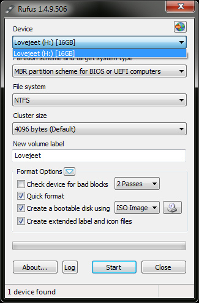
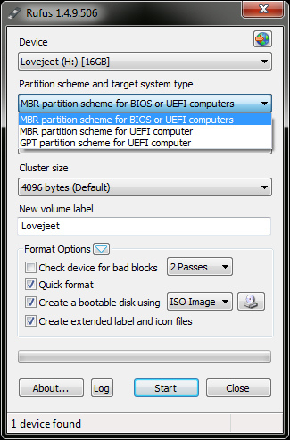
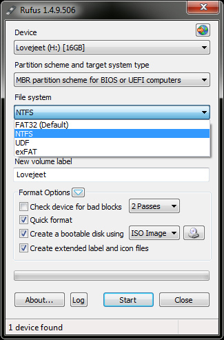
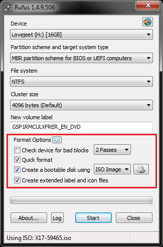
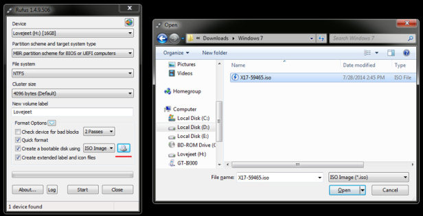
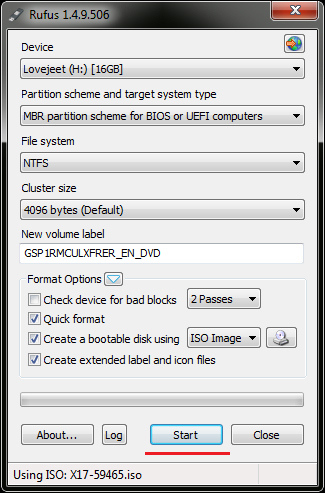

+++
title = "كيفية عمل فلاشه للإقلاع منها لأي نظام تشغيل"
date = "2015-05-17"
description = "هل لديك نسخة ويندوز بصيغة ISO ولا تستطيع حرقها على أسطوانة، نقدم لك عزيزي القارئ طريقة وضع نسخة من أي نظام تشغيل على الفلاشه والتثبيت منها مباشرة."
categories = ["مهارات رقمية",]
tags = ["موقع لغة العصر"]

+++

هل لديك نسخة ويندوز بصيغة ISO ولا تستطيع حرقها على أسطوانة، نقدم لك عزيزي القارئ طريقة وضع نسخة من أي نظام تشغيل على الفلاشه والتثبيت منها مباشرة.
إذا كنت تريد حرق نسخة من ويندوز 7 يمكنك استخدام أداة Windows 7 USB/DVD download tool المجانية، من انتاج مايكروسوفت، بعد تثبيت الأداة قم بفتحها بصلاحيات المدير Run as administrator ثم اتبع الخطوات.

1. قم بتحميل أداة Rufus [من موقعها الرسمي من هنا](http://rufus.akeo.ie/).
2. قم بفتح الأداة بصلاحيات المدير Run as administrator.
3. قم بالضغط على Device ثم اختر الفلاشه التي تريد وضع الويندوز عليها.

4. اختر “MBR partition scheme for BIOS or UEFI computers “للإقلاع من ال BIOS.
أو أختر “GPT partition scheme for UEFI computer ” للإقلاع من ال UEFI.

5. اختر نظام الملفات NTFS إذا كان حجم ملف ال ISO أكبر من 4 جيجا.

6. اترك قيمة cluster size كما هي.
7. قم بضبط إعدادات الفورمات كما الآتي:
اختر “Quick Format “.
اختر “Create extended label and icon files “.
اختر “Create a bootable disk using “.

8. اضغط علي علامة القرص بجانب “Create a bootable disk using “ثم اختر ملف ال ISO.

9. تأكد من الإعدادات التي قمت بعملها ثم اضغط زر Start لبدأ حرق النسخة.

قائمة أنظمة التشغيل التي تدعمها أداة Rufus:
* Arch Linux
* Archbang
* BartPE/pebuilder
* CentOS
* Damn Small Linux
* Fedora
* FreeDOS
* Gentoo
* GParted
* gNewSense
* Hiren’s Boot CD
* LiveXP
* Knoppix
* KolibriOS
* Kubuntu
* Linux Mint
* NT Password Registry Editor
* OpenSUSE
* Parted Magic
* Partition Wizard
* ReactOS
* rEFInd
* Slackware
* Tails
* Trinity Rescue Kit
* Ubuntu
* Ultimate Boot CD
* Windows XP (SP2+)
* Windows Server 2003 R2
* Windows Vista
* Windows 7
* Windows 8
* Windows 8.1

---
هذا الموضوع نٌشر باﻷصل على موقع مجلة لغة العصر.

http://aitmag.ahram.org.eg/News/15640.aspx