+++
title = "دليل شامل لتحديث جهازك على ويندوز ولينكس وماك"
date = "2017-12-01"
description = "نعلم جميعا أن تحديث أجهزتنا هو أمر مرهق، لكن على الرغم من ذلك فالقيام به بشكل دوري هو شيء مهم جدا، وذلك لأن الأمور قد اختلفت عن الأوقات الماضية، فالتحديثات لا تقوم فقط بتصليح المشاكل الموجودة في البرامج لكنها تسبب أيضا الثغرات الأمنية التي أصبحت خطرا على المستخدم، لذلك نقدم لك عزيزي القارئ دليلا شاملا لكيفية تحديث النظام على ويندوز ولينكس وماك."
categories = ["مهارات رقمية", "ويندوز", "لينكس",]
tags = ["مجلة لغة العصر"]
images = ["images/Windows.png"]

+++
نعلم جميعا أن تحديث أجهزتنا هو أمر مرهق، لكن على الرغم من ذلك فالقيام به بشكل دوري هو شيء مهم جدا، وذلك لأن الأمور قد اختلفت عن الأوقات الماضية، فالتحديثات لا تقوم فقط بتصليح المشاكل الموجودة في البرامج لكنها تسبب أيضا الثغرات الأمنية التي أصبحت خطرا على المستخدم، لذلك نقدم لك عزيزي القارئ دليلا شاملا لكيفية تحديث النظام على ويندوز ولينكس وماك.

## أولا: نظام ويندوز

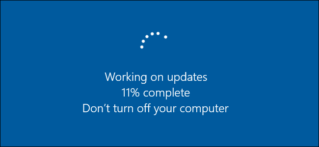

إذا كنت تستخدم ويندوز 8 أو 10 فلا بد أن تكون لاحظت أن تحديثات الويندوز قد أصبحت إجبارية، فلم يعد لديك الإعدادات السهلة للتعامل مع التحديثات واختيار التحديثات التي ترغب في تثبيتها ولكن على الرغم من أن ويندوز يقوم بالكثير من الأمور بشكل تلقائي يجب على المستخدم التحقق من بعض الأشياء لإبقاء كل الأمور محدثة تماما على جهازك، مثل البرامج والتطبيقات من الجهات الخارجية وبعض تعريفات الأجهزة.

## 1- التحقق من تحديثات النظام

-  في ويندوز 8 و10:
اضغط زر Start ثم ابحث عن windows update واختر Windows Update Settings.

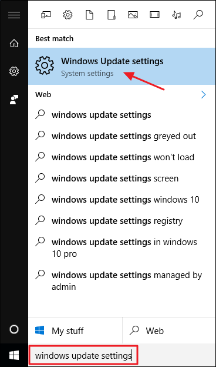

يمكنك الضغط على زر Check for updates للتحقق من وجود تحديثات جديدة دائما، في حالة عدم قيام الويندوز بتحميلها تلقائيا.

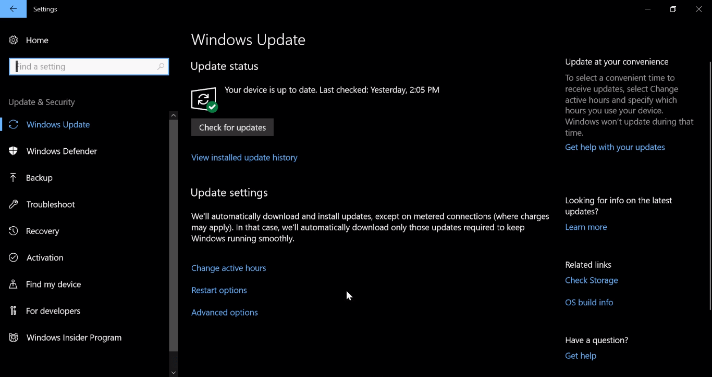

فإذا كان هناك تحديثات متوفرة لم يتم تنزيلها وتثبيتها بعد فستظهر على شاشه الإعدادات، يمكنك الإطلاع على المزيد من المعلومات عنها عبر النقر على الزر تفاصيل details.  أو الضغط على زر التثبيت لبدء تحميلها ثم تثبيتها.
-  في ويندوز 7:
اضغط زر Start ثم قم بكتابة Windows Update واضغط Enter.

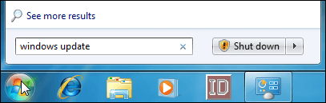

سيظهر لك نافذة التحكم في التحديثات، وستجدها مقسمة إلى "تحديثات هامة" وتحديثات اختيارية".

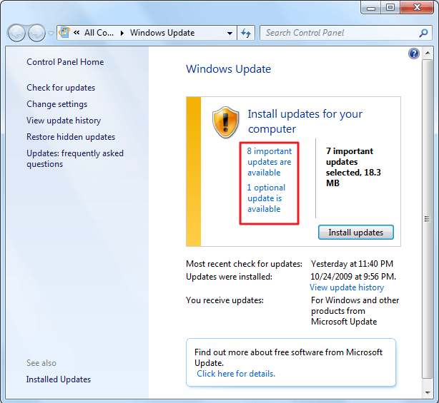

 بالضغط على أي منهما يمكنك اختيار التحديثات التي تود تثبيتها، ثم الضغط على "Install updates” لبدء تحميل وتثبيت التحديثات.

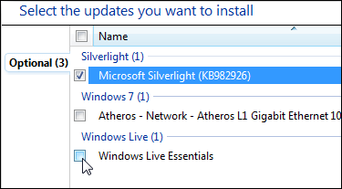

## 2- التحقق من تحديثات البرامج الخارجية

أغلب البرامج التي نستخدمها تحتوي على خيار للتحقق من التحديثات، مثل متصفحات الإنترنت Chrome و Firefox وبرنامج VLC والعديد من البرامج الأخري. فيمكنك إما تحديثها عندما تطلب ذلك، أو القيام بالأمر بشكل دوري، أو استخدام برامج التحديث التلقائي مثل:

- Secunia Personal Software:
وهو أداة صغيرة بمجرد تثبيتها فإنها تعمل في الخلفية وتراقب التحديثات، وعندما تجد تحديث فإنها تقوم بتحميله ثم تثبيته تلقائيا إذا أمكن. 
يمكنك تحميله من هنا: http://secunia.com/PSISetup.exe

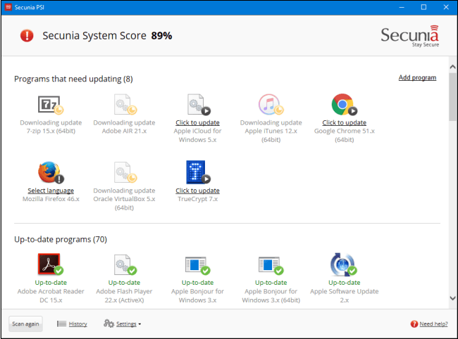

- SUMo: يقوم بنفس عمل الأداة السابقة تقريبا، يمكنك تحميله من هنا
https://www.kcsoftwares.com/?sumo

- Patch My PC Updater: برنامج مشابه لسابقيه يدعم تحديث أكثر من 165 برنامج تلقائيا للتحميل: https://patchmypc.net/download

## 3- التحقق من تحديثات التعريفات

يقوم ويندوز 10 بالتحديث التلقائي للتعريفات أيضا، لكن هناك بعض المهام التي تحتاج للقيام بها، مثل تحديث تعريفات الجرافيك وخاصة إذا كنت تستخدم بطاقة GPU خارجية، قم بالتوجه إلى موقع الشركة المصنعة للبطاقة وتحقق من آخر التحديثات بعد اختيارك لنوع البطاقة التي توجد في جهازك:

- NVIDIA: http://www.nvidia.com/Download/index.aspx?lang=en-us
- AMD: http://support.amd.com/en-us/download
- Intel: https://downloadcenter.intel.com

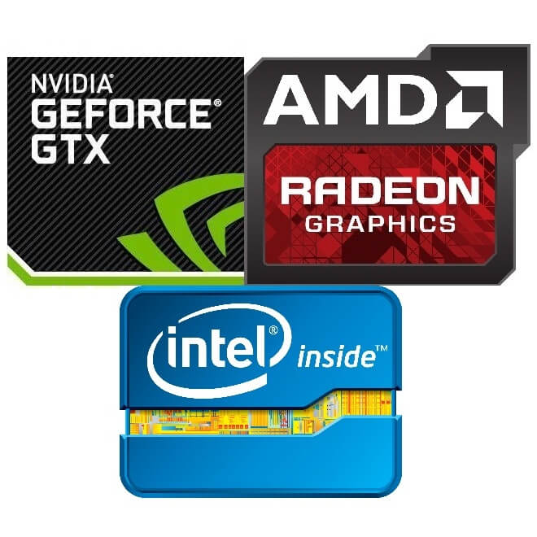

كما يمكنك أيضا الاستعانة ببرامج التحديث التلقائي للتعريفات والتي تؤدي عملها على أتم وجه مثل:
- Driver Booster: برنامج ممتاز لتحديث تعريفات كل مكونات جهازك، تشمل قاعدة بياناته أغلب قطع الهاردوير ونادرا ما يفشل في عملية التحديث.
https://www.iobit.com/en/driver-booster.php
- DriverPack Solution: البرنامج الشهير لتحديث التعريفات، والذي سبق وطرحت المجلة النسخة الكاملة منه على ال DVD الهدية.
https://drp.su/en

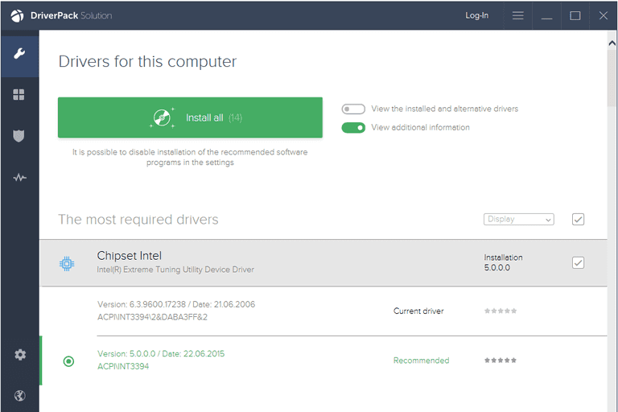

- Snappy Driver Installer: أداة مفتوحة المصدر لتحديث التعريفات بطريقة بسيطة وتدعم جميع إصدارات الويندوز.
https://sdi-tool.org/download

## ثانيا: نظام لينكس

تعد سهولة عملية التحديث احدي نقاط القوة في نظام لينكس، وأيضا سرعة صدور التحديثات فحتي عند اكتشاف ثغرة ما في النظام فإن التحديث لا يتأخر عن 48 ساعة لسد الثغرة لضمان الأمان.
كما أن مستخدم لينكس لا يحتاج إلى تحديث النظام ثم تحديث التعريفات، لأن النظام وجميع البرامج المثبتة وحتى التعريفات يتم تحديثها جميعا بمجرد بدء عملية التحديث. إلا إذا كان المستخدم قد قام بتثبيت بعض البرمجيات من مصادر خارجية لا تنتمي للمستودعات الرسمية، فحينها يجب عليه التوجه للمكان الذي قام بتحميل الحزمة منه والتحقق من وجود إصدار أحدث.

- التحديث من خلال الطرفية Terminal:
تختلف الطريقة من توزيعة لأخري بسبب اختلاف برامج إدارة الحزم التي تستخدمها التوزيعات:
- توزيعة Debian و Ubuntu وما بني عليهما:
`sudo apt-get update && sudo apt-get upgrade`
- توزيعة Fedora ومشتقاتها:
`sudo dnf update`
- توزيعة openSUSE:
`sudo zypper refresh && sudo zypper update`
- توزيعة Archlinux و Manjaro:
`sudo pacman -Syu`

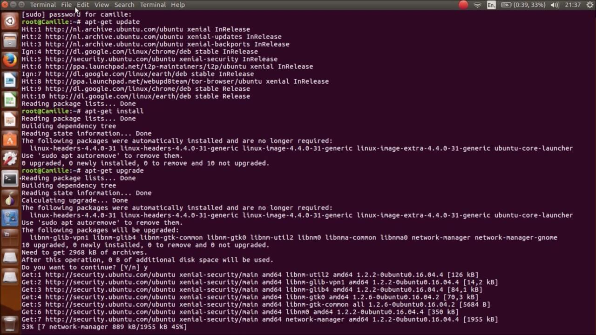

## ثالثا: نظام ماك

عملية التحديث في نظام ماك بسيطة للغاية، فكل ما عليك هو التوجه لمتجر التطبيقات وتثبيت التحديثات المتوفرة.
قم بالدخول إلى الإعدادات ثم القسم App Store، يمكنك التحكم في كيفية التعامل مع التحديثات من هنا، يفضل أن تقوم بتفعيل كل الخيارات المتاحة كما بالصورة.

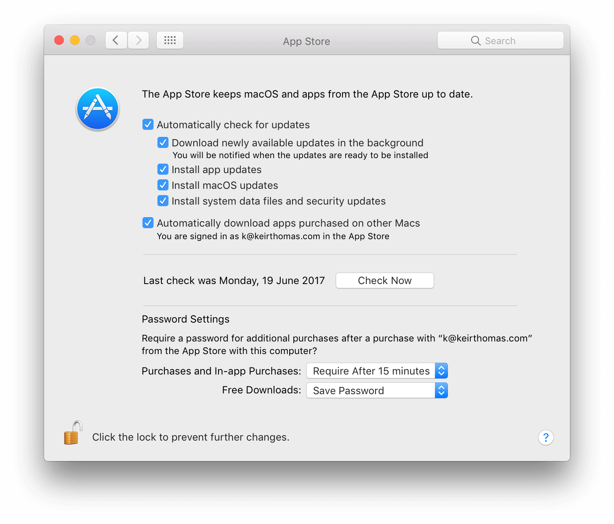

بعد ذلك قم بفتح متجر التطبيقات واختر التبويب Updates، ستجد كل التطبيقات المتاح تحديثها هناك.

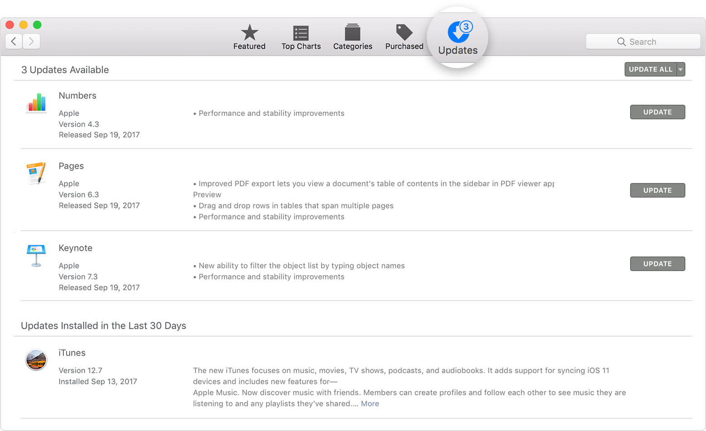

وفى الختام، ربما يتوقف الكثير منا عن القيام بالتحديثات، لأنها عملية متعبة أو للخوف من ظهور مشاكل بعد التحديث، لكن حتى تبقي آمنا من مخاطر الثغرات الأمنية لا بد أن تبقي جهازك محدثا دائما، فالوقاية خير من العلاج.

---

هذا الموضوع نُشر باﻷصل في مجلة لغة العصر العدد 204 شهر 12-2017 ويمكن الإطلاع عليه [هنا](https://drive.google.com/file/d/1xznMVhH7dSIO7XTOnKykG1pSSrQLtWsx/view?usp=sharing).

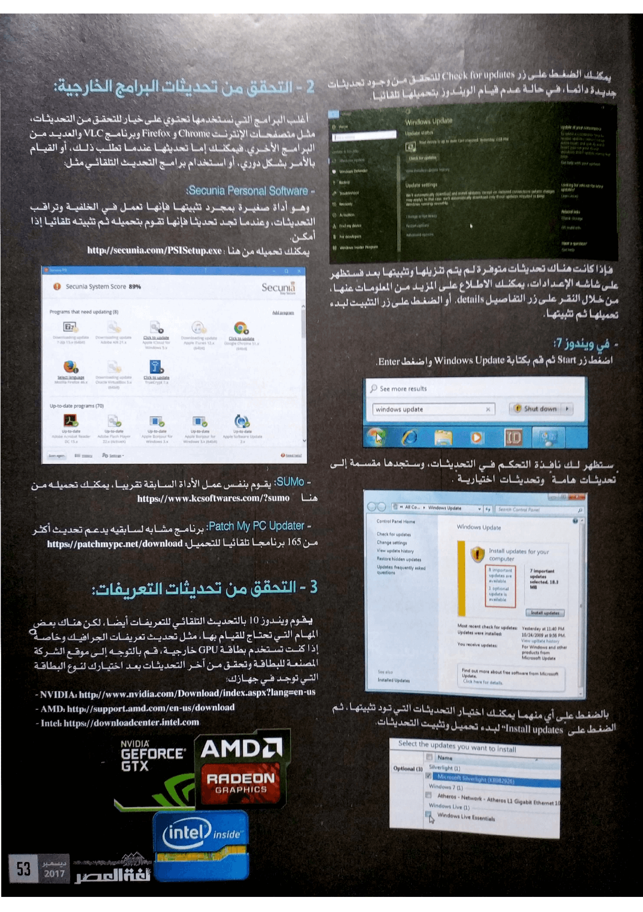

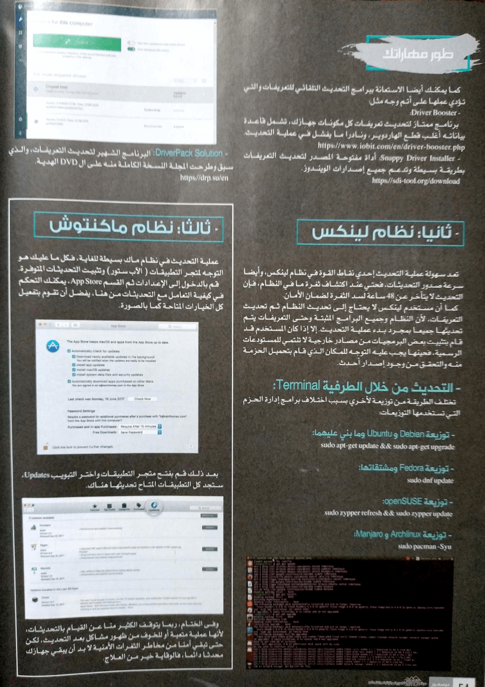
