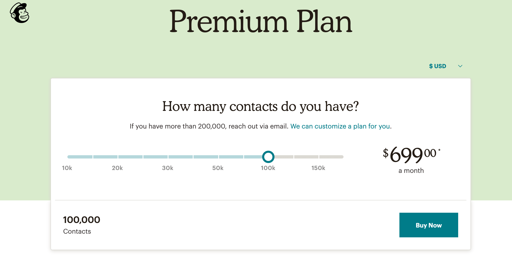
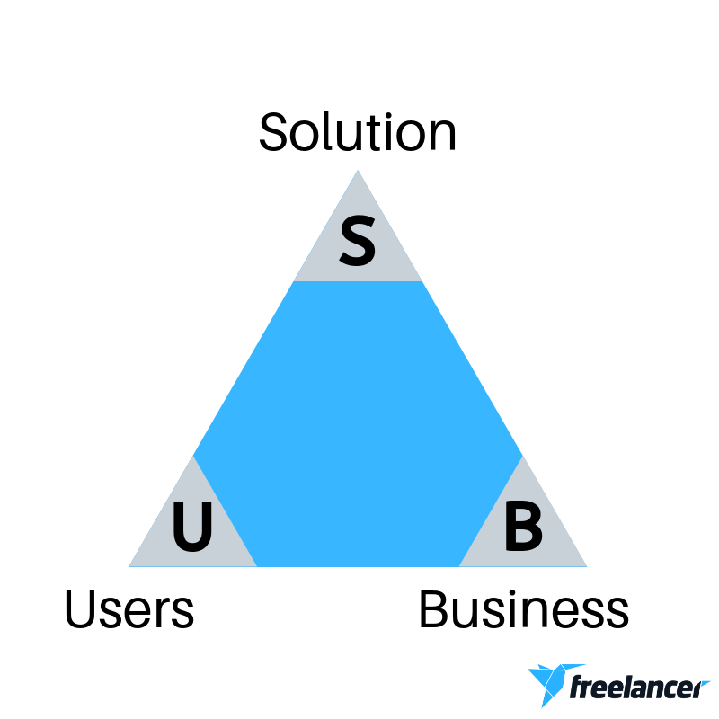
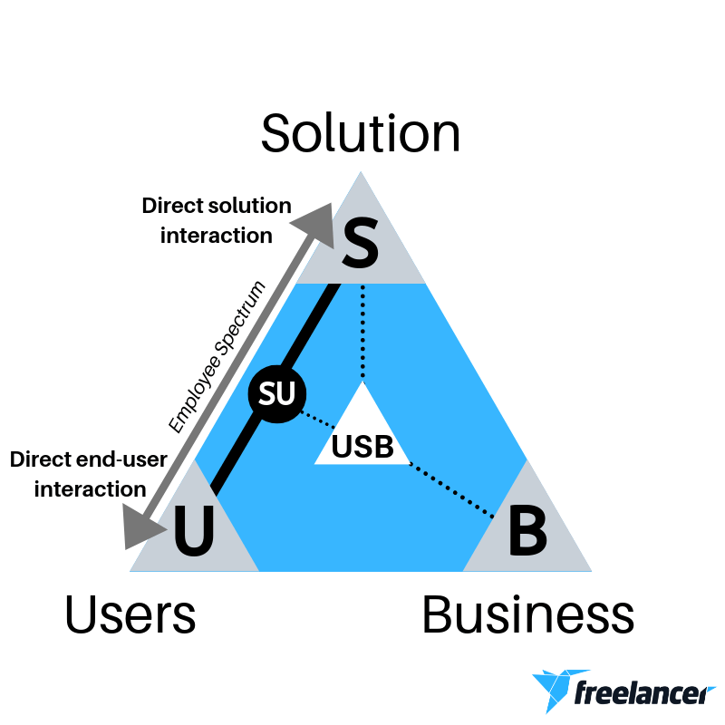
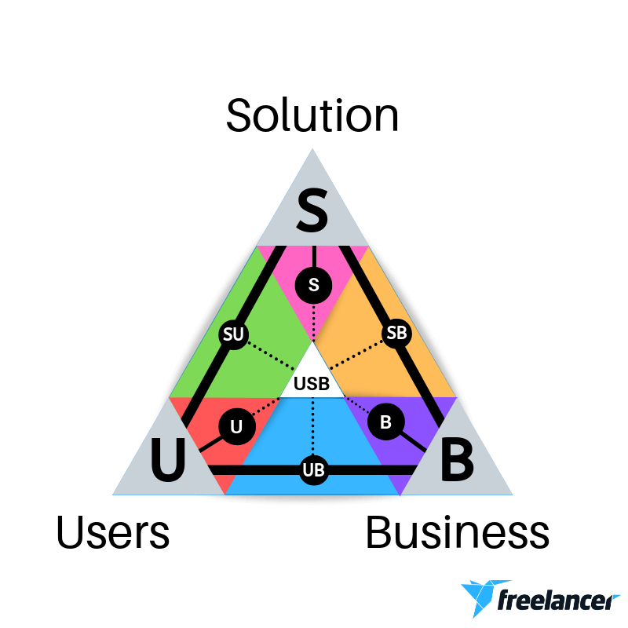
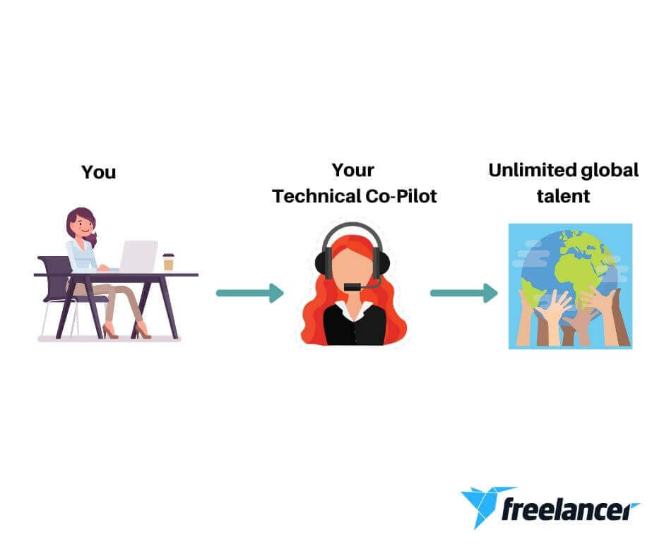
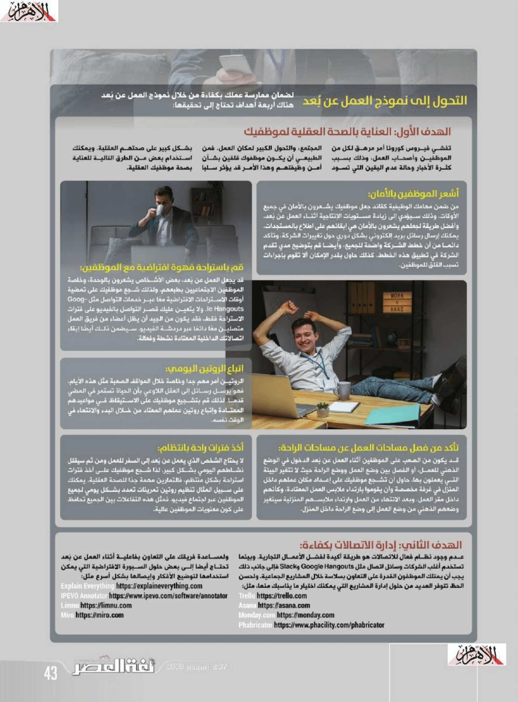
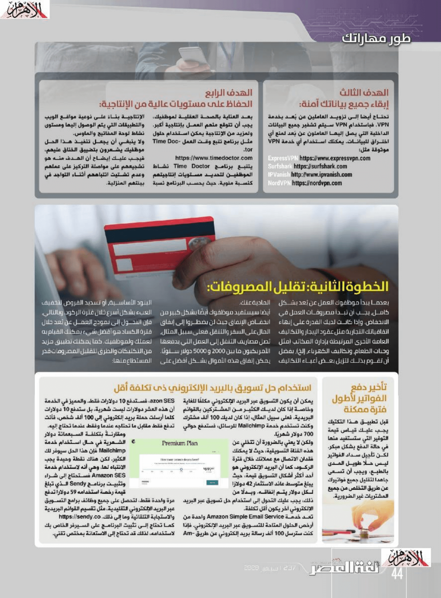
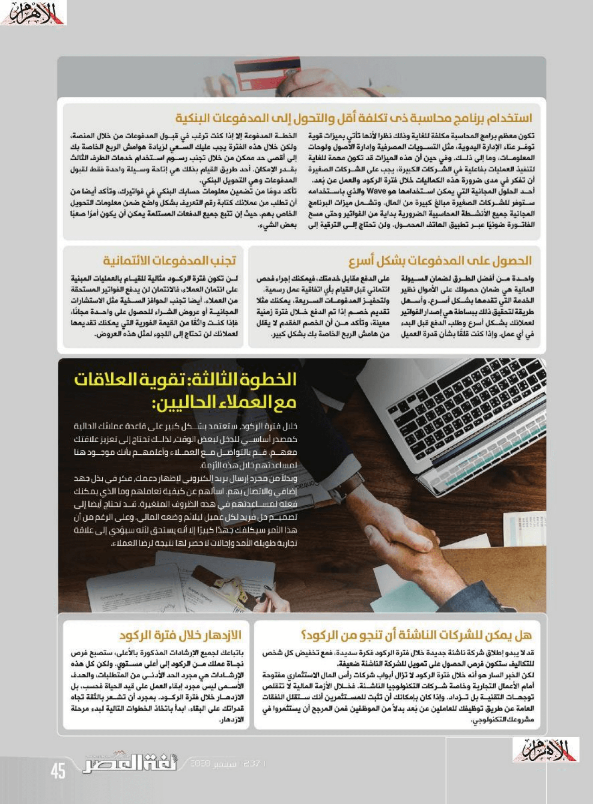
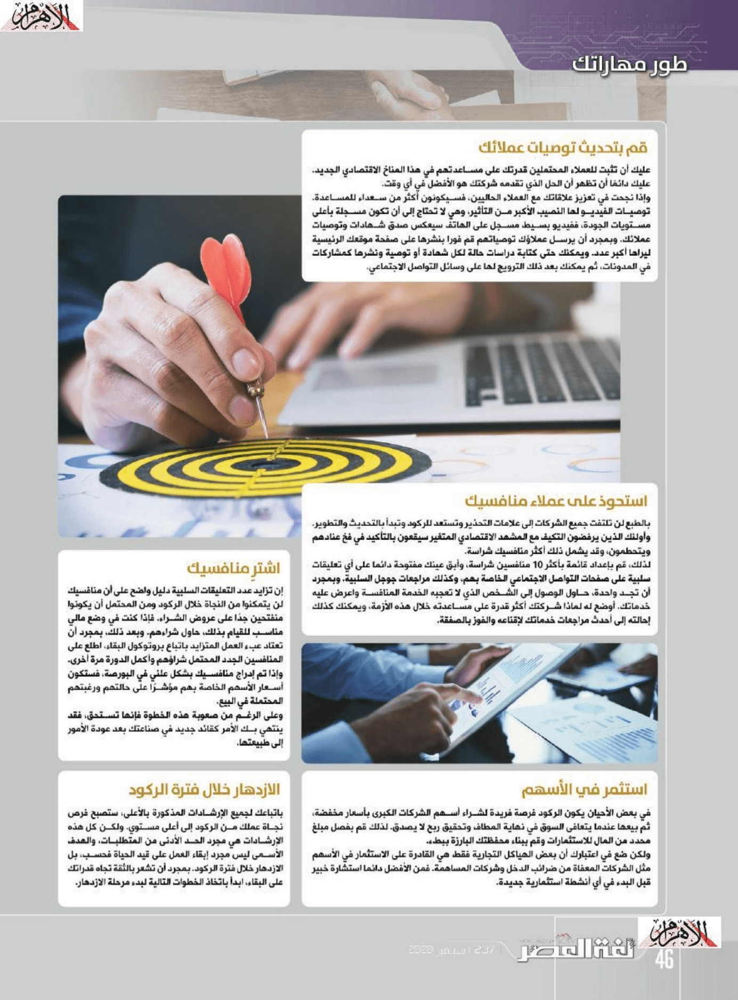
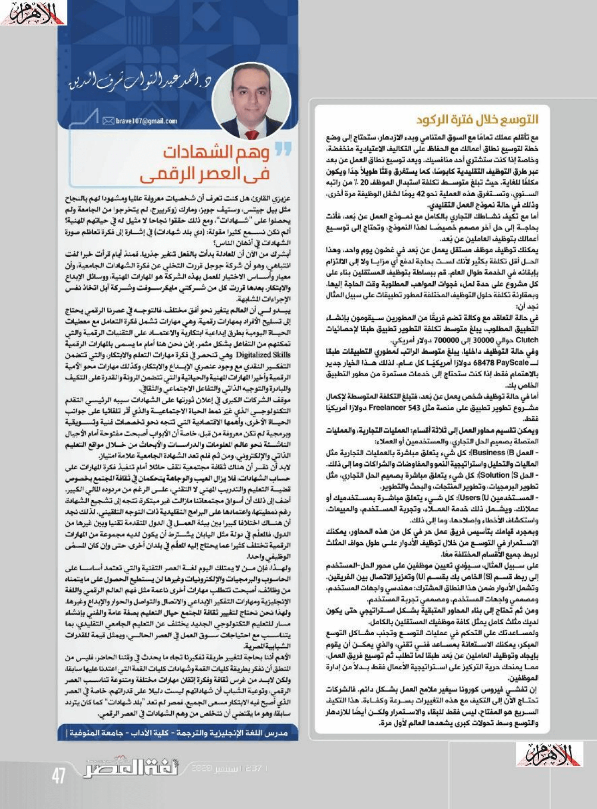

+++
title = "كيف تدير وتنمي أعمالك خلال فترة العمل عن بُعد؟"
date = "2020-09-01"
description = "مع استمرار فيروس كورونا المستجد في الانتشار وإحداث الفوضى في سوق الأسهم والمال وتباطؤ نمو الاقتصادي العالمي، أصبح العمل من المنزل واقعا مفروضا على أغلب الموظفين الذين اعتادوا العمل من مكاتبهم أو مقر أعمالهم. وبالنسبة لأصحاب الأعمال فقد يكون هذا السيناريو مرهقًا للغاية، خاصة وأن الكثيرين من أصحاب الأعمال والموظفين لا يزالون يكافحون للتكيف مع نموذج العمل عن بُعد الذي فرضه فيروس كورونا عليهم. وعلى الرغم من كل الصعوبات التي تلوح في الأفق إلا أنه لم يحن وقت القفز من السفينة للنجاة، بل يجب عليك تعديل الأشرعة وركوب أمواج التطور. نستعرض فيما يلي ثلاث خطوات ضرورية لشركتك للنجاة خلال الوضع الحالي، وكذلك للتوسع والازدهار."
categories = ["مهارات رقمية",]
tags = ["مجلة لغة العصر"]

+++

مع استمرار فيروس كورونا المستجد في الانتشار وإحداث الفوضى في سوق الأسهم والمال وتباطؤ نمو الاقتصادي العالمي، أصبح العمل من المنزل واقعا مفروضا على أغلب الموظفين الذين اعتادوا العمل من مكاتبهم أو مقر أعمالهم. وبالنسبة لأصحاب الأعمال فقد يكون هذا السيناريو مرهقًا للغاية، خاصة وأن الكثيرين من أصحاب الأعمال والموظفين لا يزالون يكافحون للتكيف مع نموذج العمل عن بُعد الذي فرضه فيروس كورونا عليهم. وعلى الرغم من كل الصعوبات التي تلوح في الأفق إلا أنه لم يحن وقت القفز من السفينة للنجاة، بل يجب عليك تعديل الأشرعة وركوب أمواج التطور. نستعرض فيما يلي ثلاث خطوات ضرورية لشركتك للنجاة خلال الوضع الحالي، وكذلك للتوسع والازدهار.

## الخطوة الأولى: الانتقال الناجح إلى نموذج العمل من المنزل

أول شيء تحتاج إلى التركيز عليه في خطة البقاء هو وضع أساس قوي لأعمالك في المستقبل من خلال التحول إلى نموذج العمل عن بُعد بشكل ناجح. فقد كان هذا النموذج للعمل مطروحا لوقت طويل، وتبنته العديد من الشركات العالمية، ولكن بعد تفشي فيروس كورونا أصبح ضرورة حتمية لا مفر منها.

### التحول إلى نموذج العمل عن بُعد

لضمان ممارسة عملك بكفاءة من خلال نموذج العمل عن بُعد هناك أربعة أهداف تحتاج إلى تحقيقها:

-   ​ العناية بالصحة العقلية لموظفيك.
-   ​ إدارة الاتصالات بكفاءة.
-   ​ إبقاء جميع بياناتك آمنة.
-   ​ الحفاظ على مستويات عالية من الإنتاجية.

#### 1- العناية بالصحة العقلية لموظفيك

تفشي فيروس كورونا أمر مرهق لكل من الموظفين وأصحاب العمل، وذلك بسبب كثرة الأخبار وحالة عدم اليقين التي تسود المجتمع، والتحول الكبير لمكان العمل. فمن الطبيعي أن يكون موظفوك قلقين بشأن أمن وظيفتهم وهذا الأمر قد يؤثر سلبا بشكل كبير على صحتهم العقلية. ويمكنك استخدام بعض من الطرق التالية للعناية بصحة موظفيك العقلية.

##### أشعر الموظفين بالأمان

من ضمن مهامك الوظيفية كقائد جعل موظفيك يشعرون بالأمان في جميع الأوقات، وذلك سيؤدي إلى زيادة مستويات الإنتاجية أثناء العمل عن بُعد. وأفضل طريقة لجعلهم يشعرون بالأمان هي إبقائهم على اطلاع بالمستجدات.

يمكنك إرسال رسائل بريد إلكتروني بشكل دوري حول تغييرات الشركة، وتأكد دائما من أن خطط الشركة واضحة للجميع، وأيضا قم بتوضيح مدي تقدم الشركة في تطبيق هذه الخطط. كذلك حاول بقدر الإمكان ألا تقوم بإجراءات تسبب القلق للموظفين.

##### قم باستراحة قهوة افتراضية مع الموظفين

قد يجعل العمل عن بُعد بعض الأشخاص يشعرون بالوحدة، وخاصة الموظفين الاجتماعيين بطبعهم. ولذلك شجع موظفيك على تمضية أوقات الاستراحات الافتراضية معًا عبر خدمات التواصل مثل Google Hangouts. ولا يتعين عليك قصر التواصل بالفيديو على فترات الاستراحة فقط، فقد يكون من الجيد أن يظل أعضاء من فريق العمل متصلين معًا دائمًا عبر دردشة الفيديو. سيضمن ذلك أيضًا إبقاء اتصالاتك الداخلية المعتادة نشطة وفعالة.

##### تأكد من فصل مساحات العمل عن مساحات الراحة

قد يكون من الصعب على الموظفين أثناء العمل عن بُعد الدخول في الوضع الذهني للعمل، أو الفصل بين وضع العمل ووضع الراحة حيث لا تتغير البيئة التي يعملون بها. حاول أن تشجع موظفيك على إعداد مكان عملهم داخل المنزل في غرفة مخصصة وأن يقوموا بارتداء ملابس العمل المعتادة، وكأنهم داخل مقر العمل، وبعد الانتهاء من العمل وارتداء ملابسهم المنزلية سيتغير وضعهم الذهني من وضع العمل إلى وضع الراحة داخل المنزل.

##### اتباع الروتين اليومي

الروتين أمر مهم جدا وخاصة خلال المواقف الصعبة مثل هذه الأيام، فهو يرسل رسائل إلى العقل اللاوعي بأن الحياة تستمر في المضي قدما. لذلك قم بتشجيع موظفيك على الاستيقاظ في مواعيدهم المعتادة وإتباع روتين عملهم المعتاد من خلال البدء والانتهاء في نفس الوقت.

##### أخذ فترات راحة بانتظام

لا يحتاج الشخص الذي يعمل عن بُعد إلى السفر للعمل ومن ثم سيقلل نشاطهم اليومي بشكل كبير. لذا شجع موظفيك على أخذ فترات استراحة بشكل منتظمة، فالتمارين مهمة جدًا للصحة العقلية. يمكنك على سبيل المثال تنظيم روتين تمرينات تمدد بشكل يومي لجميع الموظفين عبر اجتماع فيديو. فمثل هذه التفاعلات بين جميع من بالعمل تحافظ على كون معنويات الجميع عالية.

#### 2- إدارة الاتصالات بكفاءة

عدم وجود نظام فعال للاتصالات هو طريقة أكيدة لفشل الأعمال التجارية. وبينما تستخدم أغلب الشركات وسائل اتصال مثل Google Hangouts وSlack فإلى جانب ذلك يجب أن يمتلك الموظفون القدرة على التعاون بسلاسة خلال المشاريع الجماعية. ولحسن الحظ تتوفر العديد من حلول إدارة المشاريع التي يمكنك اختيار ما يناسبك منها، مثل:

-   ​ Trello https://trello.com
-   ​ Asana https://asana.com
-   ​ Monday.com https://monday.com
-   ​ Phabricator https://www.phacility.com/phabricator

ولمساعدة فريقك على التعاون بفاعلية أثناء العمل عن بُعد تحتاج أيضا إلى بعض حلول السبورة الافتراضية التي يمكن استخدامها لتوضيح الأفكار وإيصالها بشكل أسرع مثل:

-   ​ Explain Everything https://explaineverything.com
-   ​ IPEVO Annotator https://www.ipevo.com/software/annotator
-   ​ Limnu https://limnu.com
-   ​ Miro https://miro.com

#### 3- إبقاء جميع بياناتك آمنة

تحتاج أيضا إلى تزويد العاملين عن بُعد بخدمة VPN. فباستخدام VPN سيتم تشفير جميع البيانات الداخلية التي يصل إليها العاملون عن بُعد لمنع أي اختراق للبيانات. يمكنك استخدام أي خدمة VPN موثوقة مثل:

-   ​ ExpressVPN https://www.expressvpn.com
-   ​ Surfshark https://surfshark.com
-   ​ IPVanish http://www.ipvanish.com
-   ​ NordVPN https://nordvpn.com

#### 4- الحفاظ على مستويات عالية من الإنتاجية

بعد العناية بالصحة العقلية لموظفيك، يجب أن تتوقع منهم العمل بإنتاجية أكبر. ولمزيد من الإنتاجية يمكن استخدام حلول مثل برنامج تتبع وقت العمل Time Doctor.

[https://www.timedoctor.com](https://www.timedoctor.com/)

يتتبع برنامج Time Doctor نشاط الموظفين لتحديد مستويات إنتاجيتهم كنسبة مئوية. حيث يحسب البرنامج نسبة الإنتاجية بناءً على نوعية مواقع الويب والتطبيقات التي يتم الوصول إليها ومستوى نشاط لوحة المفاتيح والماوس.

ولا ينبغي أن يجعل تنفيذ هذا الحل موظفيك يشعرون بتضييق الخناق عليهم، فيجب عليك إيضاح أن الهدف منه هو تشجيعهم على مواصلة التركيز على عملهم وعدم تشتيت انتباههم أثناء التواجد في بيئتهم المنزلية.

## الخطوة الثانية: تقليل المصروفات

بعدما يبدأ موظفوك العمل عن بُعد بشكل كامل، يجب أن تبدأ مصروفات العمل في الانخفاض. وإذا كانت لديك القدرة على إنهاء اتفاقياتك التجارية مثل عقود الإيجار والتكاليف العامة الأخرى المرتبطة بإدارة المكاتب (مثل وجبات الطعام، وتكاليف الكهرباء، إلخ)، يفضل أن تقوم بذلك لتزيل بعض أعباء التكاليف المادية عنك.

أيضا سيستفيد موظفوك أيضًا بشكل كبير من انخفاض الإنفاق حيث لن يضطروا إلى إنفاق المال على السفر والتنقل. فعلى سبيل المثال، تصل مصاريف التنقل إلى العمل التي يدفعها الأمريكيون ما بين 2000 و5000 دولار سنويًا. يمكن إنفاق هذه الأموال بشكل أفضل على البنود الأساسية، أو تسديد القروض لتخفيف العبء بشكل أسرع خلال فترة الركود. وبالتالي، فإن التحول إلى نموذج العمل عن بُعد خلال فترة الكساد هو أفضل شيء يمكنك القيام به لعملك ولموظفيك. كما يمكنك تطبيق مزيد من التكتيكات والطرق لتقليل المصروفات قدر المستطاع منها:

### تأخير دفع الفواتير لأطول فترة ممكنة

قبل تطبيق هذا التكتيك يجب عليك قياس قيمة التوفير التي ستستفيد منها في حالة الدفع بشكل مبكر. لكن تأجيل سداد الفواتير ليس حلاً طويل المدى بالطبع، ويجب أن تسعى جاهدا لتقليل جميع فواتيرك عن طريق التخلص من جميع المشتريات غير الضرورية.

### استخدام حل تسويق بالبريد الإلكتروني ذو تكلفة أقل

يمكن أن يكون التسويق عبر البريد الإلكتروني مكلفًا للغاية وخاصة إذا كان لديك الكثير من المشتركين بالقوائم البريدية. فعلى سبيل المثال، إذا كان لديك 100 ألف مشترك وكنت تستخدم خدمة Mailchimp للرسائل، فستدفع حوالي 700 دولار شهريًا.

ولكن لا يعني ذلك بالضرورة أن تتخلي عن هذه القناة التسويقية، حيث لا يمكنك فقدان الاتصال مع عملائك خلال فترة الركود، كما أن البريد الإلكتروني هو أحد أكثر أشكال التسويق قيمة، حيث يبلغ متوسط عائد الاستثمار 42 دولارًا لكل دولار يتم إنفاقه. وبدلاً من ذلك، يجب عليك التحول إلى استخدام حل تسويق عبر البريد الإلكتروني آخر يكون أقل تكلفة.

تعد خدمة Amazon Simple Email Service واحدة من أرخص الحلول المتاحة للتسويق عبر البريد الإلكتروني. فإذا كنت سترسل 100 ألف رسالة بريد إلكتروني عن طريق Amazon SES، فستدفع 10 دولارات فقط. والمميز في الخدمة أن هذه العشر دولارات ليست شهرية، بل ستدفع 10 دولارات كلما أرسلت حملة بريد إلكتروني إلى 100 ألف شخص، فأنت تدفع فقط مقابل ما تحتاجه عندما وفقط عندما تحتاج إليه.

ومقارنةً بتكلفة السبعمائة دولار الشهرية في حال استخدام خدمة Mailchimp فإن هذا الحل سيوفر لك الكثير. لكن هناك نقطة وحيدة يجب الانتباه لها، وهي أنه لاستخدام خدمة Amazon SES فستحتاج إلى شراء وتثبيت برنامج Sendy الذي تبلغ قيمة رخصة استخدامه 59 دولارا تدفع مرة واحدة فقط، لتحصل على جميع وظائف برامج التسويق عبر البريد الإلكتروني التقليدية، مثل تقسيم القوائم البريدية والاستجابة التلقائية وما إلى ذلك. [https://sendy.co](https://sendy.co/)

كما تحتاج إلى تثبيت البرنامج على السيرفر الخاص بك لاستخدامه، لذلك قد تحتاج إلى الاستعانة بمختص تقني.

### استخدام برنامج محاسبة ذو تكلفة أقل والتحول إلى المدفوعات البنكية

تكون معظم برامج المحاسبة مكلفة للغاية وذلك نظرا لأنها تأتي بميزات قوية توفر عناء الإدارة اليدوية، مثل التسويات المصرفية وإدارة الأصول ولوحات المعلومات وما إلى ذلك. وفي حين أن هذه الميزات قد تكون مهمة للغاية لتنفيذ العمليات بفاعلية في الشركات الكبيرة، يجب على الشركات الصغيرة أن تفكر في مدى ضرورة هذه الكماليات خلال فترة الركود والعمل عن بُعد.

أحد الحلول المجانية التي يمكن استخدامها هو Wave والذي باستخدامه ستوفر للشركات الصغيرة مبالغ كبيرة من المال. وتشمل ميزات البرنامج المجانية جميع الأنشطة المحاسبية الضرورية بداية من الفواتير وحتى مسح الفاتورة ضوئيا عبر تطبيق الهاتف المحمول. ولن تحتاج إلى الترقية إلى الخطة المدفوعة إلا إذا كنت ترغب في قبول المدفوعات من خلال المنصة، ولكن خلال هذه الفترة يجب عليك السعي لزيادة هوامش الربح الخاصة بك إلى أقصى حد ممكن من خلال تجنب رسوم استخدام خدمات الطرف الثالث بقدر الإمكان. أحد طريق القيام بذلك هي إتاحة وسيلة واحدة فقط لقبول المدفوعات وهي التحويل البنكي.

تأكد دوما من تضمين معلومات حسابك البنكي في فواتيرك، وتأكد أيضا من أن تطلب من عملائك كتابة رقم التعريف بشكل واضح ضمن معلومات التحويل الخاص بهم، حيث إن تتبع جميع الدفعات المستلمة يمكن أن يكون أمرًا صعبًا بعض الشيء

### الحصول على المدفوعات بشكل أسرع

واحدة من أفضل الطرق لضمان السيولة المالية هي ضمان حصولك على الأموال نظير الخدمة التي تقدمها بشكل أسرع. وأسهل طريقة لتحقيق ذلك ببساطة هي إصدار الفواتير لعملائك بشكل أسرع وطلب الدفع قبل البدء في أي عمل. وإذا كنت قلقًا بشأن قدرة العميل على الدفع مقابل خدمتك، فيمكنك إجراء فحص ائتماني قبل القيام بأي اتفاقية عمل رسمية.

ولتحفيز المدفوعات السريعة، يمكنك مثلا تقديم خصم إذا تم الدفع خلال فترة زمنية معينة، وتأكد من أن الخصم المُقدم لا يقلل من هامش الربح الخاصة بك بشكل كبير.

### تجنب المدفوعات الائتمانية

لن تكون فترة الركود مثالية للقيام بالعمليات المبنية على ائتمان العملاء، فالائتمان لن يدفع الفواتير المستحقة من العملاء. أيضا تجنب الحوافز السخية مثل الاستشارات المجانية أو عروض الشراء للحصول على واحدة مجانًا، فإذا كنت واثقًا من القيمة الفورية التي يمكنك تقديمها لعملائك لن تحتاج إلى اللجوء لمثل هذه العروض.

## الخطوة الثالثة: تقوية العلاقات مع العملاء الحاليين

خلال فترة الركود، ستعتمد بشكل كبير على قاعدة عملائك الحالية كمصدر أساسي للدخل لبعض الوقت، لذلك تحتاج إلى تعزيز علاقتك معهم. قم بالتواصل مع العملاء وأعلمهم بأنك موجود هنا لمساعدتهم خلال هذه الأزمة.

وبدلاً من مجرد إرسال بريد إلكتروني لإظهار دعمك، فكر في بذل جهد إضافي والاتصال بهم. اسألهم عن كيفية تعاملهم وما الذي يمكنك فعله لمساعدتهم في هذه الظروف المتغيرة. قد تحتاج أيضا إلى تصميم حل فريد لكل عميل ليلائم وضعه المالي. وعلى الرغم من أن هذا الأمر سيكلفك جهدا كبيرا إلا أنه يستحق لأنه سيؤدي إلى علاقة تجارية طويلة الأمد وإحالات لا حصر لها نتيجة لرضا العملاء.

### هل يمكن للشركات الناشئة أن تنجو من الركود؟

قد لا يبدو إطلاق شركة ناشئة جديدة خلال فترة الركود فكرة سديدة، فمع تخفيض كل شخص للتكاليف ستكون فرص الحصول على تمويل للشركة الناشئة ضعيفة.

لكن الخبر السار هو أنه خلال فترة الركود لا تزال أبواب شركات رأس المال الاستثماري مفتوحة أمام الأعمال التجارية وخاصة شركات التكنولوجيا الناشئة. فخلال الأزمة المالية لا تتقلص توجهات التقنية بل تزداد. وإذا كان بإمكانك أن تثبت للمستثمرين أنك ستقلل النفقات العامة عن طريق توظيفك للعاملين عن بُعد بدلاً من الموظفين فمن المرجح أن يستثمروا في مشروعك التكنولوجي.

### الازدهار خلال فترة الركود

بإتباعك لجميع الإرشادات المذكورة بالأعلى، ستصبح فرص نجاة عملك من الركود إلى أعلى مستوي. ولكن كل هذه الإرشادات هي مجرد الحد الأدنى من المتطلبات، والهدف الأسمى ليس مجرد إبقاء العمل على قيد الحياة فحسب، بل الازدهار خلال فترة الركود. بمجرد أن تشعر بالثقة تجاه قدراتك على البقاء، ابدأ باتخاذ الخطوات التالية لبدء مرحلة الازدهار.

#### قم بتحديث توصيات عملائك

عليك أن تثبت للعملاء المحتملين قدرتك على مساعدتهم في هذا المناخ الاقتصادي الجديد. عليك دائمًا أن تظهر أن الحل الذي تقدمه شركتك هو الأفضل في أي وقت.

وإذا نجحت في تعزيز علاقاتك مع العملاء الحاليين، فسيكونون أكثر من سعداء للمساعدة. توصيات الفيديو لها النصيب الأكبر من التأثير، وهي لا تحتاج إلى أن تكون مسجلة بأعلى مستويات الجودة، ففيديو بسيط مسجل على الهاتف سيعكس صدق شهادات وتوصيات عملائك. وبمجرد أن يرسل عملاؤك توصياتهم قم فورا بنشرها على صفحة موقعك الرئيسية ليراها أكبر عدد. ويمكنك حتى كتابة دراسات حالة لكل شهادة أو توصية ونشرها كمشاركات في المدونات، ثم يمكنك بعد ذلك الترويج لها على وسائل التواصل الاجتماعي.

#### استحوذ على عملاء منافسيك

بالطبع لن تلتفت جميع الشركات إلى علامات التحذير وتستعد للركود وتبدأ بالتحديث والتطوير. وأولئك الذين يرفضون التكيف مع المشهد الاقتصادي المتغير سيقعون بالتأكيد في فخ عنادهم ويتحطمون، وقد يشمل ذلك أكثر منافسيك شراسة.

لذلك، قم بإعداد قائمة بأكثر 10 منافسين شراسة، وأبق عينك مفتوحا دائما على أي تعليقات سلبية على صفحات التواصل الاجتماعي الخاصة بهم وكذلك مراجعات جوجل السلبية. وبمجرد أن تجد واحدة، حاول الوصول إلى الشخص الذي لا تعجبه الخدمة المنافسة واعرض عليه خدماتك. أوضح له لماذا شركتك أكثر قدرة على مساعدته خلال هذه الأزمة، ويمكنك كذلك إحالته إلى أحدث مراجعات خدماتك لإقناعه والفوز بالصفقة.

#### اشترِ منافسيك

إن تزايد عدد التعليقات السلبية دليل واضح على أن منافسيك لن يتمكنوا من النجاة خلال الركود ومن المحتمل أن يكونوا منفتحين جدًا على عروض الشراء. فإذا كنت في وضع مالي مناسب للقيام بذلك، حاول شرائهم. وبعد ذلك، بمجرد أن تعتاد عبء العمل المتزايد باتباع بروتوكول البقاء، أطلع على المنافسين الجدد المحتمل شرائهم وأكمل الدورة مرة أخرى.

وإذا تم إدراج منافسيك بشكل علني في البورصة، فستكون أسعار الأسهم الخاصة بهم مؤشرًا على حالتهم ورغبتهم المحتملة في البيع.

وعلى الرغم من صعوبة هذه الخطوة فإنها تستحق، فقد ينتهي بك الأمر كقائد جديد في صناعتك بعد عودة الأمور إلى طبيعتها.

#### استثمر في الأسهم

في بعض الأحيان يكون الركود فرصة فريدة لشراء أسهم الشركات الكبرى بأسعار مخفضة، ثم بيعها عندما يتعافى السوق في نهاية المطاف وتحقيق ربح لا يصدق. لذلك قم بفصل مبلغ محدد من المال للاستثمارات وقم ببناء محفظتك البارزة ببطء.

ولكن ضع في اعتبارك أن بعض الهياكل التجارية فقط هي القادرة على الاستثمار في الأسهم مثل الشركات المعفاة من ضرائب الدخل وشركات المساهمة. فمن الأفضل دائما استشارة خبير قبل البدء في أي أنشطة استثمارية جديدة.

### التوسع خلال فترة الركود

مع تأقلم عملك تمامًا مع السوق المتنامي وبدء الازدهار، ستحتاج إلى وضع خطة لتوسيع نطاق أعمالك مع الحفاظ على التكاليف الاعتيادية منخفضة، وخاصة إذا كنت ستشتري أحد منافسيك. ويعد توسيع نطاق العمل عن بعد عبر طرق التوظيف التقليدية كابوسًا، كما يستغرق وقتًا طويلاً جدًا ويكون مكلفًا للغاية. حيث تبلغ متوسط تكلفة استبدال الموظف 20٪ من راتبه السنوي، وتستغرق هذه العملية حوالي 42 يوما لشغل الوظيفة مرة أخرى، وذلك في حالة نموذج العمل التقليدي.

أما مع تكيف نشاطك التجاري بالكامل مع نموذج العمل عن بُعد، فأنت بحاجة إلى حل آخر مصمم خصيصًا لهذا النموذج، وتحتاج إلى توسيع أعمالك بتوظيف العاملين عن بُعد.

يمكنك توظيف موظف مستقل يعمل عن بُعد في غضون يوم واحد، وهذا الحل أقل تكلفة بكثير لأنك لست بحاجة لدفع أي مزايا ولا إلى الالتزام بإبقائه في الخدمة طوال العام. قم ببساطة بتوظيف المستقلين بناء على كل مشروع على حدي لملء فجوات المواهب المطلوبة وقت الحاجة إليها.

وبمقارنة تكلفة حلول التوظيف المختلفة لمطور تطبيقات على سبيل المثال نجد أن:

-   ​ في حالة التعاقد مع وكالة تضم فريقًا من المطورين سيقومون بإنشاء التطبيق المطلوب، يبلغ متوسط تكلفة التطوير تطبيق طبقا لإحصائيات Clutch حوالي 30000 إلى 700000 دولار أمريكي.
-   ​ وفي حالة التوظيف داخليا، يبلغ متوسط الراتب لمطوري التطبيقات طبقا ل PayScale 68478 دولارًا أمريكيًا كل عام. لذلك هذا الخيار جدير بالاهتمام فقط إذا كنت ستحتاج إلى خدمات مستمرة من مطور التطبيق الخاص بك.
-   ​ أما في حالة توظيف شخص يعمل عن بُعد، فتبلغ التكلفة المتوسطة لإكمال مشروع تطوير تطبيق على منصة مثل Freelancer 543 دولارًا أمريكيًا فقط.

ويمكن تقسيم محاور العمل إلى ثلاثة أقسام: العمليات التجارية، والعمليات المتصلة بصميم الحل التجاري، والمستخدمين أو العملاء:

-   العمل Business (B): كل شيء يتعلق مباشرة بالعمليات التجارية مثل الماليات والتحليل واستراتيجية النمو والمفاوضات والشراكات وما إلى ذلك.

-   الحل Solution (S): كل شيء يتعلق مباشرة بصميم الحل التجاري، مثل تطوير البرمجيات، وتطوير المنتجات، والبحث والتطوير.

-   المستخدمين Users (U): كل شيء يتعلق مباشرة بمستخدميك أو عملائك. ويشمل ذلك خدمة العملاء، وتجربة المستخدم، والمبيعات، واستكشاف الأخطاء وإصلاحها، وما إلى ذلك.

وبمجرد قيامك بتأسيس فريق عمل حر في كل من هذه المحاور، يمكنك الاستمرار في التوسع من خلال توظيف الأدوار على طول حواف المثلث لربط جميع الأقسام المختلفة معًا.

على سبيل المثال، سيؤدي تعيين موظفين على محور الحل-المستخدم إلى ربط قسم (S) الخاص بك بقسم (U) وتعزيز الاتصال بين الفريقين. وتشمل الأدوار ضمن هذا النطاق المشترك: مهندسي واجهات المستخدم، ومصممي واجهات المستخدم، ومصممي تجربة المستخدم.

ومن ثم تحتاج إلى بناء المحاور المتبقية بشكل استراتيجي حتى يكون لديك مثلث كامل يمثل كافة موظفيك المستقلين بالكامل.

ولمساعدتك على التحكم في عمليات التوسع وتجنب مشاكل التوسع المبكر، يمكنك الاستعانة بمساعد فني تقني، والذي يمكن أن يقوم بإيجاد وتوظيف العاملين عن بُعد طبقا لما تطلب ثم توسيع فريق العمل، مما يمنحك حرية التركيز على استراتيجية الأعمال فقط بدلاً من إدارة الموظفين.

## ختام

إن تفشي الفيروس التاجي سيغير ملامح العمل بشكل دائم. فالشركات تحتاج الآن إلى التكيف مع هذه التغييرات بسرعة وكفاءة. هذا الكتيف السريع هو المفتاح، ليس فقط للبقاء والاستمرار ولكن أيضًا للازدهار والتوسع وسط تحولات كبرى يشهدها العالم لأول مرة.

---

هذا الموضوع نُشر باﻷصل في مجلة لغة العصر العدد 237 شهر 09-2020 ويمكن الإطلاع عليه [هنا](https://drive.google.com/file/d/10tpjJH9UwTpuxQ8nMAAQL2JYKltr0RIh/view?usp=sharing).

