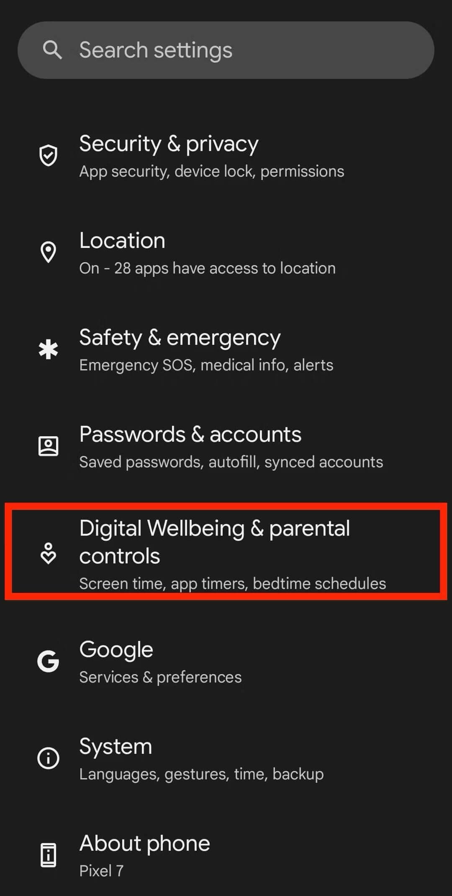
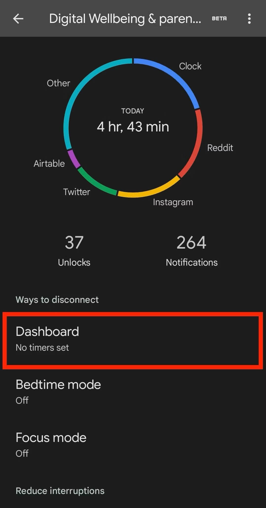
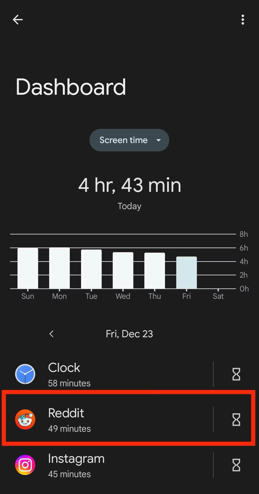
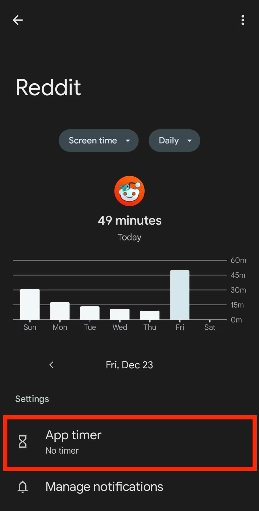
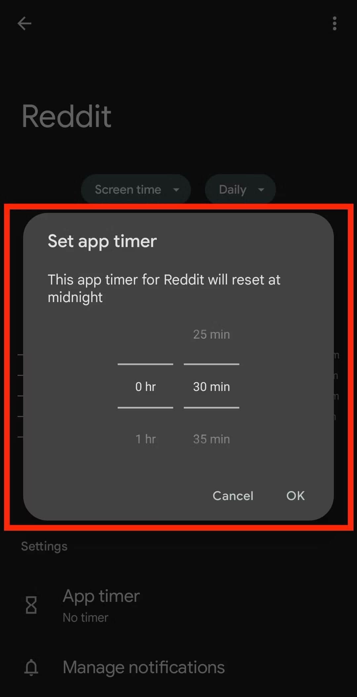
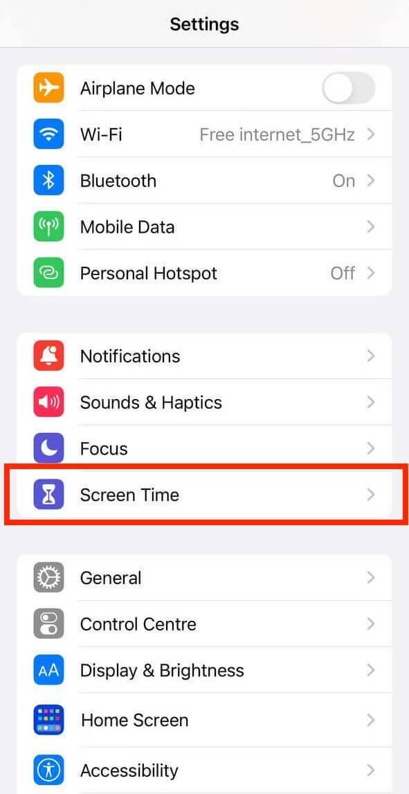
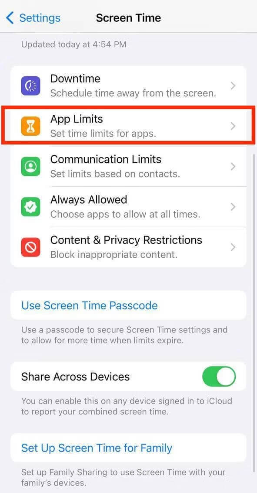
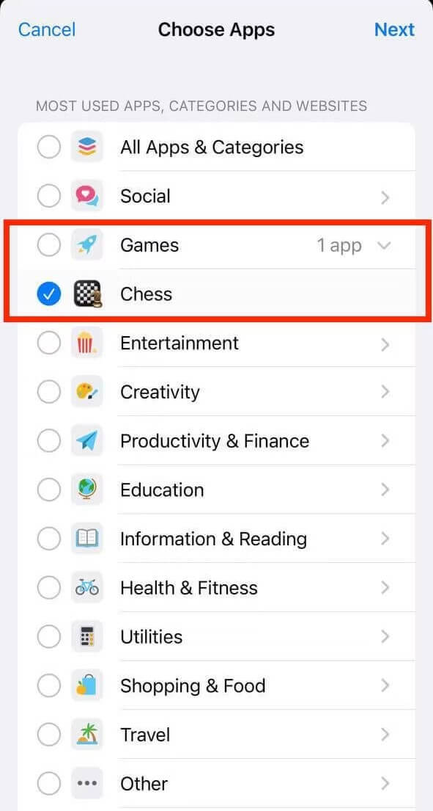
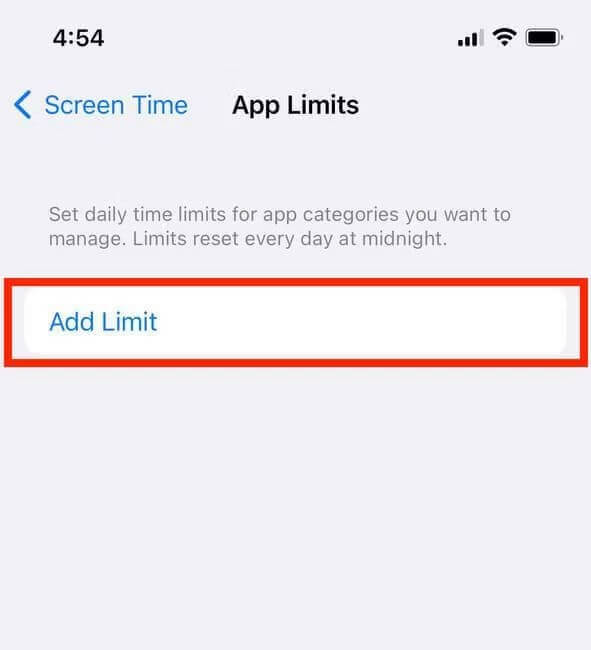
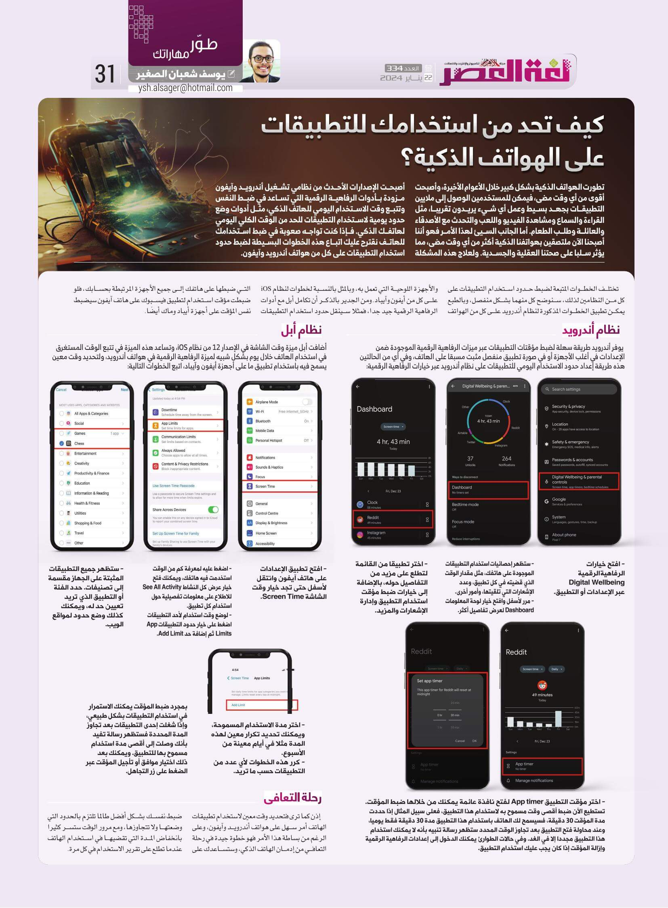

+++
title = "كيف تحد من استخدامك للتطبيقات على الهواتف الذكية؟"
date = "2024-01-22"
description = "تطورت الهواتف الذكية بشكل كبير خلال الأعوام الأخيرة وأصبحت أقوى من أي وقت مضى، فيمكن للمستخدمين الوصول إلى ملايين التطبيقات بجهد بسيط وعمل أي شيء يريدون تقريبًا، مثل القراءة والسماع ومشاهدة الفيديو واللعب والتحدث مع الأصدقاء والعائلة وطلب الطعام. أما الجانب السيئ لهذا الأمر فهو أننا أصبحنا الآن ملتصقين بهواتفنا الذكية أكثر من أي وقت مضى، مما يؤثر سلبًا على صحتنا العقلية والجسدية. ولعلاج هذه المشكلة أصبحت الإصدارات الأحدث من نظامي تشغيل أندرويد وأيفون مزودة بأدوات الرفاهية الرقمية التي تساعد في ضبط النفس وتتبع وقت الاستخدام اليومي للهاتف الذكي، مثل أدوات وضع حدود يومية لاستخدام التطبيقات للحد من الوقت الكلي اليومي لهاتفك الذكي. فإذا كنت تواجه صعوبة في ضبط استخدامك للهاتف نقترح عليك اتباع هذه الخطوات البسيطة لضبط حدود استخدام التطبيقات على كل من هواتف أندرويد وأيفون."
categories = ["أندرويد", "مهارات رقمية"]
tags = ["مجلة لغة العصر"]

+++

## مقدمة

تطورت الهواتف الذكية بشكل كبير خلال الأعوام الأخيرة وأصبحت أقوى من أي وقت مضى، فيمكن للمستخدمين الوصول إلى ملايين التطبيقات بجهد بسيط وعمل أي شيء يريدون تقريبًا، مثل القراءة والسماع ومشاهدة الفيديو واللعب والتحدث مع الأصدقاء والعائلة وطلب الطعام. أما الجانب السيئ لهذا الأمر فهو أننا أصبحنا الآن ملتصقين بهواتفنا الذكية أكثر من أي وقت مضى، مما يؤثر سلبًا على صحتنا العقلية والجسدية. ولعلاج هذه المشكلة أصبحت الإصدارات الأحدث من نظامي تشغيل أندرويد وأيفون مزودة بأدوات الرفاهية الرقمية التي تساعد في ضبط النفس وتتبع وقت الاستخدام اليومي للهاتف الذكي، مثل أدوات وضع حدود يومية لاستخدام التطبيقات للحد من الوقت الكلي اليومي لهاتفك الذكي. فإذا كنت تواجه صعوبة في ضبط استخدامك للهاتف نقترح عليك اتباع هذه الخطوات البسيطة لضبط حدود استخدام التطبيقات على كل من هواتف أندرويد وأيفون.

تختلف خطوات المتبعة ضبط حدود استخدام التطبيقات على كل من النظامين لذلك سنوضح كل منها بشكل منفصل، وبالطبع يمكن تطبيق الخطوات المذكورة لنظام أندرويد على كل من الهواتف والأجهزة اللوحية التي تعمل به، وبالمثل بالنسبة لخطوات لنظام iOS على كل من أيفون وأيباد. ومن الجدير بالذكر أن تكامل أبل مع أدوات الرفاهية الرقمية جيد جدًا فمثلا سينقل حدود استخدام التطبيقات التي ضبطها على هاتفك إلى جميع الأجهزة المرتبطة بحسابك، فلو ضبطت مؤقت استخدام لتطبيق الفيس بوك على هاتف أيفون سيضبط نفس المؤقت على أجهزة أيباد وماك أيضًا.

## نظام أندرويد

يوفر أندرويد طريقة سهلة لضبط مؤقتات التطبيقات عبر ميزات الرفاهية الرقمية الموجودة ضمن الإعدادات في أغلب الأجهزة أو في صورة تطبيق منفصل مثبت مسبقًا على الهاتف، وفي أي من الحالتين هذه طريقة إعداد حدود الاستخدام اليومي للتطبيقات على نظام أندرويد عبر خيارات الرفاهية الرقمية:

- افتح خيارات الرفاهية الرقمية Digital Wellbeing عبر الإعدادات أو التطبيق.

- ستظهر إحصائيات استخدام التطبيقات الموجودة على هاتفك، مثل مقدار الوقت الذي قضيته في كل تطبيق، وعدد الإشعارات التي تلقيتها، وأمور أخرى.
- مرر لأسفل وافتح خيار لوحة المعلومات Dashboard لعرض تفاصيل أكثر.

- اختر تطبيقًا من القائمة لتطلع على مزيد من التفاصيل حوله بالإضافة إلى خيارات ضبط مؤقت استخدام التطبيق وإدارة الإشعارات والمزيد.

- اختر مؤقت التطبيق App timer لفتح نافذة عائمة يمكنك من خلالها ضبط المؤقت.

تستطيع الآن ضبط أقصى وقت مسموح به لاستخدام هذا التطبيق، فعلى سبيل المثال إذا حددت مدة المؤقت 30 دقيقة، فسيسمح لك الهاتف باستخدام هذا التطبيق مدة 30 دقيقة فقط يوميًا، وعند محاولة فتح التطبيق بعد تجاوز الوقت المحدد ستظهر رسالة تنبيه بأنه لا يمكنك استخدام هذا التطبيق مجددًا إلا في الغد. وفي حالات الطوارئ يمكنك الدخول إلى إعدادات الرفاهية الرقمية وإزالة المؤقت إذا كان يجب عليك استخدام التطبيق.

## نظام أبل

أضافت أبل ميزة وقت الشاشة في الإصدار 12 من نظام iOS، وتساعد هذه الميزة في تتبع الوقت المستغرق في استخدام الهاتف خلال يوم بشكل شبيه لميزة الرفاهية الرقمية في هواتف أندرويد، ولتحديد وقت معين يسمح فيه باستخدام تطبيق ما على أجهزة أيفون وأيباد اتبع الخطوات التالية:

- افتح تطبيق الإعدادات على هاتف أيفون وانتقل لأسفل حتى تجد خيار وقت الشاشة Screen Time.

- اضغط عليه لمعرفة كم من الوقت استخدمت فيه هاتفك، ويمكنك فتح خيار عرض كل النشاط See All Activity للاطلاع على معلومات تفصيلية حول استخدام كل تطبيق.
- لوضع وقت استخدام لأحد التطبيقات اضغط على خيار حدود التطبيقات App Limits ثم إضافة حد Add Limit.

- ستظهر جميع التطبيقات المثبتة على الجهاز مقسمة إلى تصنيفات. حدد الفئة أو التطبيق الذي تريد تعيين حد له، ويمكنك كذلك وضع حدود لمواقع الويب.

- اختر مدة الاستخدام المسموحة، ويمكنك تحديد تكرار معين لهذه المدة مثلا في أيام معينة من الأسبوع.

- كرر هذه الخطوات لأي عدد من التطبيقات حسب ما تريد تريدها.

بمجرد ضبط المؤقت يمكنك الاستمرار في استخدام التطبيقات بشكل طبيعي، وإذا شغلت إحدى التطبيقات بعد تجاوز المدة المحددة فستظهر رسالة تفيد بأنك وصلت إلى أقصى مدة استخدام مسموح بها للتطبيق. ويمكنك بعد ذلك اختيار موافق أو تأجيل المؤقت عبر الضغط على زر التجاهل.

## خاتمة

إذن كما ترى فتحديد وقت معين لاستخدام تطبيقات الهاتف أمر سهل على هواتف أندرويد وأيفون، وعلى الرغم من بساطة هذا الأمر فهو خطوة جيدة في رحلة التعافي من إدمان الهاتف الذكي، وستساعدك على ضبط نفسك بشكل أفضل طالما تلتزم بالحدود التي وضعتها ولا تتجاوزها، ومع مرور الوقت ستسر كثيرًا بانخفاض المدة التي تقضيها في استخدام الهاتف عندما تطلع على تقرير الاستخدام في كل مرة.

---

هذا الموضوع نُشر باﻷصل في مجلة لغة العصر العدد 334 شهر 01-2024 ويمكن الإطلاع عليه [هنا.](https://drive.google.com/file/d/1EC9jw9tW6RN7A9AXJUH-9MMderS13WPK/view?usp=drive_link)

