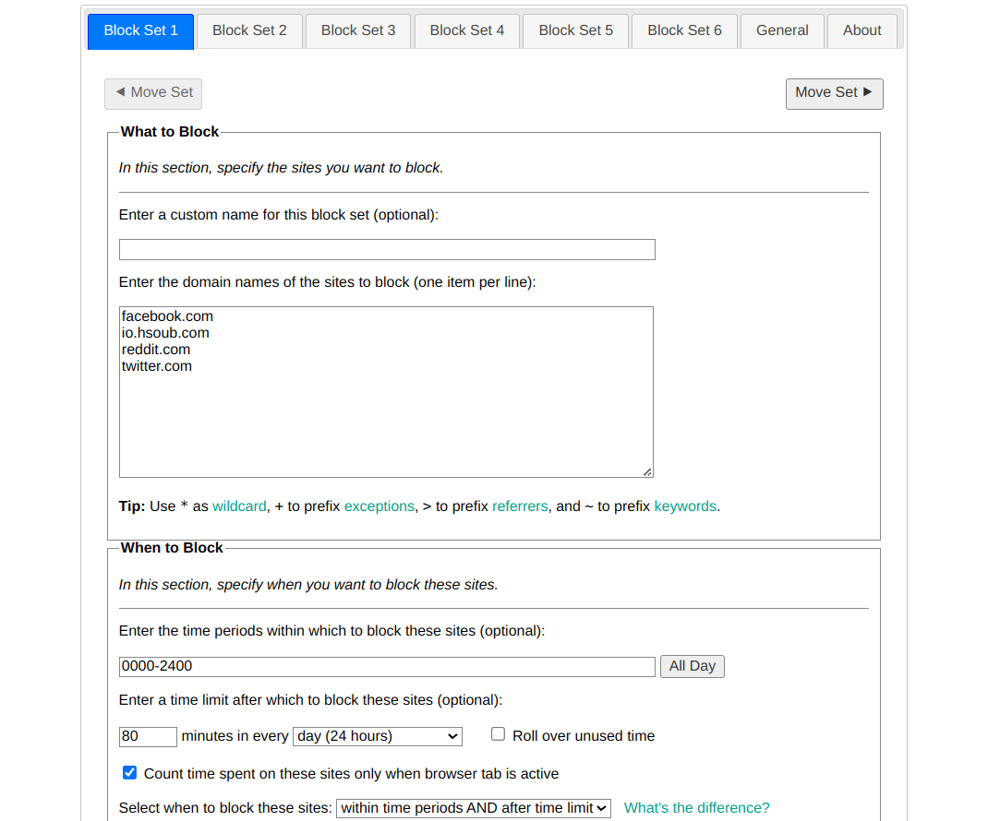
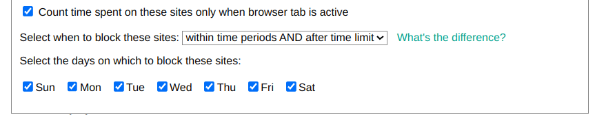
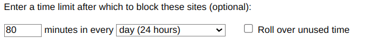
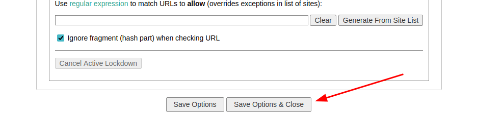
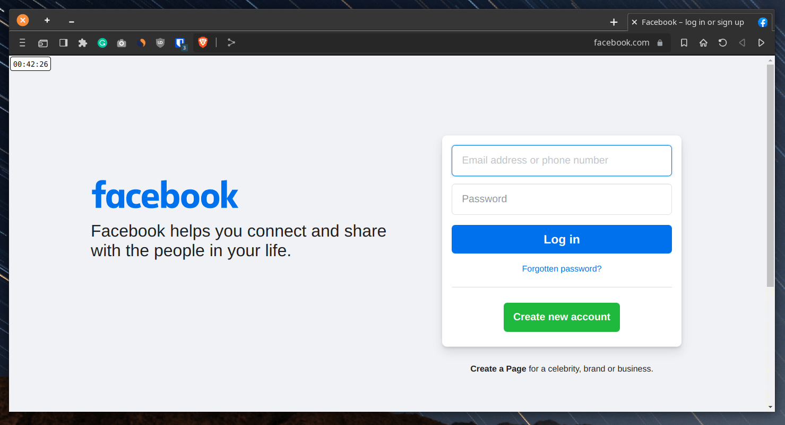
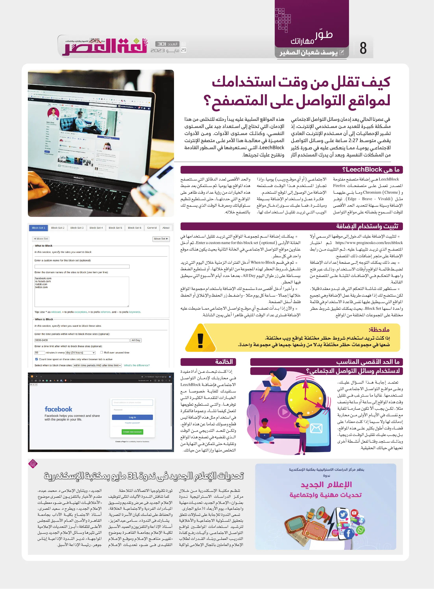

+++
title = "كيف تقلل من وقت استخدامك لمواقع التواصل على المتصفح؟"
date = "2023-05-29"
description = "في عصرنا الحالي يعد إدمان وسائل التواصل الاجتماعي مشكلة كبيرة للعديد من مستخدمي الإنترنت، إذ تشير الإحصائيات إلى أن مستخدم الإنترنت العادي يقضي متوسط 2:27 ساعة على وسائل التواصل الاجتماعي يوميًا، مما ينعكس عليه في صورة كثير من المشكلات النفسية. وبعد أن يدرك المستخدم آثار هذه المواقع السلبية عليه يبدأ رحلته للتخلص من هذا الإدمان، والتي تحتاج إلى استعداد جيد على المستوى النفسي وكذلك مستوى الأدوات. ومن الأدوات المميزة في معالجة هذا الأمر على متصفح الإنترنت LeechBlock، التي نستعرضها في السطور القادمة ونقترح عليك تجربتها."
categories = ["مهارات رقمية"]
tags = ["مجلة لغة العصر"]

+++

## مقدمة

في عصرنا الحالي يعد إدمان وسائل التواصل الاجتماعي مشكلة كبيرة للعديد من مستخدمي الإنترنت، إذ تشير الإحصائيات إلى أن مستخدم الإنترنت العادي يقضي متوسط 2:27 ساعة على وسائل التواصل الاجتماعي يوميًا، مما ينعكس عليه في صورة كثير من المشكلات النفسية. وبعد أن يدرك المستخدم آثار هذه المواقع السلبية عليه يبدأ رحلته للتخلص من هذا الإدمان، والتي تحتاج إلى استعداد جيد على المستوى النفسي وكذلك مستوى الأدوات. ومن الأدوات المميزة في معالجة هذا الأمر على متصفح الإنترنت LeechBlock، التي نستعرضها في السطور القادمة ونقترح عليك تجربتها.

## ما هي LeechBlock؟

LeechBlock هي إضافة متصفح مفتوحة المصدر تعمل على متصفحات Firefox و Chromium (Chrome) وما بني عليهما مثل (Edge - Brave - Vivaldi). توفر الإضافة وسيلة سهلة لتحديد الحد الأقصى للوقت المسموح بقضائه على مواقع التواصل الاجتماعي (أو أي موقع ويب) يوميًا، وإذا تجاوز المستخدم هذا الوقت فستمنعه اﻹضافة من الوصول إلى الموقع المستخدم.

فكرة عمل واستخدام اﻹضافة بسيطة ومباشرة، فما عليك سوى إدخال مواقع الويب التي تريد تقليل استخدامك لها، والحد الأقصى لعدد الدقائق التي ستتصفح هذه المواقع بها يوميًا. ثم ستتمكن بعد ضبط هذه الخيارات من رؤية عداد وقت ظاهر على المواقع التي حددتها، حتى تستطيع تنظيم سلوكياتك ومعرفة الوقت الذي يسمح لك بالتصفح خلاله.

## تثبيت واستخدام اﻹضافة

لتثبيت اﻹضافة عليك الدخول إلى [موقعها الرسمي](https://www.proginosko.com/leechblock) أولا ثم اختيار المتصفح الذي تريد تثبيتها عليه، ثم التثبيت من رابط اﻹضافة على متجر إضافات ذلك المتصفح.

بعد ذلك يمكنك التوجه إلى صفحة إعدادات الإضافة لضبط قائمة المواقع وأوقات الاستخدام، وذلك عبر فتح واجهة التحكم في اﻹضافات المثبتة على المتصفح من القائمة.

ستظهر لك شاشة التحكم التي قد تبدو معقدة قليلا، لكن ستتضح لك إذا فهمت طريقة عمل اﻹضافة وهي تجميع المواقع التي سيطبق عليها نفس قاعدة الاستخدام في قائمة واحدة اسمها Block Set، بحيث يمكنك تطبيق شروط حظر مختلفة على المجموعات المختلفة من المواقع.

يمكنك إضافة اسم لمجموعة المواقع التي تريد تقليل استخدامها في الخانة الأولى Enter a custom name for this block set (optional)، ثم أدخل عناوين مواقع التواصل الاجتماعي في الخانة الثانية بحيث يكون هناك موقع واحد في كل سطر.

ثم في قسم When to Block أدخل الفترات الزمنية خلال اليوم التي تريد تشغيل شروط الحظر لهذه المجموعة من المواقع خلالها، أو تستطيع الضغط ببساطة على زر طوال اليوم All Day، بعدها حدد أيام الأسبوع التي سيطبق فيها الحظر.

وأخيرًا أدخل أقصى مدة ستسمح لك اﻹضافة باستخدام مجموعة المواقع خلالها إجمالًا - ساعة كل يوم مثلا - واضغط زر الحفظ واﻹغلاق أو الحفظ فقط أسفل الصفحة.

والآن إذا بدأت تصفح أي موقع تواصل الاجتماعي مما ضبطت عليه اﻹضافة فسترى عداد الوقت المتبقي ظاهرًا أعلى يمين الشاشة.

**ملاحظة**: إذا كنت تريد استخدام شروط حظر مختلفة لمواقع ويب مختلفة، ضعها في مجموعات حظر مختلفة بدلاً من وضعها جميعًا في مجموعة واحدة.

## ما الحد الأقصى المناسب لاستخدام وسائل التواصل الاجتماعي؟

تعتمد إجابة هذا السؤال عليك، وعلى مواقع التواصل الاجتماعي التي تستخدمها. غالبا ما سترغب في تقليل وقت هذه المواقع إلى ساعة أو ساعة ونصف مثلا، لكن يجب ألاّ تكون صارمًا للغاية مع نفسك في الأيام الأولى من محاربة إدمانك لها ولا سيما إذا كنت معتادًا على قضاء وقت أطول بكثير على هذه المواقع، بل يجب عليك تقليل الوقت تدريجيًا وبذلك ستجد وقتًا لفعل أنشطة أخرى تحبها في حياتك الحقيقية.

## خاتمة

إذا كنت تبحث عن أداة مفيدة في محاربتك لإدمان التواصل الاجتماعي فإضافة LeechBlock ستفيدك للغاية خصوصًا مع الخيارات المتقدمة الكثيرة التي توفرها والتي تستطيع تطويعها لتعمل كيفما تشاء. وعموًما فالفكرة في استخدام مثل هذه اﻹضافة ليس قطع وصولك تمامًا عن هذه المواقع، ولكن للحد التدريجي من الوقت الذي تقضيه في تصفح هذه المواقع وتقليله حتى تتمكن في النهاية من التخلص منها وإزالتها من حياتك.

---

مترجم بتصرف من [هذا الموضوع](https://fosspost.org/limit-social-media-time-browser-addon).

هذا الموضوع نُشر باﻷصل في مجلة لغة العصر العدد 301 شهر 05-2023 ويمكن الإطلاع عليه [هنا](https://drive.google.com/file/d/101lc030xaDDoW4m8j-JaCYXL5KtIM2fn/view?usp=drive_link).

