+++
title = "دليلك الشامل للوقاية من فيروسات الفدية"
date = "2020-03-01"
description = "على الرغم من مرور فترة كبيرة من الوقت على ظهور فيروسات الفدية، إلا أنه لا يوجد حل نهائي لها، وذلك لأنها ليست مجرد فيروس واحد يتم تثبيت مضاد فيروسات للحماية منه وينتهي الأمر، ولأن المخربين يستمرون في إنشاء العديد منها في كل يوم. فمؤخرا تعرضت شركة تحويل الأموال ترافيليكس لهجوم تسبب في إصابة جميع أنظمتها وأدي إلى خسائر مالية جسيمة، كما تعرضت بلدية ويلبروك البلجيكية إلى هجوم نهاية شهر يناير الماضي أدي إلى تعطل عدد من المنشآت. ولذلك كان من الضروري أن نخصص موضوعا مستقلا نتحدث فيه عن فيروس الفدية من جديد، وطرق الوقاية منه بالتفصيل، وكيفية التعامل عند الإصابة به."
categories = ["اﻷمن الرقمي",]
tags = ["مجلة لغة العصر"]

+++
على الرغم من مرور فترة كبيرة من الوقت على ظهور فيروسات الفدية، إلا أنه لا يوجد حل نهائي لها، وذلك لأنها ليست مجرد فيروس واحد يتم تثبيت مضاد فيروسات للحماية منه وينتهي الأمر، ولأن المخربين يستمرون في إنشاء العديد منها في كل يوم. فمؤخرا تعرضت شركة تحويل الأموال ترافيليكس لهجوم تسبب في إصابة جميع أنظمتها وأدي إلى خسائر مالية جسيمة، كما تعرضت بلدية ويلبروك البلجيكية إلى هجوم نهاية شهر يناير الماضي أدي إلى تعطل عدد من المنشآت. ولذلك كان من الضروري أن نخصص موضوعا مستقلا نتحدث فيه عن فيروس الفدية من جديد، وطرق الوقاية منه بالتفصيل، وكيفية التعامل عند الإصابة به.

## فيروسات الفدية

تعرف أيضا باسم فيروسات التشفير أو Ransomware، وهي برمجيات خبيثة تصيب أجهزة الكمبيوتر وتقيد الوصول إليها عن طريق منع المستخدم من الوصول إلى نظام التشغيل أو تشفير جميع البيانات المخزنة على جهازه، ثم تطلب من المستخدم دفع مبلغ محدد من المال كفدية مقابل فك تشفير الملفات أو السماح بالوصول مرة أخرى لنظام التشغيل.

وفي الواقع، فيروسات الفدية ليست بالشيء الجديد، ولكنها لم تكن بهذا الانتشار سابقا. فقد تم تطوير أول فيروس تشفير وطلب الفدية عام 1989 والذي عُرف وقتها باسم PC Cyborg Trojan، وكان هذا الفيروس يقوم بتشفير ملفات الضحية وطلب دفع 189 دولار مقابل الحصول على أداة فك التشفير. وبعد ذلك توالت فيروسات الفدية وأصبحت أكثر شراسة، ففي عام 2013 انتشر فيروس جديد يُسمى CryptoLocker وهذه المرة كان يطلب الدفع عبر عملة البتكوين الرقمية، وتشير التقارير إلى أنه استطاع الحصول على أموال فدية تقدر ب 27 مليون دولار.

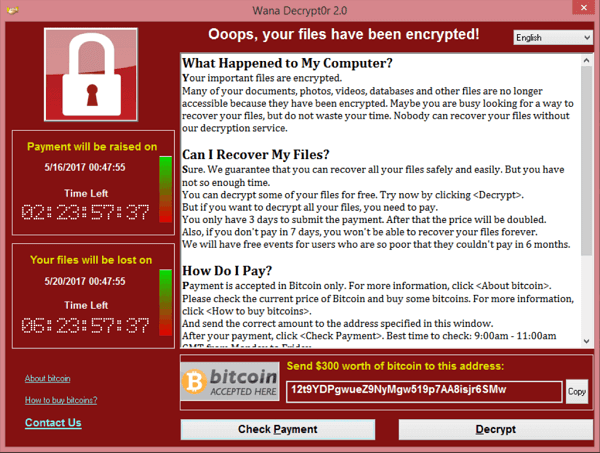

أما في الآونة الأخيرة، فبالتأكيد قد سمعت عن فيروس الفدية الشهير WannaCry الذي أصاب أكثر من 230,000 جهاز في أكثر من 150 دولة حول العالم ليضرب العديد من المؤسسات والشركات الكبرى وطلب من المستخدمين المصابين دفع ما يقابل 300 دولار بعملة البتكوين خلال مدة لا تزيد عن 7 أيام وإلا سيقوم الفيروس بحذف الملفات نهائيا، وكذلك فيروس Petya الذي اتخذ نهجا مختلفا في التشفير ليصيب سجل الإقلاع الرئيسي Master boot record (MBR) حتى يمنع الجهاز من الإقلاع إلى ويندوز من القرص الصلب إلا عند دفع مبلغ الفدية.

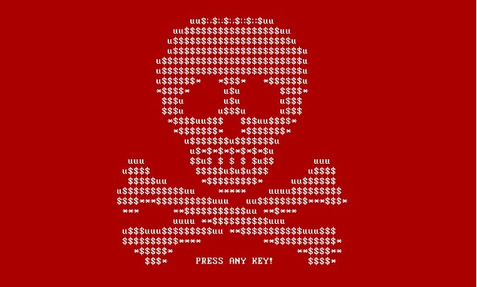

## حماية أجهزتك من فيروس الفدية

كما هو الحال مع أغلب الفيروسات، تعد الإنترنت المصدر الأول لفيروسات الفدية، ولذلك أول ما يجب عليه فعله لحماية جهازك من خطر الإصابة بفيروس الفدية هو تنفيذ تعليمات الأمان الرقمي المعتادة:
 - عدم فتح أي روابط من مصادر غير معروفة سواء على الإيميل أو مواقع التواصل الاجتماعي
 - عدم تحميل البرامج المقرصنة والكراكات وغيرها من الطرق غير رسمية للحصول على البرمجيات.
 - التأكد من تحديث نظام التشغيل لديك إلى أحدث إصدار، ومن تثبيت جميع التحديثات الأمنية المتوفرة.
 - عدم استخدام أنظمة التشغيل منتهية الدعم مثل ويندوز اكس بي أو ويندوز 7.
  ولكن لن تكفي هذه الخطوات حتى مع استخدام مضاد فيروسات احترافي، وذلك لأن فيروسات الفدية يصعب اكتشافها إلى أن تقوم بعملية التشفير فعليا، وبالتالي نحتاج لمزيد من خطوات الحماية.

## النسخ الاحتياطي

وأفضل حل لحماية الأجهزة من فيروسات الفدية هو النسخ الاحتياطي، وبما أن فيروس الفدية يقوم بتشفير كل ما على القرص الصلب، فيجب أن تحتفظ بالنسخة الاحتياطية في مكان آمن معزول عن جهازك مثل خدمات التخزين السحابي أو قرص صلب خارجي.

### النسخ الاحتياطي على قرص خارجي

إذا كان لديك قرص صلب خارجي فيمكنك بكل سهولة الاحتفاظ بنسخة احتياطية من ملفاتك المهمة باستخدام وظيفة النسخ الاحتياطي الموجودة افتراضيا في ويندوز باسم File History أو أجهزة ماك باسم Time Machine. ولكن ستحتاج إلى توصيل القرص بجهازك كل فترة وتشغيل أداة النسخ الاحتياطي للاحتفاظ بأحدث نسخة من ملفاتك الهامة. تتميز هذه الطريقة بأنها سهلة وغير مكلفة وسريعة، ويعيبها الاعتماد على مكان واحد للنسخ الاحتياطي، فإذا حدثت أي مشكلة بالتخزين الخارجي ستخسر جميع ملفاتك.

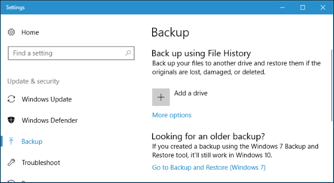

### النسخ الاحتياطي عبر الإنترنت

أما إذا كان همك الأكبر الاحتفاظ بملفاتك آمنة فيمكنك استخدام خدمات النسخ الاحتياطي عبر الإنترنت مثل Backblaze أو Carbonite اللذان يقدمان خدمة النسخ الاحتياطي لملفاتك ابتداء من 6 دولار شهريا، ويوفران برامج للويندوز والماك تقوم بالنسخ الاحتياطي تلقائيا وفي الخلفية. يميز هذه الطريقة ضمان عدم فقدان بياناتك، ولكن يعيبها التكلفة المادية المرتفعة، بالإضافة إلى استغراق عملية النسخ الاحتياطي لوقت طويل وخصوصا إذا كانت سرعة الإنترنت لديك منخفضة.

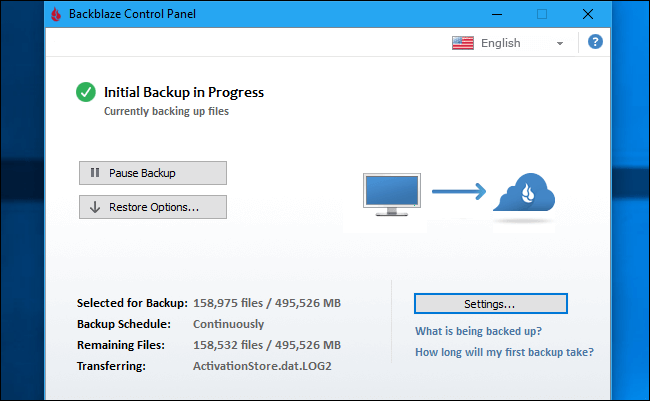

### النسخ الاحتياطي عبر التخزين السحابي

تستطيع استخدام خدمات التخزين السحابي في العديد من الأمور ومن ضمن هذه الأمور النسخ الاحتياطي، وعلى الرغم من اعتراض خبراء النسخ الاحتياطي أن هذه الطريقة ليست الأمثل للقيام بالأمر، إلا أنها تناسب أغلب الأشخاص في كثير من الأحيان. فبدلا من الاحتفاظ بالملفات على جهازك، يمكنك تثبيت أحد خدمات التخزين السحابي مثل Google Drive – Microsoft OneDrive – MEGA – Dropbox ونسخ الملفات إليها من خلال مستعرض الملفات بالطريقة العادية. وبذلك سيتم رفع هذه الملفات إلى حسابك على الخدمة، ويمكنك الوصول إليها من خلال أي جهاز، بل ويمكنك مزامنة الملفات بين مختلف أجهزتك. تجمع هذه الطريقة بين مميزات الطريقتين السابقتين، لكن تكمن مشكلتها في أن أغلب مزودي خدمات التخزين السحابي يقدمون مساحة تخزين صغيرة ومحدودة للخدمة المجانية، ولذلك ستحتاج إلى شراء مساحة تخزين أكبر.

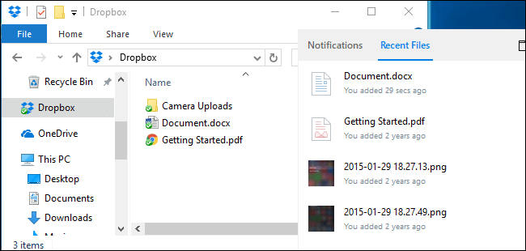

### نسخة احتياطية واحدة لا تكفي!

لضمان بقاء ملفاتك مخزنة بصورة آمنة يُفضل أن تستخدم دائما طريقتين للنسخ الاحتياطي. واحدة تستطيع الوصول إليها بشكل فيزيائي مثل استخدام قرص خارجي، والأخرى تستطيع الوصول إليها من أي مكان مثل التخزين السحابي. وبذلك تكون جمعت بين أفضل طريقتين، فالنسخ الاحتياطي على الإنترنت يُمكنك من الوصول إلى ملفاتك من أي مكان، بينما التخزين الفيزيائي يسمح لك بالوصول إلى ملفاتك بشكل سريع وغير مكلف.

## تفعيل الحماية من فيروسات الفدية في ويندوز 10

يحتوي ويندوز 10 على حماية من فيروسات الفدية مدمجة في مضاد الفيروسات Windows Defender، ولتفعيل هذه الميزة تحتاج إلى الدخول إلى تطبيق الإعدادات ثم قسم Update & Security ثم تبويب Windows Security، ستجد الاختيار Virus & Threat Protection قم بالضغط عليه.

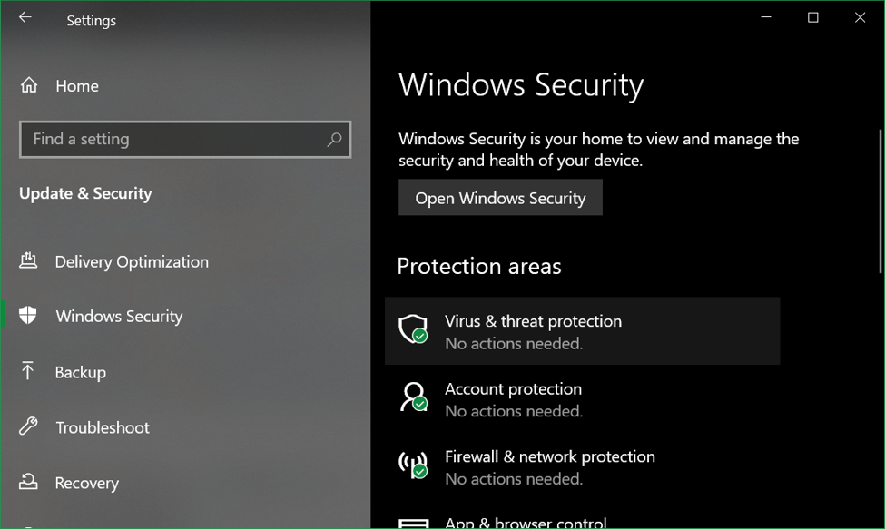

قم بالتمرير إلى أسفل حتى تجد القسم Ransomware Protection ثم اضغط على Manage ransomware protection.

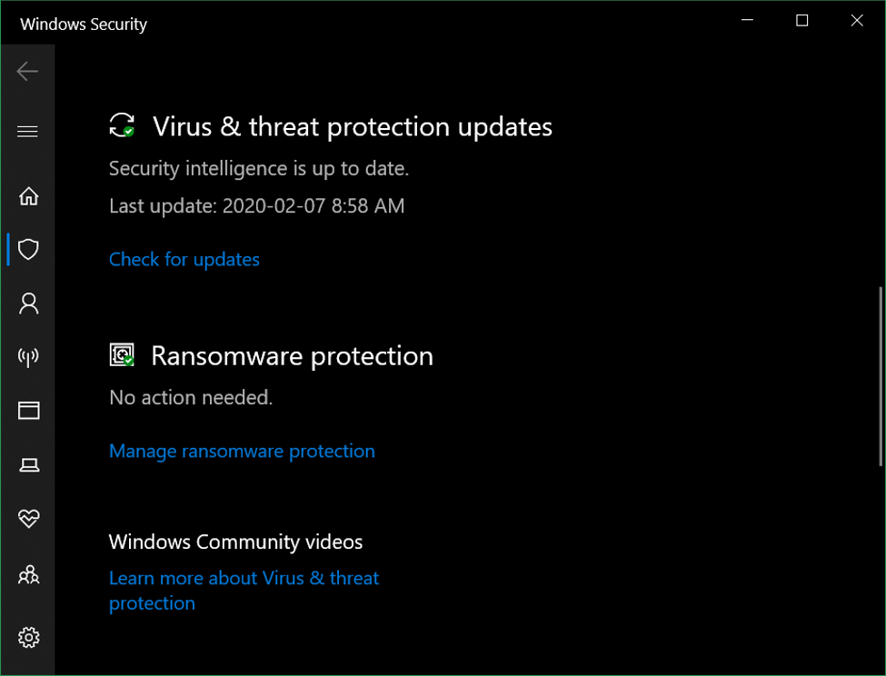

بعد ذلك قم تفعيل Controlled Folder Access. والآن تحتاج إلى إضافة المجلدات التي تريد حمايتها من خلال الاختيار Protected folders، وكذلك يمكنك تحديد التطبيقات والبرامج الموثوقة من خلال الاختيار Allow an app through controlled folder access.
وعند تفعيل هذه الميزة سيقوم الويندوز بمنع التطبيقات غير موثوقة بعمل تغييرات في المجلدات التي قمت بإضافتها. وبذلك تكون طبقة حماية أخرى للحفاظ على ملفاتك آمنة.
## استخدم برامج متخصصة لمكافحة فيروسات الفدية

تتوفر العديد من البرامج التي تحمي جهازك من الإصابة، منها مضادات الفيروسات التقليدية التي تحتوي على ميزات الحماية من فيروسات الفدية، ومنها البرامج المتخصصة في الحماية من فيروسات الفدية فقط.

من هذه البرامج Acronis Ransomware Protection - ZoneAlarm Anti-Ransomware - Malwarebytes Anti-Ransomware، ولعلك تتساءل ما الذي يجعل هذه البرامج مختلفة عن مضاد الفيروسات التقليدي. تختلف الطريقة التي يستخدمها كل نوع من البرامج، فمضاد الفيروسات العادي سيقوم بفحص الملفات والتعرف على الأنماط والتوقيعات للفيروسات التي تطابق الموجودة في قاعدة بياناته، بينما ستقوم البرامج المتخصصة بالتعرف على البرمجيات الخبيثة عن طريق سلوكها مباشرة ومنعها من القيام بتغييرات في جهازك.

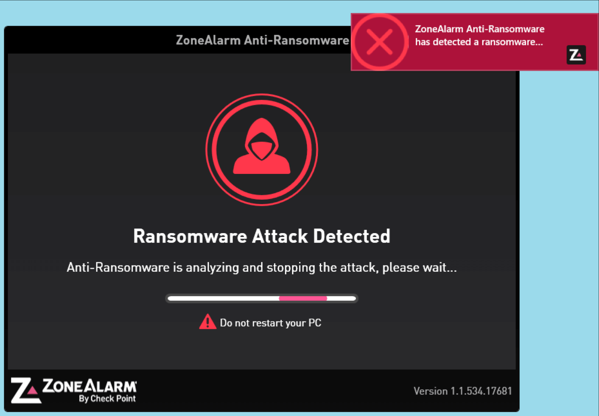

## ماذا تفعل إذا أُصيب جهازك بفيروس الفدية؟

في حالة إصابة جهازك بفيروسات الفدية تصبح أمام خيارين، إما دفع المبلغ المطلوب على أمل أن تسترجع بياناتك المشفرة، أو استعادة بياناتك من النسخة الاحتياطية، وذلك في حالة ما إذا أخذت استعداداك قبل حدوث المشكلة والتعرض للإصابة، أما إذا لم تتخذ إجراءات الوقاية، فستبدأ رحلة البحث عن العلاج، والتي قد تكلل بالنجاح أو تنتهي بالفشل.

وبما أن هذا النوع من الفيروسات مختلف ومتنوع ويستخدم طرق تشفير متنوعة ومتطورة فمن الصعب أن يكون هناك طريقة واحدة لفك التشفير لكل تلك الأنواع، ولذلك تأسست مجموعة من المشاريع وتم تطوير العديد من الأدوات من قبل شركات الحماية المختلفة في محاولة لإنقاذ المستخدمين الضحايا.

### التعرف على نوع فيروس الفدية

يوفر موقع ID Ransomware طريقة سهلة للمستخدمين المصابين للتعرف على نوع فيروس الفدية الذي أصاب أجهزتهم. تحتاج فقط إلى الدخول إلى الموقع عن طريق الرابط https://id-ransomware.malwarehunterteam.com وإرفاق عينة لملف مشفر بالإضافة إلى ملاحظة وتعليمات وعناوين الدفع، وسيقوم الموقع بتحليل الملف ومحاولة التعرف على الفيروس وإبلاغك ما إذا كان هناك طريقة معروفة لفك تشفير ملفاتك أو لا.

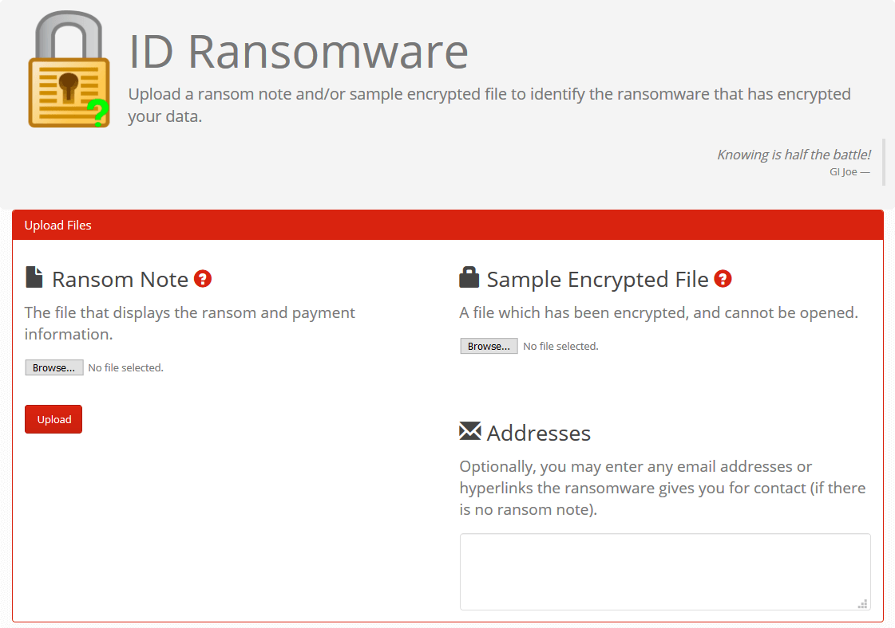

### محاولة فك التشفير

يمكنك محاولة فك تشفير ملفاتك واستعادتها عن طريق الأدوات التالية:

- موقع No More Ransom هو مشروع مشترك بين عدد شركات برامج الحماية مثل McAfee وKaspersky يهدف إلى توفير منصة تساعد المستخدمين على فك تشفير ملفاتهم عن طريق فحصها وتزويدهم بأداة فك التشفير إن وجدت، ويعمل الموقع بطريقة مشابهة للموقع السابق.

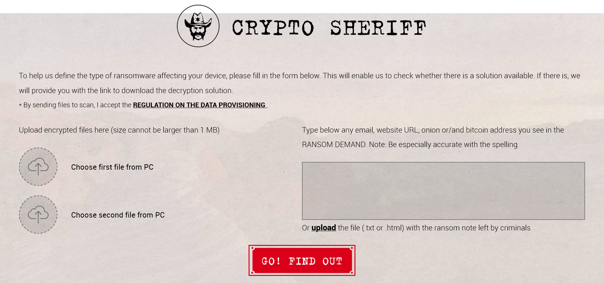

- أداة McAfee Ransomware Recover هي أداة لفك تشفير الملفات المصابة ببعض أنواع فيروس الفدية، الأداة متاحة بشكل مجاني وتعمل على ويندوز 7 أو أحدث. تحتاج الأداة إلى وجود اتصال بالإنترنت لكي تعمل، ويمكنك تحميلها من خلال الرابط التالي https://www.mcafee.com/enterprise/en-in/downloads/free-tools/ransomware-decryption.html
- أيضا توفر شركة الحماية المعروفة Trend Micro أداة Ransomware File Decryptor لفك تشفير أكثر من 25 نوع من فيروسات الفدية. يمكنك التعرف على كيفية استخدام الأداة وتحميلها من هنا https://esupport.trendmicro.com/en-us/home/pages/technical-support/1114221.aspx?cm_mmc=KB1105967-_-Public-_-AllProducts-_-All
- يوفر موقع شركة الحماية Emsisoft مجموعة كبيرة من أدوات فك التشفير يصل عددهم إلى أكثر من 68 أداة. بعد دخولك على الموقع ستجد قائمة بكل الأدوات المتاحة وأنواع الفيروسات التي يمكن فك تشفير الملفات المصابة بها.
https://www.emsisoft.com/ransomware-decryption-tools/free-download

---

هذا الموضوع نُشر باﻷصل في مجلة لغة العصر العدد 231 شهر 03-2020 ويمكن الإطلاع عليه [هنا](https://drive.google.com/file/d/1i9EDdJLUAi-G93XQt3jU7SV1pP78UDvm/view?usp=sharing).

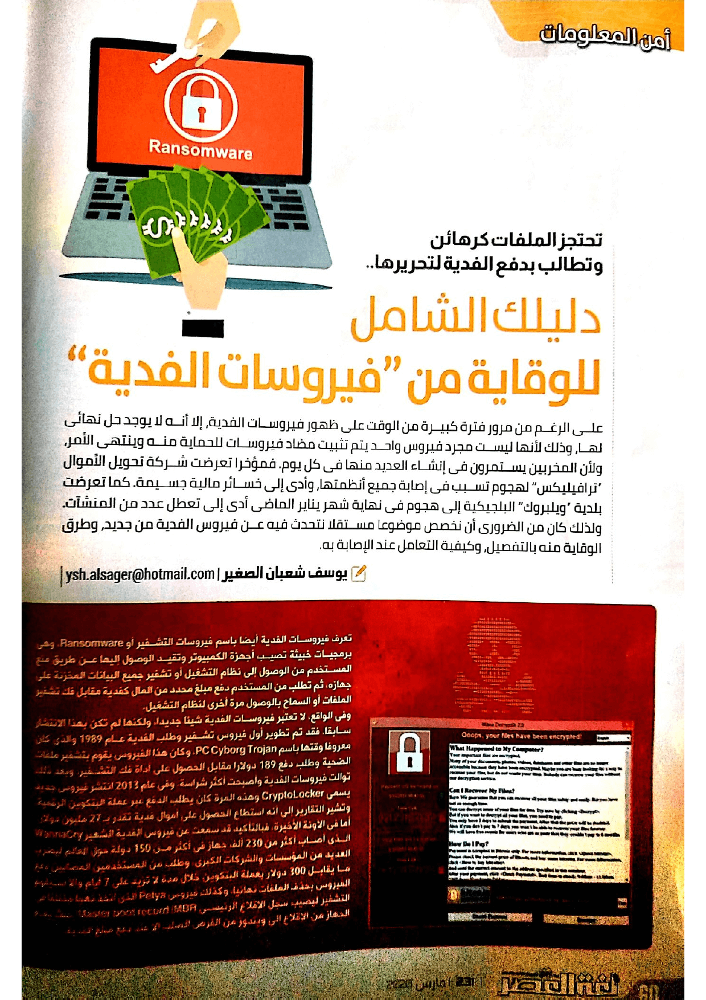

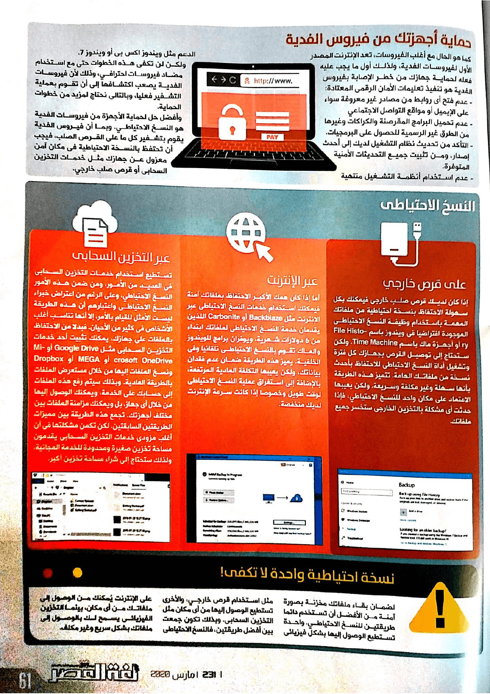

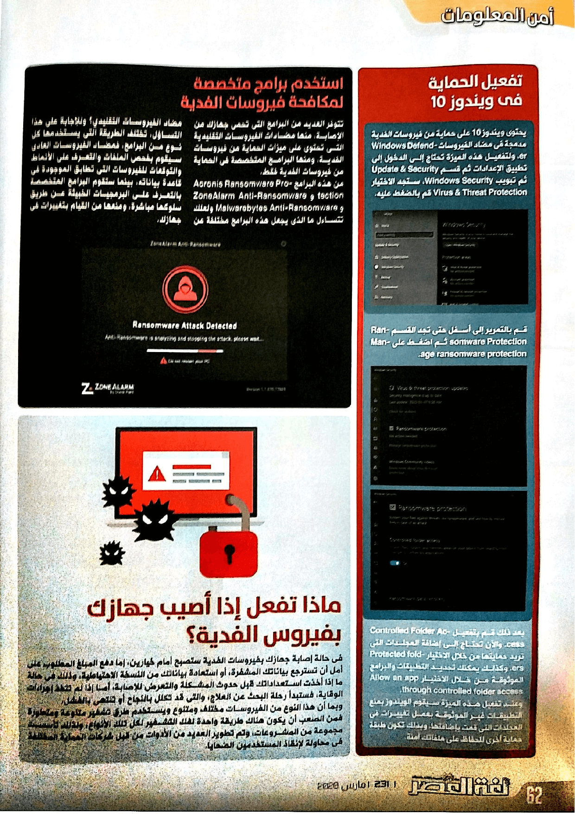

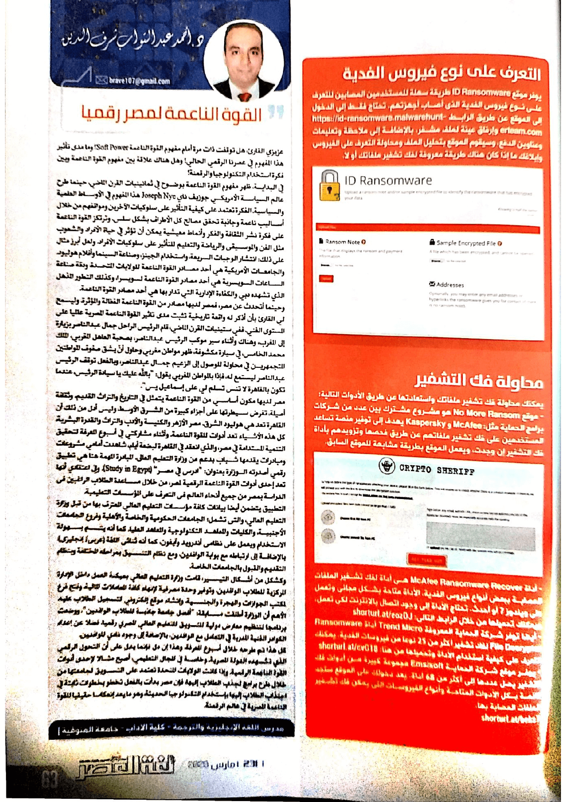
