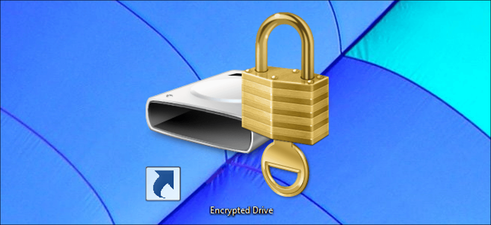
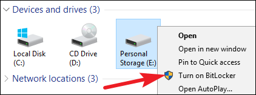
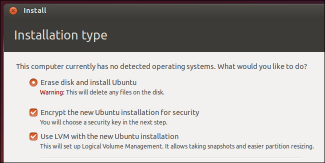
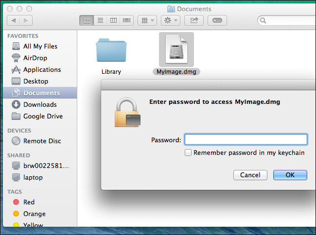
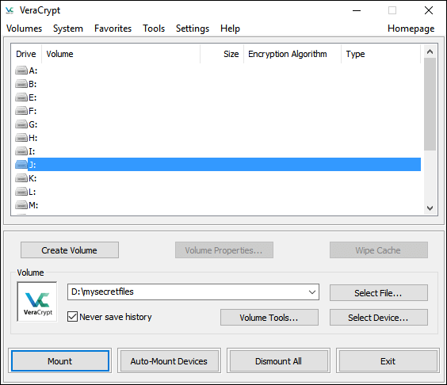
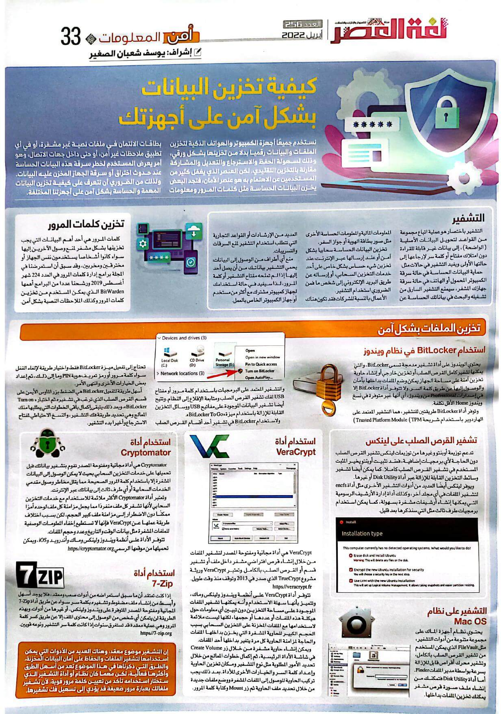

+++
title = "كيفية تخزين البيانات بشكل آمن على أجهزتك"
date = "2022-04-01"
description = "نستخدم جميعا أجهزة الكمبيوتر والهواتف الذكية لتخزين الملفات والبيانات رقميا بدلا من تخزينها بشكل ورقي، وذلك لسهولة الحفظ والاسترجاع والتعديل والمشاركة مقارنة بالتخزين التقليدي. لكن العنصر الذي يغفل كثير من المستخدمين عن الاهتمام به هو عنصر الأمان، فتجد البعض يخزن البيانات الحساسة مثل كلمات المرور ومعلومات بطاقات الائتمان في ملفات نصية غير مشفرة، أو في أي تطبيق ملاحظات غير آمن، أو حتى داخل جهات الاتصال، وهو أمر يعرض المستخدم لخطر سرقة هذه البيانات الحساسة عند حدوث اختراق أو سرقة الجهاز المخزن عليه البيانات. ولذلك من الضروري أن نتعرف على كيفية تخزين البيانات المهمة والحساسة بشكل آمن على أجهزتنا المختلفة."
categories = ["اﻷمن الرقمي"]
tags = ["مجلة لغة العصر"]

+++

## مقدمة

نستخدم جميعا أجهزة الكمبيوتر والهواتف الذكية لتخزين الملفات والبيانات رقميا بدلا من تخزينها بشكل ورقي، وذلك لسهولة الحفظ والاسترجاع والتعديل والمشاركة مقارنة بالتخزين التقليدي. لكن العنصر الذي يغفل كثير من المستخدمين عن الاهتمام به هو عنصر الأمان، فتجد البعض يخزن البيانات الحساسة مثل كلمات المرور ومعلومات بطاقات الائتمان في ملفات نصية غير مشفرة، أو في أي تطبيق ملاحظات غير آمن، أو حتى داخل جهات الاتصال، وهو أمر يعرض المستخدم لخطر سرقة هذه البيانات الحساسة عند حدوث اختراق أو سرقة الجهاز المخزن عليه البيانات. ولذلك من الضروري أن نتعرف على كيفية تخزين البيانات المهمة والحساسة بشكل آمن على أجهزتنا المختلفة.

## التشفير

التشفير باختصار هو عملية اتباع مجموعة من القواعد لتحويل البيانات الأصلية (الواضحة)، إلى بيانات غير قابلة للقراءة دون امتلاك مفتاح أو كلمة سر لإرجاعها إلى حالتها الأولى. ويفيد التشفير في حالات مثل:

- ​	**حماية البيانات الحساسة في حالة سرقة الكمبيوتر المحمول أو الهاتف**: في حالة سرقة جهازك المشفر، سيمنع التشفير السارق من تشغيله والبحث في بياناتك الحساسة عن المعلومات المالية والمعلومات الحساسة الأخرى مثل صور بطاقة الهوية أو جواز السفر.
- ​	**تخزين البيانات الحساسة سحابيا بشكل آمن أو عند إرسالها عبر الإنترنت**: عند تخزين شيء حساس بشكل خاص على أحد خدمات التخزين السحابي، أو إرساله عن طريق البريد الإلكتروني إلى شخص ما فمن الضروري استخدام التشفير.
- ​	**الأعمال**: بالنسبة للشركات فقد تكون هناك العديد من الإرشادات أو القواعد التجارية التي تتطلب استخدام التشفير لمنع السرقات والتسريبات.
- ​	**منع أي أطراف من الوصول إلى البيانات**: يحمي التشفير بياناتك من أن يصل أحد إليها إذا لم تمنحه مفتاح التشفير أو كلمة المرور، لذا سيفيد في حالة استخدامك لجهاز كمبيوتر مشترك مع أكثر من مستخدم أو جهاز الكمبيوتر الخاص بالعمل.

## تخزين كلمات المرور

كلمات المرور هي أحد أهم البيانات التي يجب تخزينها بشكل مشفر لمنع وصول الآخرين إليها سواء كانوا أشخاص يستخدمون نفس الجهاز أو مخترقين ومخربين، وقد سبق أن استعرضنا في المجلة برامج إدارة كلمات المرور في العدد 224 شهر أغسطس 2019 ورشحنا عددا من البرامج أهمها BitWarden الذي يمكن المستخدم من تخزين كلمات المرور وكذلك الملاحظات النصية بشكل آمن.

## تخزين الملفات بشكل آمن

### استخدام BitLocker في نظام ويندوز

يحتوي الويندوز على أداة تشفير مدمجة تسمى BitLocker، والتي يمكنها تشفير كامل القرص الصلب أو تخزين خارجي أو إنشاء حاوية تخزين آمنة على مساحة الجهاز يمكن وضع الملفات بداخلها بأمان والوصول إليها عن طريق كلمة السر. ولا تتوفر أداة BitLocker إلا في إصدارات Professional من ويندوز، أي إنها غير متوفرة في نسخ ويندوز Home الأقل تكلفة.

وتوفر أداة BitLocker طريقتين للتشفير هما التشفير المعتمد على الهاردوير باستخدام شريحة Trusted Platform Module (TPM) والتشفير المعتمد على البرمجيات باستخدام كلمة مرور أو مفتاح USB لفك تشفير القرص الصلب ومتابعة اﻹقلاع إلى النظام. وتتيح أيضا تشفير البيانات الموجودة على مفاتيح USB ووسائل التخزين القابلة للإزالة باستخدام ميزة "BitLocker To Go".

ولاستخدام BitLocker في تشفير أحد أقسام القرص الصلب تحتاج إلى تفعيل ميزة BitLocker فقط واختيار طريقة لإلغاء القفل سواء كلمة مرور أو رمز تعريف هوية PIN وما إلى ذلك، ثم إعداد بعض الخيارات الأخرى وانتهى الأمر.

أسهل طريقة لتفعيل BitLocker هي الضغط بزر الماوس الأيمن على قسم القرص الصلب الذي ترغب في تشفيره ثم اختيار " Turn on BitLocker"، وبعد ذلك يتبقى إكمال باقي الخطوات التي يطلبها منك المعالج وهي تحديد طريقة فك التشفير، والنسخ الاحتياطي لمفتاح الاسترجاع وأخيرا بدء التشفير.

### تشفير القرص الصلب على لينكس

تدعم توزيعة أوبنتو وغيرها من توزيعات لينكس تشفير القرص الصلب دون الحاجة لأي برمجيات الإضافية، فعند تثبيت أوبنتو يخير المثبت المستخدم في تشفير القرص الصلب كاملا. كما يمكن أيضا تشفير وسائط التخزين القابلة للإزالة عبر أداة Disk Utility أو غيرها.

ويوفر لينكس أيضًا العديد من أدوات التشفير الأخرى مثل أداة encfs لتشفير الملفات في أي مجلد آخر، وكذلك أداة إدارة الأرشيف الرسومية التي يمكنها إنشاء أرشيفات مشفرة بسهولة، كما يمكن استخدام برمجيات طرف ثالث مثل التي سنذكرها بعد قليل.

### التشفير على نظام Mac OS

يحتوي نظام أجهزة الماك على مجموعة متنوعة من أدوات التشفير، مثل FileVault الذي يمكن المستخدم من تشفير القرص الصلب بالكامل، وتشفير محرك أقراص قابل للإزالة بسرعة بواسطة مدير الملفات Finder. أما أداة Disk Utility فتمكنك من إنشاء ملف صورة قرص مشفر يمكنك تخزين الملفات بداخلها.

### استخدام أداة VeraCrypt

VeraCrypt هي أداة مجانية ومفتوحة المصدر لتشفير الملفات من خلال إنشاء قرص افتراضي مشفر داخل ملف أو تشفير قسم أو القرص الصلب بالكامل. وتعتبر VeraCrypt وريثة مشروع TrueCrypt الذي صدر في 2013 وتوقف منذ وقت طويل.

[https://veracrypt.fr](https://veracrypt.fr/)

تتوفر أداة VeraCrypt على أنظمة ويندوز ولينكس وماك، وتتميز بأنها سهلة الاستخدام وأنه يمكنها تشفير الملفات الموجودة على مساحة التخزين دون تبيين أي معلومات حول هيكلة هذه الملفات أو عددها أو حجمها، لكنها ليست ملائمة لاستخدامها مع الملفات المخزنة على التخزين السحابي بسبب الحجم الكبير للحاوية المشفرة التي يخزن بداخلها الملفات والحاجة لمزامنة الحاوية كل مرة يتغير بداخلها أحد الملفات.

ويمكن إنشاء حاوية مشفرة من خلال زر Create Volume في شاشة الأداة الرئيسية، ثم إكمال خطوات المعالج من خلال تحديد الأمور المطلوبة مثل نوع التشفير ومكان تخزين الحاوية وإعداد كلمة السر والخيارات الأخرى للأداة. بعد ذلك يجب تركيب الحاوية للوصول إلى الملفات المشفرة ووضع ملفات جديدة من خلال تحديد ملف الحاوية ثم زر Mount وكتابة كلمة المرور.

### استخدام أداة Cryptomator

Cryptomator هي أداة مجانية ومفتوحة المصدر تقوم بتشفير بياناتك قبل تحميلها على خدمات التخزين السحابي بحيث لا يمكن الوصول إلى البيانات المشفرة إلا باستخدام كلمة المرور الصحيحة. مما يقلل مخاطر وصول مقدمي الخدمات السحابية أو أي طرف ثالث إلى بياناتك عبر الإنترنت.

وتعتبر أداة Cryptomator الأكثر ملائمة للاستخدام مع خدمات التخزين السحابي لأنها تشفر كل ملف منفردًا مما يجعل مزامنة كل ملف لوحده أمرًا ممكنًا دون الاضطرار إلى مزامنة ملف كبير الحجم، لكن بسبب اختلاف طريقة عملها عن VeraCrypt فإنها لا تستطيع إخفاء المعلومات الوصفية للملفات المشفرة مثل بيانات الوقت والتاريخ وعدد وحجم الملفات.

تتوفر الأداة على أنظمة ويندوز ولينكس وماك وأندرويد وiOS، ويمكن تحميلها من موقعها الرسمي [https://cryptomator.org](https://cryptomator.org/)

### استخدام أداة 7Zip

إذا كنت تعتقد أن ما سبق استعراضه من أدوات صعب ومعقد، فلا يوجد أسهل وأبسط من إنشاء ملف مضغوط وتشفيره بكلمة سر سواء عن طريق أداة 7-Zip المجانية ومفتوحة المصدر المتوفرة على ويندوز ولينكس، أو غيرها من أدوات. وبهذه الطريقة لن يتمكن أي شخص من الوصول إلى محتوى الملف إلا عن طريق كسر كلمة المرور وهي عملية معقدة قد تستغرق سنوات إذا كانت كلمة سر التشفير ونوعه قويان.

[https://7-zip.org](https://7-zip.org/)

## خاتمة

إن التشفير موضوع معقد، وهناك العديد من الأدوات التي يمكن استخدامها لتشفير الملفات والحفاظ على أمان البيانات المخزنة، والطرق التي ذكرناها في هذا الموضوع تعد من أسهل الطرق وأكثرها فعالية، لكن مهما كان نظام أو أداة التشفير الذي ستختار استخدامه تأكد من تعيين كلمة مرور قوية، لأن تشفير ملفاتك بعبارة مرور ضعيفة قد يؤدي إلى تسهيل فك تشفيرها.

---

هذا الموضوع نُشر باﻷصل في مجلة لغة العصر العدد 256 شهر 03-2022 ويمكن الإطلاع عليه [هنا](https://drive.google.com/file/d/1_rjlygA6DFQNUvacEAr1awZZF-d_TZKH/view?usp=sharing).

