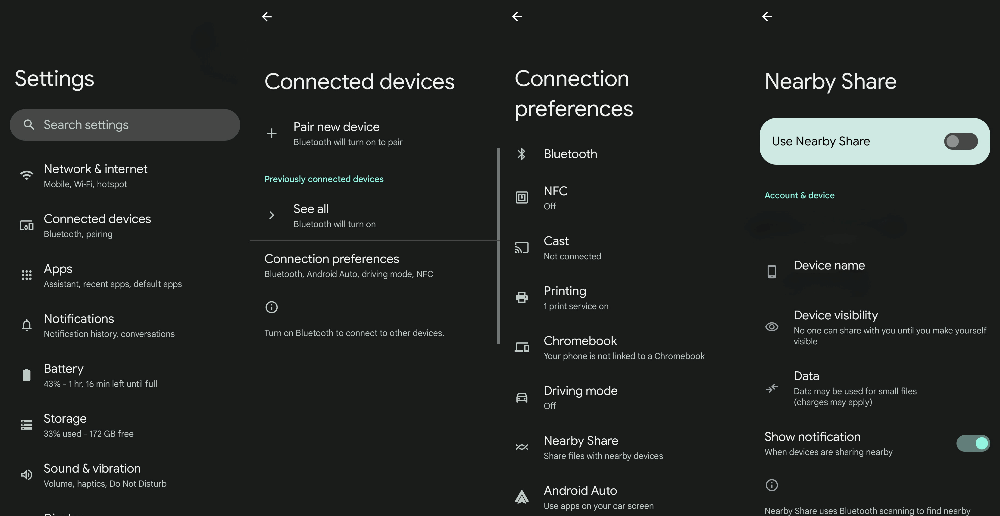
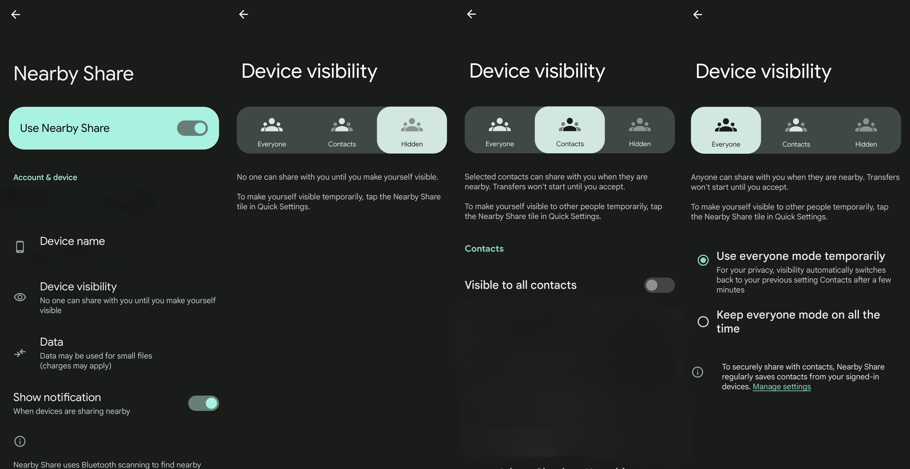
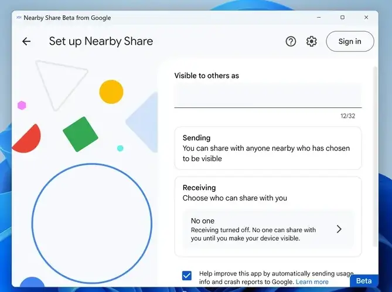
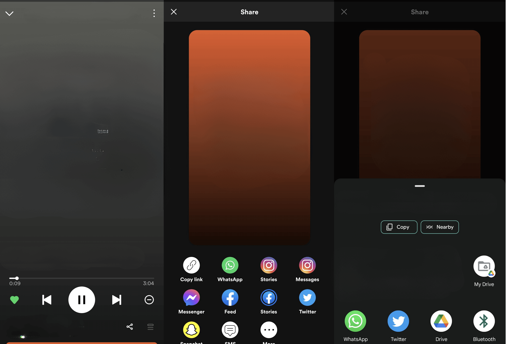
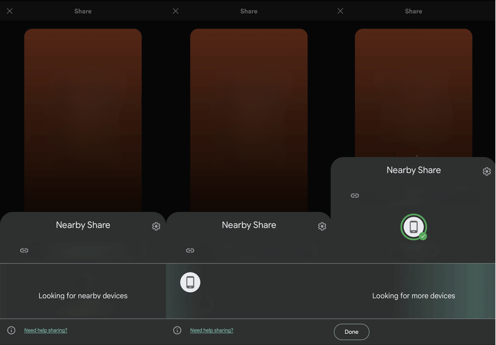
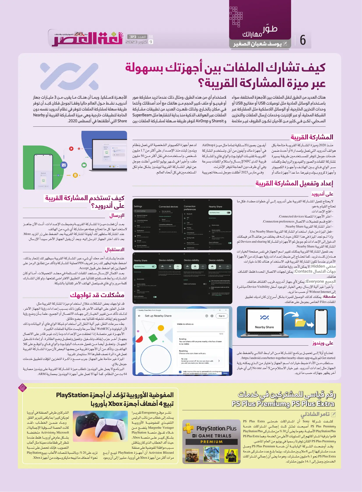

+++
title = "كيف تشارك الملفات بين أجهزتك بسهولة عبر ميزة المشاركة القريبة؟"
date = "2023-10-09"
description = "هناك العديد من الطرق لنقل الملفات بين الأجهزة المختلفة، سواء باستخدام الوسائل المادية مثل توصيلات USB أو مفاتيح USB أو وحدات التخزين الخارجية، أو الوسائل اللاسلكية مثل المشاركة عبر الشبكة المحلية، أو عبر الإنترنت وخدمات إرسال الملفات والتخزين السحابي، لكن في كثير من الأحيان تكون الظروف غير ملائمة لاستخدام أي من هذه الطرق، ومثال ذلك عندما تريد مشاركة صور أو فيديو أو ملف كبير الحجم من هاتفك مع أحد أصدقائك وأنتما في مكان بالخارج، ولذلك ظهرت العديد من تطبيقات مشاركة الملفات عبر الهواتف الذكية منذ بداية انتشارها مثل SuperBeam و ShareIt و AirDrop لتوفر طريقة سهلة لمشاركة الملفات بين اﻷجهزة لاسلكيًا. وبما أن هناك ما يقرب من 3 مليارات جهاز أندرويد نشط حول العالم حاليًا وفقًا لجوجل فكان لا بد أن توفر طريقة سهلة لمشاركة الملفات تتوفر في نظام أندرويد نفسه دون الحاجة لتطبيقات خارجية وهي ميزة المشاركة القريبة أو Nearby Share التي أطلقتها في أغسطس 2020."
categories = ["ويندوز", "أندرويد"]
tags = ["مجلة لغة العصر"]

+++

## مقدمة

هناك العديد من الطرق لنقل الملفات بين الأجهزة المختلفة، سواء باستخدام الوسائل المادية مثل توصيلات USB أو مفاتيح USB أو وحدات التخزين الخارجية، أو الوسائل اللاسلكية مثل المشاركة عبر الشبكة المحلية، أو عبر الإنترنت وخدمات إرسال الملفات والتخزين السحابي، لكن في كثير من الأحيان تكون الظروف غير ملائمة لاستخدام أي من هذه الطرق، ومثال ذلك عندما تريد مشاركة صور أو فيديو أو ملف كبير الحجم من هاتفك مع أحد أصدقائك وأنتما في مكان بالخارج، ولذلك ظهرت العديد من تطبيقات مشاركة الملفات عبر الهواتف الذكية منذ بداية انتشارها مثل SuperBeam و Shareit و AirDrop لتوفر طريقة سهلة لمشاركة الملفات بين اﻷجهزة لاسلكيًا. وبما أن هناك ما يقرب من 3 مليارات جهاز أندرويد نشط حول العالم حاليًا وفقًا لجوجل فكان لا بد أن توفر طريقة سهلة لمشاركة الملفات تتوفر في نظام أندرويد نفسه دون الحاجة لتطبيقات خارجية وهي ميزة المشاركة القريبة أو Nearby Share التي أطلقتها في أغسطس 2020.

## المشاركة القريبة

منذ 2020 وميزة المشاركة القريبة متاحة بكل هواتف أندرويد التي تعمل بإصدار 6 أو أحدث ضمن خدمات جوجل لتوفر للمستخدمين طريقة يسيرة لمشاركة الملفات والصور والفيديو والروابط وكلمات سر الواي فاي بين الهاتف وأجهزة الكمبيوتر وأجهزة كروم بوك وغيرها ما عدا أجهزة ماك أو أيفون. بصورة لاسلكية تمامًا مثل ميزة AirDrop في أجهزة ماك وأيفون من أبل. وتستخدم المشاركة القريبة تقنيات البلوتوث والواي فاي والمشاركة قريبة المدى NFC لإرسال واستلام الملفات بسرعة وفي أي ظرف دون الحاجة لتوفر الإنترنت.

وفي ومارس 2023 أطلقت جوجل نسخة تجريبية لدعم أجهزة الكمبيوتر الشخصية التي تعمل بنظام ويندوز ثبتت منذ اﻹصدار على أكثر من 1.7 مليون شخص واستخدمت في نقل أكثر من 50 مليون ملف، وأخيرًا في شهر يوليو الماضي أعلنت جوجل عن توفر المشاركة القريبة لويندوز بشكل عام لكل المستخدمين في كل أنحاء العالم.

## إعداد وتفعيل المشاركة القريبة

### على أندرويد

لا يحتاج تفعيل المشاركة القريبة على أندرويد إلى أي خطوات معقدة، فكل ما تحتاج القيام به هو:

1. افتح الإعدادات.
2. اختر الأجهزة المتصلة Connected devices.
3. افتح قسم تفضيلات الاتصال Connection preferences.
4. اختر المشاركة القريبة Nearby Share.
5. فعل الميزة من خيار استخدام المشاركة القريبة Use Nearby Share.

وإذا لم تجد الميزة في هذا المكان حيث أنه قد يختلف من هاتف لآخر فيمكنك الدخول إلى اﻹعدادات ثم جوجل ثم الأجهزة والمشاركة Devices and sharing ثم المشاركة القريبة Nearby Share.

بعد تفعيل المشاركة القريبة يمكنك تغيير اسم الجهاز في نفس صفحة الخيارات هذه إن كنت تريد، كما تحتاج إلى ضبط إعدادات رؤية جهازك من الأجهزة الأخرى عندما تكون المشاركة القريبة قيد الاستخدام. هناك ثلاث خيارات:

- مخفي Hidden: لا يمكن لأحد رؤية هاتفك.
- جهات الاتصال Contacts: يمكن لجهات الاتصال المحددة فقط  اكتشاف هاتفك.
- الجميع Everyone: يمكن لأي جهاز أندرويد قريب اكتشاف هاتفك.

وأخيرًا غير آلية اﻹرسال، وهي الخيار الموجود أسفل Device Visibility مباشرة إلى Without Internet أو حسب ما تريد.

ملاحظة: يمكنك كذلك الوصول للميزة بشكل أسرع إن كان لديك تطبيق الملفات Files الخاص بجوجل على هاتفك.

### على ويندوز

- تحتاج أولا إلى تحميل برنامج المشاركة من الرابط التالي بالضغط على Get started ثم تثبيته https://android.com/better-together/nearby-share-app/.
- ستطلب من الأداة ضبط خيارات اسم الجهاز واختيار من الذي يمكنه رؤية الجهاز مثل إعدادات أندرويد. غير خيار الاستلام من لا أحد No one إلى أي خيار آخر يظهر جهازك حسب ما تريد.

## كيف تستخدم المشاركة القريبة على أندرويد؟

### اﻹرسال

- بعد أن فعلت ميزة المشاركة القريبة وضبطت اﻹعدادات، أنت الآن جاهز لاستخدامها. كل ما تحتاج عمله هو مشاركة أي شيء من الهاتف.

- عند المشاركة ستظهر لك أيقونة المشاركة القريبة بعد الضغط على زر المزيد More.

- بعد ذلك اختر الجهاز المرسل إليه، وبعد أن يقبل الجهاز الآخر سيبدأ الإرسال.

### الاستقبال

عندما يشارك أحد معك أي شيء عبر المشاركة القريبة سيظهر لك إشعار بذلك، اضغط عليه ليظهر لك رمز تعريف PIN لعملية المشاركة وتأكد من تطابق الرمز على الجهازين ثم اضغط على قبول Accept.

بعد اكتمال اﻹرسال ستجد الملفات المستلمة في مجلد التحميلات، أما لو كان المشارك روابط فستفتح تلقائيًا عبر التطبيق الافتراضي لفتحها، ولو كان المشارك كلمة مرور واي فاي فسيتصل الهاتف الآخر تلقائيًا بالشبكة.

## مشكلات قد تواجهك

قد تواجهك بعض المشاكل خلال استخدام ميزة المشاركة القريبة مثل:

- **فشل العثور على الهاتف الآخر**: قد يكون ذلك بسبب إعدادات رؤية الجهاز الآخر، لذلك تأكد من تغيير الخيار إلى جهات الاتصال أو الجميع، علمًا بأن وضع رؤية الجميع يتم إيقاف تشغيله تلقائيًا بعد بضع دقائق.
- **بطء سرعات النقل**: غير آلية النقل إلى استخدام شبكة الواي فاي أو البيانات وذلك لأن البلوتوث وWebRTC أبطأ سرعة وليست مثالية للملفات الكبيرة.
- **الأجهزة غير متصلة**: إذا تحققت من الإعدادات وما زلت غير قادر على الاتصال بجهاز آخر جرّب إيقاف وتشغيل، وتفعيل وتعطيل وضع الطائرة، أو إعادة تشغيل الجهاز، وتحقق أيضًا من تفعيل خدمات البلوثوث والواي فاي والموقع على كلا الهاتفين، وتأكد من أن الأجهزة قريبة من بعضها البعض ﻷن ميزة المشاركة القريبة تعمل في دائرة نصف قطرها 30 سنتيمتر تقريبًا.
- **الميزة غير متاحة على الجهاز**: جرب مسح ذاكرة التخزين المؤقت لتطبيق خدمات جوجل بلاي.
- البرنامج لا يعمل على الويندوز: تتطلب ميزة المشاركة القريبة على ويندوز معمارية 64 بت من النظام، كما أنها لا تعمل على أجهزة الويندوز بمعمارية ARM.

---

هذا الموضوع نُشر باﻷصل في مجلة لغة العصر العدد 319 شهر 10-2023 ويمكن الإطلاع عليه [هنا](https://drive.google.com/file/d/1a7xUBkUYtW_0SQwuOcxp9d9TgX0kiaJH/view?usp=drive_link).

