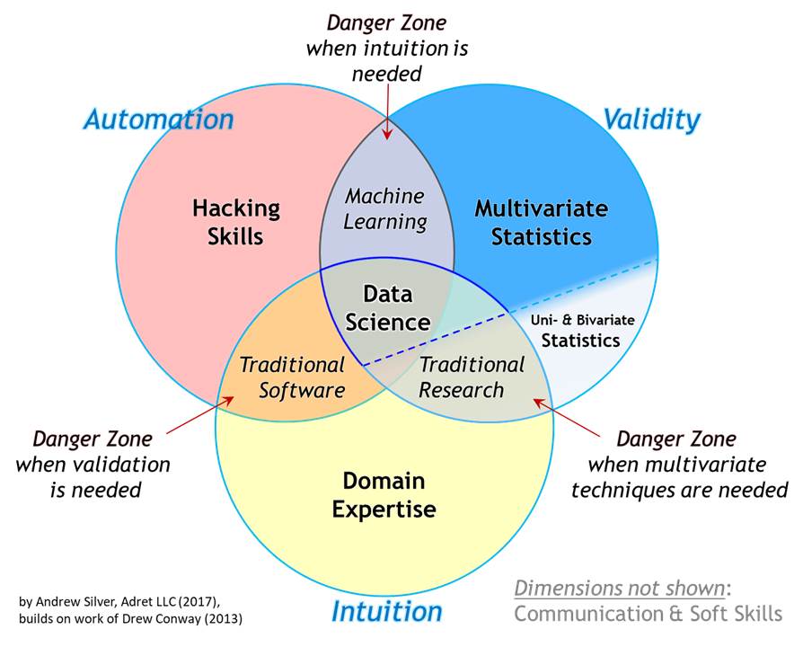
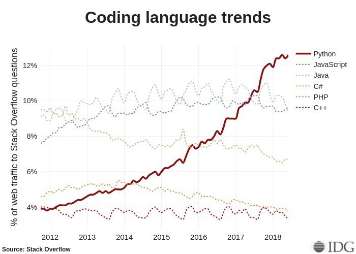
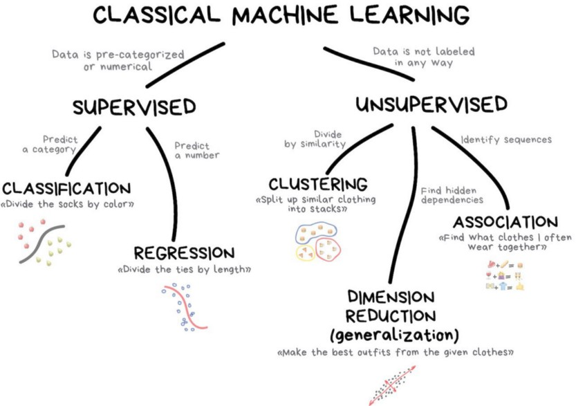
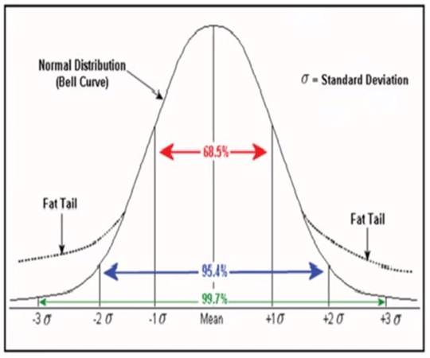
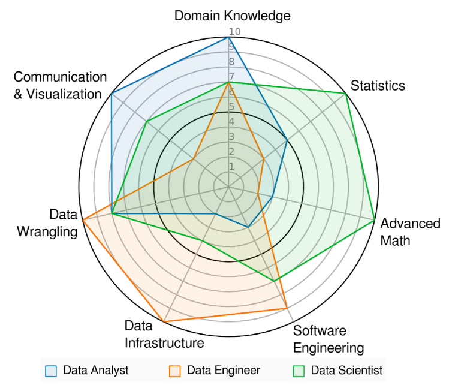
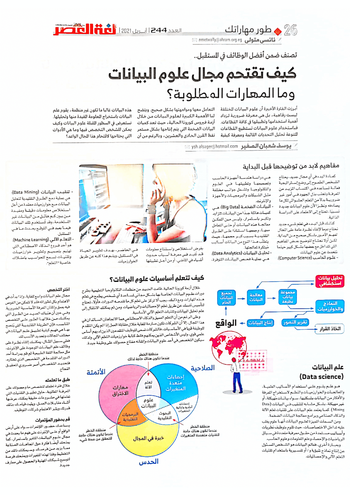
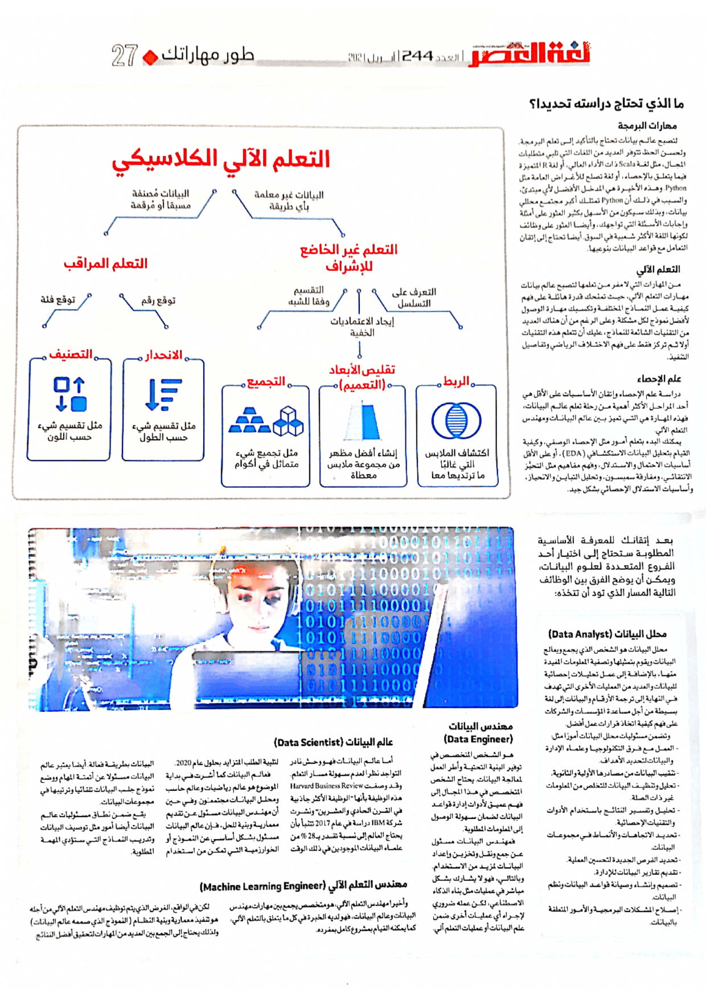

+++
title = "كيف تقتحم مجال علوم البيانات وما هي المهارات المطلوبة؟"
date = "2021-04-01"
description = "أبرزت الفترة الأخيرة أن علوم البيانات المختلفة ليست رفاهية، بل هي معرفة ضرورية تزداد أهمية استخدامها وتطبيقها في كافة القطاعات. فباستخدام علوم البيانات تستطيع القطاعات المتنوعة تحليل التحديات القائمة ومعرفة كيفية التعامل معها ومواجهتها بشكل صحيح. ويتضح لنا الأهمية الكبيرة لعلوم البيانات من خلال أزمة فيروس كورونا الحالية، حيث تعد كميات البيانات الضخمة التي يتم إنتاجها بشكل مستمر نفط القرن الواحد والعشرين، وبالرغم من أن هذه البيانات غالبا ما تكون غير منظمة، يقوم علم البيانات باستخراج المعلومة المفيدة منها وتحليلها. نستعرض في السطور القادمة علوم البيانات وكيف يمكن للشخص التخصص فيها وما هي الأدوات التي يحتاجها لاقتحام هذا المجال الواعد."
categories = ["مهارات رقمية",]
tags = ["مجلة لغة العصر"]

+++

أبرزت الفترة الأخيرة أن علوم البيانات المختلفة ليست رفاهية، بل هي معرفة ضرورية تزداد أهمية استخدامها وتطبيقها في كافة القطاعات. فباستخدام علوم البيانات تستطيع القطاعات المتنوعة تحليل التحديات القائمة ومعرفة كيفية التعامل معها ومواجهتها بشكل صحيح. ويتضح لنا الأهمية الكبيرة لعلوم البيانات من خلال أزمة فيروس كورونا الحالية، حيث تعد كميات البيانات الضخمة التي يتم إنتاجها بشكل مستمر نفط القرن الواحد والعشرين، وبالرغم من أن هذه البيانات غالبا ما تكون غير منظمة، يقوم علم البيانات باستخراج المعلومة المفيدة منها وتحليلها. نستعرض في السطور القادمة علوم البيانات وكيف يمكن للشخص التخصص فيها وما هي الأدوات التي يحتاجها لاقتحام هذا المجال الواعد.

## مفاهيم لا بد من توضيحها قبل البداية

كعادة البدء في أي مجال جديد، يحتاج الشخص الطموح إلى وضع استراتيجية فعالة تساعده في اكتساب المزيد من المعرفة وتجنب بذل الجهود في أمور غير ضرورية بدلاً من التعلم العشوائي لكل ما يصادفه. ونظرًا لأن علوم البيانات جديدة نسبيًا، تحتاج إلى الاعتماد على الدراسة الذاتية.
كذلك قبل البدء في تعلم شيء جديد نحتاج دوما لإلقاء نظرة عامة على المجال لفهم الأمور بشكل صحيح من البداية. لكن أولا نحتاج لتوضيح بعض المفاهيم التي تتداخل مع بعضها بشكل كبير حينما نتحدث عن علوم البيانات:

### علوم الحاسب Computer Science

هي دراسة هندسة أجهزة الحاسب وتصميمها وتطبيقها في العلوم والتكنولوجيا. وتشمل جوانب مختلفة مثل الشبكات والبرمجيات والأجهزة والإنترنت.

### البيانات الضخمة Big Data

هي كميات هائلة جدًا من البيانات تتزايد وتكبر باستمرار، وليس من الممكن معالجة هذه البيانات أو حتى التعامل معها، وجمعها استنادًا على الطرق التقليدية بسبب كبر حجمها، حيث يتطلَّب هذا النوع من البيانات أساليب مُبتكرة لمعالجتها.

### تحليل البيانات Data Analytics

هي عملية فحص البيانات المتوفرة، بغرض استخلاص واستنتاج معلومات قد تُفيد في معرفة أسباب حدوث أشياء في الماضي، أو من أجل تطبيقها في الحاضر، بهدف تطوير الحياة في المستقبل، ويتم هذا كله عن طريق الخوارزميات.

### تنقيب البيانات Data Mining

هي عملية دمج الطرق التقليدية لتحليل البيانات مع خوارزميات معقدة من أجل استخلاص معلومات دقيقة ومفيدة من بين كم هائل من البيانات غير المستخدمة، وقد تُستخدم تلك البيانات فيما بعد في التوقع بحدث ما في المستقبل.

### التعلم الآلي Machine Learning

هو أحد فروع الذكاء الاصطناعي التي تهتم بتصميم وتطوير خوارزميات وتقنيات تسمح للحواسيب بامتلاك خاصية "التعلم".

### علم البيانات Data science

هو علم يقوم على استخدام الأساليب العلمية، والمعالجات والخوارزميات والنظم لاستخراج المعرفة والأفكار من البيانات بشكليها، سواء بيانات مُهيكلة، أو غير مهيكلة، بشكل مشابه للتنقيب في البيانات (Data Mining). كما يعتمد علم البيانات على تقنيات تعلم الآلة والذكاء الصناعي وبرامج معالجة البيانات الضخمة.

ومن السمات المميزة لعلوم البيانات أنها علوم يغلب عليه تداخل الاختصاصات حيث تقوم بتوظيف نظريات وأساليب مستمدة من حقول معرفية متعددة في سياق الرياضيات والإحصاء وعلم المعلومات وعلوم الحاسب.

وبعبارة أخري، فعالم البيانات هو الشخص المسؤول عن إنتاج نماذج تنبؤية و / أو تفسيرية باستخدام تقنيات التعلم الآلي والإحصائيات.

## كيف تتعلم أساسيات علوم البيانات؟

خلال أزمة كورونا الحالية، قامت العديد من منظمات التكنولوجيا التعليمية بطرح دورات علوم البيانات الخاصة بها بشكل مجاني لمساعدة أي شخص يطمح في تعلم هذه المهارات. ومع ذلك، يجب ألا تركز على تعلم كل ما تقدمه الدورات. فأولاً، تحتاج لتأسيس نفسك عن طريق تعلم الإحصائيات والرياضيات. ومن ثم يمكنك الانتقال إلى علم تحليل البيانات وتقنيات التعلم الآلي الأساسية.

وعلى الرغم من أن التعلم العميق والذكاء الاصطناعي هما الاتجاه السائد في هذا المجال، إلا أن الشركات تكون صارمة للغاية خلال مقابلة العمل إذا لم يكن المتقدم للوظيفة قويًا في الأساسيات، فالشركات تسعى لتوظيف المتقدمين الذين لديهم أساس علمي قوي، وليس الأشخاص الذي يمكنه فقط كتابة خوارزميات التعلم الآلي. ولذلك سيكون التخصص في أحد علوم البيانات وإتقانه مفتاح حصولك على وظيفة جيدة.

### اختر التخصص

مجال علم البيانات واسع للغاية، وإذا بدأت في الاهتمام بكل تطوراته فقد لا تتمكن من الغوص فيه بعمق وإتقان المعرفة الأساسية الضرورية. وفي حين أن هناك العديد من الطرق التي يمكنك من خلالها العثور على التخصص المناسب، فإن الطريقة التقليدية التي يُنصح بها هي فهم كيفية تطبيق علم البيانات في مختلف المجالات وتحديد الأنسب لك.

فعلي سبيل المثال يمكنك إلقاء نظرة على وظائف علم البيانات الموجودة على الإنترنت، مثل معالجة اللغة الطبيعية ثم قم بدراسة أحد الدورات المتقدمة في التخصص الذي تختاره، فتحديد التخصص أمر ضروري لتحقيق النجاح.

### طبق ما تعلمته

خلال فترة تعلمك لتخصص ما وحصولك على المعرفة المطلوبة، حاول تطبيق التقنيات التي تعلمتها في مشاريع حقيقة يمكنك عرضها أثناء مقابلات العمل، ويثبت قيامك بذلك قدرتك ويثير الاهتمام شركات التوظيف.

### قم بحضور المؤتمرات

يساعدك حضور المؤتمرات سواء على أرض الواقع أو على الإنترنت على فهم ما يحدث في مجال علوم البيانات المتغير باستمرار، كما يمنحك أيضًا فكرة حول اتجاهات الصناعة مما يزيد من فرصك. وسيمكنك ذلك من التخطيط وفقًا لهذه المتغيرات ويمنحك فرصة لتوسيع شبكتك المهنية والحصول على معارف جديدة.

## ما الذي تحتاج دراسته تحديدا؟

### مهارات البرمجة

لتصبح عالم بيانات تحتاج بالتأكيد إلى تعلم البرمجة. ولحسن الحظ تتوفر العديد من اللغات التي تلبي متطلبات المجال، مثل لغة Scala ذات الأداء العالي، أو لغة R المتميزة فيما يتعلق بالإحصاء، أو لغة تصلح للأغراض العامة مثل Python. وهذه الأخيرة هي المدخل الأفضل لأي مبتدئ، والسبب في ذلك أن Python تمتلك أكبر مجتمع محللي بيانات، وبذلك سيكون من الأسهل بكثير العثور على أمثلة وإجابات الأسئلة التي تواجهك، وأيضا العثور على وظائف لكونها اللغة الأكثر شعبية في السوق. أيضا تحتاج إلى إتقان التعامل مع قواعد البيانات بنوعيها.

### التعلم الالي

من المهارات التي لا مفر من تعلمها لتصبح عالم بيانات مهارات التعلم الالي، حيث تمنحك قدرة هائلة على فهم كيفية عمل النماذج المختلفة وتكسبك مهارة الوصول لأفضل نموذج لكل مشكلة. وعلى الرغم من أن هناك العديد من التقنيات الشائعة للنماذج، عليك أن تتعلم هذه التقنيات أولاً ثم تركز فقط على فهم الاختلاف الرياضي وتفاصيل التنفيذ.

### علم الإحصاء

دراسة علم الإحصاء وإتقان الأساسيات على الأقل هي أحد المراحل الأكثر أهمية من رحلة تعلم عالم البيانات، فهذه المهارة هي التي تميز بين عالم البيانات ومهندس التعلم الآلي.

يمكنك البدء بتعلم أمور مثل الإحصاء الوصفي، وكيفية القيام بتحليل البيانات الاستكشافي (EDA)، أو على الأقل أساسيات الاحتمال والاستدلال، وفهم مفاهيم مثل التحيُّز الانتقائي، ومفارقة سمبسون، وتحليل التباين والانحياز، وأساسيات الاستدلال الإحصائي بشكل جيد.

## اختيار مسارك

بعد إتقانك للمعرفة الأساسية المطلوبة ستحتاج إلى اختيار أحد الفروع المتعددة لعلوم البيانات، ويمكن أن يوضح الفرق بين الوظائف التالية المسار الذي تود أن تتخذه:

### محلل البيانات (Data Analyst)

محلل البيانات هو الشخص الذي يجمع ويعالج البيانات ويقوم بتمثيلها وتصفية المعلومات المفيدة منها بالإضافة إلى عمل تحليلات إحصائية للبيانات والعديد من العمليات الأخرى التي تهدف في النهاية إلى ترجمة الأرقام والبيانات إلى لغة بسيطة من أجل مساعدة المؤسسات والشركات على فهم كيفية اتخاذ قرارات عمل أفضل.
وتضمن مسؤوليات محلل البيانات أمور مثل:

-   العمل مع فرق التكنولوجيا وعلماء الإدارة والبيانات لتحديد الأهداف.
-   تنقيب البيانات من مصادرها الأولية والثانوية.
-   تحليل وتنظيف البيانات للتخلص من المعلومات غير ذات الصلة.
-   تحليل وتفسير النتائج باستخدام الأدوات والتقنيات الإحصائية.
-   تحديد الاتجاهات والأنماط في مجموعات البيانات.
-   تحديد الفرص الجديدة لتحسين العملية.
-   تقديم تقارير البيانات للإدارة.
-   تصميم وإنشاء وصيانة قواعد البيانات ونظم البيانات.
-   إصلاح المشاكل البرمجية والأمور المتعلقة بالبيانات.

### مهندس البيانات (Data Engineer)

هو الشخص المتخصص في توفير البنية التحتية وأُطر العمل لمعالجة البيانات. يحتاج الشخص المتخصص في هذا المجال إلى فهم عميق لأدوات إدارة قواعد البيانات لضمان سهولة الوصول إلى المعلومات المطلوبة.

فمهندس البيانات مسؤول عن جمع ونقل وتخزين وإعداد البيانات لمزيد من الاستخدام. وبالتالي، فهو لا يشارك بشكل مباشر في عمليات مثل بناء الذكاء الاصطناعي، لكن عمله ضروري لإجراء أي عمليات أخرى ضمن علم البيانات أو عمليات التعلم آلي.

### عالم البيانات (Data Scientist)

أما عالم البيانات فهو وحش نادر التواجد نظرا لعدم سهولة مسار التعلم. وقد وصفت Harvard Business Review هذه الوظيفة بأنها "الوظيفة الأكثر جاذبية في القرن الحادي والعشرين" ونشرت شركة IBM دراسة في عام 2017 تتنبأ بأن يحتاج العالم إلى نسبة تقدر ب 28٪ من علماء البيانات الموجودين في ذلك الوقت لتلبية الطلب المتزايد بحلول عام 2020.

فعالم البيانات كما أشرت في بداية الموضوع هو عالم رياضيات وعالم حاسب ومحلل البيانات مجتمعين. وفي حين أن مهندس البيانات مسؤول عن تقديم معمارية وبنية للحل، فإن عالم البيانات مسؤول بشكل أساسي عن النموذج أو الخوارزمية التي تمكن من استخدام البيانات بطريقة فعالة. أيضا يعتبر عالم البيانات مسؤولا عن أتمتة المهام ووضع نموذج جلب البيانات تلقائيًا وترتيبها في مجموعات البيانات.
يقع ضمن نطاق مسئوليات عالم البيانات أيضا أمور مثل توصيف البيانات وتدريب النماذج التي ستؤدي المهمة المطلوبة.

### مهندس التعلم الآلي (Machine Learning Engineer)

وأخيرا مهندس التعلم الآلي هو متخصص يجمع بين مهارات مهندس البيانات وعالم البيانات، فهو لديه الخبرة في كل ما يتعلق بالتعلم الآلي كما يمكنه القيام بمشروع كامل بمفرده.

لكن في الواقع، الغرض الذي يتم توظيف مهندس التعلم الآلي من أجله هو تنفيذ معمارية وبنية النظام (النموذج الذي صممه عالم البيانات) ولذلك يحتاج إلى الجمع بين العديد من المهارات لتحقيق أفضل النتائج.

---

هذا الموضوع نُشر باﻷصل في مجلة لغة العصر العدد 244 شهر 04-2021 ويمكن الإطلاع عليه [هنا](https://drive.google.com/file/d/1ZY3Y1-0eCTo_E1-B1vBhLZzNzRGA_ZMF/view?usp=sharing).

