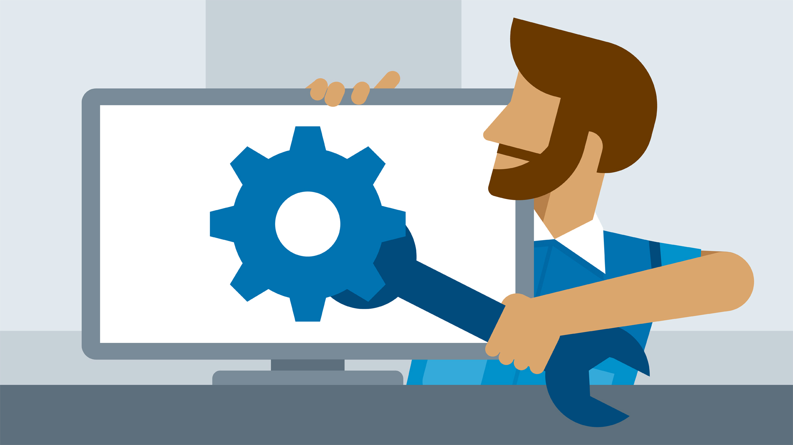

+++
title = "كيف تتعلم مهارات الدعم الفني التقني بنفسك؟"
date = "2020-07-01"
description = "كثيرا ما تحدث المشكلات التقنية في كل مكان حتى في الشركات التي لديها فرق تقنية متخصصة. لذلك قد تكون فكرة أن تعلم نفسك بعض مهارات الدعم الفني التقني فكرة جيدة ستمكنك من إصلاح وحل العديد من المشاكل التي تواجهك أثناء استخدام جهاز الكمبيوتر والإنترنت مثل تشنج الجهاز أو رفض بعض الملفات للحفظ أو تضرر بعض المستندات. فامتلاكك لبعض من هذه المهارات يغنيك عن طلب مساعدة قسم الدعم الفني الخاص بعملك والذي قد يتسبب في تضييع الوقت أو تأخير إنجاز المهام."
categories = ["مهارات تقنية",]
tags = ["مجلة لغة العصر"]

+++
كثيرا ما تحدث المشكلات التقنية في كل مكان حتى في الشركات التي لديها فرق تقنية متخصصة. لذلك قد تكون فكرة أن تعلم نفسك بعض مهارات الدعم الفني التقني فكرة جيدة ستمكنك من إصلاح وحل العديد من المشاكل التي تواجهك أثناء استخدام جهاز الكمبيوتر والإنترنت مثل تشنج الجهاز أو رفض بعض الملفات للحفظ أو تضرر بعض المستندات. فامتلاكك لبعض من هذه المهارات يغنيك عن طلب مساعدة قسم الدعم الفني الخاص بعملك والذي قد يتسبب في تضييع الوقت أو تأخير إنجاز المهام.

امتلاكك للقليل من مهارات تكنولوجيا المعلومات والدعم الفني التقني الأساسية سيساعدك في زيادة الإنتاجية ويوفر عليك عناء طلب وانتظار فرق الدعم الفني لحل المشاكل التكنولوجية التي تواجهك. ويساعد توفر العديد من المصادر والمجتمعات على الإنترنت المستخدم في حل أي مشكلة تقريبا، لذلك كل ما تحتاجه للبدء هو بعض التعطش للمعرفة واتباعك لمجموعة من النصائح المفيدة.

## استخدام محركات البحث

نستخدم جميعنا محركات البحث (مثل جوجل ويوتيوب) طوال اليوم سواء للبحث عن مستجدات الأخبار أو الترفيه أو أي أمر آخر، فمحركات البحث اليوم يمكنها تزويدنا بنتائج لا حصر لها عن أي شيء نقوم بالبحث عنه بداخلها. وفي حالة مواجهتك لمشكلة تقنية يجب أن تستخدم محرك البحث أيضا بنفس الطريقة، فمثلا عند حدوث خطأ ما بنظام الويندوز أو أحد البرامج المثبتة على الجهاز، هل يظهر "رمز خطأ" على الشاشة؟ إذا كان يظهر رمز أو رقم محدد قم بنسخه أو كتابته في محرك البحث إلى جانب اسم البرنامج الذي أظهر الخطأ وأي معلومات أخرى ستساعد في تضييق نطاق البحث. وعند البحث في الأغلب ستجد واحد من ثلاثة أشياء:
- إجابة قام بكتابتها شخص ما واجه نفس المشكلة التي تواجهك، وغالبا ما ستكون خطوات دقيقة يمكنك استخدامها على جهازك. في هذه الحالة كل ما عليك فعله هو اتباع هذه الخطوات المذكورة.
- مقالة لاستكشاف الأخطاء وإصلاحها منشورة على موقع مزود خدمة ما، أو موقع الشركة المصنعة. وستجد بداخلها الخطوات التي يجب عملها لحل المشكلة التقنية وفقا لرمز الخطأ.
- في بعض الأحيان عند قيامك بالبحث باستخدام عبارة ما سيقترح عليك محرك البحث القيام بعملية البحث باستخدام بعض العبارات الأخرى والتي تكون ذات صلة بشكل أكبر بالموضوع. فمثلا محرك بحث جوجل يقوم بعرض هذه الاقتراحات أسفل صفحة نتائج البحث، حاول تفقد هذه النتائج لأنها في غالب الأحيان تكون ذات صلة كبيرة بما تبحث عنه وستساعدك في إيجاد حلول للمشاكل في حالة كانت عبارة البحث الأصلية غير دقيقة كفاية لجلب نتائج كافية.
وعلى الرغم من أنه في بعض الأحيان عند قيامك بالبحث عن شيء ما لن تجد نتائج تفيد في حل المشكلة التي تواجهك وستحتاج إلى الرجوع إلى المختص بالدعم الفني التقني، إلا أن استخدام محركات البحث يجب أن يكون أول خطوة تقوم بها عند مواجهتك لأي مشكلة تقنية.

## تعلم كيفية تركيب كابلات الكمبيوتر

أحد المهارات الأساسية للدعم الفني التقني التي تحتاج لتعلمها، على الرغم من أنها قد تبدو أمرا بديهيا، هي القدرة على تركيب كابلات جهاز الكمبيوتر بالشكل الصحيح. فلزيادة فاعلية الكمبيوتر نقوم بتوصيل عدد من الملحقات به مثل الطابعات وأجهزة المسح الضوئي وتصوير المستندات، ومع زيادة هذه الملحقات يزداد عدد الكابلات والأسلاك المتصلة بالجهاز، مما يجعل الوضع يبدو معقدا بالنسبة لبعض المستخدمين ويؤدي إلى خوفهم من لمس أي شيء على الإطلاق.

ومع ذلك، فإن معظم الكابلات الخارجية المتصلة بجهازك بسيطة وتتكون عادةً من: وصلة الطاقة ووصلة الشاشة ووصلة الإيثرنت ووصلة ال USB والطابعة والماسح الضوئي، وأي وصلات أخرى مثل الماوس ولوحة المفاتيح.

تحتاج إلى استثمار بعض الوقت للتعرف على ما يفعله كل كابل وأين يفترض أن يتم توصيله، كما يمكنك أيضًا معرفة المزيد حول توصيلات جهازك من خلال قراءة دليل المالك المرفق مع المنتج أو المتاح على الإنترنت.

ستفيدك هذه المهارة في المرة التالية التي تواجهك فيها مشكلة. ففي بعض الأحيان يكون سبب المشكلة أنه لديك سلك غير مركب بإحكام يستمر في الانزلاق من الجهاز. وفي هذه الحالة تحقق جيدًا من جميع الأسلاك والكابلات للتأكد من توصيلها جميعا بإحكام قبل البدء في البحث عن أي حلول أخرى.

## تعلم أساسيات تكنولوجيا المعلومات

قد تبدو المهارة الأساسية التالية التي تحتاج لتعلمها مخيفة بعض الشيء، ولكن كلما زادت معرفتك بمجال تكنولوجيا المعلومات كلما زادت سهولة فهم مشاكل جهازك وحلها. فعلى سبيل المثال هناك مجموعة من المصطلحات الأكثر شيوعًا تساهم معرفة الأشخاص الذين ليسوا على دراية كبيرة بتكنولوجيا المعلومات لها في التعامل مع الدعم الفني التقني، ومنها:

- عنوان IP (IP Address): يستخدم الكمبيوتر والطابعة وكل جهاز يتصل بالإنترنت عنوان بروتوكول إنترنت (IP) محددًا لتعريف الجهاز. وعادة ما يتم تعيين عناوين IP تلقائيًا لجهازك، ولكن يمكن أن يتم تعيين عناوين IP محددة بشكل يدوي. تستطيع اعتبار عنوان IP أمرا شبيها بالرقم على لوحة ترخيص السيارة.
- الراوتر (Router): يعد جهاز الراوتر الخاص بك أحد العناصر المهمة للغاية في تأمين عملك، فهو بمثابة خط الدفاع الأول ضد المتسللين. ويقوم جهاز الراوتر بتوجيه المحتوى إلى مكانه المناسب داخل الشبكة، سواء كان ذلك الكمبيوتر أو الطابعة أو أي جهاز آخر متصل به.
- الحوسبة السحابية (Cloud Computing): تتوفر حاليا العديد من خدمات التخزين السحابى للملفات، مما يمنح المستخدم القدرة على الوصول عند بعد إلى الملفات من خلال أكثر من جهاز واحد. وتعد الحوسبة السحابية خيارا رائعا للشركات التي لديها موظفين يعملون عن بُعد، حيث يمكنهم حفظ الملفات والمستندات والصور في السحابة ثم الوصول إليها من أي جهاز كالهاتف أو الكمبيوتر الشخصي.
- جدار الحماية (Firewall): ويعرف أيضا بالجدار الناري، هو برنامج أو جهاز ملموس لحماية الكمبيوتر من المتسللين والفيروسات. تتوفر العديد من جدران الحماية الملائمة لكل الاستخدامات بداية من حزم برامج مكافحة الفيروسات الصغيرة إلى حلول البرامج الشاملة والأجهزة المعقدة والمكلفة. وسواء كان جهازك مزودًا بجدار حماية أم لا يجب عليك استخدامه والتأكد من فعاليته لضمان الحفاظ على ملفاتك ومستنداتك آمنة.
- البرامج الضارة (Malware): هي أي برامج خبيثة صممها المخترقون للدخول إلى أنظمة تكنولوجيا المعلومات لديك. ويسعى هؤلاء المتسللون إلى تخريب جهاز الكمبيوتر الخاص بك، والحصول على معلوماتك الخاصة، والتحكم عن بعد بالجهاز، والتلاعب بالضحية للحصول على أمواله.
سيفيدك تعلم هذه المصطلحات في فهم العديد من الأمور أثناء البحث عن حلول للمشاكل، كما سيساعدك في توضيح مشكلتك بشكل أفضل لمختصي الدعم الفني مما يجعل أداؤهم أفضل.

## تعلم كيفية الحكم على سلامة ما يصلك خلال الإنترنت

سلامتك وأمانك الرقمي سواء على المستوي الشخصي أو على مستوي العمل هي واحدة من أهم الجوانب التي يجب أن تنتبه لها. فنحن نتعرض للمحتوي على الإنترنت بشكل يومي، وهذا المحتوي منه الجيد ومنه السيء، وفتح أو تثبيت محتوي ضار سينتج عنه ما لا يحمد عقباه.

فعلى سبيل المثال، قد تصلك رسائل على البريد الإلكتروني من نوعية "تهانينا! أنت الزائر رقم مليون لموقعنا اضغط هنا لتحصل على جائزتك التي قيمتها مليون دولار" و "مرحبا أنا ...... وبحاجة لمساعدتكم للحصول على مبلغ 45 مليون دولار من الميراث"، والتي تكون إما رسائل بها برامج خبيثة وضارة، أو بريد مضلل يهدف إلى سرقة بيانات المالية للحصول على أموالك. ولذلك يساعد تعلم كيفية الحكم على السلامة لمحتوي ما على تجنب الأشياء التي قد تضر بجهاز الكمبيوتر الخاص بك وبأمانك الرقمي.

تأكد دائما من التفكير بما يكفي في شيء يصلك عبر الإنترنت قبل فتحه، وخاصة قبل إعطاء أي من معلوماتك الشخصية مثل اسمك وعنوانك والمعلومات الأخرى التي لا تريد أن يعرفها أحد مثل كلمات المرور ومعلومات حسابك البنكي.

## تعلم المزيد من المهارات عبر الكورسات

من أفضل الطرق لزيادة خبراتك في أمر ما هو دراسة أحد الكورسات المتوفرة عبر الإنترنت، وبالنسبة لمهارات الدعم الفني التقني الأساسية ستجد العديد من الكورسات التي توفرها العديد من المواقع المرموقة مثل Coursera. وتقدم جوجل دورة تدريبية كاملة مجانية مدتها 6 أشهر لمن يرغب في التعمق في الدعم الفني لتكنولوجيا المعلومات على موقع Coursera تحت مسمي "Google IT Support Professional Certificate" وتحتوي على 5 كورسات تأخذك من مرحلة الأساسيات التي تتعرف فيها على أمور بسيطة مثل تركيب جهاز الكمبيوتر وتثبيت نظام التشغيل إلى مراحل متقدمة تشمل التعرف على الشبكات وأمن المعلومات وإدارة الأنظمة.

ويمكنك الالتحاق بهذه الدورة بشكل مجاني والتعرف على مزيد من التفاصيل من الرابط https://www.coursera.org/professional-certificates/google-it-support

قد لا تبدو معرفة العديد من الأمور حول مهارات تكنولوجيا المعلومات الأساسية ومهارات الدعم الفني ضروريا لكل المستخدمين، لكنها في الواقع قد أصبحت مهارة حياتية لا غني عنها. لذلك حاول على الأقل إتقان الأمور الضرورية فقط مثل كيفية البحث عن حلول للمشكلات التي تواجهك وكيف تقوم بتركيب توصيلات جهاز الكمبيوتر الخاص بك والأمور الأخرى التي ذكرتها بالأعلى، لأن ذلك سيوفر عليك الكثير وسيساعدك في توفير الوقت والمال بكل تأكيد.

---

هذا الموضوع نُشر باﻷصل في مجلة لغة العصر العدد 235 شهر 07-2020 ويمكن الإطلاع عليه [هنا](https://drive.google.com/file/d/16KcS-qSXQMvVSwarjQl5o23ZvdHirPn2/view?usp=sharing).

