+++
title = "لغة Python.. مدخلك الأفضل إلى عالم البرمجة"
date = "2020-03-01"
description = "يوما بعد يوما تصبح أهمية تعلم البرمجة واضحة ويزداد الطلب على المبرمجين على مستوي العالم. ولحسن حظنا، تتوفر كميات هائلة من مصادر تعلم البرمجة على الإنترنت ويمكن الوصول إليها ببضعة نقرات. لكن نظرا لكون البرمجة مجالا ضخما، يواجه المبتدئون صعوبة كبيرة في اتخاذ قرارتهم واختيار لغتهم البرمجية الأولي. وبالنظر إلى مواقع إحصائيات لغات البرمجة، نجد أن لغة بايثون Python تتصدر التصنيف على موقع PYPL وتحتل المركز الثالث على موقع TIOBE، ومقارنة مع اللغات المتصدرة الأخرى مثل Java أو C ستجد أن بايثون هي الأسهل في التعلم، كما يمكن استخدامها في العديد من المجالات والأغراض المختلفة.نتناول فيما يلي لغة بايثون بشكل أكثر تفصيلا، ولماذا تعد مدخل المبتدئين الأفضل إلى عالم البرمجة."
categories = ["برمجة",]
tags = ["مجلة لغة العصر"]

+++

يوما بعد يوما تصبح أهمية تعلم البرمجة واضحة ويزداد الطلب على المبرمجين على مستوي العالم. ولحسن حظنا، تتوفر كميات هائلة من مصادر تعلم البرمجة على الإنترنت ويمكن الوصول إليها ببضعة نقرات. لكن نظرا لكون البرمجة مجالا ضخما، يواجه المبتدئون صعوبة كبيرة في اتخاذ قرارتهم واختيار لغتهم البرمجية الأولي. وبالنظر إلى مواقع إحصائيات لغات البرمجة، نجد أن لغة بايثون Python تتصدر التصنيف على موقع PYPL وتحتل المركز الثالث على موقع TIOBE، ومقارنة مع اللغات المتصدرة الأخرى مثل Java أو C ستجد أن بايثون هي الأسهل في التعلم، كما يمكن استخدامها في العديد من المجالات والأغراض المختلفة.نتناول فيما يلي لغة بايثون بشكل أكثر تفصيلا، ولماذا تعد مدخل المبتدئين الأفضل إلى عالم البرمجة.

> بايثون لغة تجمع بين السهولة والقوة والمرونة

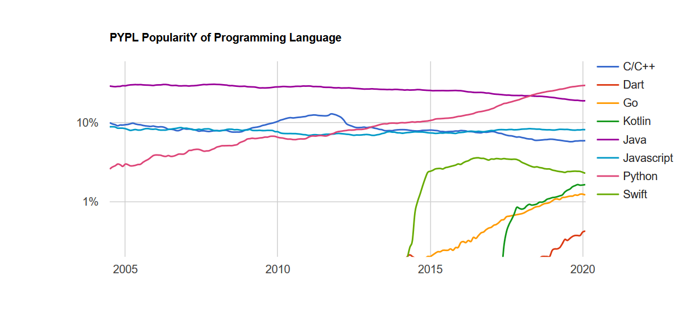

## لغة بايثون Python

بايثون هي لغة برمجة متعددة الأغراض مفتوحة المصدر عالية المستوي ديناميكية الكتابة، تجمع بين القوة والبساطة الكبيرة وتدعم البرمجة كائنية التوجه. طُورت لغة بايثون بواسطة جايدو ڤان روسم Guido Van Rossum أثناء عمله في مركز العلوم والحاسب الآلي بهولندا عام 1986.


أُطلقت النسخة الأولي من اللغة في 1991، لكن الإصدار الأول قد أُطلق بعد ذلك بثلاثة أعوام. وفي عام 2000 أُصدرت النسخة 2.0 والتي أضافت مجموعة جديدة من الميزات مثل List Comprehensions - Garbage Collection System ودعم Unicode. وبعد ذلك في ديسمبر 2008، حصلت بايثون على تحديث كبير للغاية هو الإصدار 3.0 والذي لم يكن متوافقا مع الإصدارات السابقة، واستمر كلا الإصدارين 3.x و2.x بالحصول على التحديثات بشكل مستمر حتى بداية العام الحالي، حيث وصلت دورة حياة بايثون 2 إلى نهايتها، بعد تأجيل تاريخ إيقاف الدعم الرسمي لها من عام 2015 إلى 2020 نظرا لقاعدة المستخدمين الكبيرة التي لم تتمكن من الترقية إلى الإصدار 3.0 قبل انتهاء تلك المدة. أما الآن فبايثون 3 هي الإصدار الذي يجب على الجميع استخدامه.

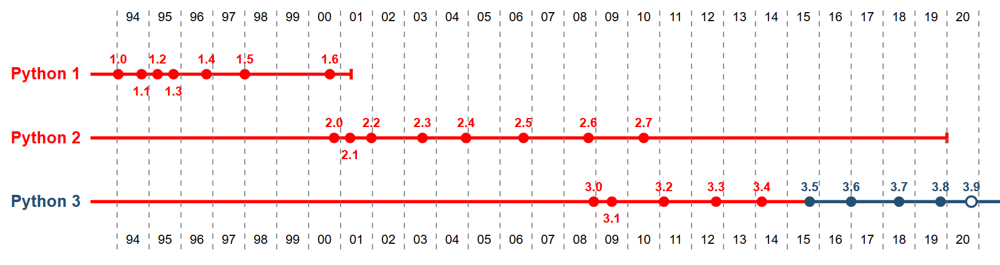

يشيد العديد من المبرمجين المحترفين بجمالية وبساطة الكود المكتوب بلغة بايثون، ولعل ذلك راجع للمبادئ التوجيهية لكتابة كود بايثون، والمعروفة ب Zen of Python، والذي يتضمن توجيهات مثل: "الجميل أفضل من القبيح - الصريح أفضل من الضمني - البسيط أفضل من المركب - المركب أفضل من المعقد - لا يجب تمرير الأخطاء بسهولة - إذا كان من الصعب شرح كيفية التنفيذ، فهذه فكرة سيئة - إذا كان التنفيذ سهل الشرح، فقد تكون فكرة جيدة".

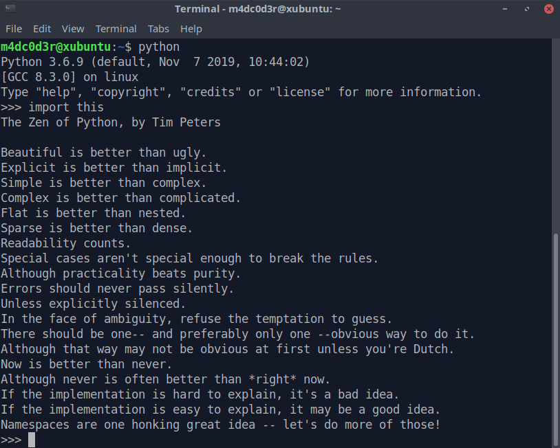

## ما الذي يميز بايثون عن اللغات الأخرى؟

### سهولة الكتابة والقراءة

تتميز بايثون بأنها سهلة الكتابة والقراءة والتعلم، حيث تشبه طريقة كتابها اللغة الإنجليزية بشكل كبير. وستلاحظ ذلك بنفسك إذا كانت لديك أي خلفية برمجية مسبقة مع أي لغة أخرى.

فمثلا لطباعة جملة على الشاشة كل ما تحتاج القيام به هو كتابة:

`print('Hello، world!')`

ولعمل برنامج يحدد ما إذا كان العدد موجبًا أو سالبًا أو صفرا:

```python
num = float(input("Enter a number: "))
if num > 0:
   print("Positive number")
elif num == 0:
   print("Zero")
else:
   print("Negative number")
```

أما قابلية القراءة، فترجع إلى أن لغة بايثون مصممة بشكل واع من البداية على عكس الكثير من لغات البرمجة، فقابلية القراءة هي محط اهتمام رئيسي أُخذ بعين الاعتبار في تصميم بايثون، وهذه الميزة لها العديد من الفوائد الإيجابية يذكر بعضها مطور بايثون Guido van Rossum: "هذا التركيز على قابلية القراءة لم يحدث بمحض الصدفة. كلغة برمجة شيئية، تهدف بايثون إلى تشجيع إنشاء نص برمجي يمكن إعادة استخدامه، فحتى لو كتبنا توثيقا كاملا للبرامج في كل وقت، فإن النص البرمجي سيعاد استخدامه بصعوبة إذا لم يُقرأ بسهولة. إن العديد من خصائص بايثون، بالإضافة إلى طريقة استخدام الإزاحة الخاصة بها، تجعل النص البرمجي المكتوب بها قابلا للقراءة بفاعلية أكبر". كما أن سهولة القراءة هي ميزة مشجعة على التعاون وتسهل المشاركة في مشاريع بايثون مفتوحة المصدر.

### مفتوحة المصدر

بايثون لغة مفتوحة المصدر، لن تدفع أي أموال نظير استخدامها فهي مجانية وستبقى مجانية إلى الأبد. فيمكنك تحميل ونسخ وتوزيع وقراءة كود المصدر والقيام ببعض التغييرات عليها واستخدام أجزاء منها في برمجيات حرة جديدة دون قيود، وهذا أحد الأسباب التي تجعل بايثون لغة جيدة وجذابة في نفس الوقت للمبرمجين، فقد أُنشئت وطُورت ووضع أساساتها من قبل مجتمع البرمجيات مفتوحة المصدر ويتم تحسينها باستمرار بواسطة مبرمجين متطوعين يتشاركون نفس الشغف باللغة. وهذه الميزة تأخذنا إلى ميزة أخرى ملاصقة لها..

### المجتمع والمكتبات

تتميز بايثون بمجتمع كبير للمطورين نظرا لكونها مفتوحة المصدر، ويوفر هذا المجتمع الضخم العديد من مصادر التعلم ومنصات المساعدة وحل المشاكل على الإنترنت وفي الواقع. كما يوفر العديد من المكتبات البرمجية لكل الأغراض تقريبا والتي تسهل عملية التطوير.

وطبقا لإحصائيات موقع Python Package Index (PyPI) المستودع الرسمي لحزم ومكتبات بايثون فقد تجاوز عدد المكتبات على الموقع 216000 مع بداية شهر فبراير 2020.

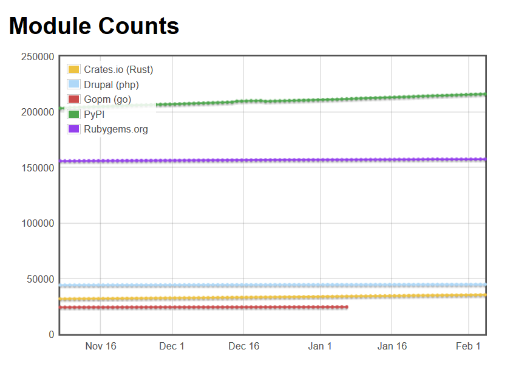

وتشمل المكتبات المتوفرة مكتبات خاصة بالشبكات وتطوير الويب والواجهات الرسومية وقواعد البيانات ومعالجة النصوص والصور.

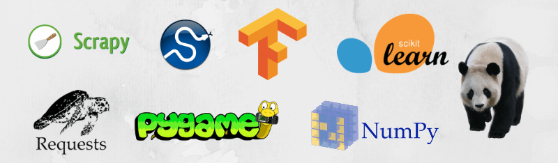

### تعمل في كل مكان ويستخدمها العديد من كبريات الشركات

بايثون لغة محمولة يمكنك استخدام وتشغيل البرامج المكتوبة بها على جميع المنصات تقريبا مثل لينكس وويندوز وMac OS وغيرها من المنصات وأنظمة التشغيل. ونظرا لأنها تجمع بين القوة والسهولة والمرونة فإن قائمة الشركات والمواقع التي تستخدم بايثون طويلة للغاية منها Google – Yahoo – Mozilla – Microsoft – Dropbox – Cisco – Spotify – Quora – Facebook – Heroku – Reddit - Amazon.


### لغة مفسّرة

بايثون لغة مفسّرة (interpreted) وليست مبنية (compiled)، حيث يقوم مترجم بايثون Python interpreter بقراءة سطر واحد من الكود في كل مرة، ويقوم بترجمته إلى لغة منخفضة المستوى (byte code) ثم يقوم بتشغيله. ولذلك يمكن تشغيل برامج بايثون من الكود المصدري مباشرة عن طريق وسيط يسمى bytecode مهمته ترجمة الكود إلى لغة الآلة مباشرة، مما يوفر الكثير من الوقت أثناء عملية التطوير نظرًا لعدم الحاجة إلى إجراء عملية البناء في كل مرة ترغب باختبار الكود. كما يمكن استخدام المفسِّر الخاص ببايثون بصورة تفاعلية، مما يجعل التعامل مع الخصائص التي تقدّمها اللغة أسهل، ويُمّكن المطور من كتابة برامج لغرض التدريب، أو اختبار جزء محدد أثناء عملية تطوير برنامج ما.

### تزيد من إنتاجية المطورين

تتيح بايثون كتابة البرامج بأسلوب مختصر ومقروء، فالبرامج المكتوبة في بايثون تكون عادة أقصر بكثير من مكافئاتها في لغات مثل Cأو C++أو Java، ولعدّة أسباب:

-   تتيح أنواع البيانات ذات المستوى العالي إمكانية استخدام تعابير معقدّة في عبارة واحدة.
-   يتم تجميع العبارات باستخدام الإزاحات، بدلًا من أقواس البداية والنهاية.
-   لا حاجة للتصريح عن نوع المتغير أو الوسيط.

تملك بايثون العديد من أنواع البيانات مثل القوائم، والجداول، والمجموعات، والقواميس، والنصوص. تحمل القوائم عناصر بيانات عشوائية يمكن أن تُصنف وتجمّع وتستخدم كـ كومات stacks، بينما المجموعات تحمل عناصر فريدة وغير مرتبة. وبالإضافة إلى ذلك، تسمح بايثون باستخدام كلا من أساليب البرمجة الشيئية والبرمجة الإجرائية وبعض من البرمجة الوظيفية.

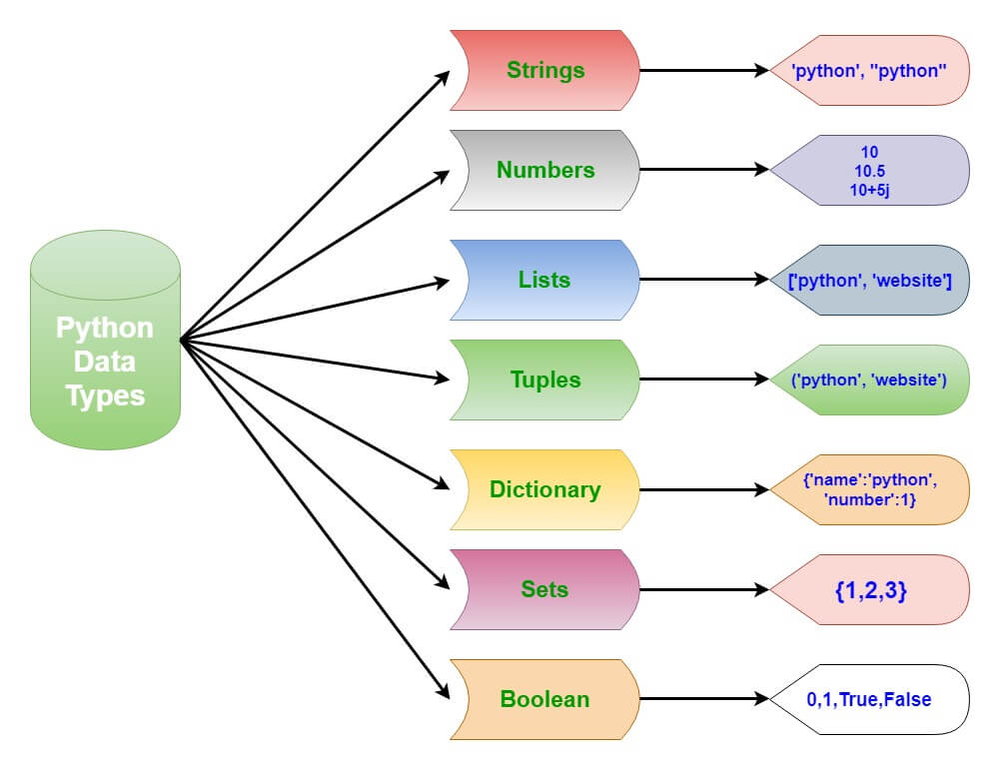

أيضا تستخدم بايثون البرمجة الوحدية (Modular)، وهو نظام شائع يرتب الوظائف والدوال داخل مساحات إسمية (namespace)، وكل ملف في بايثون يُعّرف وحدة. تَظّهر الوظائف والأصناف والمتغيرات المعرفة أو المستدعاه داخل الملف في مساحة الاسم لهذه الوحدة، ويمكن لاستيراد الوحدة أن ينشئ قاموسا محليا يحمل عناصر هذه الوحدة أو يسحب بعض من عناصر هذه الوحدة إلى المساحة الإسمية.

### متعددة الاستخدامات

تعد بايثون لغة برمجة متعددة الاستخدامات لكونها لا تختص باستخدام محدد، فيمكن استخدامها بعدة مجالات بداية من الأمور البسيطة وحتى التطبيقات المعقدة:

-   تطوير الويب: وذلك بالاعتماد على أطر عمل مختصة أبرزها إطار فلاسك Flask وإطار جانجو Django، ويتم الاعتماد عليها بشكل أكبر في تطوير الواجهات الخلفية Back-End.

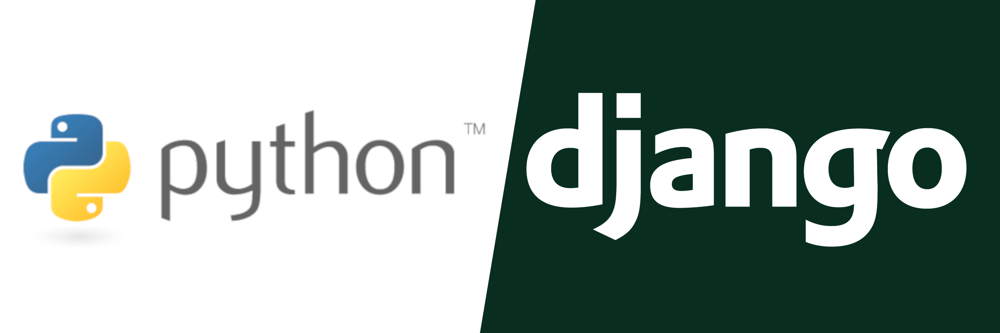

-   تطوير واجهات المستخدم الرسومية GUI: يتم استخدام مكتبات عدة مثل مكتبة Qt ومكتبة GTK+.
-   أمن المعلومات: حيث يوجد العديد من برمجيات الطرف الثالث التي يطورها مبرمجين من مختلف أنحاء العالم لتساعد العاملين بمجال أمن المعلومات على محاكاة عمليات الاختراق والقيام باختبار الاختراق Penetration Testing وصنع أدوات الاختراق المؤتمتة أو الأدوات التي تقوم بتثبيت الترقيعات الأمنية لحل المشاكل المكتشفة.
-   برمجة قواعد البيانات: تتميز بايثون بتوافقها مع معظم لغات قواعد البيانات مثل Oracle -SQL - MySQL، حيث يمكن إدارة قواعد البيانات باستخدام هذه اللغة بكل سهولة.
-   علم البيانات والذكاء الاصطناعي: تستخدم بايثون في هذه المجالات بكثرة بسبب قدرتها على التعامل مع البيانات بشكل سلس وتحليلها، ووجود العديد من المكتبات المختصة في هذا المجال مثل pandas لتحليل البيانات، وTensorFlow أو scikit-learn لتعلم الآلة، وMatplotlib لتمثيل وعرض البيانات. كما أنها تستطيع برمجة الشبكات العصبية Neural Networks واستخدامها في بناء تطبيقات قادرة على التعلم والتطوير الذاتي.
-   لغة برمجة نصية: أُدمجت بايثون كلغة برمجة نصية في العديد من التطبيقات والبرمجيات مثل GIMP وOpenOffice، وهي تستخدم بكثرة في تطبيقات التصميم ثلاثي الأبعاد مثل Cinema 4D – Maya – Blender – Autodesk Softimage. وتستخدم بشكل عام في الأتمتة وكتابة الأكواد النصية (الإسكريبتات).

## مشاكل وعيوب بايثون

-   بايثون بطيئة مقارنةً بالعديد من اللغات البرمجية الأخرى مثل Java – C – C++ لأن كل سطر من الكود يتم تنفيذه بمفرده باستخدام المفسر Interpreter على عكس تلك اللغات.
-   لم تتمكن بايثون من دخول سباق تطبيقات الهواتف حتى الآن على الرغم من استخدامها في العديد من تطبيقات الويب وسطح المكتب.
-   قد تواجه المبرمجين الذين يستخدمون لغة بايثون بعض الصعوبات عند تعلم لغة جديدة وذلك لاعتيادهم على المكتبات التي تقدمها اللغة بالإضافة إلى طريقة كتابتها.

## مصادر لتعلم لغة بايثون

بايثون هي أحد أسهل اللغات التي يمكنك تعلمها إن لم تكن الأسهل، وإلى جانب المجالات المختلفة التي ذكرتها فهي أيضا من أكثر اللغات المطلوبة على مواقع العمل الحر freelancing، مما يجعل فرصة العمل بعد تعلمك لها كبيرة.

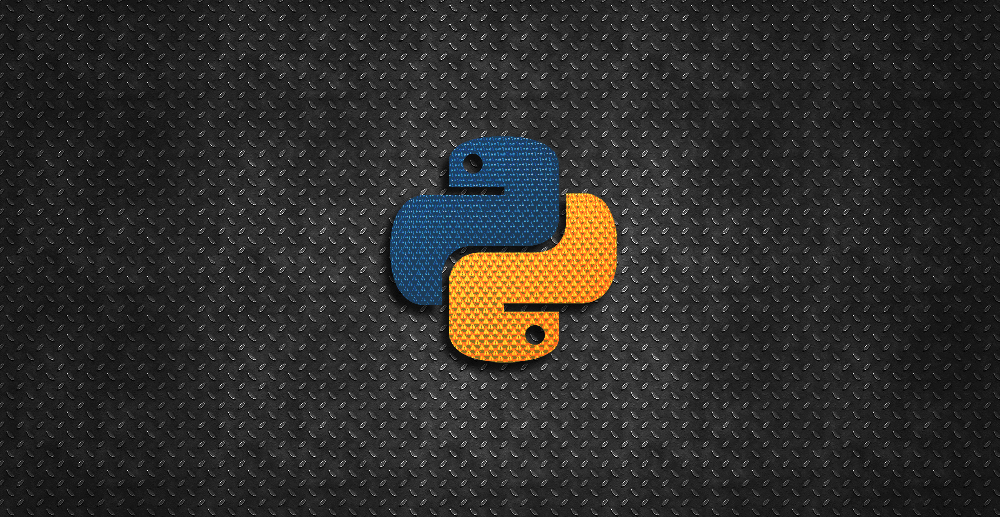

إذا كنت تعرف وتتقن لغات برمجة أخرى سابقا فسيستغرق الأمر شهر واحد تقريبا لتعلم لغة بايثون إذا كنت تستثمر من 3 إلى 5 ساعات يوميا، أما إذا كنت جديدًا في مجال البرمجة، فقد تحتاج إلى مزيد من الوقت لتعلم لغة بايثون ومع ذلك قد لا يستغرق الأمر أكثر من 3 أشهر لتعلم لغة بايثون على اعتبار أنك مبتدئ وليس لديك أي خلفية برمجية مسبقا.
وتمتلئ الإنترنت بالمصادر والدورات والكتب لتعلم بايثون، وفيما يلي ترشيح لأفضل المصادر التي يمكنك بدء تعلم أولي لغاتك البرمجية من خلالها:

### أولا: المصادر العربية

-   الكتب:
    -   تعلم البرمجة مع بايثون 3، تأليف جِيرار سوين، وترجمة هشام رزق الله وآخرون
    -   مقدمة في البرمجة عن طريق لغة بايثون، محمد الغافلي
    -   فكر بايثون، تأليف الآن داوني، وترجمة طارق زيد الكيلاني
-   الدورات:
    -   **دورة محمد عيسى: دورة Python 3 أساسيات ومتقدم**
        تشمل الدورة العديد من الموضوعات بداية من الأساسيات والتعابير المنطقية ومعالجة الأخطاء والدوال وحتى البرمجة الكائنية والتعامل المكتبات وقواعد البيانات.
        https://www.youtube.com/playlist?list=PLMYF6NkLrdN98I0nEXOuR_gK8b4w-NJcN
    -   **الدليل الشامل لتعلم بايثون**
        دورة مجانية باللغة العربية على موقع Udemy مدتها 9 ساعات وتتكون من 47 درس، وتتسم بالشرح البسيط حيث أنها موجهة للمبتدئين.
        https://www.udemy.com/course/learn-python-arabic
    -   **مقدمة إلى برمجة الحاسب باستخدام لغة Python**
        دورة مقدمة من منصة رواق باللغة العربية تستعرض المفاهيم الأساسية للبرمجة باستخدام لغة بايثون ولا تتطلب أي معرفة مسبقة.
        https://www.rwaq.org/courses/introduction-to-programming
-   مصادر أخرى:
-   توثيق بايثون باللغة العربية من أكاديمية حسوب
    https://wiki.hsoub.com/Python
-   فهرس مصادر تعلم بايثون باللغة العربية
    https://abotyim.github.io/Learn-Python-Arabic

### ثانيا: المصادر الإنجليزية

-   الكتب:
    -   Python Cookbook by David Beazley and Brian K. Jones
    -   Head First Python: A Brain-Friendly Guide, by Paul Barry
    -   Python Crash Course: A Hands-On, Project-Based Introduction to Programming, by Eric Matthes
    -   Learn Python the Hard Way: 3rd Edition, by Zed A. Shaw
-   الدورات:
    -   **Google's Python Class**
        لدي جوجل مجموعة ممتازة من المصادر التعليمية للمبتدئين، وهي مجانية تماما ومناسبة للأشخاص الذين لديهم القليل من الخبرة والمعرفة في مجال البرمجة. تتضمن هذه المنصة دورة مكونة من دروس مكتوبة ومقاطع فيديو للدروس المصورة، والكثير من التمارين البرمجية.
        https://developers.google.com/edu/python
    -   **Programming for Everybody (Getting Started with Python)**
        أحد الدورات المتميزة من جامعة Michigan المتاحة على موقع Edx بشكل مجاني، وهي موجهة لمن ليس لديه أي خلفية مسبقة عن البرمجة. مدة هذه الدورة 7 أسابيع وتتطلب دراسة من 2-4 ساعات أسبوعيا فقط.
        https://www.edx.org/course/programming-for-everybody-getting-started-with-pyt
    -   **Introduction to Python: Absolute Beginner**
        دورة تدريبية من مايكروسوفت ستتعلم من خلالها كيفية كتابة وتحرير أكواد بايثون على Jupyter Notebooks، وهو متصفح مخصص بشكل أساسي لتحرير الأكواد وتجربتها ويغنيك تماما عن تثبيت بايثون على جهازك. مدتها هذه الدورة 5 أسابيع وتتطلب دراسة من 3-4 ساعات أسبوعيا بشكل منتظم.
        https://www.edx.org/course/introduction-to-python-absolute-beginner-2
-   مصادر أخرى:
    -   توثيق بايثون https://docs.python.org/3
    -   مسارات تعلم بايثون https://realpython.com/learning-paths/
    -   فهرس أدوات ومكتبات ومصادر بايثون https://github.com/vinta/awesome-python

---

هذا الموضوع نُشر باﻷصل في مجلة لغة العصر العدد 231 شهر 03-2020 ويمكن الإطلاع عليه [هنا](https://drive.google.com/file/d/1i9EDdJLUAi-G93XQt3jU7SV1pP78UDvm/view?usp=sharing).


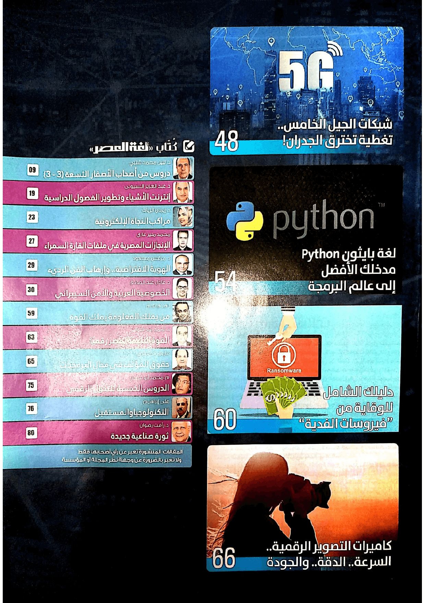

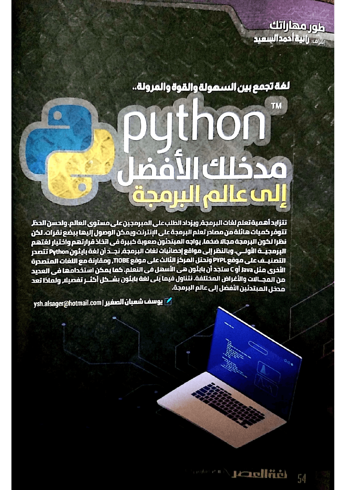

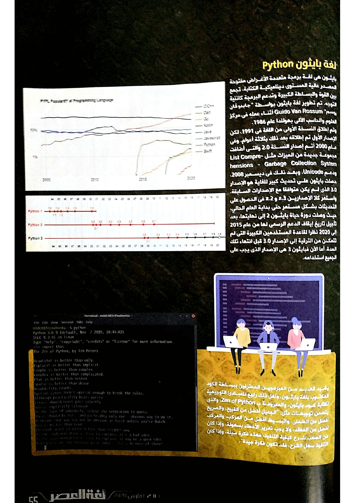

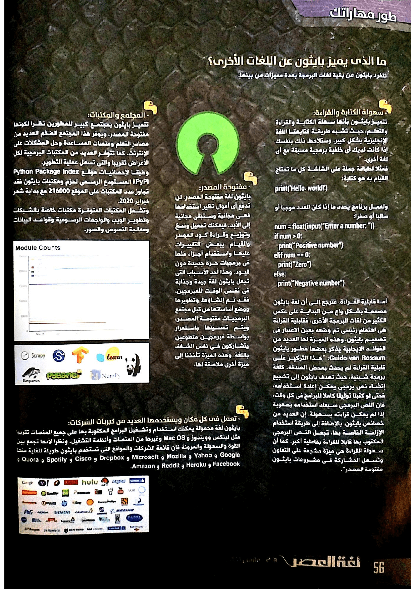

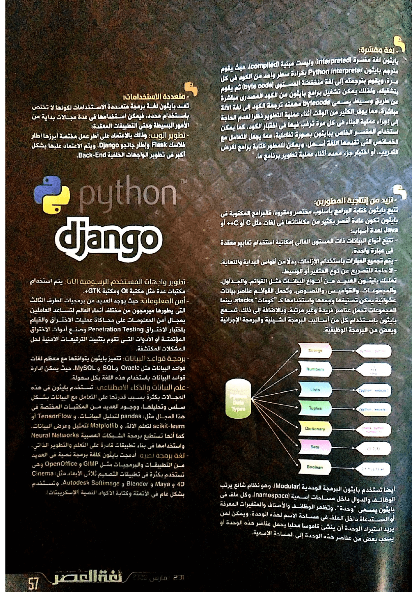

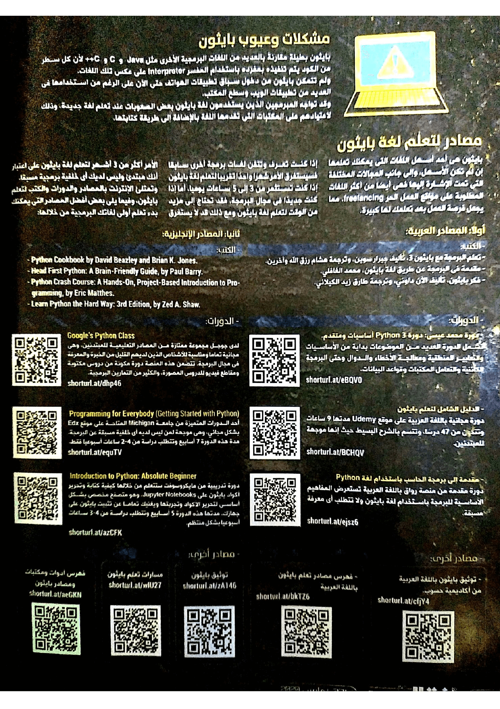
