+++
title = "ربط الهاتف المحمول بالكمبيوتر في ويندوز ولينكس وماك"
date = "2019-08-01"
description = "مع تزايد استخدام شبكات الـ Wi-Fi في المنزل والعمل ومختلف الأماكن، أصبح من الشائع جدا أن يكون كلا من الهتاف المحمول والكمبيوتر الشخصي متصلين بنفس الشبكة، مما يتيح إمكانية ربط كلاهما بالآخر والحصول على عدد من المميزات المفيدة. دعونا نتعرف على كيفية القيام بذلك على كل من ويندوز ولينكس وMac."
categories = ["مهارات رقمية",]
tags = ["مجلة لغة العصر"]
images = ["images/0.png"]

+++
مع تزايد استخدام شبكات الـ Wi-Fi في المنزل والعمل ومختلف الأماكن، أصبح من الشائع جدا أن يكون كلا من الهتاف المحمول والكمبيوتر الشخصي متصلين بنفس الشبكة، مما يتيح إمكانية ربط كلاهما بالآخر والحصول على عدد من المميزات المفيدة. دعونا نتعرف على كيفية القيام بذلك على كل من ويندوز ولينكس وMac.

## أولا: ربط الهاتف بويندوز 10

يوفر ويندوز 10 للمستخدم تطبيق "هاتفك" Your Phone لربط الهاتف بالويندوز، حيث يتيح لك المراسلة من خلال الكمبيوتر، ومزامنة الإشعارات الخاصة بك، ونقل الصور بين الجهازين لاسلكيًا. كما سيوفر قريبا عرض شاشة الهاتف على الكمبيوتر على أجهزة أندرويد. أما بالنسبة لمستخدمي iOS فيمكنهم فقط استخدام ميزة "المتابعة على الكمبيوتر" لإرسال روابط مواقع الإنترنت إلى أجهزتهم، وذلك نظرا لتقييدات نظام أبل التي تمنع عددا من المميزات المتاحة على ويندوز.

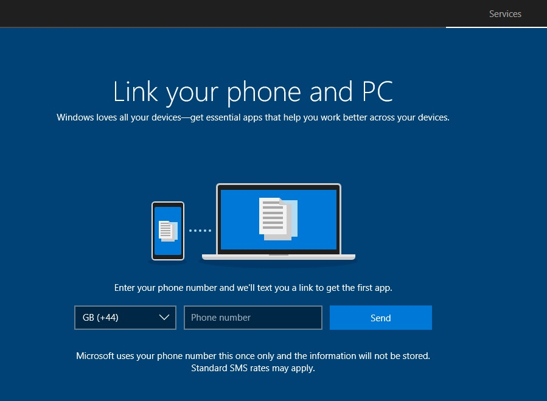

### كيفية ربط هاتفك المحمول بويندوز 10 عن طريق تطبيق Your Phone

يأتي تطبيق Your Phone مثبتًا على ويندوز 10 بشكل افتراضي مما يجعل عملية الربط بسيطة، كما يمكنك تنزيله من المتجر إذا قمت بإلغاء تثبيته من قبل.
1. قم بفتح تطبيق "Your Phone" الخاص بك من قائمة البداية Start.

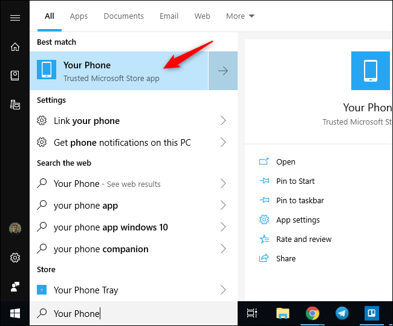

2. سيطلب منك التطبيق تسجيل الدخول بحساب مايكروسوفت إذا لم تكن قد سجلت من قبل، ثم سيطلب منك إدخال رقم هاتفك ليرسل لك رابط تطبيق " Your Phone Companion" لتثبيته.
3. بعد تثبيت التطبيق على هاتفك وفتحه قم بتسجيل الدخول بنفس الحساب الموجود على الويندوز، ثم وافق على الصلاحيات التي سيطلبها التطبيق واضغط Allow للسماح بالربط بين الجهازين.

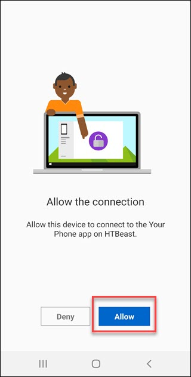

### نقل الصور من الهاتف إلى الويندوز

يعرض التطبيق على الويندوز الصور ولقطات الشاشة الحديثة الموجودة على هاتفك، وبالتحديد آخر 25 صورة. ويمكنك الوصول إليها بالضغط على الصور Photos في القائمة الجانبية.

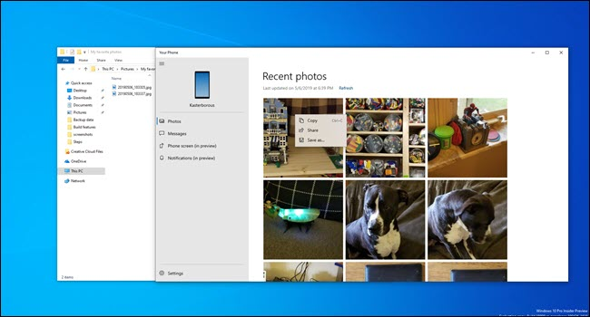

يمكنك سحب وإفلات أي صورة لنسخها، أو الضغط عليها بزر الماوس الأيمن واختيار Copy أو Save as لحفظها في جهازك، كما يمكنك اختيار Share لمشاركة الصورة إلى أي مكان آخر.

قد تبدو هذه الميزة تافهة لكنها في الواقع توفر عليك العديد من الخطوات عند الحاجة للوصول إلى صورة حديثة توصيل الهاتف بالكمبيوتر سلكيا أو جلب الملف عبر أحد خدمات التخزين السحابي.

لكن ما يعيب تصفح الصور هو كونه محدودا بآخر ملفات فقط، فإذا أردت تصفح أو نقل صور أقدم فسيجب عليك استخدام طرق أخرى.

### إرسال الرسائل النصية عبر الويندوز

داخل قسم الرسائل Messages ستجد الرسائل النصية الموجودة على هاتفك، يمكنك رؤية الردود والرسائل الواردة في مكان واحد. ولإرسال رسالة جديدة كل ما عليك فعله هو اختيار المرسل إليه والكتابة والضغط على إرسال. كما يمكنك أيضا التمرير عبر سجل الرسائل إذا رغبت في العودة لرسائل أقدم دون أي مشاكل.

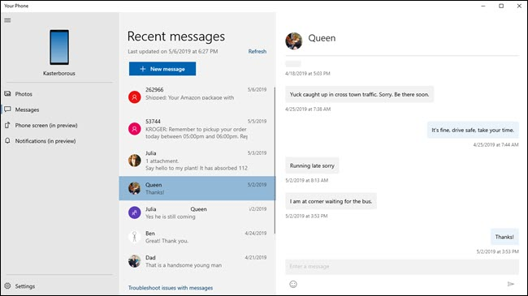

### عرض إشعارات الهاتف على الويندوز

يوفر تطبيق Your Phone ميزة أخرى رائعة، هي عرض إشعارات الهاتف على الويندوز والتحكم فيها، ويمكنك تخصيص التطبيق التي يسمح بها بعض الإشعارات أو تحديدها لمنع الإزعاج.

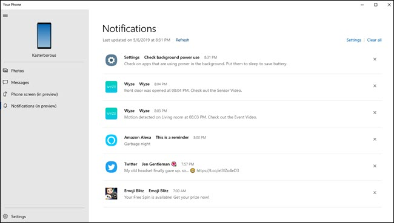

ولتفعيل هذه الميزة ستحتاج إلى السماح لتطبيق Your Phone Companion على هاتفك بالوصول إلى الإشعارات لعرضها على الويندوز عبر تطبيق Your Phone. قم بفتح قسم الإشعارات Notifications ثم اضغط على الزر "Open Settings for Me"، سيتم فتح إعدادات الوصول إلى الإشعارات على هاتفك. قم بإعطاء الصلاحيات لتطبيق Your Phone Companion.

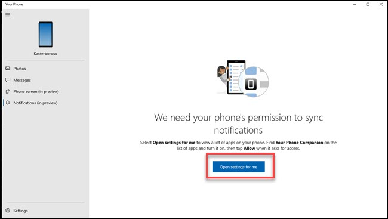

أما لتعديل التطبيقات التي ترغب في عرض إشعاراتها، اضغط على زر الإعدادات الموجود أسفل يسار تطبيق Your Phone، ثم مرر للأسفل وستجد الاختيار " Pick the apps you want notifications from." قم بالضغط عليه وستظهر قائمة التطبيقات الموجودة على هاتفك، ويمكنك إيقاف إشعارات أي منها كما ترغب.

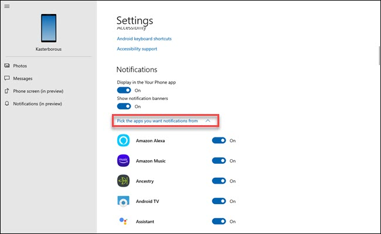

## ثانيا: ربط الهاتف بنظام لينكس

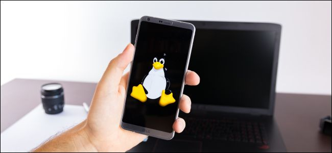

إذا كنت أحد مستخدمي توزيعات لينكس، يمكنك استخدام KDE Connect لربط الهاتف بجهازك الكمبيوتر الخاص بك والحصول على مجموعة كبيرة من المميزات أبرزها:
- التوصل بإشعارات الهاتف على الكمبيوتر والعكس والرد عليها.
- مزامنة الحافظة بين الجهازين.
-التحكم في الوسائط التي تشغل على الكمبيوتر من خلال الهاتف.
- استخدام الهاتف كجهاز تحكم في الكمبيوتر.
- مشاركة الملفات بين الجهازين.
- تصفح ملفات الهاتف لاسلكيا من خلال الكمبيوتر.
- عرض حالة شحن الهاتف.

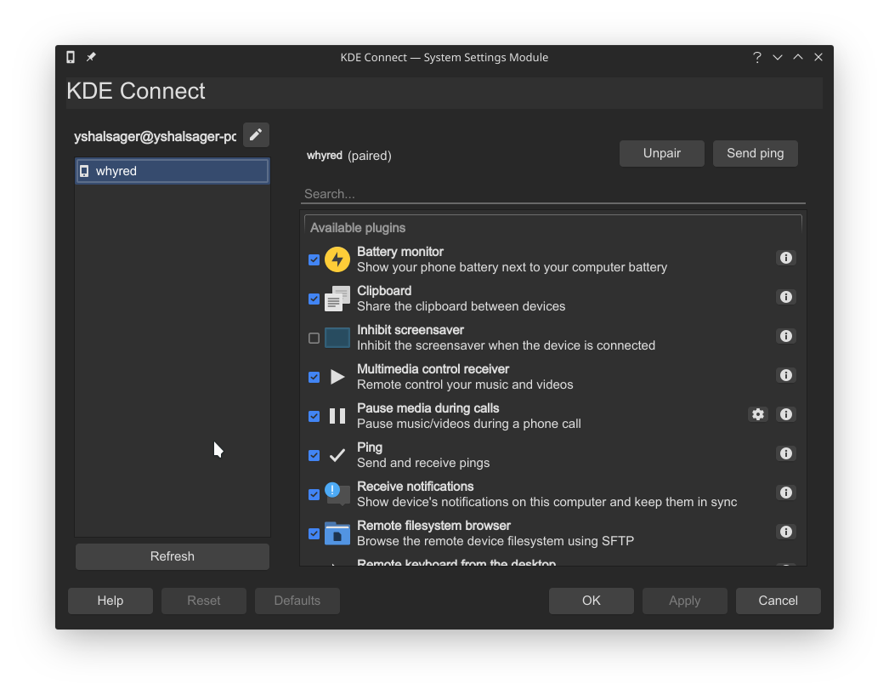

يعد KDE Connect جزء أساسي من واجهة سطح مكتب KDE على لينكس، فهو متضمن افتراضيا ولا يحتاج إلى أي تثبيت أو إعداد. ويمكن لمستخدمي واجهة GNOME استخدام إضافة GSConnect التي يتكامل مع تطبيق KDE Connect على أندرويد.

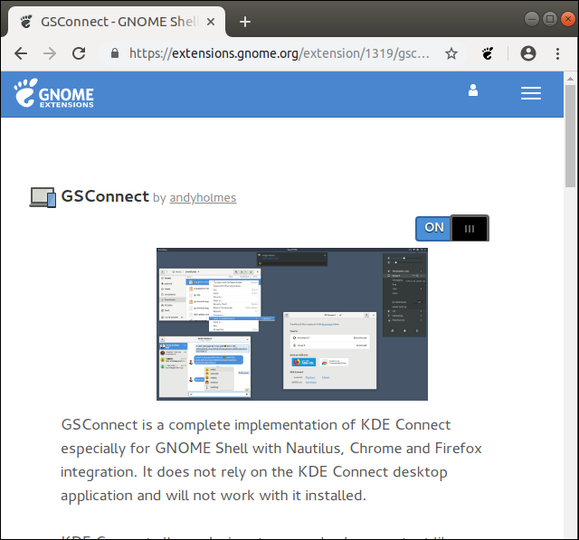

أما بالنسبة لواجهات سطح المكتب الأخرى، يحتاج مستخدموها إلى تثبيت الحزم kdeconnect - indicator-kdeconnect

### كيفية ربط هاتفك المحمول بـ لينكس عن طريق تطبيق KDE Connect

تحتاج أولا لتوصيل كلا من الهاتف والكمبيوتر بنفس جهاز الراوتر، ولا يشترط أن يكون اتصال الكمبيوتر لاسلكيا. بعد ذلك تحتاج لتثبيت تطبيق KDE Connect على هاتفك الأندرويد، ستجد التطبيق بمجرد البحث عنه على متجر جوجل بلاي.

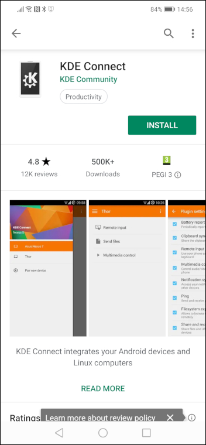

بعد تثبيت وفتح التطبيق ستجد جهاز الكمبيوتر ظاهرا أسفل Available devices، اضغط عليه ثم على الزر Request pairing لطلب الاقتران، ستظهر رسالة على الكمبيوتر بمحاولة الهاتف للاقتران، اضغط Accept للموافقة.

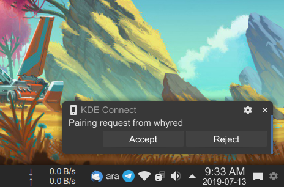

سيظهر لك تطبيق الهاتف الآن الخيارات المتاحة والوظائف التي تتطلب الحصول على بعض الصلاحيات، مثل إرسال الرسائل ومزامنة الإشعارات. لتفعيل أي منها، اضغط على الوظيفة وقم بإعطاء الصلاحيات المطلوبة.

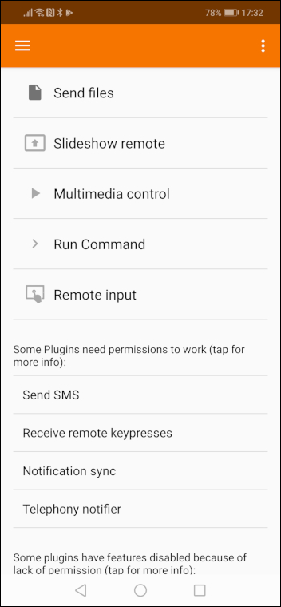

## ثالثا: ربط iPhone بنظام Mac OS

نظرا لكون الجهازين من إنتاج شركة أبل، فإن التكامل بين ال iPhone وال Mac يسمح للمستخدم بالقيام بالعديد من الأمور التي تجعل استخدام كلاهما أسهل وتوفر المزيد من الوقت.

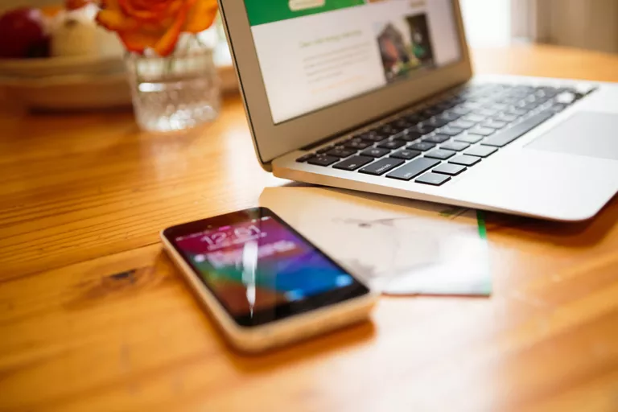

### المزامنة بين iPhone وMac

تعتبر المزامنة باستخدام iTunes واحدة من أبسط الطرق لتوصيل iPhone بـ Mac والتي تمكنك من مزامنة كافة المحتوي الموجود على الهاتف من صور وملفات وكتب، ويمكنك القيام ذلك إما عن طريق كابل USB، قم بتوصيل الهاتف بمنفذ USB على جهاز Mac وسيتم فتح iTunes تلقائيًا لتظهر لك معلومات الجهاز وخيارات المزامنة.

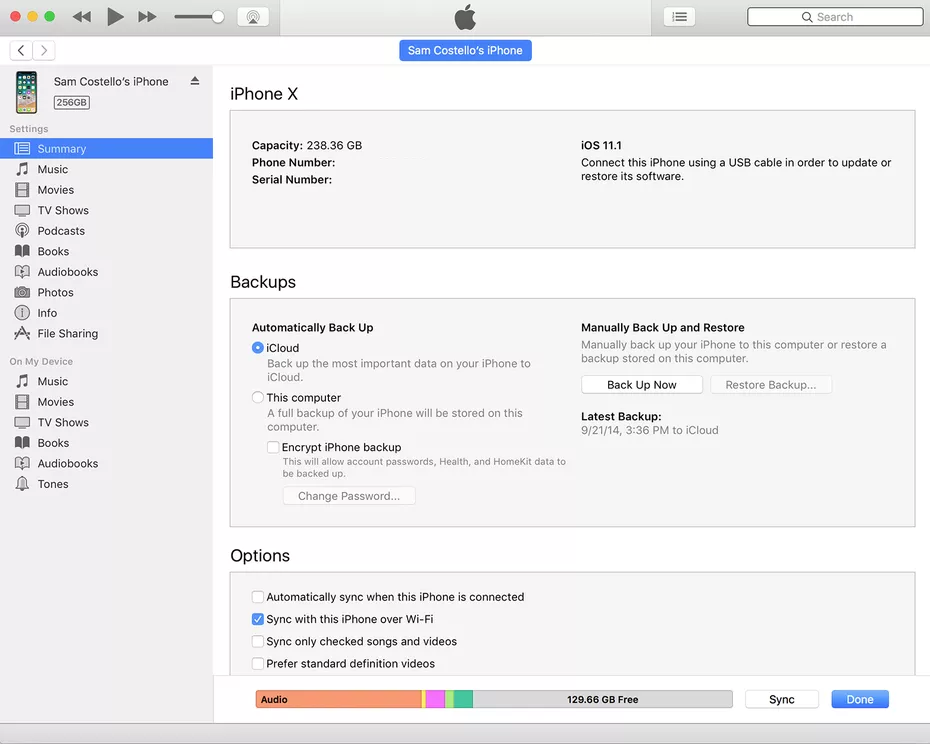

أو عن طريق شبكة بشرط أن يكون كلا الجهازين متصلين بنفس الشبكة. ولكن تحتاج أولا لتفعيل هذا الاختيار من داخل إعدادات ال iTunes، بعد توصيل الهاتف بـ Mac اختر Sync with this iPhone over Wi-Fi لتفيل المزامنة باستخدام ال Wi-Fi.

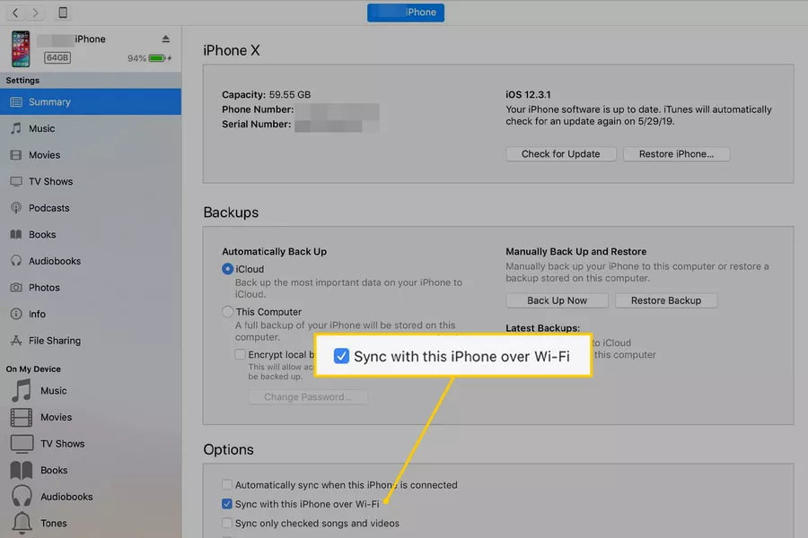

### توصيل iPhone وMac باستخدام iCloud

يفضل البعض المزامنة لاسلكيا مع استبعاد iTunes من المعادلة، وذلك باستخدام iCloud. فقط تأكد من تسجيل الدخول على جهاز Mac وiPhone بنفس حساب iCloud وأن كلاهما لديه نفس إعدادات المزامنة. بعد ذلك، ستتم مزامنة أي تغيير في البيانات الموجودة على جهاز ما إلى iCloud ثم إلى الجهاز الآخر، بحيث يكون جميعهم متزامنين دائمًا.

لتسجيل الدخول إلى iCloud على iPhone: افتح الإعدادات ثم اسم المستخدم الخاص بك ثم iCloud، وقم بالتسجيل باستخدام اسم المستخدم وكلمة المرور لحساب أبل الخاص بك.

لتسجيل الدخول إلى iCloud على Mac: من قائمة أبل أعلى يسار الشاشة قم باختيار إعدادات النظام ثم ثم iCloud، واتبع التعليمات التي ستظهر لك لإتمام التسجيل.

### ميزات الاستمرارية بين iPhone وMac

Continuity أو "الاستمرارية" هي إحدى مميزات AirDrop التي تعمل على مختلف أجهزة أبل، وتسمح لك ب"الاستمرار" في عمل نفس المهام التي بدأتها على أحد الأجهزة على الآخر، وتشمل:

- التسليم Handoff: تمكنك هذه الميزة من تناقل العناصر بين الأجهزة، مثل أن تبدأ في كتابة إيميل على iPhone ثم تستأنف ذلك على iPad، أو أن تتصفح أحد المواقع على iPhone وتكمل التصفح من حيث توقفت على Mac.
- إجراء المكالمات والرد عليها: تستطيع الرد على مكالمات هاتفك باستخدام جهاز Mac إذا كان موجودا بعيدا عن متناول يدك. ولتمكين هذه الميزة، من إعدادات هاتفك - قسم الهاتف - المكالمات على أجهزة أخرى Calls on Other Devices - فعل "السماح بالمكالمات على الأجهزة الأخرى" ثم حدد أي من أجهزتك يمكنه إجراء المكالمات واستقبالها.
- الحافظة الموحدة: عندما تقوم بنسخ نص وصور وبيانات أخرى، يمكن لكل جهاز به حساب iCloud الخاص بك لصقها. فإذا قمت بنسخ نص على جهاز iPhone الخاص بك، فسيتم أيضًا نسخه تلقائيًا على جهاز Mac ويمكن لصقه هناك.

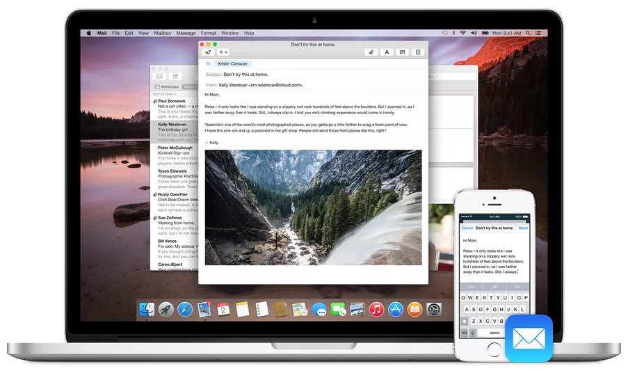

ولاستخدام ميزات "الاستمرارية" تحتاج إلى أن يكون حساب أبل الخاص بك موجودا على كل الأجهزة، وأن يكون البلوتوث مفتوحا، وأن تكون الأجهزة متصلة بنفس شبكة Wi-Fi. أيضا تحتاج إلى تشغيل ميزة Handoff على Mac من إعدادات النظام – الإعدادات العامة – ثم تفعيل الاختيار Allow Handoff between this Mac and your iCloud devices. وعلى iPhone كذلك من الإعدادات – الإعدادات العامة ثم القسم Handoff.

---

هذا الموضوع نُشر باﻷصل في مجلة لغة العصر العدد 224 شهر 08-2019 ويمكن الإطلاع عليه [هنا](https://drive.google.com/file/d/1DvrXcgPjjo94JHlcALfN6vUmsd7Dx905/view?usp=sharing).

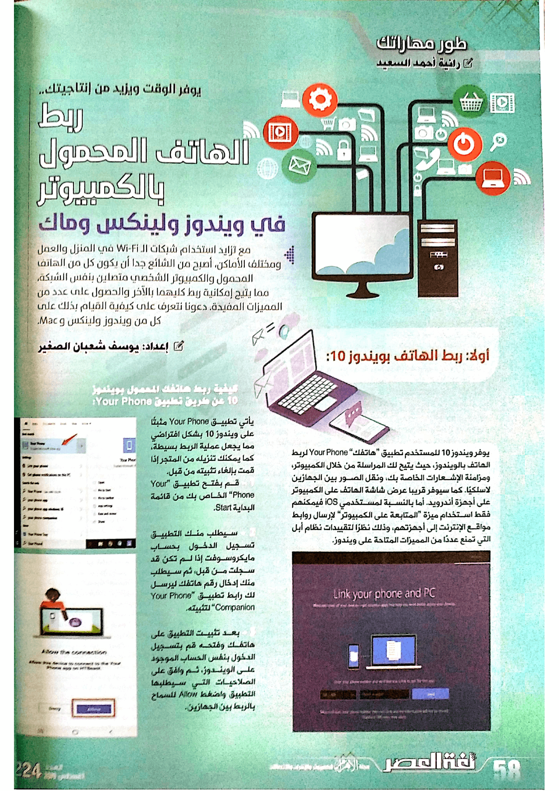

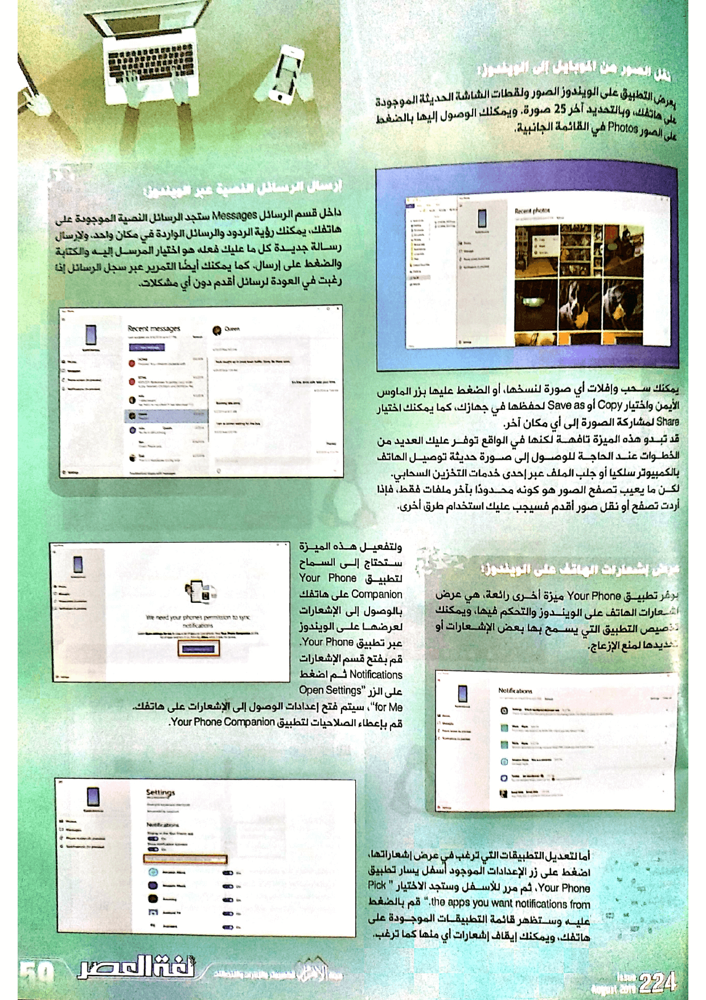

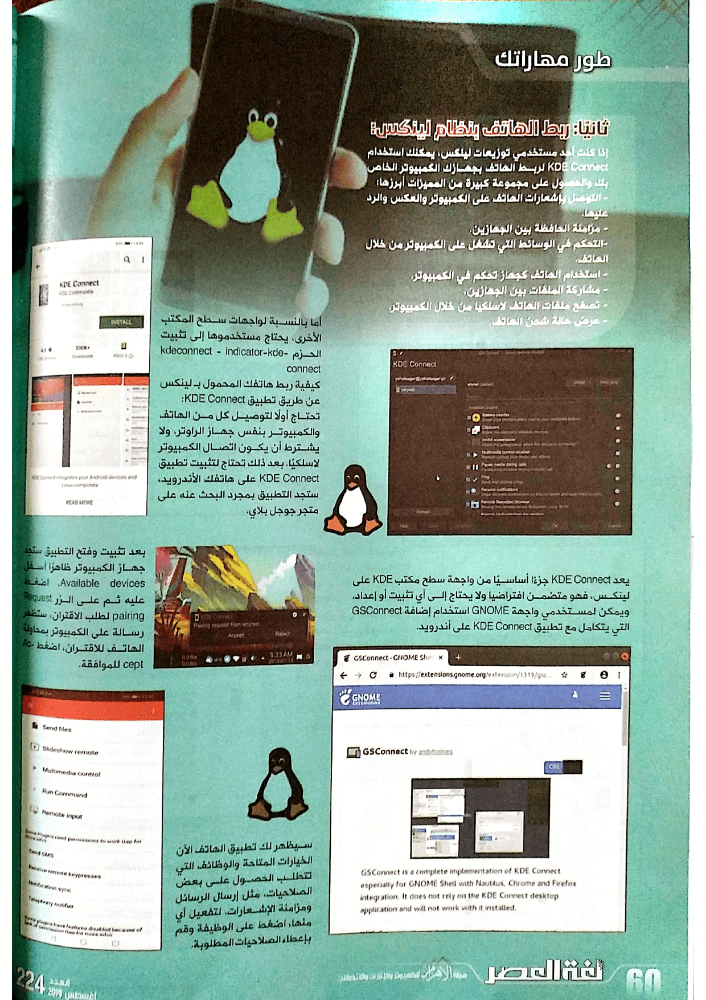

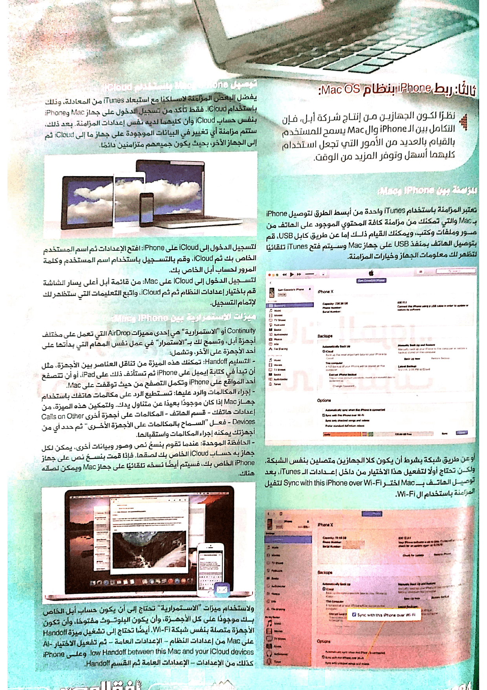

