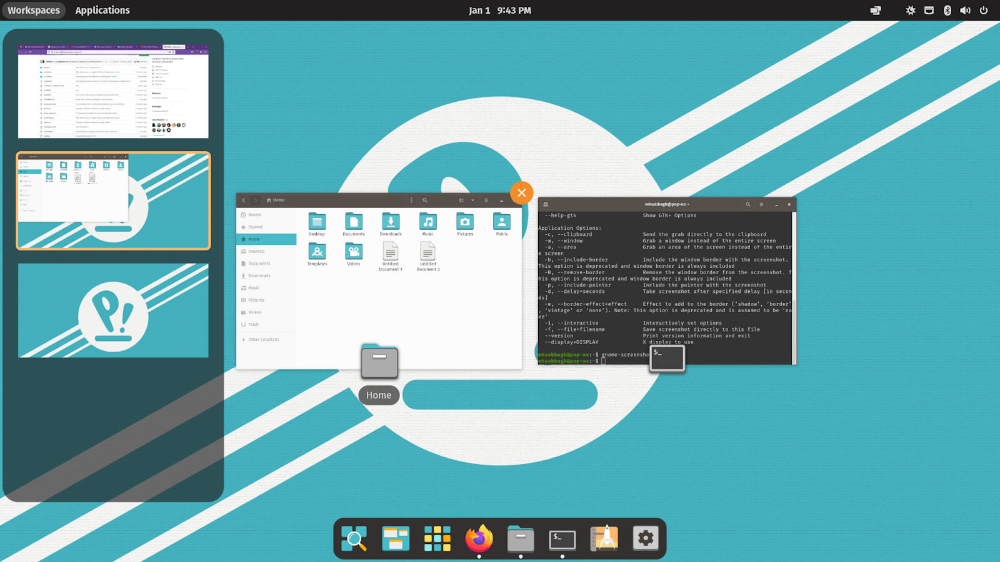
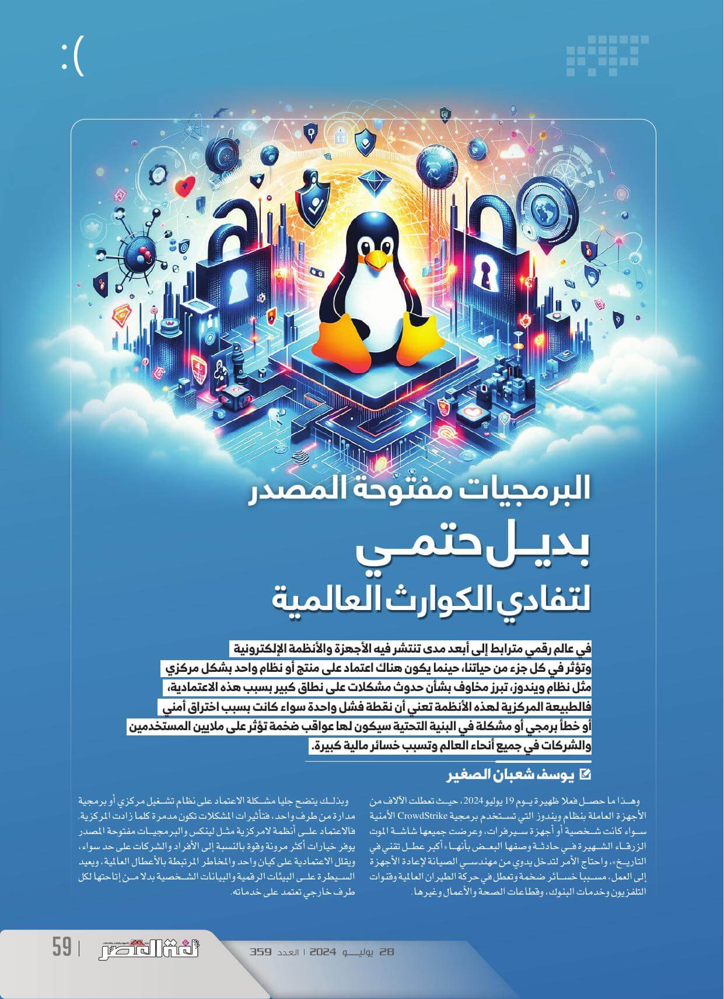
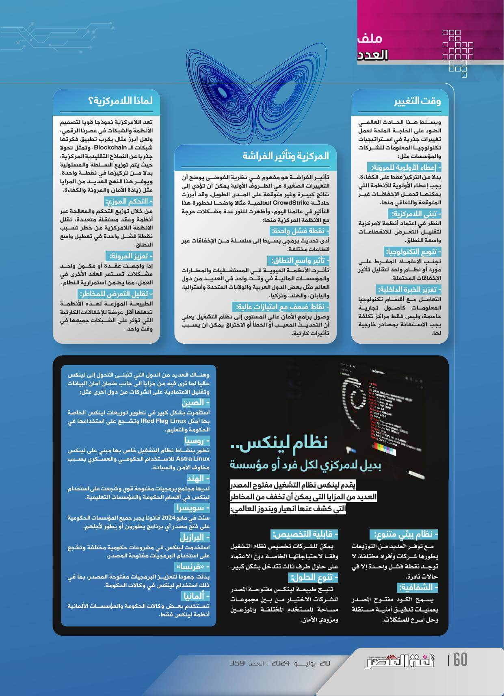
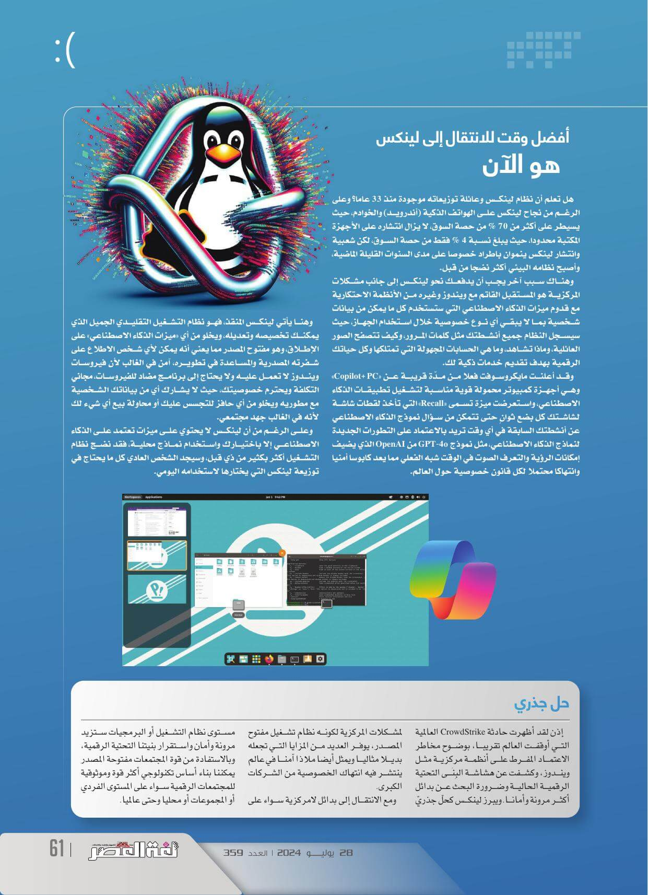

+++

title = "البرمجيات مفتوحة المصدر بديل حتمي لتفادي الكوارث العالمية"
date = "2024-07-28"
description = "في عالم رقمي مترابط إلى أبعد مدى تنتشر فيه الأجهزة والأنظمة الإلكترونية وتؤثر في كل جزء في حياتنا، حينما يكون هناك اعتماد على منتج أو نظام واحد بشكل مركزي مثل نظام ويندوز، تبرز مخاوف بشأن حدوث مشاكل على نطاق كبير بسبب هذه الاعتمادية، فالطبيعة المركزية لهذه الأنظمة تعني أن نقطة فشل واحدة سواء كانت بسبب اختراق أمني أو خطأ برمجي أو مشكلة في البنية التحتية سيكون لها عواقب ضخمة تؤثر على ملايين المستخدمين والشركات في جميع أنحاء العالم وتسبب خسائر مالية كبيرة."
categories = ["برمجيات حرة",]
tags = ["مجلة لغة العصر"]

+++

## مقدمة

في عالم رقمي مترابط إلى أبعد مدى تنتشر فيه الأجهزة والأنظمة الإلكترونية وتؤثر في كل جزء في حياتنا، حينما يكون هناك اعتماد على منتج أو نظام واحد بشكل مركزي مثل نظام ويندوز، تبرز مخاوف بشأن حدوث مشاكل على نطاق كبير بسبب هذه الاعتمادية، فالطبيعة المركزية لهذه الأنظمة تعني أن نقطة فشل واحدة سواء كانت بسبب اختراق أمني أو خطأ برمجي أو مشكلة في البنية التحتية سيكون لها عواقب ضخمة تؤثر على ملايين المستخدمين والشركات في جميع أنحاء العالم وتسبب خسائر مالية كبيرة.

وهذا ما حصل فعلًا ظهيرة يوم 19 يوليو 2024 حيث تعطلت الآلاف من الأجهزة العاملة بنظام ويندوز التي تستخدم برمجية CrowdStrike الأمنية سواءًا كانت شخصية أو أجهزة سيرفرات، وعرضت جميعها شاشة الموت الزرقاء الشهيرة في حادثة وصفها البعض بأنها "أكبر عطل تقني في التاريخ"، واحتاج الأمر لتدخل يدوي من مهندسي الصيانة لإعادة الأجهزة إلى العمل، مسببًا خسائر ضخمة وتعطل في حركة الطيران العالمية وقنوات التليفزيون وخدمات البنوك وقطاعات الصحة والأعمال وغيرها.

وبذلك يتضح جليًا مشكلة الاعتماد على نظام تشغيل مركزي أو برمجية مدارة من طرف واحد، فتأثيرات المشاكل تكون مدمرة كلما زادت المركزية. فالاعتماد على أنظمة لامركزية مثل لينكس والبرمجيات مفتوحة المصدر يوفر خيارات أكثر مرونة وقوة بالنسبة إلى الأفراد والشركات على حد سواء، ويقلل الاعتمادية على كيان واحد والمخاطر المرتبطة بالأعطال العالمية، ويعيد السيطرة على البيئات الرقمية والبيانات الشخصية بدلًا من إتاحتها لكل طرف خارجي تعتمد على خدماته.

## وقت التغيير

ويسلط هذا الحادث العالمي الضوء على الحاجة الملحة لعمل تغييرات جذرية في استراتيجيات تكنولوجيا المعلومات للشركات والمؤسسات مثل:

1. **إعطاء الأولوية للمرونة**: بدلًا من التركيز فقط على الكفاءة، يجب إعطاء الأولوية للأنظمة التي يمكنها تحمل الإخفاقات غير المتوقعة والتعافي منها.
2. **تبني اللامركزية**: النظر في اعتماد أنظمة لامركزية لتقليل التعرض للانقطاعات واسعة النطاق.
3. **تنويع التكنولوجيا**: تجنب الاعتماد المفرط على مورد أو نظام واحد لتقليل تأثير الإخفاقات المحتملة.
4. **تعزيز الخبرة الداخلية**: التعامل مع أقسام تكنولوجيا المعلومات كأصول تجارية حاسمة، وليس فقط مراكز تكلفة يجب الاستعانة بمصادر خارجية لها.

## المركزية وتأثير الفراشة

تأثير الفراشة هو مفهوم في نظرية الفوضى يوضح أن التغييرات الصغيرة في الظروف الأولية يمكن أن تؤدي إلى نتائج كبيرة وغير متوقعة على المدى الطويل. وقد أبرزت حادثة CrowdStrike العالمية مثالًا واضحا لخطورة هذا التأثير في عالمنا اليوم وأظهرت للنور عدة مشكلات حرجة مع الأنظمة المركزية منها:

1. **نقطة فشل واحدة**: أدى تحديث برمجي بسيط إلى سلسلة من الإخفاقات عبر قطاعات مختلفة.
2. **تأثير واسع النطاق**: تأثرت الأنظمة الحيوية في المستشفيات والمطارات والمؤسسات المالية في وقت واحد في العديد من دول العالم مثل بعض الدول العربية والولايات المتحدة وأستراليا واليابان والهند وتركيا.
3. **نقاط ضعف مع امتيازات عالية**: وصول برامج الأمان عالي المستوى إلى نظام التشغيل يعني أن التحديث المعيب أو الخطأ أو الاختراق يمكن أن يسبب تأثيرات كارثية.

## لماذا اللامركزية؟

تعد اللامركزية نموذجًا قويًا لتصميم الأنظمة والشبكات في عصرنا الرقمي ولعل أبرز مثال يقرب تطبيق فكرتها شبكات ال Blockchain، وتمثل تحولًا جذريًا عن النماذج التقليدية المركزية، حيث يتم توزيع السلطة والمسؤولية بدلاً من تركيزها في نقطة واحدة. ويوفر هذا النهج العديد من المزايا مثل زيادة الأمان والمرونة والكفاءة.

1. **التحكم الموزع**: من خلال توزيع التحكم والمعالجة عبر أنظمة وعقد مستقلة متعددة، تقلل الأنظمة اللامركزية من خطر تسبب نقطة فشل واحدة في تعطيل واسع النطاق.
2. **تعزيز المرونة**: إذا واجهت عقدة أو مكون واحد مشكلات، تستمر العقد الأخرى في العمل، مما يضمن استمرارية النظام.
3. **تقليل التعرض للمخاطر**: الطبيعة الموزعة لهذه الأنظمة تجعلها أقل عرضة للإخفاقات الكارثية التي تؤثر على الشبكات جميعها في وقت واحد.

## نظام لينكس: بديل لامركزي لكل فرد أو مؤسسة

يقدم لينكس نظام التشغيل مفتوح المصدر العديد من المزايا التي يمكن أن تخفف من المخاطر التي كشف عنها انهيار ويندوز العالمي:

1. **نظام بيئي متنوع**: مع توفر العديد من التوزيعات يطورها شركات وأفراد مختلفة، لا توجد نقطة فشل واحدة إلا في حالات نادرة.
2. **الشفافية**: يسمح الكود مفتوح المصدر بعمليات تدقيق أمنية مستقلة وحل أسرع للمشكلات.
3. **قابلية التخصيص**: يمكن للشركات تخصيص نظام التشغيل وفقًا لاحتياجاتها الخاصة دون الاعتماد على حلول طرف ثالث تتدخل بشكل كبير.
4. **تنوع الحلول**: تتيح طبيعة لينكس مفتوحة المصدر للشركات الاختيار من بين مجموعات مساحة المستخدم المختلفة والموزعين ومزودي الأمان.

وهناك العديد من الدول التي تتبنى التحول إلى لينكس حاليًا لما ترى فيه من مزايا إلى جانب ضمان أمان البيانات وتقليل الاعتمادية على الشركات من دول أخرى مثل:

- **الصين:** استثمرت بشكل كبير في تطوير توزيعات لينكس الخاصة بها (مثل Red Flag Linux) وتشجع على استخدامها في الحكومة والتعليم.
- **روسيا:**  تطور بنشاط نظام التشغيل خاص بها مبني على لينكس Astra Linux للاستخدام الحكومي والعسكري بسبب مخاوف الأمن والسيادة.
- **الهند:** لديها مجتمع برمجيات مفتوحة قوي وشجعت على استخدام لينكس في أقسام الحكومة والمؤسسات التعليمية.
- **سويسرا**: سنّت في مايو 2024 قانونًا يجبر جميع المؤسسات الحكومية على فتح مصدر أي برنامج يطورون أو يُطوّر لأجلهم.
- **البرازيل:** استخدمت لينكس في مشروعات حكومية مختلفة وتشجع على استخدام البرمجيات مفتوحة المصدر.
- **فرنسا:** بذلت جهودًا لتعزيز البرمجيات مفتوحة المصدر، بما في ذلك استخدام لينكس في وكالات الحكومة.
- **ألمانيا:** تستخدم بعض وكالات الحكومة والمؤسسات الألمانية أنظمة لينكس فقط.

## أفضل وقت للانتقال إلى لينكس هو الآن

هل تعلم أن نظام لينكس وعائلة توزيعاته موجودون منذ 33 عامًا؟ وعلى الرغم من نجاحه لينكس على الهواتف الذكية (أندرويد) والخوادم حيث يسيطر على أكثر من 70٪ من حصة السوق، لا يزال انتشاره على الأجهزة المكتبة محدودًا حيث يبلغ نسبة 4٪ فقط من حصة السوق، لكن شعبية وانتشار لينكس ينموان باطراد خصوصًا على مدى السنوات القليلة الماضية، وأصبح نظامه البيئي أكثر نضجًا من قبل.

وهناك سبب آخر يجب أن يدفعك نحو لينكس إلى جانب مشكلات المركزية هو المستقبل القاتم مع ويندوز وغيره من الأنظمة الاحتكارية مع قدوم ميزات الذكاء الاصطناعي التي ستستخدم كل ما يمكن من بيانات شخصية بما لا يبقي أي نوع خصوصية خلال استخدام الجهاز، حيث سيسجل النظام جميع أنشطتك مثل كلمات المرور، وكيف تتصفح الصور العائلية، وماذا تشاهد، وما هي الحسابات المجهولة التي تمتلكها وكل حياتك الرقمية بهدف تقديم خدمات ذكية لك.

وقد أعلنت مايكروسوفت فعلًا من مدّة قريبة عن "Copilot+ PC" وهي أجهزة كمبيوتر محمولة قوية مناسبة لتشغيل تطبيقات الذكاء الاصطناعي، واستعرضت ميزة تسمى "Recall" التي تأخذ لقطات شاشة لشاشتك كل بضع ثوانٍ حتى تتمكن من سؤال نموذج الذكاء الاصطناعي عن أنشطتك السابقة في أي وقت تريد بالاعتماد على التطورات الجديدة لنماذج الذكاء الاصطناعي مثل نموذج GPT-4o من OpenAI الذي يضيف إمكانات الرؤية والتعرف الصوت في الوقت شبه الفعلي مما يعد كابوسًا أمنيًا وانتهاكًا محتملاً لكل قانون خصوصية حول العالم.

وهنا يأتي لينكس المنقذ، فهو نظام التشغيل التقليدي الجميل الذي يمكنك تخصيصه وتعديله، ويخلو من أي "ميزات الذكاء الاصطناعي" على الإطلاق، وهو مفتوح المصدر مما يعني أنه يمكن لأي شخص الاطلاع على شفرته المصدرية والمساعدة في تطويره، آمن في الغالب لأن فيروسات ويندوز لا تعمل عليه ولا يحتاج إلى برنامج مضاد للفيروسات، مجاني التكلفة ويحترم خصوصيتك حيث لا يشارك أي من بياناتك الشخصية مع مطوريه ويخلو من أي حافز للتجسس عليك أو محاولة بيع أي شيء لك لأنه في الغالب جهد مجتمعي.

وعلى الرغم من أن لينكس لا يحتوي على ميزات تعتمد على الذكاء الاصطناعي إلا باختيارك واستخدام نماذج محلية، فقد نضج نظام التشغيل أكثر بكثير من قبل، وسيجد الشخص العادي كل ما يحتاج في توزيعة لينكس التي يختارها لاستخدامه اليومي.

## الخاتمة

إذا، لقد أظهرت حادثة CrowdStrike العالمية التي أوقفت العالم تقريبًا، بوضوح مخاطر الاعتماد المفرط على أنظمة مركزية مثل ويندوز، وكشفت عن هشاشة البِنَى التحتية الرقمية الحالية وضرورة البحث عن بدائل أكثر مرونة وأمانًا. ويبرز لينكس كحلّ جذريّ لمشاكل المركزية لكونه نظام تشغيل مفتوح المصدر، يوفر العديد من المزايا التي تجعله بديلًا مثاليًا ويمثل أيضًا ملاذًا آمنًا في عالم ينتشر فيه انتهاك الخصوصية من الشركات الكبرى.

ومع الانتقال إلى بدائل لامركزية سواءًا على مستوى نظام التشغيل أو البرمجيات ستزيد مرونة وأمان واستقرار بنيتنا التحتية الرقمية، وبالاستفادة من قوة المجتمعات مفتوحة المصدر يمكننا بناء أساس تكنولوجي أكثر قوة وموثوقية للمجتمعات الرقمية سواء على المستوى الفردي أو المجموعات أو محليًا وحتى عالميًا.

---

هذا الموضوع نُشر باﻷصل في مجلة لغة العصر العدد 359 شهر 07-2024 ويمكن الإطلاع عليه [هنا](https://drive.google.com/file/d/1fpmE3YbUvyTONpPpMoHaSOtmdK66sMvg/view?usp=drive_link).

