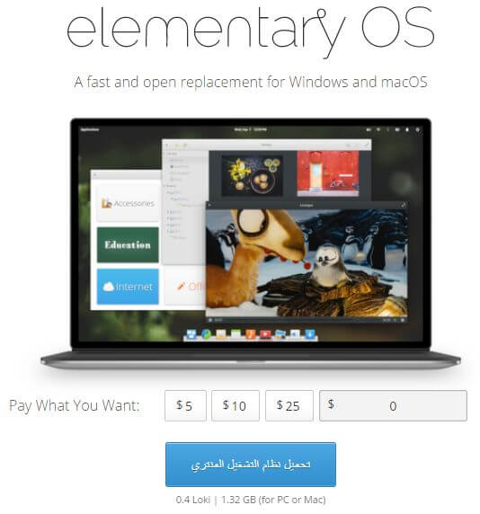
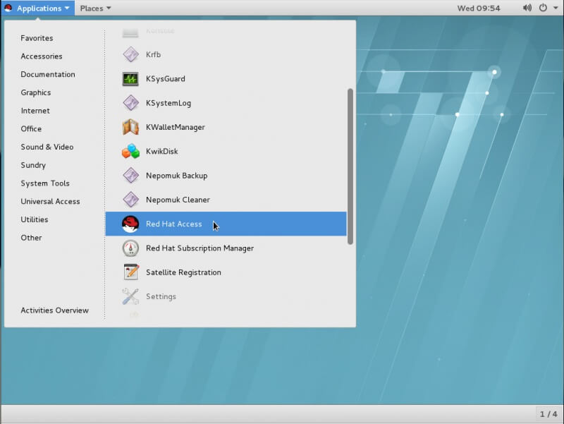
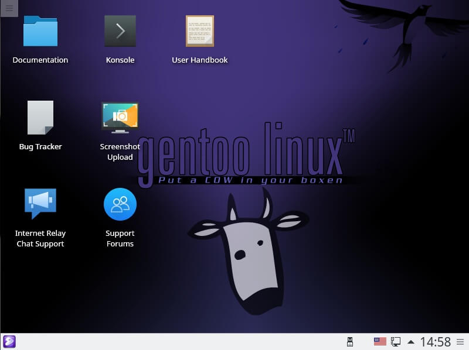
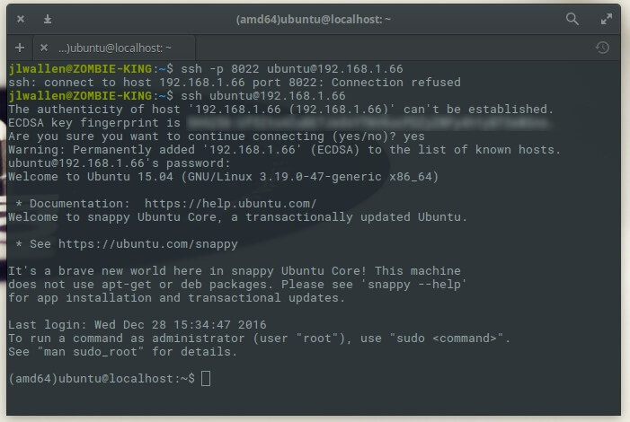

+++
title = "أفضل توزيعات لينكس لسنة 2017 وكيفية تحميلها"
date = "2017-01-09"
description = "ها قد انتهى عام 2016، الذي يعد من أفضل الأعوام التي مرت على لينكس منذ انشاءه، فقد أتم 25 عام وانضمت مايكروسوفت إلى مؤسسة لينكس، والعديد من الأحداث الهامة الأخرى. ومن المتوقع أن تكون عام 2017 مهمة أيضا لكل محبي نظام لينكس، فدعونا نتعرف على أفضل توزيعات لينكس لسنة 2017 كما جاء فى موقع liunx.com"
categories = ["لينكس",]
tags = ["افهم تكنولوجيا"]
+++

ها قد انتهى عام 2016، الذي يعد من أفضل الأعوام التي مرت على لينكس منذ انشاءه، فقد أتم 25 عام وانضمت مايكروسوفت إلى مؤسسة لينكس، والعديد من الأحداث الهامة الأخرى، وعام 2017 ستكون أيضا مهمة لكل محبي نظام لينكس، فدعونا نتعرف على أفضل توزيعات لينكس لسنة 2017 كما جاء فى موقع [liunx.com](https://www.linux.com/news/learn/sysadmin/best-linux-distributions-2017)

|                                                 |
| ------------------------------------------------------------------------ |
| [مصدر الصورة](http://0rax0.deviantart.com/art/Linux-2014-Logo-457151181) |

بالتأكيد لا يمكننا فقط إنشاء قائمة وقول "هذه هي الأفضل" لأنه في كثير من الأحيان تتخصص توزيعات لينكس لهدف معين، ولهذا سنستعرض أفضل توزيعات لينكس لسنة 2017 الصاعدة للقمة حسب الهدف المرجو منها.

**دعونا نبدأ:**

## أفضل توزيعة لينكس للأجهزة المكتبية

### [Elementary OS](https://elementary.io/)

|                                                                               |
| --------------------------------------------------------------------------------------------------------------- |
| Elementary OS Loki ليست فقط التوزيعة الأجمل، فهى مستقرة جدا وتقدم تجربة لا مثيل لها فى سهولة الاستخدام والتناسق |

قد يعتبر هذا تحيزا، لضخامة المنافسة على لقب أفضل توزيعة للأجهزة المكتبية، لكن مما لا شك فيه أن توزيعة Elementary OS Loki سوف تفعل المستحيل لانتزاع اللقب من توزيعة Linux Mint فى عام 2017. وسوف يكون هذا انجازا رائعا إلى حد ما، على اعتبار أن لينكس مينت تتصدر عرش قائمة [Distrowatch ](http://distrowatch.com/)بينما Elementary OS تقف حاليا عند الرقم 6.

##### **كيف يمكن ل Elementary OS أن تنتزع عرش Linux Mint؟**

الإصدار Loki من التوزيعة قد أثبت أنها أكثر توزيعات لينكس جمالا، كما أن كونها مبنية على أوبونتو قد أكسبها استقرار وثبات، وهكذا تقدم Elementary OS تجربة لا مثيل لها فى سهولة الاستخدام والتناسق.

يجد البعض أن سطح مكتب توزيعة Elementary OS يشابه كثيرا نظام الماك Mac OS، ومع ذلك يعد هذا التشابه من أكثر عوامل الجذب لمستخدي التوزيعة، وبطبيعة الحال يمكنك التعديل على مظهر التوزيعة كما تريد، فنحن نتحدث عن لينكس هنا !

##### كيفية تحميل التوزيعة

قم بالدخول إلى موقع التوزيعة [https://elementary.io](https://elementary.io/) اضغط على زر مخصص واكتب 0، سيظهر لك زر التحميل كما بالصورة، يمكنك التحميل من خلال الروابط المباشرة أو رابط التورنت.

## أفضل توزيعة لينكس صغيرة الحجم للأجهزة الضعيفة

### [LXLE](http://www.lxle.net/)

|                                  |
| ----------------------------------------------------------- |
| LXLE تجمع بين الحجم الصغير والإنتاجية الكبيرة فى مزيج مثالى |

بدون أدنى شك، ستصبح توزيعة LXLE أفضل توزيعة لينكس خفيفة الحجم لعام 2017، لماذا؟ ببساطة لأنها تمكنت من الجمع بين الحجم الصغير والإنتاجية الكبيرة فى مزيج مثالي. بعبارة أخرى، هذه التوزيعة خفيفة الحجم لن تعطلك عن اداء عملك، لأنك ستجد كل ما تحتاج إليه من أدوات فى سطح المكتب، مما يشعرك بأنك فى بيتك حتى إذا كنت تستخدم جهاز ضعيف الإمكانيات.

LXLE مبنية على أوبونتو 16.04 لذلك سوف تستمع بالدعم طويل الأجل، كما ستستفيد من مدير نوافذ LXLE الذى سيشعرك بالألفة الفورية.

تأتى توزيعة LXLE بالعديد من الأدوات مثل LibreOffice و GIMP، لكنك سوف تحتاج إلى تثبيت متصفح انترنت حديث إلى جانب برامجك المفضلة.

حاليا توزيعة LXLE تحتل المركز 16 فى قائمة [Distrowatch](http://distrowatch.com/)، ونتطلع إلى وصولها لقائمة أفضل 10 توزيعات لينكس خلال منتصف 2017.

##### كيفية تحميل التوزيعة

قم بالدخول إلى موقع التوزيعة http://www.lxle.net/download اختر النسخة التي تود تحميلها، أدخل كود ال Captcha ثم اضغط Submit.

## أفضل توزيعة لينكس لاختبار الإختراق

### [Parrot Linux](https://www.parrotsec.org/)

|                                                                         |
| ------------------------------------------------------------------------------------------------------- |
| Parrot Linux توزيعة متميزة مبنية على Debian وتوفر لك كل أدوات اختبار الاختراق التي قد ترغب فى استخدامها |

يتم تكليف مسئول النظام Administrator يوميا بالعديد من المهام، وبدون أدوات صلبة يصبح هذا العمل تحديا شاقا، لذلك هناك العديد من التوزيعات على استعداد لأداء هذه المهمة، واحدة من هذه التوزيعات هى Parrot Linux المبنية على Debian، وهى توفر لك جميع ادوات اختبار الاختراق التي قد تحتاجها، كما ستجد أيضا العديد من أدوات التشفير والتخفى والتحقيق الجنائي الرقمي والبرمجة وحتى الإنتاجية.

كل هذه الأدوات تعد الأساس الصلب لعمل توزيعة لينكس متميزة ليستخدمها مديروا الأنظمة ومختبري الاختراق.

حاليا توزيعة Parrot Linux تحتل المركز 57 فى قائمة [Distrowatch](http://distrowatch.com/)، ومن المتوقع لها أن تقوم بقفزه كبيرة خلال هذا العام.

##### **كيفية تحميل التوزيعة**

قم بالدخول إلى موقع التوزيعة https://www.parrotsec.org/download.fx اختر النسخة التي تريد تحميلها والسيرفر الذي سيتم التحميل منه ثم اضغط زر Download، يمكنك أيضا التحميل من خلال التورنت

## أفضل توزيعة لينكس لأجهزة السيرفرات غير التجارية non-Enterprise

### [CentOS](https://www.centos.org/)

|             |
| ------------------------------------- |
| CentOS توزيعة موثوقة لإدارة السيرفرات |

من غير المفاجئ أن تستمر توزيعة CentOS فى قيادة التوزيعات المخصصة للسيرفرات، وهناك سبب لبقاءها فى القمة وهو أنها مستمدة من سورس Red Hat Enterprise Linux (RHEL).

وبسبب ذلك فإنها تعتبر أكثر توزيعة موثوقة لإدارة السيرفرات، كما أن لديها مجتمع دعم كبير سيوفر عليك عناء البحث عن مشاكل، فإذا كان لديك عمل صغير أو متوسط وتتطلع إلى نقل مركز البيانات إلى منصة مفتوحة المصدر، تذكر أن CentOS هي خيارك الأول.

##### **كيفية تحميل التوزيعة**

قم بالدخول إلى موقع التوزيعة https://www.centos.org/download واختيار النسخة التي تريد تحميلها

## أفضل توزيعة لينكس لأجهزة سيرفرات المشاريع التجارية Enterprise

### [SUSE](https://www.suse.com/)

|                         |
| -------------------------------------------------- |
| Red Hat تتناغم تماما مع احتياجات المشاريع التجارية |

مرة أخرى تقوم SUSE بعمل رائع لإنتزاع عرش توزيعات لينكس التجارية، ولكن قد تتأخر قليلا هذه المرة بسبب العمل الجاد لRed Hat Enterprise Linux، لكن مع حلول نهاية 2017 قد تنقلب الموازين لصالح SUSE حيث يمكنها بالفعل انتزاع جزء كبير من حصة Red Hat.

##### كيفية تحميل التوزيعة:

قم بالدخول إلى موقع التوزيعة https://www.suse.com/download-linux ثم قم بتحميل النسخة المجانية من التوزيعة هذا إذا أردت تجربتها، وبالطبع إذا أردت استخدامها فى مشروعك التجاري عليك بشرائها للحصول على المميزات الكاملة.

## أفضل توزيعة لينكس متقدمة للمحترفين

### [Gentoo](https://www.gentoo.org/)

|                                                                                |
| ------------------------------------------------------------------------------------------------------- |
| Gentoo توزيعة تتطلب مستوى عالي من فهم نظام لينكس، لكن سوف تكافأ بحصولك على ما تحتاجه تماما ولا شيء أكثر |

هى التوزيعة الأفضل لكل من يريد اظهار براعته مع نظام لينكس، ولكل من يتقن النظام ويحتاج الحصول على توزيعة تلبى احتياجاته تماما، فهي توزيعة مستقله مبنية من المصدر، كما تحتاج إلى بناء كل شيء من المصدر للوصل للنتيجة المطلوبة وذلك يحتاج مستوى عالي من فهم نظام لينكس إلى جانب مزيد من الوقت والصبر، لكن ستحصل على ما تريد فى النهاية.

توزيعة Gentoo ليست جديدة نسبيا، حيث أنها كانت موجودة منذ فترة، فإذا كنت تريد أن تثبت مهارتك فى التعامل مع لينكس سوف يساعدك أن تبدأ باستخدام Gentoo.

##### كيفية تحميل التوزيعة:

قم بالدخول إلى موقع التوزيعة https://www.gentoo.org/downloads وتحميل النسخة التي تريدها.

## أفضل توزيعة لينكس لأنترنت الأشياء IoT

### [Snappy Ubuntu Core](https://developer.ubuntu.com/en/snappy/)

|                                                                                                                          |
| ----------------------------------------------------------------------------------------------------------------------------------------------------- |
| Ubuntu Snaps جعلت من السهل تثبيت الحزم دون الحاجة للقلق حول التبعيات dependencies أو حصول كسر بسبب الترقية، مما يجعل هذا النظام هو الأفضل لعمليات IoT |

الآن نحن نتحدث حقا عن الملعب الجديد لنظام لينكس، عالم انترنت الأشياء حيث ستشرق شمس اللينكس، لأن هناك العديد من التوزيعات التي قد بدأت بالفعل فى تحمل هذه المهمة، لكن عام 2017 سيكون الرهان على توزيعة Snappy Ubuntu Core لأن Ubuntu Snaps جعلت من السهل تثبيت الحزم دون الحاجة للقلق حول التبعيات dependencies أو حصول كسر بسبب الترقية، مما يجعل هذا النظام هو الأفضل لعمليات IoT.

**كيفية تحميل التوزيعة:**
قم بالدخول إلى موقع التوزيعة https://developer.ubuntu.com/core واختيار النسخة التي تريد الحصول عليها ثم اتباع التعليمات.

**وفى النهاية الإختيار لك!**

فتعدد الخيارات هو واحدة من أعظم مميزات نظام لينكس، هناك المئات من التوزيعات للاختيار من بينها، وكثير منها سوف تلبى احتياجاتك تماما، ومع ذلك إذا كنت تريد أن تختار أفضل توزيعة لسنة 2017 فبإمكانك ذلك من خلال اختيار أحد التوزيعات السابقة وأنا متأكد أنها لن تخيب أملك.

[المصدر - ترجمت بتصرف](https://www.linux.com/news/learn/sysadmin/best-linux-distributions-2017)

---

هذا المقال نشر باﻷصل على مدونة افهم تكنولوجيا ويمكن الإطلاع عليه [هنا](https://efhamtechnology.blogspot.com/2017/01/best-linux-distro-2017.html).
