+++
title = "أفضل توزيعات لينكس المرتقبة لسنة 2017"
date = "2017-03-01"
description = "إحدى نقاط قوة نظام لينكس هي تعدد التوزيعات التي يمكن للمستخدم الاختيار من بينها، فلكل توزيعة من المتنافسين هدف لتحقيقه، وإذا نظرنا للوضع الحالي سنجد أن التوزيعات التي تحتل القمة هي Mint – Debian – Ubuntu – OpenSUSE – Manjaro على الترتيب. لكن هل سيظل الحال كما هو عليه في هذا العام؟ لا أظن ذلك لأن هناك العديد من التوزيعات التي تسعى جاهدة لتصدر الترتيب."
categories = ["لينكس",]
tags = ["مجلة لغة العصر"]

+++

إحدى نقاط قوة نظام لينكس هي تعدد التوزيعات التي يمكن للمستخدم الاختيار من بينها، فلكل توزيعة من المتنافسين هدف لتحقيقه، وإذا نظرنا للوضع الحالي سنجد أن التوزيعات التي تحتل القمة هي Mint – Debian – Ubuntu – OpenSUSE – Manjaro على الترتيب. لكن هل سيظل الحال كما هو عليه في هذا العام؟ لا أظن ذلك لأن هناك العديد من التوزيعات التي تسعى جاهدة لتصدر الترتيب.

## توزيعة Antergos

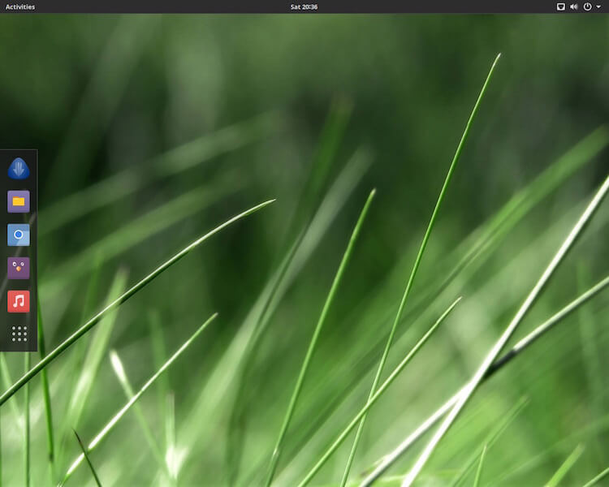

هي توزيعة مبنية على Arch Linux الشهيرة بقابليتها للتخصيص كما تريد، وهذا النوع من التوزيعات (Arch وما بنى عليها) يحتاج القليل من الجهد للوصول للنتيجة المطلوبة في النهاية، فهي لا ينصح بها للمستخدمين المبتدئين في استعمال لينكس.
وهنا يأتي دور توزيعة Antergos والتي تعد بمثابة توزيعة Ubuntu من Debian، مما يجعلها الإصدار المناسب جدا لكل من يريد الاعتماد على Arch وفى نفس الوقت الحصول على تحديثات وترقيات مستمرة، فهي توزيعة متدحرجة " rolling release" وهذا يعنى أن نظام التشغيل الأساسي والتطبيقات التي تعمل عليها ستحصل على التحديثات الجديدة بمجرد أن يتم إطلاقها من المصدر.

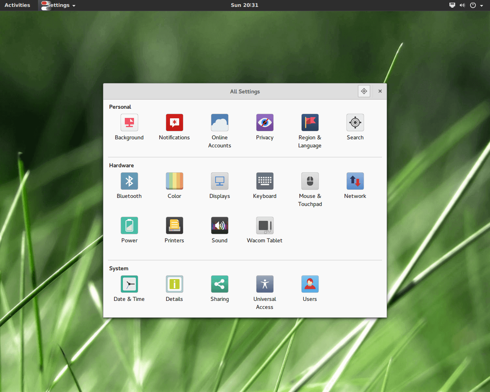

تأتى التوزيعة بواجهة سطح المكتب GNOME 3 التي تجعل الاستخدام سهلا للغاية، مع العديد من الثيمات والخلفيات وحتى الأيقونات، وبهذا يمكنك إضفاء لمستك الشخصية والاستمتاع بالواجهة، أيضا واجهة التثبيت المخصصة تضيف لمسة فريدة من نوعها، كما أن ملف ال ISO الخاص بالتوزيعة يحتوي على كل ما هو ضروري فقط، حيث تم التخلص من جميع البرمجيات الزائدة.
موقع التوزيعة الرسمي:
https://www.antergos.com/

## توزيعة KDE Neon

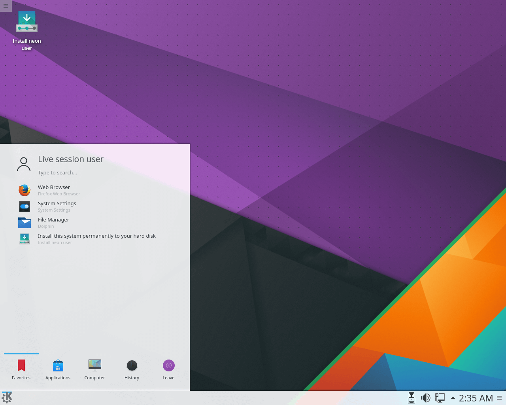

توزيعة جديدة ظهرت لأول مرة في 2016 وهي مبنية على Ubuntu 16.014 LTS مع واجهة سطح المكتب KDE Plasma، فهي بكل تأكيد الخيار الأمثل لكل من يحب استخدام أوبنتو مع واجهة KDE.

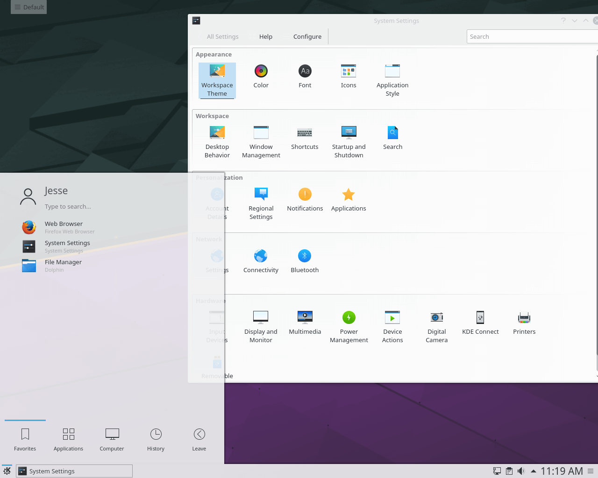

تتوفر ثلاث نسخ من التوزيعة وهي:

-   User Edition والتي تحتوي على أحدث اصدار من واجهة KDE.
-   User LTS Edition والتي تستخدم النسخة Plasma 5.8 LTS الأكثر استقرارا.
-   Developer Edition والتي تستخدم النسخة التجريبية من الواجهة، أو التي لم تصل لمرحلة الاستقرار بعد.

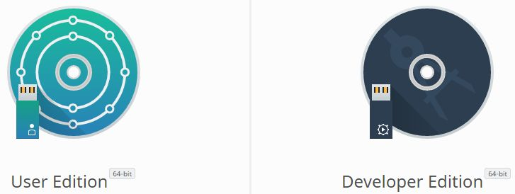

موقع التوزيعة الرسمي:
https://neon.kde.org

## توزيعة Fedora 26

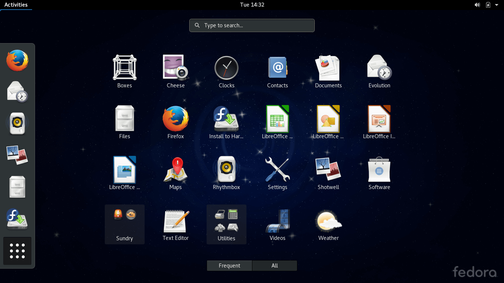

هي توزيعة عريقة تحتل المركز السابع ضمن قائمة موقع distrowatch، وسيتم إطلاق الإصدار 26 خلال يونيو 2017.
من المبكر التحدث عن مميزات هذا الإصدار، لأن فيدورا دائما ما تقدم الجديد كل عام، ولكن من المؤكد أنه سوف يشمل تغييرات كبيرة في أسلوب العرض المستخدم حاليا، كما ستشمل أيضا GNOME 3.24 وDNF 2.0 وPython 3.6
موقع التوزيعة الرسمي:
https://getfedora.org/

## توزيعة Solus

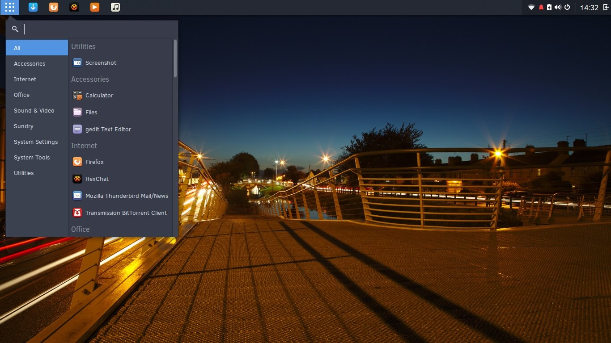

توزيعة أخرى مستقلة مبنية من المصدر، تتميز بسطح مكتبها المبتكر Budgie المبنى على GNOME بحيث يمكن تشغيله دون مشاكل على توزيعات أخرى، كما أن لديها مدير حزم خاص هو eopkg فهي نظام تشغيل كامل يستحق التجربة.
وتعد توزيعة Slous من التوزيعات الصاعدة حيث وصلت للمركز 14 في قائمة موقع distrowatch رغم كونها حديثا الإطلاق.

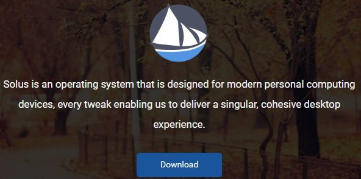

موقع التوزيعة الرسمي:
https://solus-project.com/

## توزيعة Ubuntu Budgie

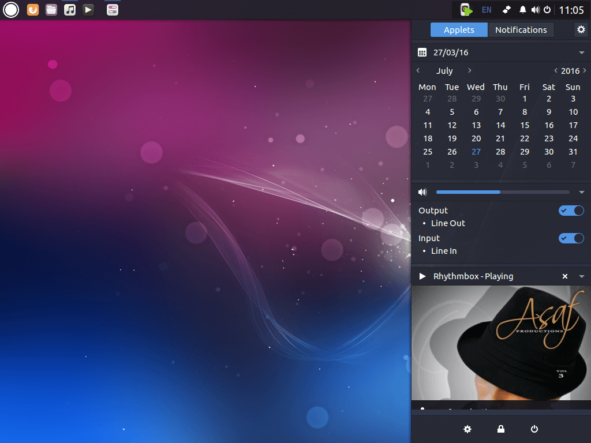

هي توزيعة جديدة أخرى انضمت رسميا إلى عائلة مشتقات أوبنتو في 2016 لكن سيتم إصدارها الفعلي عند إطلاق النسخة الجديدة من أوبنتو في أبريل 2017.
تستخدم التوزيعة سطح المكتب Budgie المبنى على GNOME والمصمم في الأصل من قبل مشروع Slous كما أوضحت، فهي تقدم سطح مكتب نظيف وسهل الاستخدام مع العديد من المميزات التي قد تحتاج لها في أي توزيعة لينكس حديثة، أيضا تحتوي على Action Center يحتوي على الإشعارات والإعدادات السريعة.

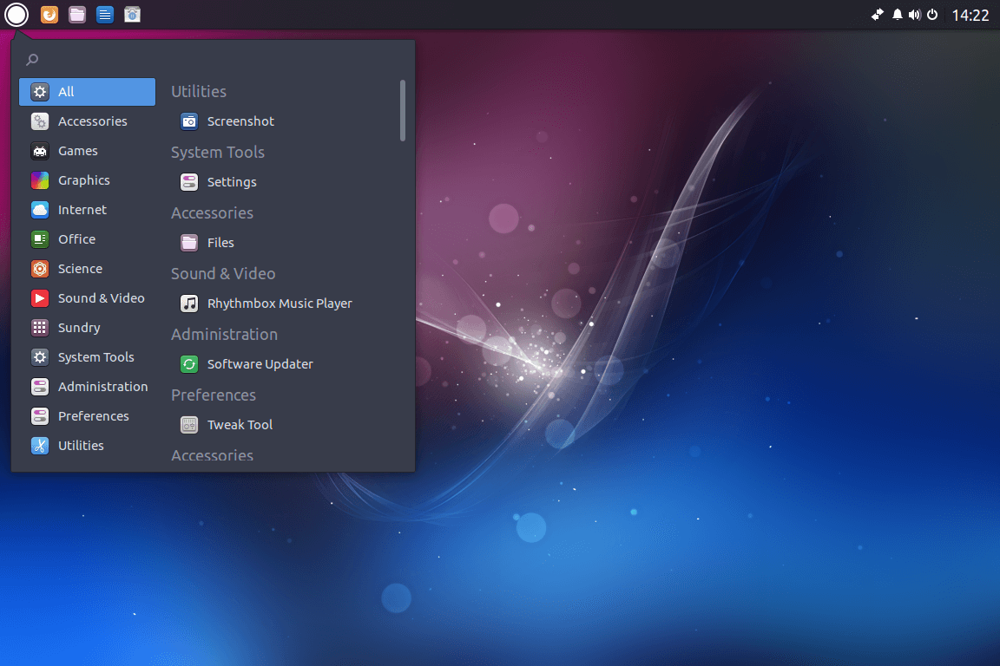

موقع التوزيعة الرسمي: (حتى إطلاق أوبنتو 17.04)
https://budgie-remix.org/

## توزيعة Ubuntu

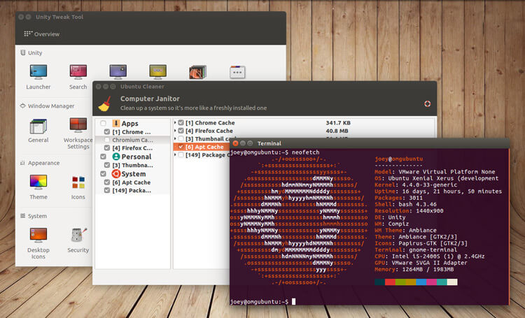

بالتأكيد هي التوزيعة التي ننتظرها جميعا، ففي أبريل 2017 سيتم إطلاق Ubuntu 17.04 ‘Zesty Zapus’ الذي من المفترض أن يقدم توازن جيد بين الاستقرار والتحديث، حيث سيتضمن النسخة التجريبية من واجهة Unity 8، التي يجب أن تكون قد وصلت مرحلة الاستقرار بوصول أوبنتو إلى الإصدار 17.10.

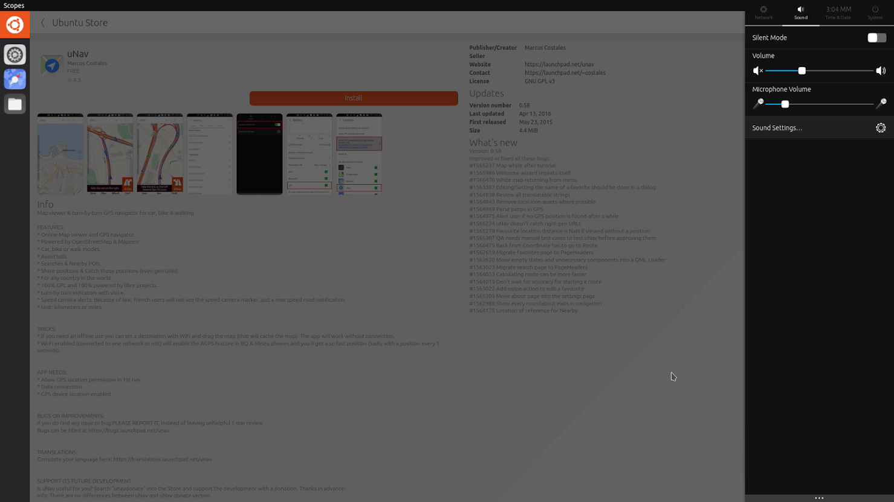

موقع التوزيعة الرسمي:
https://www.ubuntu.com/desktop

---

هذا الموضوع نُشر باﻷصل في مجلة لغة العصر العدد 195 شهر 3-2017 ويمكن الإطلاع عليه [هنا](https://drive.google.com/file/d/1d8dNqOyFKJy8A-jBf5-XhIDuZvDbpGrB/view?usp=sharing).

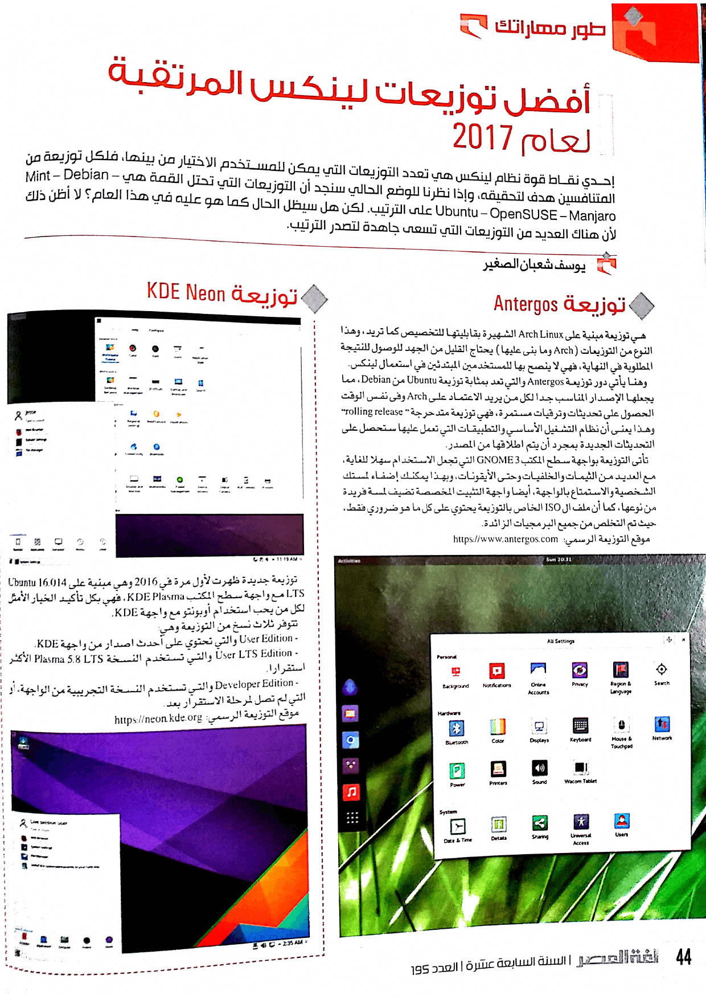

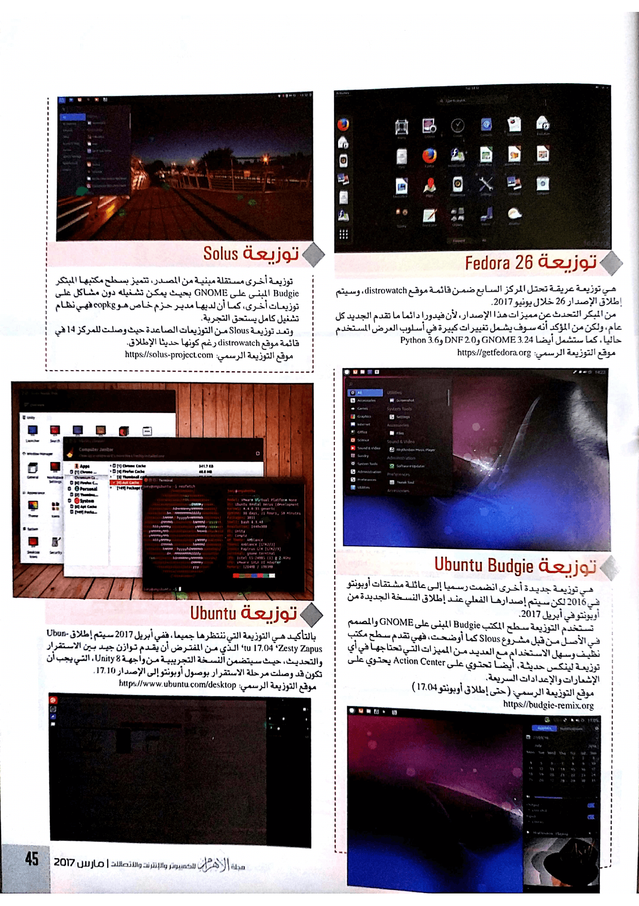
