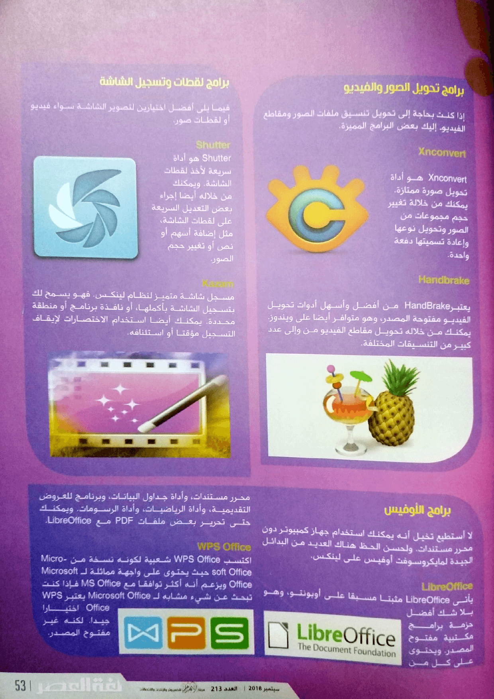

+++
title = "أفضل البرامج التي يجب أن تجربها على أوبونتو"
date = "2018-09-01"
description = "دائما ما يعاني المستخدمون الجدد لنظام لينكس من الحيرة عند الإنتقال اليه، وذلك بسبب اختلاف طبيعة البرامج بينه وبين ويندوز، فهناك العديد من البرامج التي لن تجدها فى لينكس ويجب عليك استخدام البدائل المتوفرة. ولحسن الحظ يتمتع لينكس بتنوع كبير فى البرامج المتوفرة والتي يتزايد عددها يوما بعد يوم. وفى هذا الموضوع سنتاول قائمة شاملة لأفضل برامح أوبونتو المناسبة لجميع أنواع المستخدمين. حتي تساعدك هذه البرامج في الحصول على أفضل تجربة لنظام لينكس الخاص بك."
categories = ["لينكس",]
tags = ["مجلة لغة العصر"]

+++

دائما ما يعاني المستخدمون الجدد لنظام لينكس من الحيرة عند الإنتقال اليه، وذلك بسبب اختلاف طبيعة البرامج بينه وبين ويندوز، فهناك العديد من البرامج التي لن تجدها فى لينكس ويجب عليك استخدام البدائل المتوفرة. ولحسن الحظ يتمتع لينكس بتنوع كبير فى البرامج المتوفرة والتي يتزايد عددها يوما بعد يوم. وفى هذا الموضوع سنتاول قائمة شاملة لأفضل برامح أوبونتو المناسبة لجميع أنواع المستخدمين. حتي تساعدك هذه البرامج في الحصول على أفضل تجربة لنظام لينكس الخاص بك.

تناولت المجلة منذ فترة ليست بالبعيدة مجموعة من الدروس الخاصة بلينكس وكيف يمكنك الانتقال إليه والتعامل معه لأول مرة، لكن الجزء الذي كان غائبا عن هذه السلسلة هو استعراض مجموعة من البرامج الأساسية.
إذن ما هي هذه البرامج الأساسية؟ لا يوجد إجابة محددة هنا. فهذا يعتمد على احتياجاتك ونوع العمل الذي تقوم به على الجهاز الخاص بك.

ومع ذلك نقدم لقراءنا مستخدمي لينكس هذه القائمة الشاملة لبرامج لينكس التي يمكنك استخدامها بانتظام، وقد تم تقسيم القائمة إلى فئات مختلفة لتسهيل العثور على البرامج المناسبة لك.

وبالتأكيد، لا يجب عليك تثبيت واستخدام جميع هذه البرامج. ما عليك سوى تصفح القائمة، وقراءة الوصف ثم تثبيت البرامج التي تحتاج إليها أو التي تميل إلى استخدامها فقط، وجميع البرامج فى هذه القائمة موجودة فى مركز برمجيات أوبونتو، باستثناء بعض البرامج التي سنشير إليها.

## متصفحات الإنترنت

تأتي توزيعة أوبونتو مع متصفح فايرفوكس كمتصفح الإنترنت الافتراضي. ومنذ النسخة 58 تحسن فايرفوكس بشكل كبير. لكن يميل الكثير منا إلي استخدام أكثر من متصفح ويب من أجل الفصل بين أنواع الأعمال المختلفة.

## Google Chrome

كروم هو متصفح الويب الأكثر استخدامًا على الإنترنت. فهو يتيح لك باستخدام حسابك في Google إجراء مزامنة عبر أجهزتك المختلفة. كما يدعم الكثير من الإضافات والتطبيقات التي تعزز من قدراته. ويمكنك تنزيل Chrome في أوبونتو من موقعه على الويب.
https://www.google.com/chrome/

### Brave

قد يكون Chrome متصفح الويب الأكثر استخدامًا، ولكنه لا يحترم الخصوصية بشكل كبير. من المتصفحات البديلة التي تستحق التجربة Brave الذي يمنع الإعلانات وبرمجيات التتبع بشكل افتراضي. مما يوفر لك تجربة تصفح سريعة وآمنة.

## برامج الصوتيات

يحتوي أوبونتو على برنامج Rhythmbox كمشغل موسيقى افتراضي وهو لا يعد اختيارًا سيئًا لمشغل الموسيقى الافتراضي. ومع ذلك، يمكنك بالتأكيد تثبيت مشغل موسيقى أفضل.

### Sayonara

Sayonara هو مشغل موسيقى صغير وخفيف الوزن مع واجهة مستخدم سوداء داكنة. ويتضمن جميع الميزات الأساسية التي تتوقعها في أي مشغل موسيقى. ولا يلتهم الكثير من موارد الجهاز.

### Audacity

يعتبر Audacity محرر صوت أكثر من مشغل الصوت. ويمكنك تسجيل الصوت وتحريره باستخدام هذه الأداة المجانية والمفتوحة المصدر. وهو متوفر لكل من لينكس وويندوز وماك.و يمكنك تثبيته بسهولة من مركز البرامج.

### Clementine

مشغل صوتيات متميز، يحتوي على كل ما يحتاجه أى شخص لتنظيم مكتبات الصوتيات الخاصة به، مع إمكانية الحصول على كلمات الاغنية بشكل مباشر من الإنترنت، كما يدعم تشغيل المحتوي من خدمات التخزين السحابي مثل Google Drive و OneDrive إلى جانب مواقع الصوتيات المختلفة مثل SoundCloud.

## برامج مشغلات الفيديو

يأتي مع أوبونتو مشغل فيديو جنوم الافتراضي (المعروف سابقًا باسم طوطم) والذي لا يدعم العديد برامج ترميز الوسائط. لذلك هناك بالتأكيد مشغلات فيديو أخرى أفضل منه يجب عليك تجربتها.

### VLC

البرنامج المجاني والمفتوح المصدر VLC هو ملك مشغلات الفيديو على المستوي العالمي. ويدعم جميع برامج ترميز الوسائط الممكنة تقريبًا. كما يمكنك من زيادة مستوى الصوت حتى 200٪. وأيضا استئناف التشغيل من حيث تم التوقف، كما يدعم تشغيل الوسائط المختلفة من الإنترنت.

### SMPlayer

من أقوي البرامج المنافسة ل VLC، مجاني ومفتوح المصدر أيضا، يدعم عرض أكثر من ملف ترجمة فى نفس الوقت وتحميل ملفات الترجمة تلقائيا، إضافة إلى دعم تشغيل فيديوهات اليوتيوب والعديد من المميزات الأخري.

## برامج خدمات التخزين السحابي

يستخدم العديد منا خدمات التخزين السحابي المختلفة،لأنها تعطي درجة إضافية من الحرية. فليس عليك حمل مفتاح USB معك طوال الوقت أو القلق بشأن حدوث عطل في القرص الصلب عند استخدام الخدمات السحابية، ويتوفر العديد من برامج المزامنة لهذه الخدمات التي تدعم لينكس، منها:

## Dropbox

Dropbox هي واحدة من أشهر خدمات التخزين السحابي التي توفر للمستخدم الحصول على 2 جيجابايت سعة تخزينية مجانية، مع خيار الحصول على المزيد عن طريق باقات مدفوعة أو من خلال إحالة الآخرين.
توفر Dropbox برنامج مزامنة خاص بلينكس، ويمكنك تنزيله من موقعها على الإنترنت. حيث يقوم بإنشاء مجلد محلي على نظامك تتم مزامنته مع الخوادم السحابية.

### pCloud:

pCloud هي خدمة جيدة أخرى للتخزين السحابي. كما أن لديها برنامج مزامنة خاص بلينكس يمكنك تنزيله من موقعها على الإنترنت. يمكنك الحصول على سعة تخزينية مجانية تصل إلى 20 جيجابايت، تقع pCloud في سويسرا، وهي دولة تشتهر بقوانين خصوصية البيانات الصارمة.

## برامج تحرير الصور

بالتأكيد نحتاج إلى استخدام محرر صور في وقت ما. سواء فى العمل أو المنزل، وهذان الإختياران هما أفضل برامج أوبونتو لتحرير الصور.

### GIMP

GIMP هو محرر صور مجاني ومفتوح المصدر متاح لكل من لينكس وويندوز وماك، ويعتبر أفضل بديل لأدوبي فوتوشوب في لينكس. يمكنك استخدامه لتحرير جميع أنواع الصور الموجودة. وفى حالة كانت هذه أول مرة تستخدم البرنامج ستجد الكثير من الموارد المتاحة على الإنترنت لمساعدتك في استخدامه.

### Inkscape

إنكسكيب هو محرر صور مجاني ومفتوح المصدر يركز بشكل خاص على الرسومات المتجهة (vector). وهو بمثابة برنامج Illustrator فى برامج أدوبي. يمكنك من خلاله تصميم الرسومات المتجهة والشعارات،ومثل Gimp، لدى Inkscape أيضًا الكثير من البرامج التعليمية المتاحة عبر الإنترنت.

## برامج الرسم

برمجيات الرسم ليست هي نفسها محررات الصور على الرغم من تداخل وظائف كل منهما في بعض الأحيان. إليك بعض تطبيقات الرسم التي يمكنك استخدامها في أوبونتو.

### Krita

برنامج مجاني ومفتوح المصدر، يستخدم فى إنشاء الرسومات الرقمية وحتي والرسوم المتحركة، فهو برنامج احترافي بامتياز يوفر للرسامين كل ما يحتاجونه.

### Pinta

برنامج صغير، غير غني بالميزات ميزة غنية مثل Krita ولكنه يفي بالغرض فبرنامج Pinta أشبه ببرنامج الرسام Microsoft Paint لكن لنظام التشغيل لينكس. يمكنك عن طريقة الرسم والتلوين وإضافة النصوص والقيام بمثل هذه المهام الصغيرة الأخرى التي يقوم بها أى برنامج للرسم.

## برامج التصوير

سواء كنت مصور هاوي أو محترف، يوفر لينكس الكثير من أدوات التصوير تحت تصرفك. فيما يلي بعض التطبيقات اللي نقترح عليك تجربتها.

### digiKam

مع برنامج digiKam مفتوح المصدر، يمكنك التعامل مع صور الكاميرا الخاصة بك بطريقة احترافية. يوفر digiKam جميع الأدوات اللازمة لعرض وإدارة وتحرير وتعديل وتنظيم ووضع العلامات ومشاركة الصور.

### Darktable

يعتبر Darktable البديل المفتوح المصدر رقم واحد لبرنامج Lightroom، ويركز بشكل خاص على تطوير الصور الخام. وهو متاح على ويندوز وماك أيضا.

## برامج تحرير الفيديو

قد يعتقد البعض أنه لا يتوفر العديد من برامج تحرير الفيديو لنظام لينكس، ولكن هذا غير صحيح بالمرة، فهناك العديد من برامج تحرير الفيديو الغنية بالمميزات والسهلة الاستخدام في أوبونتو.

### Kdenlive

Kdenlive هو أفضل محرر فيديو لجميع الأغراض على لينكس. لديه ما يكفي من الميزات التي تضعه جنبا إلى جنب مع iMovie أو Movie Maker.

### Shotcut

يعد Shotcut اختيار جيد آخر لمحرر الفيديو. وهو برنامج مفتوح المصدر يحتوي على جميع الميزات التي يمكنك توقعها في أى محرر فيديو.

## برامج تحويل الصور والفيديو

إذا كنت بحاجة إلى تحويل تنسيق ملفات الصور ومقاطع الفيديوـ إليك بعض البرامج المميزة.

### Xnconvert

Xnconvert هو أداة تحويل صورة ممتازة. يمكنك من خلالة تغيير حجم مجموعات من الصور وتحويل نوعها وإعادة تسميتها دفعة واحدة.

### Handbrake

يعتبرHandBrake من أفضل وأسهل أدوات تحويل الفيديو مفتوحة المصدر، وهو متوفر أيضا على ويندوز. يمكنك من خلاله تحويل مقاطع الفيديو من وإلى عدد كبير من التنسيقات المختلفة.

## برامج لقطات وتسجيل الشاشة

فيما يلي أفضل اختيارين لتصوير الشاشة سواء فيديو أو لقطات صور.

### Shutter

Shutter هو أداة سريعة لأخذ لقطات الشاشة. ويمكنك من خلاله أيضًا إجراء بعض التعديل السريعة على لقطات الشاشة، مثل إضافة أسهم أو نص أو تغيير حجم الصور.

### Kazam

مسجل شاشة متميز لنظام لينكس. فهو يسمح لك بتسجيل الشاشة بأكملها، أو نافذة برنامج أو منطقة محددة. يمكنك أيضًا استخدام الاختصارات لإيقاف التسجيل مؤقتًا أو استئنافه.

## برامج الأوفيس

لا أستطيع تخيل أنه يمكنك استخدام جهاز كمبيوتر دون محرر مستندات. ولحسن الحظ هناك العديد من البدائل الجيدة لمايكروسوفت أوفيس على لينكس.

### LibreOffice

يأتي LibreOffice مثبتًا مسبقًا على أوبونتو وهو بلا شك أفضل حزمة برامج مكتبية مفتوح المصدر. ويحتوي على كل من محرر مستندات، وأداة جداول البيانات، وبرنامج للعروض التقديمية، وأداة الرياضيات، وأداة الرسومات. ويمكنك حتى تحرير بعض ملفات PDF مع LibreOffice.

### WPS Office

اكتسب WPS Office شعبية لكونه نسخة من Microsoft Office. حيث يحتوي على واجهة مماثلة لـ Microsoft Office ويزعم أنه أكثر توافقاً مع MS Office. فإذا كنت تبحث عن شيء مشابه لـ Microsoft Office، يعتبر WPS Office اختيارًا جيدًا. لكنه غير مفتوح المصدر.

## برامج التحميل

إذا كنت غالباً تقوم بتنزيل ملفات فيديو أو ملفات كبيرة أخرى من الإنترنت، فإن هذه الأدوات ستساعدك.

### youtube-dl

هذا هو أحد تطبيقات أوبونتو النادرة في القائمة التي تعتمد على سطر الأوامر. إذا كنت تريد تنزيل مقاطع فيديو من YouTube أو DailyMotion أو مواقع فيديو أخرى، فإن youtube-dl هو خيار ممتاز. يوفر الكثير من الخيارات المتقدمة لتحميل الفيديو. وإذا كنت لا تشعر بالارتياح مع سطر الأوامر، تتوفر نسخة أخري من البرنامج هي youtube-dlg لكن يلزم تثبيتها من مستودع خارجي.

### XDM

Xtreme Download Manager هو أداة قوية للتحميل بسرعة عالية، ويدعم تحميل الفيديو من YouTube و DailyMotion و المئات من الموقع الآخري. كما يدعم استئناف التحميل والجدولة. ويعتبر أقوي منافس مفتوح المصدر لبرنامج Internet download manager الشهير على ويندوز.

## برامج تحرير الأكواد

إذا كنت مبرمجا فغالبا لن يكون محرر نصوص Gedit الافتراضي كافياً لاحتياجاتك. فيما يلي بعض من أفضل برامج تحرير الأكواد.

### Atom

Atom هو محرر أكواد مجاني ومفتوح المصدر من GitHub. وحتى قبل إطلاق أول إصدار مستقر منه قد أصبح المفضل المفضل بين المبرمجين بسبب واجهة المستخدم المميزة والميزات التي يحتويها ودعمه لمجموعة واسعة من الإضافات.

### Visual Studio Code

VS Code هو محرر أكواد مفتوح المصدر من Microsoft. ويعد محررًا رائعًا لتطوير الويب. كما يدعم عددًا من لغات البرمجة الأخرى.

## برامج الPDF والكتب الإلكترونية

في هذا العصر الرقمي، لا يمكنك الاعتماد فقط على الكتب الورقية الحقيقية وخاصة عندما يكون هناك الكثير من الكتب الإلكترونية المجانية المتاحة على الإنترنت. إليك بعض برامج أوبونتو لإدارة ملفات PDF والكتب الإلكترونية.

### Calibre

إذا كنت من محبي الكتب وجمع الكتب الإلكترونية، إذن يجب عليك استخدام Calibre. فهو مدير كتب الكترونية يحتوي على جميع الأدوات اللازمة لإنشاء وتحويل الكتب الإلكترونيةوإدارة المكتبة الخاصة بك.

### Okular

Okular هو برنامج لعرض ملفات PDF مع خيارات لتحرير ملفات PDF. فيمكنك إجراء بعض التعديلات الأساسية على ملفات PDF على نظام لينكس باستخدام Okular مثل إضافة الملاحظات والرسومات اليدوية، والتمييز وما إلى ذلك.

## برامج الدردشة والمحادثات

لا يوجد أحد منا لا يستخدم على الأقل برنامج محادثة واحد، إليك أفضل برامج المحادثة على لينكس.

### Skype

سكايب هو تطبيق الدردشة بالفيديو الأكثر شعبية. كما يستخدم من قبل العديد من الشركات والشركات لإجراء المقابلات والاجتماعات. وهذا يجعل سكايب أحد التطبيقات التي يجب أن تكون على جهازك.

### Rambox

Rambox ليس برنامج للمراسلة بنفسه، لكنه يمكنك باستخدام الخدمات المختلفة مثل Telegram و Skype و Viber و Facebook Messanger و WhatsApp و Slack والعديد من الخدمات الأخرى فى نافذة تطبيق واحدة.

## برامج الملاحظات وقوائم المهام

نحتاج بشكل يومي إلى أخذ ملاحظات لتذكيرنا أو إعداد قائمة المهام لتنظيم اليوم، وهناك العديد من البرامج التي تؤدي هذه المهام وتستحق التجربة منها:

### Simplenote

Simplenote هو مذكرة مجانية ومفتوحة المصدر متوفر لنظام التشغيل Windows و Linux و MacOS و iOS و Android. وتتم مزامنة الملاحظات الخاصة بك إلى خادم سحابي حتي يمكنك الوصول إليها على أي جهاز. يمكنك تنزيل ملف DEB من موقعه على الويب http://simplenote.com/ وتثبيته يدويا.

### Remember The Milk

هو تطبيق مشهور لعمل قوائم المهام. وهو متوفر لكل أنظمة التشغيل على الكمبيوتر والموبايل، فيمكنك الوصول إلى قائمة المهام الخاصة بك على جميع الأجهزة التي تمتلكها. كما يمكنك أيضًا الوصول إليها من متصفح الإنترنت.

## برامج حماية الملفات والتشفير

إذا كان هناك أشخاص آخرون يستخدمون جهاز الكمبيوتر الخاص بك بشكل منتظم، فربما ترغب في إضافة طبقة إضافية من الأمان عن طريق حماية الملفات والمجلدات بكلمة المرور.

### EncryptPad

EncryptPad هو محرر نصوص مفتوح المصدر يسمح لك بقفل ملفاتك بكلمة مرور. ويمكنك اختيار نوع التشفير. كما يتوفر أيضا إصدار سطر الأوامر لهذه الأداة.

### Gnome Encfs Manager

يتيح لك مدير Gnome Encfs قفل المجلدات بكلمة مرور في لينكس. فيمكنك الاحتفاظ بأي ملفات تريدها في مجلد سري ثم قفلها بكلمة مرور.

## برامج تشغيل الألعاب

أصبحت ممارسة الألعاب على لينكس أفضل بكثير مما كانت عليه قبل بضع سنوات. فيمكنك الاستمتاع بالكثير من الألعاب على لينكس دون الرجوع إلى ويندوز باستخدام هذه البرامج.

### Steam

Steam هو منصة توزيع رقمية مشهورة تسمح لك بشراء ألعاب (إذا لزم الأمر). يحتوي Steam على أكثر من 1500 لعبة تعمل على لينكس. ويمكنك تنزيل نسخة Steam من مركز البرامج.

### PlayOnLinux

يتيح لك PlayOnLinux تشغيل ألعاب الويندوز على لينكس عبر طبقة توافق WINE. لكن لا تتوقع الكثير منها لأنه لن يتم تشغيل كل الألعاب بدون مشاكل مع PlayOnLinux، لكنه ما زال يستحق التجربة.

## برامج إدارة الحزم

يعد مركز برمجيات أوبونتو أكثر من كافٍ للمستخدم المتوسط، ولكن يمكنك الحصول على مزيد من التحكم في الحزم باستخدام هذه البرامج.

### Gdebi:

Gedbi هو مدير حزم صغير يمكنك استخدامه لتثبيت ملفات DEB بشكل أسرع من مركز البرامج كما أنه يعالج مشكلات التبعيات.

### Synaptic

كان Synaptic مدير حزم واجهة المستخدم الرسومية الافتراضي لمعظم توزيعات لينكس منذ وقت طويل. ولا يزال كذلك في بعض توزيعات لينكس. فهو مدير حزم قوي مفيد بشكل خاص في العثور على التطبيقات المثبتة وإزالتها.

## برامج النسخ الإحتياطي واستعادة الملفات

أدوات النسخ الاحتياطي والاسترداد هي برامج يجب توفرها لأي نظام. ولينكس ليس استثناء من هذه القاعدة، فهناك العديد من البرامج القوية التي تقوم بهذه المهمة.

### Timeshift

تسمح لك أداة Timeshift بأخذ لقطة snapshot للنظام الخاص بك. وهذا يمكنك من استعادة النظام الخاص بك إلى حالة سابقة في حالة حدوث مشكلة أو تلف النظام.
لاحظ أنها ليست أفضل أداة للنسخ الاحتياطي للبيانات الشخصية الخاصة بك. لذلك يمكنك استخدام أداة Backups الافتراضية في أوبونتو لهذه المهمة.

### TestDisk

برنامج يستهدف المستخدم المتقدم، ويعمل عن طريق سطر الأوامر. مهمة TestDisk هي استعادة البيانات على لينكس. فإذا قمت بحذف الملفات عن طريق الخطأ، لا تزال هناك فرصة لاسترجاعها مرة أخرى باستخدام TestDisk.

## برامج إدارة وتعديل النظام

يتمتع لينكس بقابلية للتخصيص لن تراها فى أي نظام تشغيل آخر، لذلك لا يمكن أن تخلو هذه القائمة من برامج لتعديل النظام.

### GNOME/Unity Tweak Tool

وهما أداتان تعديل ضروريتان لكل مستخدم لأوبونتو، وتسمح لك بالوصول إلى بعض إعدادات النظام المتقدمة. ومن أفضل الأشياء التي يمكنك عملها من خلالها هو تغيير سمات النظام.

#### UFW Firewall

UFW أو (جدار الحماية الغير معقد) هو جدار ناري بسيط، يحتوي على إعدادات محددة مسبقًا لشبكات المنزل والعمل والشبكة العامة والتي يمكنك الاختيار من بينها كما تشاء.

### Stacer

إذا كنت تريد تحرير بعض المساحة على أوبونتو، يجب أن تجرب Stacer. تتيح لك هذه الأداة الرسومية تحسين النظام عن طريق إزالة الملفات غير الضرورية وإلغاء تثبيت البرنامج بالكامل. يمكنك تحميل Stacer من موقعه على الانترنت.
https://github.com/oguzhaninan/Stacer

## برامج أخرى

### Neofetch

أداة سطر الأوامر بسيطة تقوم بعرض معلومات النظام الخاصة بك، مثل إصدار أوبونتو، وبيئة سطح المكتب، والسمة، والأيقونات، ومعلومات ذاكرة الوصول العشوائي، إلى جانب شعار التوزيعة.

### Etcher

يحتوي أوبونتو على أداة لإنشاء USB قابلة للإقلاع بالفعل، ولكن Etcher هو أفضل برنامج لهذه المهمة. وهو متوفر أيضًا لويندوز و ماك. يمكنك تنزيله من موقعه على الويب. https://etcher.io/

### gscan2pdf:

هذه الأداة الصغيرة لها غرض وحيد، هو تحويل الصور إلى PDF. فيمكنك استخدامها لدمج صور متعددة في ملف PDF واحد.

### Audio Recorder

برنامج صغير آخر لكنه ضروري لتسجيل الصوت على أوبونتو. يمكنك استخدامه لتسجيل الصوت من ميكروفون النظام، من مشغل الموسيقى أو من أي مصدر آخر.

وإلى هنا نصل إلى نهاية هذه القائمة، وكما ذكرت فى البداية أعلم أنك قد لا تحتاج إلى جميع هذه البرامج، ولكني متأكد من أنك الآن ترغب في أن تجرب معظم البرامج المذكورة هنا.

---

هذا الموضوع نُشر باﻷصل في مجلة لغة العصر العدد 213 شهر 09-2018 والعدد 214 شهر 10-2018 ويمكن الإطلاع عليه [هنا](https://drive.google.com/file/d/1oh_j3jbXyxKQ8wzU_Z-kUnzjvFxn25YN/view?usp=sharing) [وهنا](https://drive.google.com/file/d/18TzxpJ64gqA7SWZsUk-s9GLsvVYcz0sc/view?usp=sharing).

