+++
title = "elementary OS... التوزيعة الأمثل لمبتدئي لينكس"
date = "2020-01-01"
description = "منذ إصدار ويندوز 10 والشكوك المستمرة تنتاب مستخدميه حول مستوي الخصوصية بالنظام، وذلك بعيدا عن الإزعاج المتكرر للنوافذ الدعائية والتحديثات التي تسبب المشاكل. أما macOS فعلى الرغم من أنه يهتم بالخصوصية بشكل أفضل من الويندوز، إلا أن أبل تستمر باستمرار بإنهاء دعم الأجهزة الأقدم مع كل تحديث جديد. ولهذه الأسباب يكون نظام لينكس في كثير من الأحيان الخيار الأمثل لاستخدامه على أجهزة الكمبيوتر. فهو نظام مجاني بالكامل، ومفتوح المصدر، ويتسم بالتنوع الكبير بسبب طبيعة تطويره الغير معتمدة على جهة واحدة بخلاف النظامين السابقين. ونظرا لكون لينكس نظاما يهتم بالأداء والتوافق إلى حد كبير، فقد تم إهمال الجانب الجمالي لكثير من الوقت. لكن هذا الأمر قد بدأ بالتغير منذ فترة ليست ببعيدة. فتوزيعة elementary OS تقدم للمستخدم واجهة أنيقة تنافس macOS في الجمال، مع العديد من المميزات والبرمجيات التي تجعل استخدام لينكس على جهازك تجربة رائعة."
categories = ["لينكس",]
tags = ["مجلة لغة العصر"]

+++

منذ إصدار ويندوز 10 والشكوك المستمرة تنتاب مستخدميه حول مستوي الخصوصية بالنظام، وذلك بعيدا عن الإزعاج المتكرر للنوافذ الدعائية والتحديثات التي تسبب المشاكل. أما macOS فعلى الرغم من أنه يهتم بالخصوصية بشكل أفضل من الويندوز، إلا أن أبل تستمر باستمرار بإنهاء دعم الأجهزة الأقدم مع كل تحديث جديد. ولهذه الأسباب يكون نظام لينكس في كثير من الأحيان الخيار الأمثل لاستخدامه على أجهزة الكمبيوتر. فهو نظام مجاني بالكامل، ومفتوح المصدر، ويتسم بالتنوع الكبير بسبب طبيعة تطويره الغير معتمدة على جهة واحدة بخلاف النظامين السابقين. ونظرا لكون لينكس نظاما يهتم بالأداء والتوافق إلى حد كبير، فقد تم إهمال الجانب الجمالي لكثير من الوقت. لكن هذا الأمر قد بدأ بالتغير منذ فترة ليست ببعيدة. فتوزيعة elementary OS تقدم للمستخدم واجهة أنيقة تنافس macOS في الجمال، مع العديد من المميزات والبرمجيات التي تجعل استخدام لينكس على جهازك تجربة رائعة.

> مميزات فريدة وأناقة من الطراز الرفيع

حينما نتحدث على نظام لينكس فلابد أن يخطر ببالك توزيعة أوبنتو، التوزيعة الأكثر سهولة بالنسبة للمبتدئين من وجهة نظر الكثيرين. ولحسن الحظ فإن توزيعة elementary OS مبنية على النسخة المستقرة من توزيعة أوبنتو، مما يعنى أن النواة وكل البرمجيات يتم اختبارها قبل إصدار التحديثات لضمان الاستقرار. لكنها تختلف عن أوبنتو بشكل أساسي في بيئة سطح المكتب، حيث إنها تستخدم بيئة سطح مكتب مخصصة اسمها Pantheon.

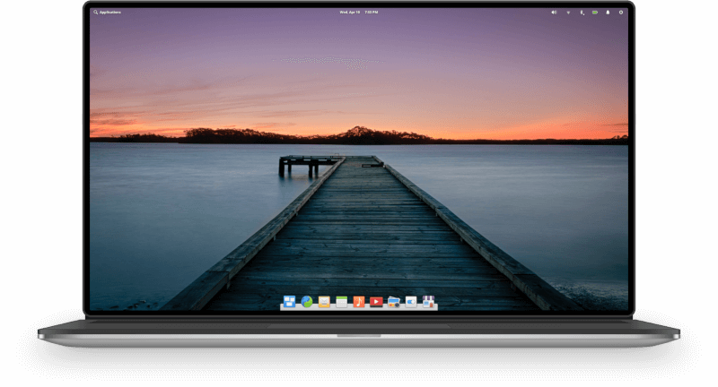

ومن النظرة الأولى على التوزيعة وبيئة سطح المكتب Pantheon ستتذكر نظام macOS، لكن بمجرد أن تبدأ باستخدامها والتعمق أكثر ستدرك الاختلافات الموجودة بوضوح. فتوزيعة elementary OS ليست فقط أسهل في الاستخدام، بل أيضا أكثر أناقة.

وقد تم إطلاق تحديث جديد للتوزيعة يحمل الرقم 5.1 في شهر ديسمبر الماضي، يجلب معه العديد من التحسينات التي تجعل elementary OS تتفوق على نظام macOS وكل توزيعات لينكس الأخرى في عدد من النواحي الرئيسية.

## تطبيق للترحيب بالمستخدمين الجدد

بمجرد انتهاء التثبيت ووصولك إلى النظام الجديد ستجد تطبيقا مخصصا للترحيب بك، حيث يتيح لك التحكم في بعض الخيارات بشكل مبدئي، مثل إعدادات الوصول للموقع الجغرافي ووضع الإضاءة الليلية، والحذف التلقائي للملفات المؤقتة وسلة المهملات.

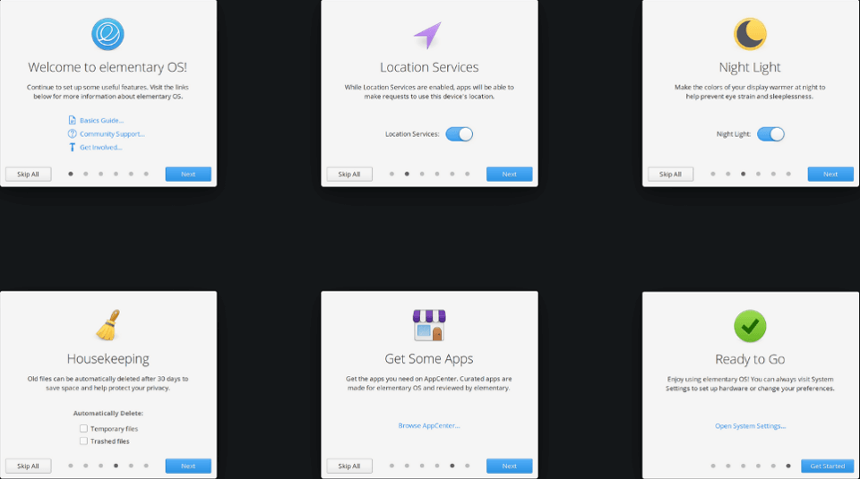

والمميز في هذا التطبيق أنه لا يحتاج إلى القيام بأي خطوات غير ضرورية مثل إنشاء حساب أو تسجيل الدخول كما في أجهزة الماك وحساب أبل، كما لا يحتاج إلى تهيئة إعدادات الإعلانات والخدمات المتطفلة كما في الويندوز. فهو يتيح لك إعداد النظام الجديد بشكل سهل ودون أي مشتتات أخرى.

وقد خطط مطوري التوزيعة جيدا لتطبيق الترحيب، فمن خلال جعل التطبيق يعمل بنظام الوحدات، عندما يتم إصدار نسخة جديدة من التوزيعة لن يقوم التطبيق بإزعاجك وعرض الخيارات التي عُرضت سابقا، بل سيكتفى باطلاعك على الخيارات الجديدة التي أُضيفت مع التحديث الجديد فقط.

## دعم مميز لتعدد المستخدمين

نقطة أخرى تتميز بها توزيعة elementary OS عن باقي توزيعات لينكس المختلفة هي دعم المستخدمين المتعددين، وخصوصا بعد تحديث 5.1 الأخير الذي أضاف تحسينات على شاشة تسجيل الدخول. حيث أصبحت شاشة تسجيل الدخول تُظهر اسم المستخدم وصورة حسابه الشخصي إلى جانب خلفية سطح المكتب المستخدمة حاليا، مما يضفي لمسة جمالية على الأسلوب التقليدي لشاشة تسجيل الدخول، كما يجعل التعرف على حسابك أسرع وخاصة إذا كان جهاز الكمبيوتر يستخدمه عدد من المستخدمين.

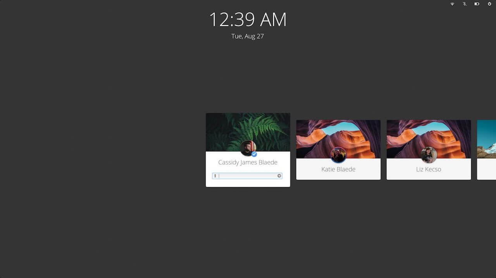

## خيارات للتحكم الأبوي

تنعدم خيارات التحكم الأبوي في توزيعات لينكس لسبب غير مفهوم. لكن لحسن الحظ لم تُغفل توزيعة elementary OS هذا الجانب. فتستطيع عن طريق خيارات التحكم الأبوي الموجودة بالإعدادات الحد من إمكانية وصول مستخدم ما إلى تطبيقات أو مواقع معينة. كما يمكنك تحديد فترة زمنية معينة يستطيع المستخدم خلالها استخدام جهاز الكمبيوتر.

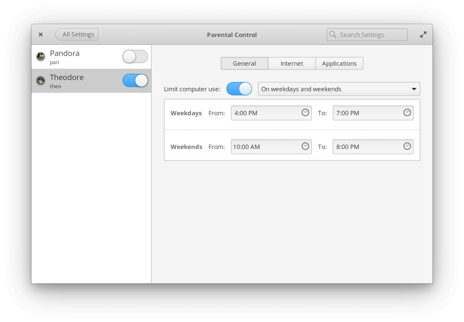

## مركز تطبيقات فريد

تستخدم التوزيعة مركز تطبيقات خاصا بها هو AppCenter. وقد أضاف تحديث 5.1 تغييرات كبيرة على مركز التطبيقات في العديد من النواحي.

من أبزر هذه التغييرات التحسينات في الأداء، حيث عمل فريق تطوير التوزيعة على زيادة سرعة التطبيق إلى عشرة أضعاف مقارنة بإصدار التوزيعة السابق، ويظهر الفرق بوضوح خلال تحميل صفحات التطبيقات داخل المركز، وخلال التنقل بين صفحات التطبيق والتطبيقات الأخرى.

كما تم إضافة دعم صيغة حزم التطبيقات Flatpak، وهي طريقة لاحتواء البرامج في بيئات معزولة آمنة تعمل دون المساس بصلاحيات النظام.

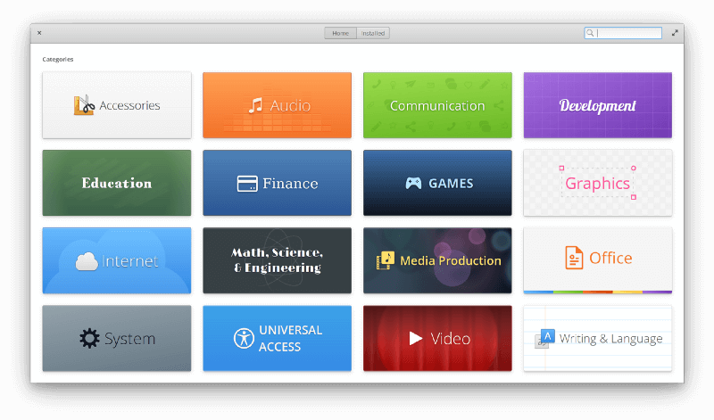

## تصميم أنيق

تتفرد توزيعة elementary OS بتصميم نظيف ومصقول يشعرك بأناقتها الفريدة. فتصميم التوزيعة متماسك ومتناسق وكل عنصر من عناصره له غرضه، وذلك على خلاف العديد من التصميمات التقليدية والقديمة للتوزيعات الأخرى.

ويظهر التصميم الفريد للتوزيعة بشكل واضح في كل البرمجيات الخاصة بها، بداية من مركز البرمجيات وتطبيقات الصور والفيديو والملفات، وانتهاءً بقوائم النظام وتطبيق الإعدادات.

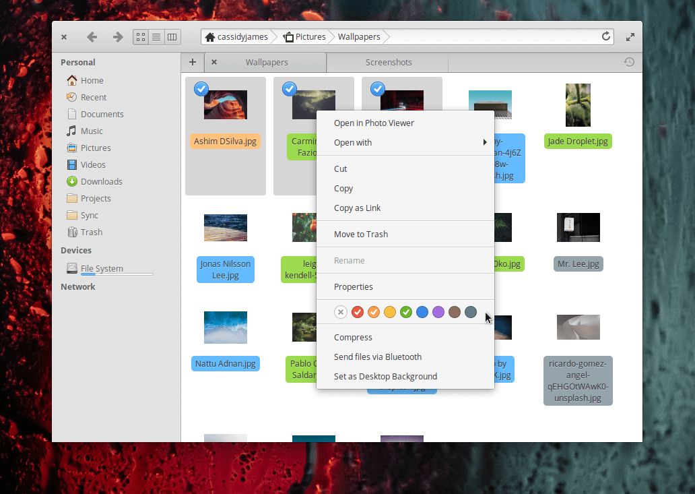

## أداء جيد حتى على الأجهزة القديمة

في كثير من الأحيان تكون التكلفة الباهظة للتصميم المميز للبرمجيات هي التضحية بالأداء. لكن هذا ليس هو الحال مع elementary OS، فعلى الرغم من التصميم الجذاب لا تزال التوزيعة تعمل بكفاءة عالية على الأجهزة القديمة. حتى لو كان جهازك يعمل بمعالج Core 2 duo و2 جيجا بايت من الرام وتعاني من البطء الشديد أثناء استخدام الويندوز، فستعمل توزيعة elementary OS بسلالة على جهازك دون الحاجة لترقية أي من مكوناته.

ينصح الموقع الرسمي للتوزيعة باستخدام معالج ثنائي النواة بمعمارية 64-bit و4 جيجا بايت من الرام ومساحة 15 جيجا بايت من القرص الصلب على الأقل للحصول على أفضل تجربة استخدام للتوزيعة.

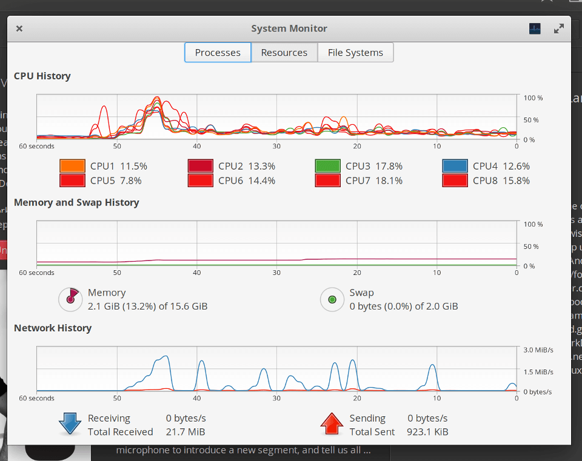

## مدخل مذهل إلى عالم لينكس

إذا كنت ممن يرغبون في تجربة نظام لينكس لكن يقف أمامك عائق صعوبة التثبيت، أو عدم جمالية الشكل، أو تعقيد النظام، فإن توزيعة elementary OS هي الخيار الأمثل لك للدخول إلى عالم لينكس.

فهي تقدم لك مزيج من الشكل الجذاب كما في نظام macOS، وسهولة التثبيت والاستخدام والتنوع الكبير في التطبيقات والبرمجيات. بالإضافة إلى التركيز الشديد على الخصوصية والأمان اللذان يميزان لينكس عن غيره من الأنظمة.

وحتى لو كنت مستخدم مبتدئ للكمبيوتر، فستجد عملية التثبيت والاستخدام سهلة للغاية. كل ما عليك فعله هو تحميل التوزيعة من موقعها الرسمي https://elementary.io ثم حرق ملف ال ISO على مفتاح USB وتثبيت النظام من خلاله. ويوفر الموقع الرسمي دليلا لمساعدتك في التثبيت يمكنك الاطلاع عليه من خلال هذا الرابط https://elementary.io/docs/installation.

---

هذا الموضوع نُشر باﻷصل في مجلة لغة العصر العدد 229 شهر 01-2020 ويمكن الإطلاع عليه [هنا](https://drive.google.com/file/d/1Xs6hxPZ0nq8rOOUkXhRkItZ2bxyrTIFh/view?usp=sharing).

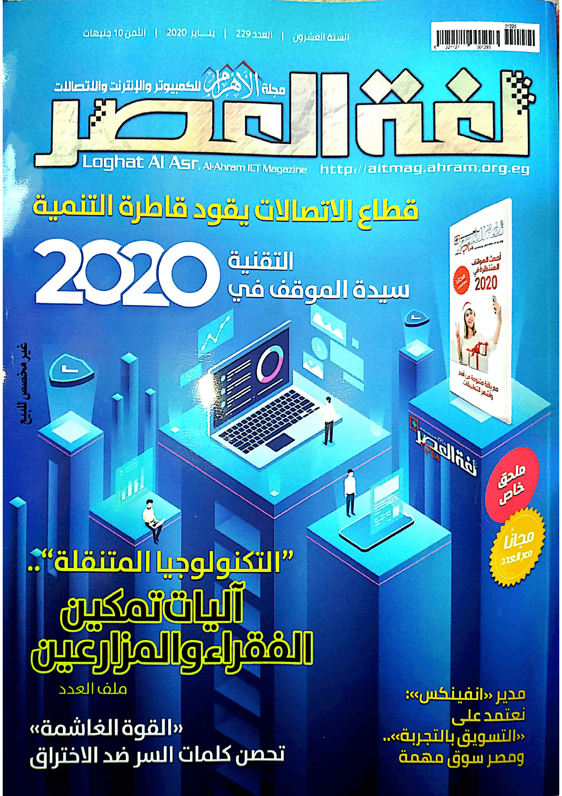

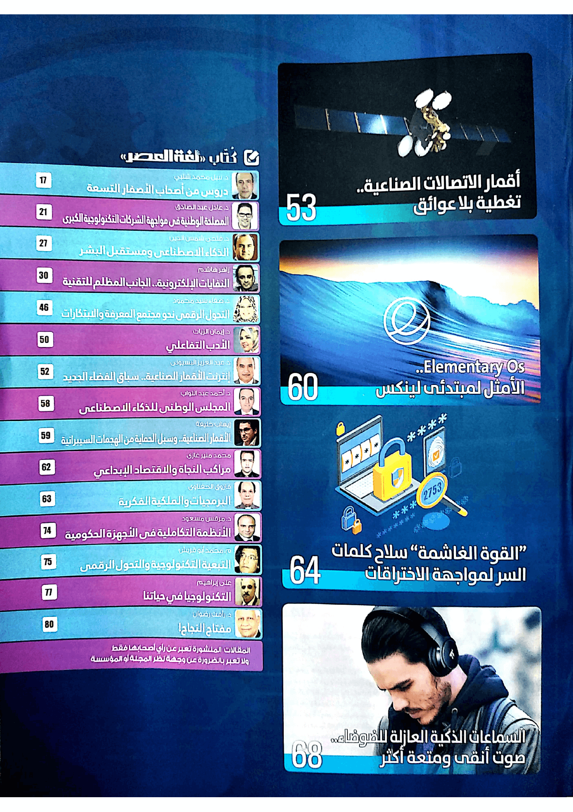

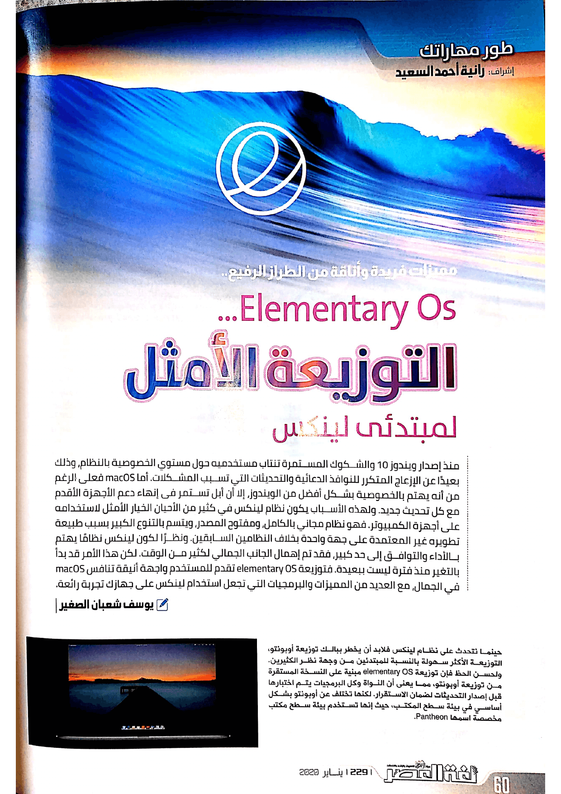

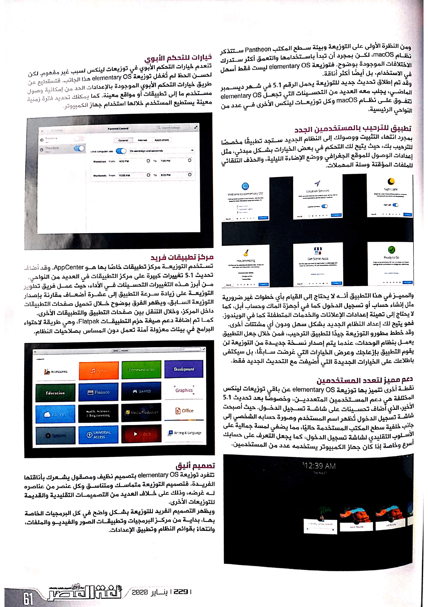

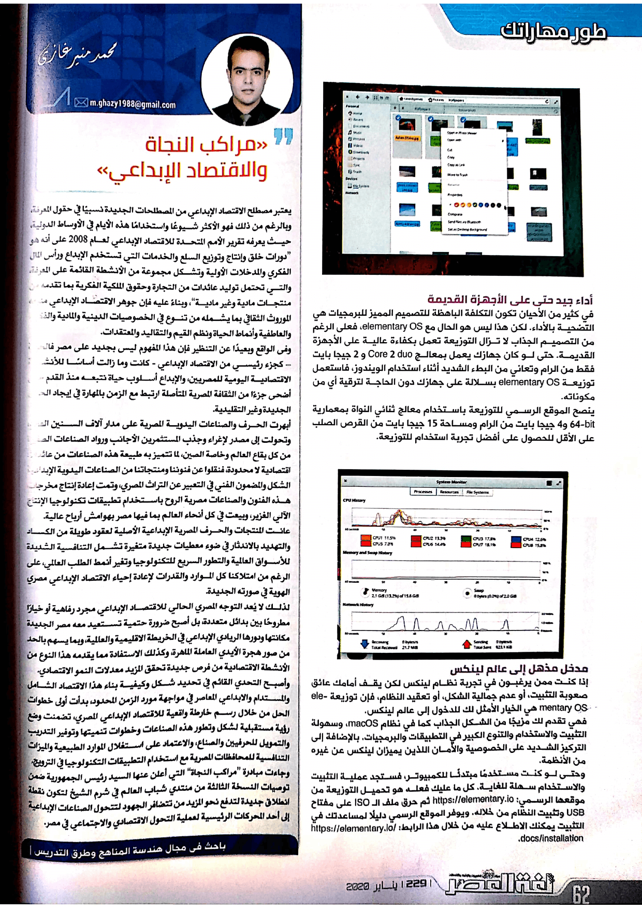
