+++
title = "ما هو نظام لينكس وكيف يمكنني تثبيته؟"
date = "2016-01-01"
description = "نظام لينكس هو نظام تشغيل مفتوح المصدر تم اختراعه عام 1984، مر بالعديد من مراحل التطوير أهمها عام 1991 وحاليا هو مشروع كبير يتم تطويره بواسطة مجموعة من المتطوعين من كل أنحاء العالم، أهم ما يميز نظام لينكس هو الثبات والسرعة والمجانية، نستعرض معا في الأسطر القادمة أهم ما يميز نظام لينكس وطريقة تثبيته على جهازك."
categories = ["لينكس",]
tags = ["مجلة لغة العصر"]
series = ["دليل لينكس"]

+++
نظام لينكس هو نظام تشغيل مفتوح المصدر تم اختراعه عام 1984، مر بالعديد من مراحل التطوير أهمها عام 1991 وحاليا هو مشروع كبير يتم تطويره بواسطة مجموعة من المتطوعين من كل أنحاء العالم، أهم ما يميز نظام لينكس هو الثبات والسرعة والمجانية، نستعرض معا في الأسطر القادمة أهم ما يميز نظام لينكس وطريقة تثبيته على جهازك.

 

## لماذا يجب عليك تجربة لينكس؟

- نظام مجاني تماما ومفتوح المصدر.

- يعمل على أقل الأجهزة في المواصفات.

- نظام مستقر، بسيط، ومتعدد الاستخدامات.

- يمكنك تثبيته بسهولة بجانب الويندوز أو الماك، كما أنه يمكنك تجربته بدون تثبيت أيضا.

- أفضل أنظمة التشغيل من ناحية الأمان (لا فيروسات بعد الآن).

- يوجد العديد من التوزيعات يمكنك اختيار ما يناسبك منها.

## توزيعات لينكس

- هي ببساطة أقرب إلى نسخ الويندوز المتعددة، وهي إما (توزيعات مصدرية) مبنية من الصفر مثل توزيعة Arch Linux، أو مبنية على توزيعة أخري مثل توزيعة Ubuntu المبنية على توزيعة Debian.

- التوزيعة هي مجموعة من البرامج والحزم التي تم اختيارها بعناية لتتوافق وتتكامل فيما بينها لتؤدي غرض معين.

- يوجد العديد من التوزيعات العالمية أشهرها:

(Debian)  دبيان https://www.debian.org/

(Ubuntu) أوبنتو http://www.ubuntu.com/

(Fedora) فيدورا https://getfedora.org/

(Linux mint) لينكس مينت http://www.linuxmint.com/

(Opensuse) اوبن سوزي https://www.opensuse.org/en/

- كما يوجد أيضا بعض التوزيعات العربية منها:

هلال لينكس http://helallinux.com/ أعجوبة http://ojuba.org/

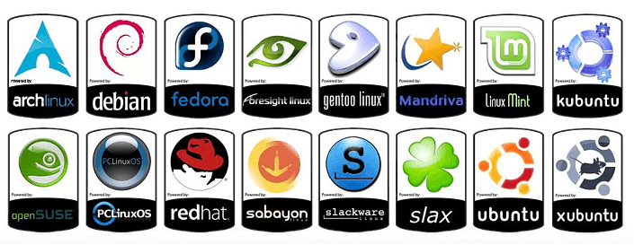

قمت باختيار توزيعة Ubuntu لشرحها لأنها تعتبر من أشهر توزيعات اللينكس وأكثرها بساطة في التعامل وجمالا في الشكل، يوجد العديد من إصدارات Ubuntu أكثرها استقرارا هو 14.04.3 (مدعوم إلى نهاية 2019-04) وأحدثها هو 15.10 (مدعوم إلى نهاية 2016-07) ولكن سأقوم بشرح التثبيت على الإصدار 14.04.3.

## متطلبات تشغيل توزيعة Ubuntu

- معالج CPU بسرعة 1 جيجا هيرتز (Pentium 4 على الأقل).

- ذاكرة وصول عشوائية RAM 1 جيجابايت على الأقل.

- مساحة فارغة في القرص الصلب Hard Disk 5 جيجابايت على الأقل.

- بطاقة شاشة تدعم دقة العرض 1024×768 على الأقل.

- بطاقة صوت.

- اتصال بالإنترنت (مُستحسن).

## أولا: تحميل Ubuntu Linux

1. قم بالدخول إلى موقع http://www.ubuntu.com/download/desktop.

2. ستجد الإصدارين المتاحين للتحميل كما بالصورة 4.

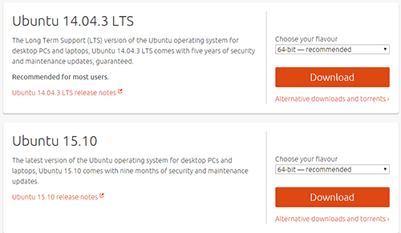

3. قم باختيار معمارية النظام (Ubuntu 14.04.3 LTS) 32 أو 64 ثم اضغط Download.

**ملاحظة 1**: 32 bit للأجهزة القديمة أو الأقل من 2 جيجا رام، 64 bit للأجهزة الحديثة أو الأعلى من 2 جيجا رام.

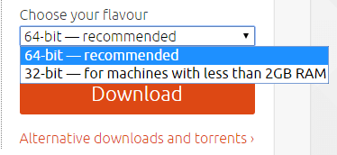

4. ستتنقل الآن إلى صفحة التحميل، ستتطلب منك التبرع لتطوير النظام، قم بالنزول إلى الأسفل ثم اضغط على Not now, take me to the download ›.

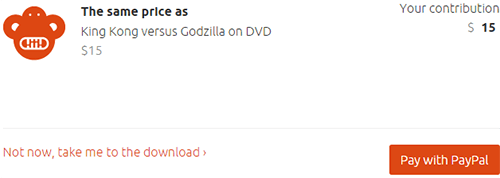

5. ستظهر لك رسالة بدأ التحميل، إذا لم يبدأ التحميل اضغط على Your download should start automatically. If it doesn’t, download now.

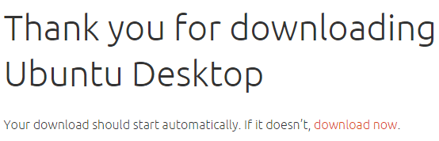

**ملاحظة 2**: يمكنك التحميل أيضا من خلال مجموعة روابط أخري إذا لم تعمل معك الروابط التي بالأعلى من هذه الصفحة.

http://www.ubuntu.com/download/alternative-downloads

## ثانيا: التحضير لتثبيت Ubuntu Linux

- لاحظ عزيزي القارئ أنه لتثبيت لينكس بجوار الويندوز يجب عليك أن تقوم بعمل 2 Partition فارغان أحدهم على الأقل مساحته 5 جيجا (الذي سنقوم بتثبيت النظام عليه) والأخر كما تريد (يستخدم كـ Swap لأداء المزيد من العمليات) ويفضل تركهما بدون عمل Format على الحالة UnPartitioned.

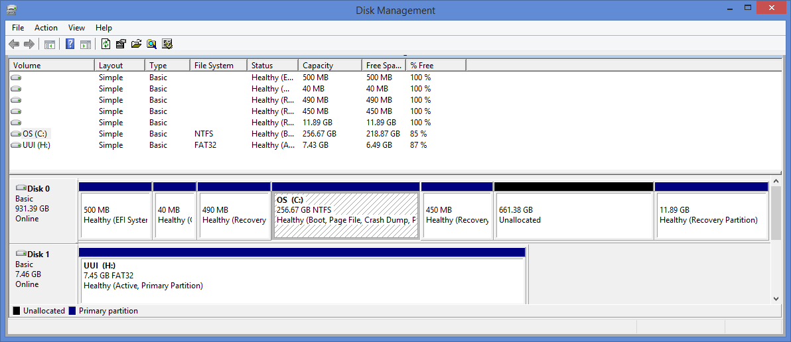

- يمكنك تثبيت لينكس بجانب الويندوز أو بجانب نظام الماك أو بجانب أي توزيعة لينكس أخري يدون أي مشاكل.

1. تحتاج إلى حرق نظام Ubuntu على قرص DVD فارغ أو USB:

   - على DVD: عن طريق الضغط على ملف ISO الخاص ب Ubuntu واختيار " Burn Disc image" ثم اضغط على " Burn" لبدأ الحرق كما بالصورة 8. (هذه الطريقة تعمل على ويندوز 7 فأعلي)

     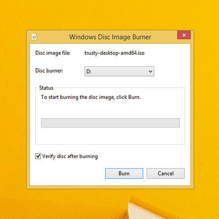

     بالنسبة لويندوز XP يمكنك استخدام برامج مثل UltraISO، PowerISO أو Infra Recorder.

   - على USB: يمكنك استخدام أي برنامج من Rufus، Universal USB Installer أو Unetbootin.

     لا تختلف الطريقة من برنامج لأخر كل ما تحتاجه هو تحديد ال USB وملف الـ ISO ثم اضغط Burn لبدأ العملية.

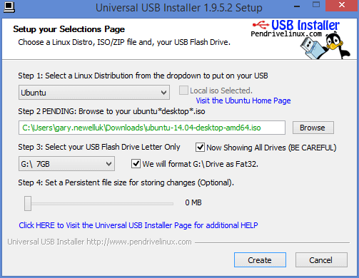

2. تحتاج إلى إغلاق خاصية الإقلاع السريع Fast boot في ويندوز:

   للإقلاع إلى Ubuntu بشكل سليم وبدون مواجهة مشكلات أثناء وبعد التثبيت يجب إغلاق خاصية Fast boot الموجودة ابتداء من ويندوز 8.

   قم بفتح لوحة التحكم Control Panel ثم قم باختيار Power Options، من الجانب الأيسر من الشاشة اختر Choose what the power button does، ستجد الاعدادات كما بالصورة 11.

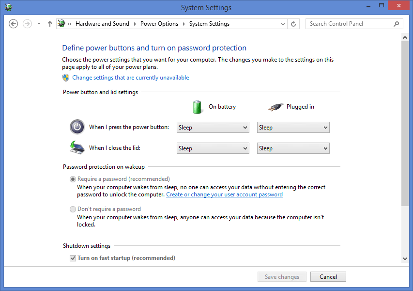

​	اضغط على "Change settings that are currently unavailable" ثم أسفل Shutdown Settings ستجد الاختيار Turn on fast startup (recommended) قم بتعطيله ثم اضغط Save Changes.

3. يُفضل عمل نسخة احتياطية من ملفاتك المهمة تجنبا لفقد البيانات نتيجة لأي أمر خاطئ.

4. بعد انتهائك من الاستعدادات قم بإعادة تشغيل جهازك والإقلاع من قرص DVD أو مفتاح USB سواء بعد تغيير إعدادات ال BIOS أو من قائمة الإقلاع مباشرة (في أغلب الأجهزة F12/F9/F11).

## ثالثا: تثبيت Ubuntu Linux على جهازك

1. بعد الإقلاع من DVD/USB ستظهر لك هذه الشاشة، اختر اللغة الإنجليزية كلغة للوحة المفاتيح بالضغط على الزر Enter.

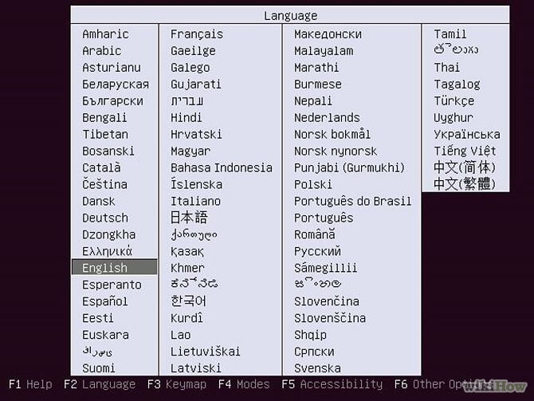

2. اختر "Try Ubuntu before installing" لتجربة النظام أو تثبيته.

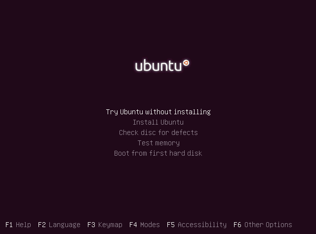

3. اختر لغة التثبيت ثم اضغط متابعة Continue.

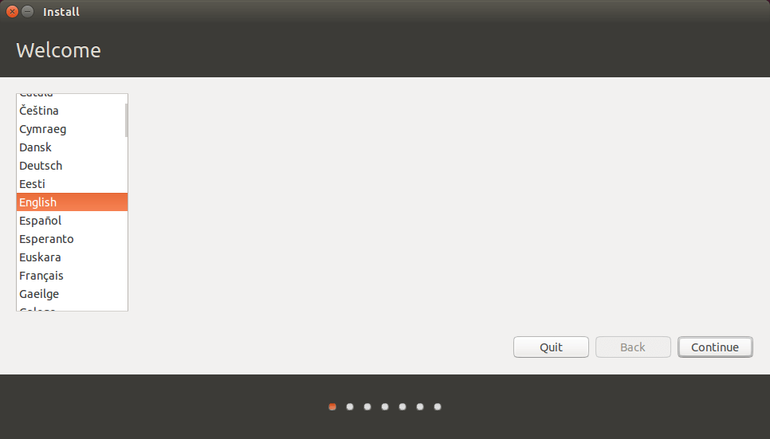

4. سيظهر سطح المكتب أمامك، بإمكانك استكشاف النظام أو الضغط على "Install Ubuntu" لبدأ عملية التثبيت.

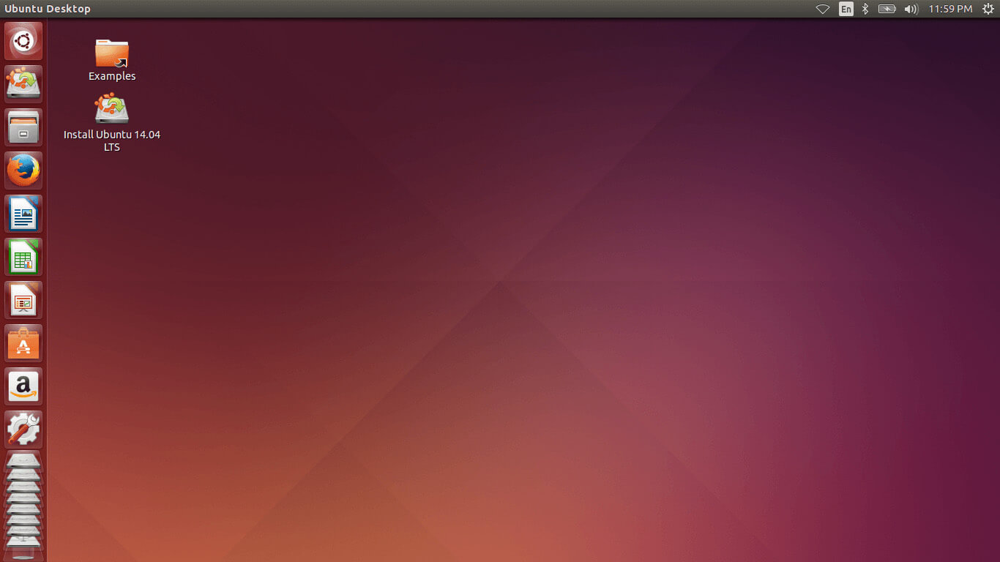

5. قم باختيار لغة التثبيت ثم اضغط Continue، ستظهر شاشة لاختيار شبكة الـ Wi-Fi الخاصة بك لتثبيت التحديثات أثناء التثبيت، يمكنك اختيارها إذا كان الانترنت لديك جيدا، وأنا افصل الضغط على I don’t want to connect to a Wi-Fi network right now وتنزيل التحديثات فيما بعد.

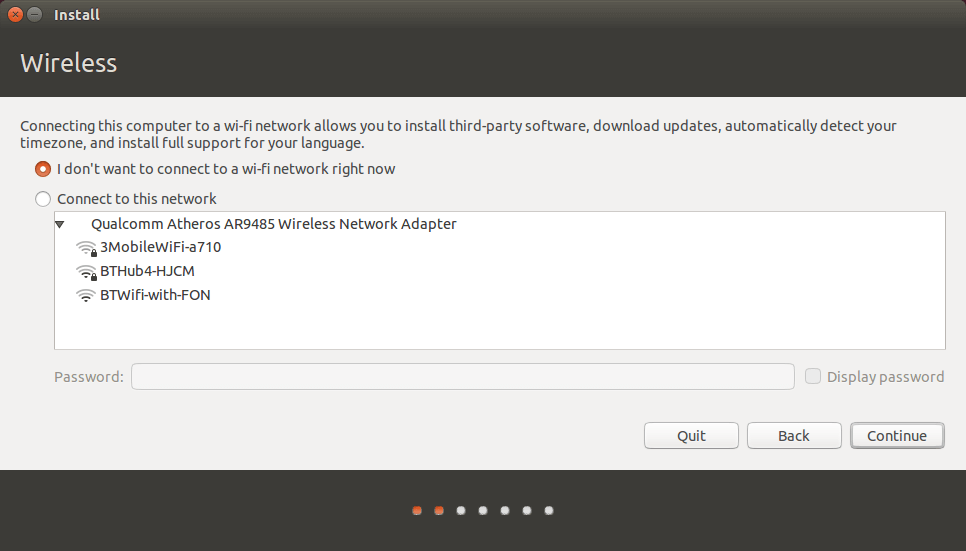

6. سيتم التحقق الآن من المساحة الخالية المتوفرة، الاتصال بمصدر كهربائي (خصوصا في أجهزة اللاب توب)، والاتصال بالإنترنت.

   في حالة تفعيل اختيار "Download updates while installing" قم بإزالته، ثم قم بتفعيل اختيار "Install this third-party software" لتثبيت البرامج التي تأتي من مصادر خارجية مثل مشغل الصوتيات وملفات، بعد ذلك اضغط Continue.

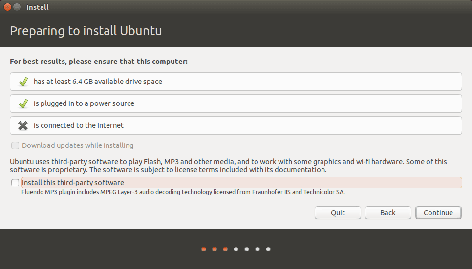

7. الآن ننتقل إلى المرحلة الأهم (تقسيم القرص الصلب واختيار مكان التثبيت):

يجب عليك التركيز والتعامل بحرص في هذه المرحلة، حيث أن أي اختيار خاطئ قد يؤدي لفقدان كل بياناتك.

ستجد الآن أربعة اختيارات أهمها:

- "Erase disk and install Ubuntu" وهو الاختيار الخاص بحذف كل ما على القرص الصلب من بيانات (وليس الجزء الخاص بالويندوز فقط)، وبالتأكيد يجب الابتعاد عن هذا الاختيار إلا في حالة أنك تريد حذف كل ما على القرص.

- "Something else" وهو الاختيار الذي نريده، حيث أننا سنقوم باختيار مكان تثبيت النظام بشكل يدوي، قم باختياره ثم اضغط Install Now.

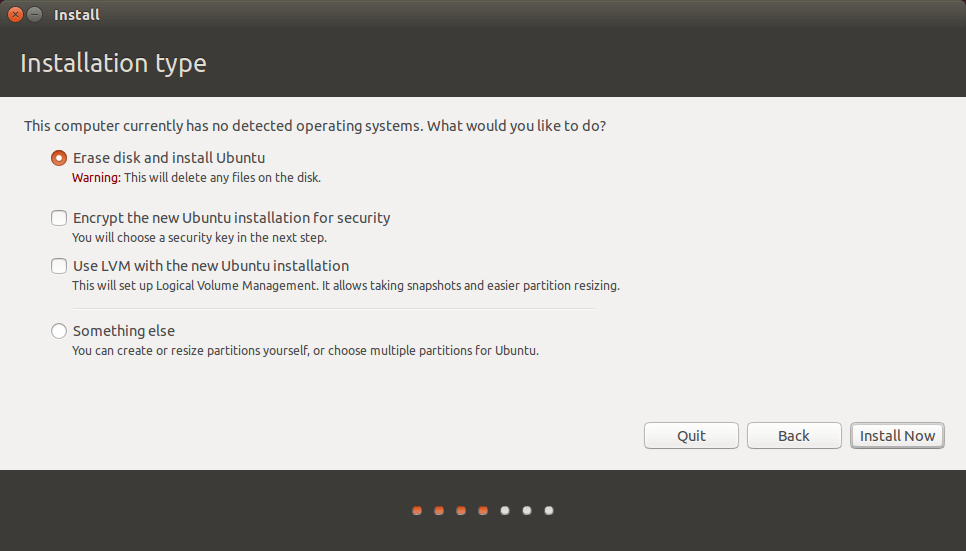

8. ستجد القرص الصلب الخاص بك ظاهرا كما بالصورة 19.

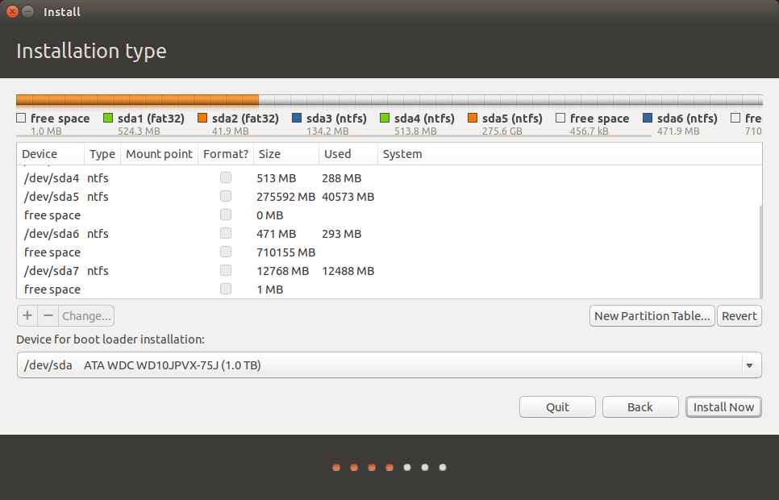

يجب عليك الآن إنشاء القسم "/" الذي سيثبت عليه النظام، قم بتحديد ال "free space" القسم الذي أنشأته أثناء مرحلة الاستعدادات (يجب أن يكون غير مهيئ unpartitioned) ثم اضغط على السهم +.

9. قم باختيار نوع القسم الجديد Primary، واترك Location كما هي، من قائمة Used as اختر EXT4 journaling file system، ومن Mount point اختر / ثم اضغط OK.

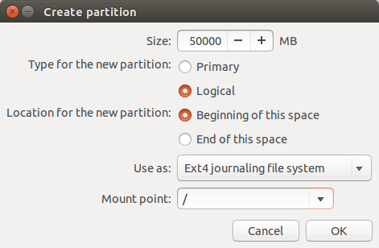

10. قم بإنشاء قسم ال Swap بنفس الطريقة ولكن من قائمة Used as اختر swap area ويفضل أن يكون حجمه ضعف حجم الذاكرة العشوائية لديك أو في المتوسط 4 جيجا.

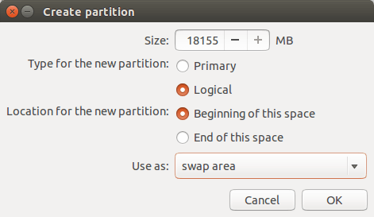

11. ستظهر رسالة تأكيد للتغيرات اضغط Continue.

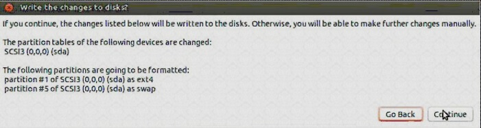

12. قم باختيار مكان تثبيت محمل الإقلاع Boot loader من القائمة المنسدلة أعلى زر Install، يفضل أن يكون نفس القسم الذي ستثبت عليه اللينكس، ثم اضغط Install Now.

**ملاحظة 3**: في حالة رغبتك في التراجع عن أي تغييرات قمت بها في هذه المرحلة اضغط على الزر Revert.

13. اختر الدولة الخاصة بك لإعداد الوقت والتاريخ، ثم اضغط Continue.

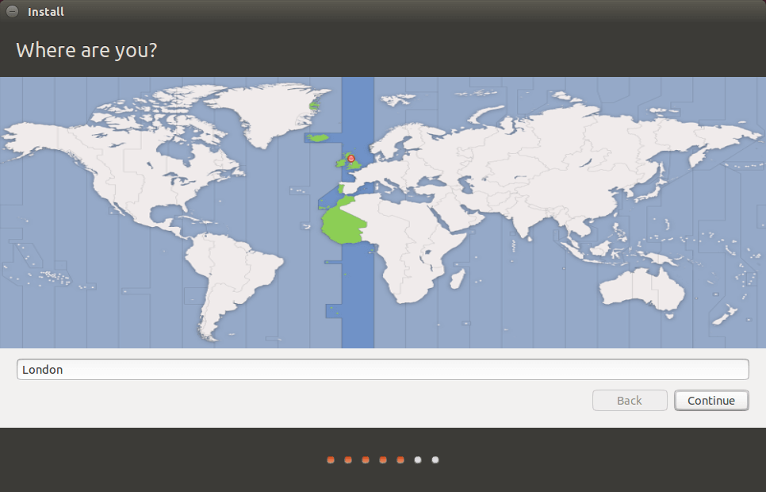

14. اختر اللغة التي تريد إضافتها إلى لوحة المفاتيح إلى جانب الانجليزية، (اختر اللغة العربية)، ثم اضغط Continue.

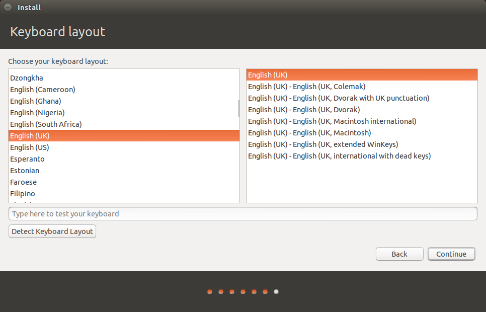

15. قم بكتابة بيانات المستخدم (اسمك-اسم جهازك-اسم المستخدم-كلمة السر-تأكيد كلمة السر)، يمكنك اختيار أن يقوم النظام بتسجيل الدخول بشكل آلي أو أن يطلب كلمة السر في كل مرة يفتح فيها.

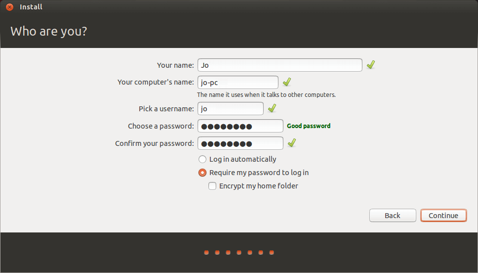

16. انتظر حتى ينتهي Ubuntu من التثبيت.

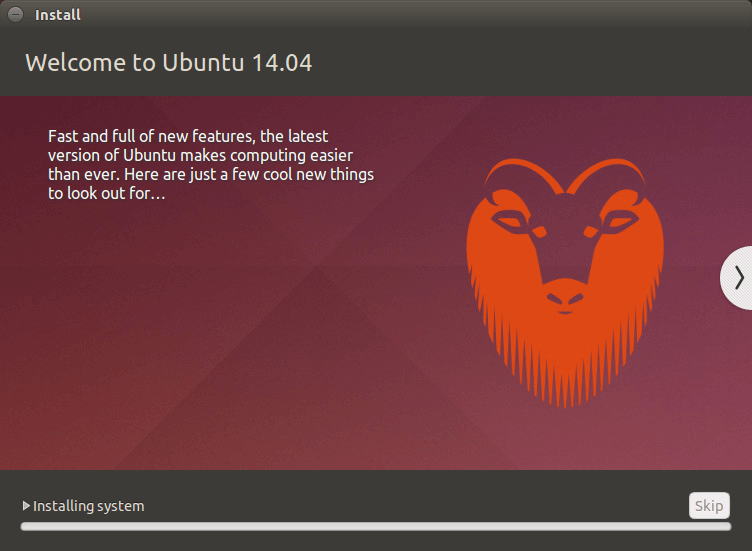

17. عند الانتهاء من التثبيت ستظهر لك هذه الرسالة اضغط Reboot Now.

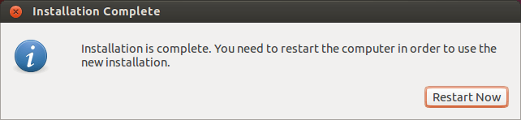

وبهذا يكون قد اكتمل التثبيت، قم بالدخول إلى Ubuntu من ال Boot Loader واستمتع بتجربة Ubuntu Linux على جهازك.

---

هذا الموضوع نُشر باﻷصل في مجلة لغة العصر العدد 181 شهر 01-2016 ويمكن الإطلاع عليه [هنا](https://drive.google.com/file/d/1AsfdtFPx3rkFiDhDT5xMkXu5YaYNRpo6/view?usp=sharing).

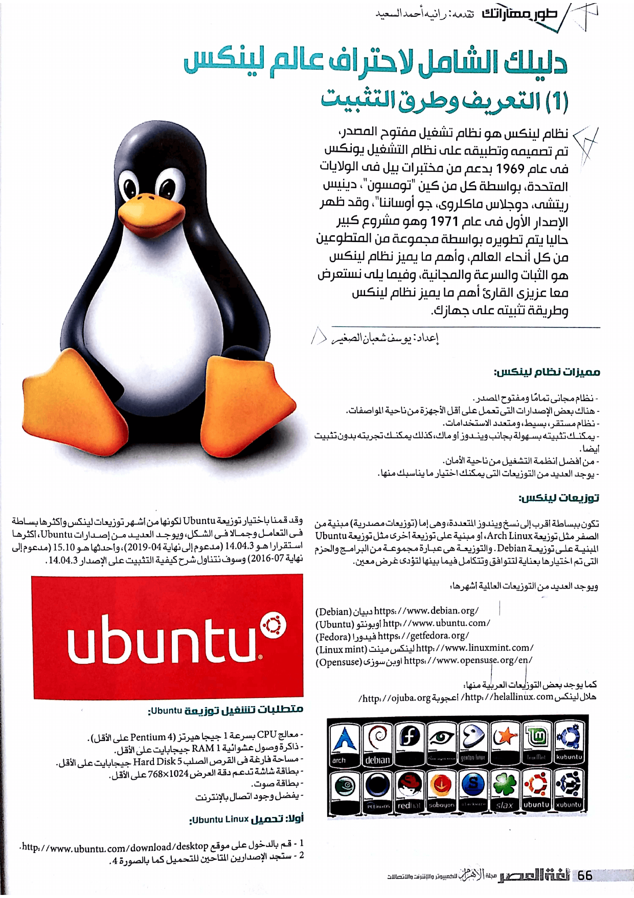

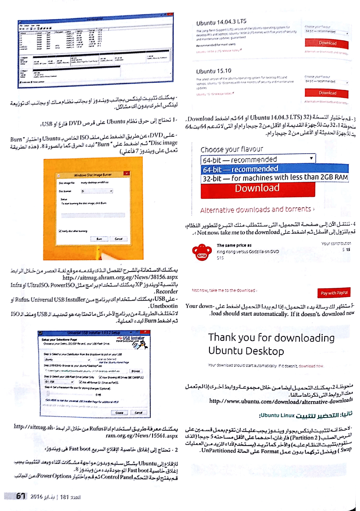

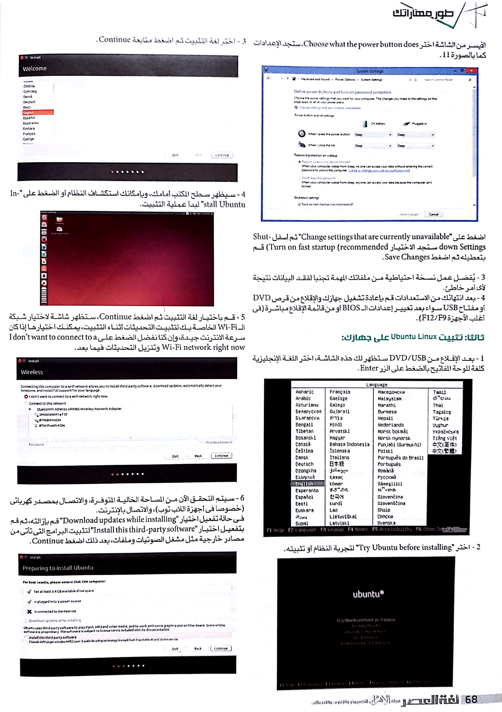

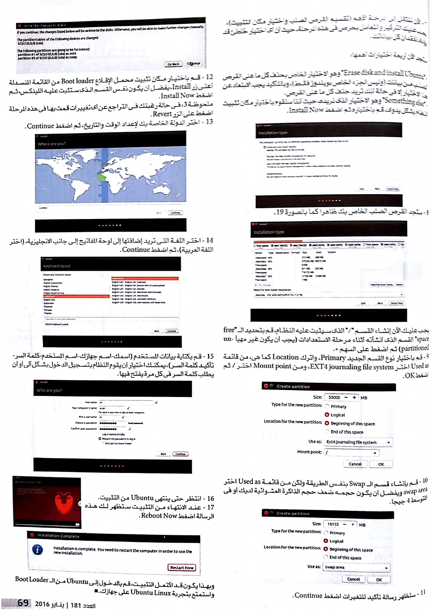

