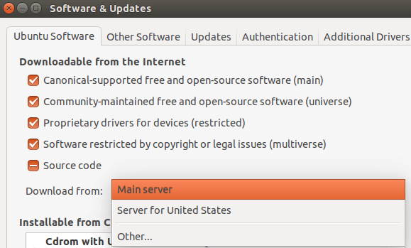

+++
title = "إضافة دعم اللغة العربية إلى أوبنتو لينكس"
date = "2016-02-01"
description = "تحدثنا في الجزء السابق عن نظام لينكس، ما هو، مميزاته، وتوقفنا عند اكتمال تثبيت أوبنتو، في حلقة هذا العدد سنواصل حديثنا وسنتعرف على كيفية إضافة الدعم الكامل للغة العربية إلى أوبنتو لينكس."
categories = ["لينكس",]
tags = ["مجلة لغة العصر"]
series = ["دليل لينكس"]

+++

تحدثنا في الجزء السابق عن نظام لينكس، ما هو، مميزاته، وتوقفنا عند اكتمال تثبيت أوبنتو، في حلقة هذا العدد سنواصل حديثنا وسنتعرف على كيفية إضافة الدعم الكامل للغة العربية إلى أوبنتو لينكس.

## أولا: تغيير لغة الواجهة إلى اللغة العربية

1. قم بالدخول إلى إعدادات النظام System settings عن طريق الضغط بزر الفأرة على رمز التحكم أعلى يمين الشاشة، ثم قم باختيار System settings.


2. ستجد الإعدادات كما بالصورة، قم بفتح Language Support.


3. من هنا نستطيع تغيير دعم اللغات كما نريد، اضغط على Install / Remove Language.


4. قم بتحديد اللغة العربية ثم اضغط Apply Changes.


5. سيطلب منك النظام إعادة إدخال كلمة المرور الخاصة بك، قم بإدخالها.


6. سيبدأ تحميل ملفات اللغة العربية الآن.


7. بعد اكتمال التحميل سيقوم النظام بتثبيت الملفات تلقائيا.


8. لتغيير لغة الواجهة إلى العربية قم بسحب اللغة العربية إلى أعلى قائمة اللغات كما بالصورة 8 ثم اضغط Apply system-Wide.


9. لتغيير باقي التفصيلات (الأرقام والعملات المحلية) انتقل إلى التبويب نسق إقليمية . Regional Formats بعدها قم بتغيير التنسيق إلى العربية (مصر) ثم اضغط Apply system-Wide.


10. يجب عليك تسجيل الخروج والدخول مرة أخري لتطبيق تغييرات اللغة.


**ملاحظة:** قد تواجهك مشكلة "Requires installation of untrusted packages" كما بالصورة 11.


-   لحل هذه المشكلة قم بفتح مركز برمجيات أوبنتو ثم من قائمة Edit قم باختيار Software Sources.


-   من قائمة Download Server قم باختيار Main Server، ثم أعد إدخال كلمة السر.



-   انتظر حتى ينتهي المتجر من تحديث مصادر البرامج ثم أعد إضافة اللغة مرة أخري.


## ثانيا: إضافة اللغة العربية إلى لوحة المفاتيح

1. قم بالدخول إلى إعدادات النظام ثم إدخال النصوص.


2. قم بالضغط على علامة (+) ثم اختر تخطيط اللغة العربية الذي تريد استخدامه واضغط أضف.


3. للتحكم في أزرار تبديل اللغات يمكنك تغييرها من الجانب الأيسر كما يظهر بالصورة 17.


يفضل تغييرها إلى Alt+Shift كما هو الحال في ويندوز، والطبع يمكنك اختيار الأزرار التي تريد.

4. لجعل زر التبديل بين اللغات ظاهرا في شريط القوائم العلوي تأكد من تفعيل اختيار "عرض مصدر الإدخال الحالي" كما بالصورة 18.


## ثالثا: إضافة دعم اللغة العربية إلى الطرفية Terminal

1. قم بفتح Terminal عن طريق البحث عنها، أو عن طريق الضغط على Ctrl+Alt+T.


2. قم بكتابة الأمر التالي `sudo apt-get install libfribidi0 libfribidi-dev`

أدخل كلمة المرور الخاصة بك، ستظهر لك هذه الرسالة " After this operation, 166 kB of additional disk space will be used" اضغط Enter وانتظر حتى الانتهاء.


3. قم بتحميل حزمة اللغة التالية:

    لنظام 32: https://launchpad.net/~behnam/+archive/ppa/+build/574785/+files/bicon_0.2.0-1ubuntu0~ppa4_i386.deb

    لنظام 64:

    https://launchpad.net/~behnam/+archive/ppa/+build/567388/+files/bicon_0.2.0-1ubuntu0~ppa4_amd64.deb

    ثم قم بفتح الحزمة باستخدام مركز برمجيات أوبنتو.

    

4. اضغط على "ثبت" وانتظر حتى ينتهي التثبيت.


5. انتقل مرة أخري إلىTerminal ثم قم بكتابة هذا الأمر وإدخال كلمة السر

`sudo gedit /usr/share/applications/gnome-terminal.desktop`


6. من خلال محرر النصوص الذي فتح أضف الكود التالي أسفل سطر X-Ubuntu-Gettext-Domain=gnome-terminal

```bash
Terminal=true
Exec=/usr/bin/bicon.bin
```


7. قم بحفظ التغييرات وإغلاق Terminal، وعند فتحها مرة أخري ستجدها تدعم اللغة العربية.


---

هذا الموضوع نُشر باﻷصل في مجلة لغة العصر العدد 182 شهر 2-2016 ويمكن الإطلاع عليه [هنا](https://drive.google.com/file/d/1Wx26dCh98PhkzJd_LJXU3NHNbzh88u1-/view?usp=sharing).


