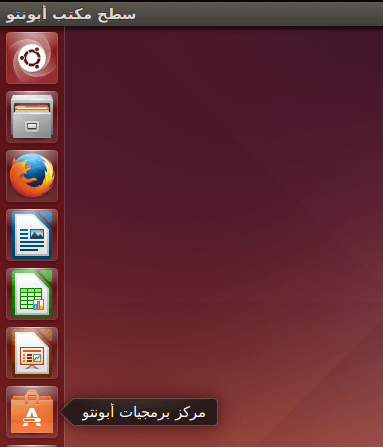
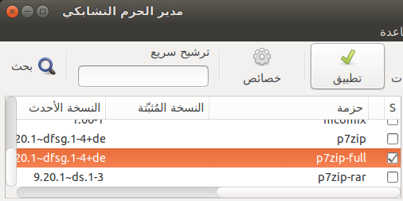
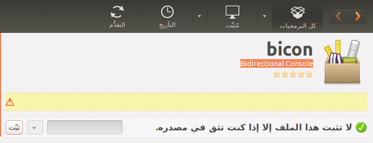

+++
title = "كيفية التعامل مع البرامج في أوبنتو لينكس"
date = "2016-03-01"
description = "تحدثنا في الجزء السابق عن اللغة العربية ونظام لينكس، وكيفية إضافة الدعم الكامل لها، في حلقة هذا العدد سنواصل حديثنا وسنتعرف على طريقة التعامل مع البرامج، تثبيت البرامج من مركز البرمجيات ومن خارجه، التعامل مع الحزم، إدارة البرامج بواسطة الطرفية Terminal."
categories = ["لينكس",]
tags = ["مجلة لغة العصر"]
series = ["دليل لينكس"]

+++

تحدثنا في الجزء السابق عن اللغة العربية ونظام لينكس، وكيفية إضافة الدعم الكامل لها، في حلقة هذا العدد سنواصل حديثنا وسنتعرف على طريقة التعامل مع البرامج، تثبيت البرامج من مركز البرمجيات ومن خارجه، التعامل مع الحزم، إدارة البرامج بواسطة الطرفية Terminal.

## التعامل مع البرامج من خلال مركز برمجيات أوبنتو

مركز برمجيات أوبنتو هو المكان الذي يحتوي على أغلب برامج وألعاب نظام أوبنتو بمختلف أنواعها، ويتميز بواجهته البسيطة وسهولة الوصول إلى البرمجيات بداخله.

### أولا: تثبيت البرامج من خلال مركز برمجيات أوبنتو

1. قم بفتح مركز البرمجيات عن طريق الضغط على من الشاشة الرئيسية

أو البحث عن كلمة software.

2. ستجد الواجهة كما بالصورة:

3. يمكنك اختيار أي برنامج من التي تظهر أمامك، كما يمكنك البحث في مركز البرمجيات عن طريق الضغط على شريط البحث وكتابة اسم التطبيق الذي تريد تثبيته.

أو البحث عن طريق الضغط على Crtl+F أو من قائمة تحرير Edit اختر بحث Find.

4. سأقوم بتثبيت برنامج فك الضغط الشهير 7Zip، بعد اختيار البرنامج اضغط على زر ثبّت Install.

5. قم بإدخال كلمة السر الخاصة بك ثم اضغط استوثق Authorize.

6. ستبدأ عملية التثبيت.

7. انتظر حتى تكتمل عملية التثبيت وتظهر علامة تم كما بالصورة 9.

### ثانيا: إزالة البرامج من خلال مركز برمجيات أوبنتو

قم بالبحث عن البرنامج الذي تريد إلغاء تثبيته ثم قم بالدخول إلى صفحته واضغط زر أزِل Uninstall.

## التعامل مع البرمجيات من خلال مدير الحزم Synaptic

Synaptic هي الواجهة الرسومية لـ apt مدير الحزم في توزيعة أوبنتو، و الغرض من Synaptic هي تسهيل عملية التثبيت و التحديث و إزالة البرمجيات، كذلك الترقية و البحث عن البرمجيات ببساطة، بالإضافة إلى إدارة المخازن.

-   **ملاحظة**: Synaptic في نسخة كوبونتو Kubuntu يطلق عليها Adept)).

-   لتثبيت مدير الحزم Synaptic:

قم بالدخول إلى مركز برمجيات أوبنتو ثم ابحث عن Synaptic Package Manager وقم بتثبيته بنفس الطريقة التي شرحتها بالأعلى.

### أولا: تثبيت البرامج من خلال مركز مدير الحزم Synaptic

1. بعد اكتمال التثبيت ستجد مدير الحزم أسفل أيقونة الإعدادات بالشاشة الرئيسية.

2. قم بالدخول عليه، سيطلب منك ادخال كلمة السر قم بإدخالها، ستجد الواجهة كما بالصورة عند فتحه لأول مرة.

3. اضغط أغلق، لتظهر لك الواجهة الرئيسية لمدير الحزم.

النافذة الرئيسية لـ Synaptic مقسمة إلى ثلاثة أقسام رئيسية، أعلى اليمين يظهر صندوق متصفح الحزم وفي أعلى اليسار قائمة الحزم وفي أسفل متصفح الحزم يوجد صندوق بيانات الحزم.

4. من خلال زر البحث تستطيع الوصول بسرعة الي البرنامج الذي تريد تثبيته، اضغط عليه ثم اكتب اسم البرنامج واضغط بحث.

5. اضغط على المربع بجانب البرنامج ثم من القائمة اختر "علم للتثبيت".

6. لتطبيق التغييرات اضغط على زر تطبيق.

7. اضغط طبق لتأكيد التغييرات.

8. بعد اكتمال التثبيت ستظهر لك الرسالة التالية، اضغط أغلق، كما يمكنك ضبطها للإغلاق التلقائي بمجرد اكتمال المهمة الحالية بوضع العلامة على "الإغلاق مباشرة بعد تطبيق التغييرات بنجاح".

### ثانيا: إزالة البرامج من خلال مركز مدير الحزم Synaptic

قم بالضغط على المربع بجانب البرنامج ثم من القائمة اختر "علم للإزالة".

بعد ذلك اضغط على زر تطبيق لتطبيق التغييرات.

## التعامل مع البرمجيات من خلال الطرفية Terminal

الكثير من الناس وخصوصا المبتدئين في التعامل مع لينكس يظنون أن الطرفية Terminal معقدة، ولكن بعد الاحتكاك بها وتعلم بعض أوامرها ستجد أنها أسهل وأسرع من التعامل مع الواجهة الرسومية في كثير من الأحيان، كما أنه ستحتاجها كثيرا لتثبيت البرامج خصوصا عندما تجد برنامجا ما على الإنترنت، ستجد أمر تثبيته من ال Terminal.

-   قم بفتح Terminal عن طريق البحث عنها، أو عن طريق الضغط على Ctrl+Alt+T.

### أولا: تثبيت البرامج من خلال الطرفية Terminal

1. للبحث عن البرامج استخدم الأمر apt-cache search application مع استبدال application باسم البرنامج الذي تريد البحث عنه، سأقوم بالبحث عن برنامج VLC (يفضل عدم البحث عن البرامج من خلال الطرفية لأنها ستعطيك نتائج بحث كثيرة).

2. بعد أن تجد في نتائج البحث البرنامج استخدم الأمر sudo apt-get install application مع استبدال application باسم البرنامج الذي تريد تثبيته، ستطلب منك ادخال كلمة السر ادخلها واضغط Enter، عندما تظهر لك رسالة الموافقة على التثبيت اضغط Enter أو Y للمتابعة.

3. انتظر حتى يتكمل التثبيت.

4. عندما تجد تنفيذ الأمر قد انتهي ستجد البرنامج قد اكتمل تثبيته ويمكنك فتحه كما تريد.

-   ملاحظة: كثيرا ما نحتاج إلى تثبيت برامج من خارج مستودعات أوبنتو الرسمية، وأسهل طريقة لفعل ذلك هي باستخدام الطرفية Terminal.

قم بكتابة الأوامر التالية بالترتيب:

`sudo add-apt-repository <repository_name>`

مع استبدال الأقواس وما بينها باسم المستودع.

فيصبح الأمر كالتالي مثلا:

`sudo add-apt-repository ppa:tualatrix/ppa`

`sudo apt-get update` لعمل تحديث لقوائم الحزم

`sudo apt-get install <application_name>` مع استبدال الأقواس وما بينها باسم البرنامج.

فيصبح الأمر كالتالي مثلا: `sudo apt-get install ubuntu-tweak`

### ثانيا: إزالة البرامج من خلال الطرفية Terminal

باستخدام الأمر sudo apt-get remove application مع استبدال application باسم البرنامج الذي تريد إزالته.

## تثبيت البرامج من خارج مركز البرمجيات

### الطريقة الأولى

قم بفتح الحزمة باستخدام مركز برمجيات أوبنتو، اضغط على "ثبت" وانتظر حتى ينتهي التثبيت.

### الطريقة الثانية

قم بفتح الطرفية في المكان الذي توجد به الحزمة (ملف .deb) (يفضل وضع الملف في المجلد home لتنجب هذه الخطوة)

ثم استخدم الأمر `sudo dpkg -i application.deb` مع استبدال application باسم الحزمة.

---

هذا الموضوع نُشر باﻷصل في مجلة لغة العصر العدد 183 شهر 03-2016 ويمكن الإطلاع عليه [هنا](https://drive.google.com/file/d/1PlVnxrTkEQg_4q1u-ozKiCx1rdsXIqvq/view?usp=sharing).

