+++
title = "ماذا يجب أن تفعل بعد تثبيت أوبنتو لينكس؟"
date = "2016-04-01"
description = "تحدثنا في الجزء السابق عن كيفية التعامل مع البرامج في أوبنتو لينكس، وفي هذا الجزء سنواصل حديثنا وسنتعرف على أهم الخطوات التي يجب عليك فعلها بعد تثبيت أوبنتو."
categories = ["لينكس",]
tags = ["مجلة لغة العصر"]
series = ["دليل لينكس"]

+++

تحدثنا في الجزء السابق عن كيفية التعامل مع البرامج في أوبنتو لينكس، وفي هذا الجزء سنواصل حديثنا وسنتعرف على أهم الخطوات التي يجب عليك فعلها بعد تثبيت أوبنتو.

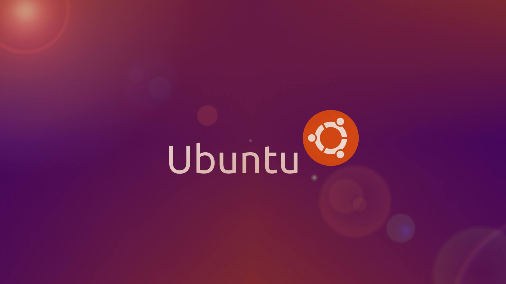
 

1- إضافة دعم اللغة العربية – سبق تناولها في [الجزء 2](/ar/posts/linux-guide-02-arabic-support/).

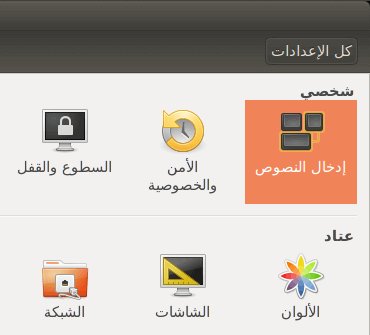

2- تثبيت مدير الحزم Synaptic – سبق تناولها في [الجزء 3](/ar/posts/linux-guide-03-dealing-with-programs/) (الجزء السابق).

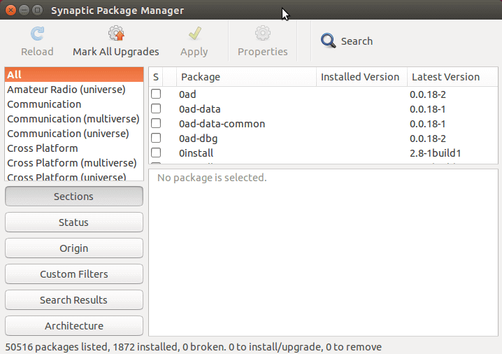

3- التحقق من تحديثات النظام:

عادة ما يظهر مُحدّث البرامج Software Updater من تلقاء نفسه افتراضيًا عند بدء تشغيل النظام، فإذا لم يظهر قم بالدخول إلى قائمة البرامج ثم ابحث عن مُحدّث البرامج أو Software Updater.

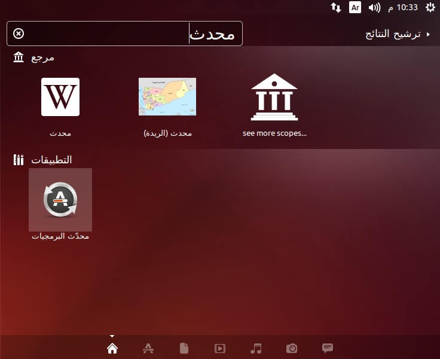

بعد الضغط عليه سيبدأ التحقق من وجود تحديثات.

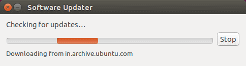

بمجرد انتهاء التحقق ستظهر لك قائمة التحديثات المتاحة كما بالصورة.

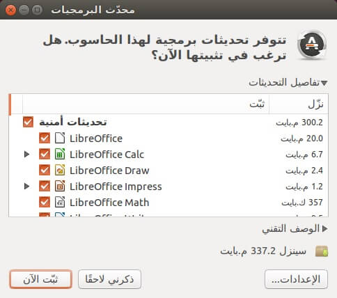

اضغط على Install أو ثبت الآن.

سيبدأ تحميل التحديثات وبعد الانتهاء من التحميل سيتم تثبيتها تلقائيا، قد تحتاج لعمل إعادة تشغيل لتطبيق التغييرات.

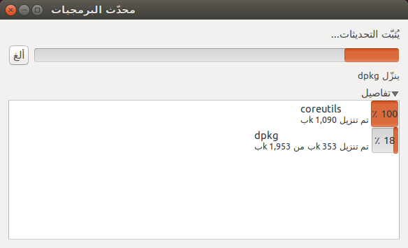

4- تثبيت حزمة الإضافات المقيّدة - ترميزات الوسائط (الكودكس):

كما تعرفون جميعا فإنه لا غنى عن ال الكودكس فهو ضروري لتشغيل بعض تنسيقات الفيديو والصوت، كما تحتوي هذه الحزمة أيضا على إضافات الفلاش والجافا، لتثبيتها قم بالخطوات التالية:

فتح مركز برمجيات أوبنتو Ubuntu Software Center كما تعلمنا في الحلقة السابقة، ثم قم بالبحث عن `ubuntu-restricted-extras` واضغط تثبيت Install.

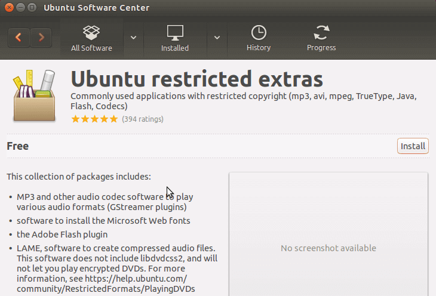

أو عن طريق الطرفية Terminal باستخدام هذا الأمر:

`sudo apt-get install ubuntu-restricted-extras`

5- تثبيت حزم فكّ الضغط:

للتعامل مع الصيغ المضغوطة مثل zip, tar.gz, zip, 7zip rar تحتاج إلى تثبيت بعض الحزم، افتح الطرفية Terminal Ctrl+Alt+T واكتب الأمر التالي:

`sudo apt-get install unace unrar zip unzip p7zip-full p7zip-rar sharutils rar uudeview mpack arj cabextract file-roller`

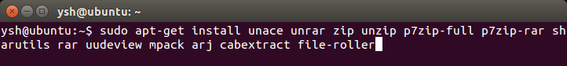

6- تثبيت تعاريف بطاقات الشاشة:

كما ذكرت سابقا فإن من مميزات لينكس أنه يستطيع أن يتعرف على معظم قطع الجهاز بشكل تلقائي، دون الحاجة إلى تعريفات خارجية، ولكن في بعض الحالات النادرة قد تواجه مشكلة في عدم عمل الوايرليس أو بطاقة الشاشة، لحل هذه المشكلة:

قم بالدخول إلى إعدادات النظام ثم البرمجيات والتحديثات.

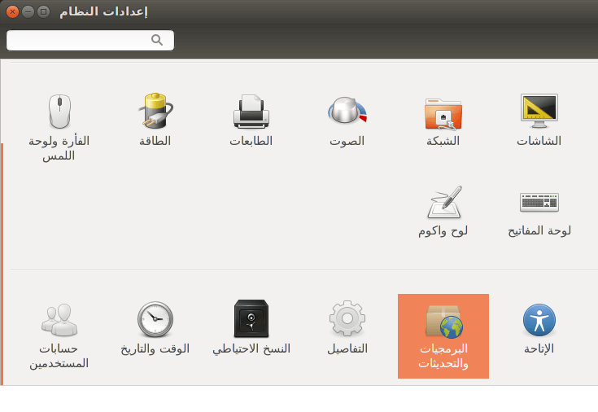

 انتقل إلى التبويب Additional Drivers إن وجدت تعريفا متوفرا فقط قم بتفعيله.

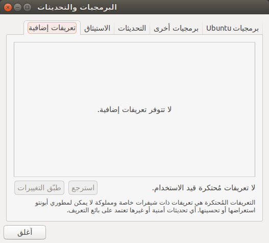

- إذا كان جهازك هجينا (أي لديك بطاقتان شاشة “إنتل وإنفيديا” على سيبل المثال)، يجب عليك تثبيت حزمة nvidia-prime لتتمكن من التبديل بين الكرتين، افتح الطرفية Terminal Ctrl+Alt+T واكتب الأوامر التالية بنفس ترتيبها:

```bash
sudo apt-get purge bumblebee
sudo apt-get install nvidia-prime
sudo add-apt-repository ppa:nilarimogard/webupd8
sudo apt-get update
sudo apt-get install prime-indicator
```

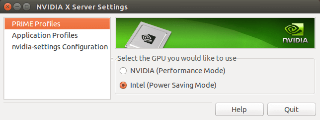

7- تعطيل مبلغ الأخطاء:

مبلغ الأخطاء في أوبنتو مزعج قليلا، فإذا صادف خطأ فربما يظل يتكرر بلا سبب، ولهذا يجب تعطيله لتجنب الإزعاج.

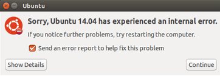

افتح الطرفية Terminal بواسطة الاختصار Ctrl+Alt+T ثم اكتب:

`sudo gedit /etc/default/apport`

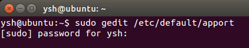

قم بتغيير القيمة enabled=1 إلى enabled=0 ثم احفظ الملف.

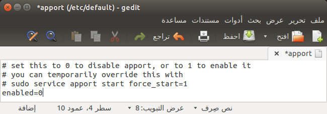

بعد ذلك اكتب الأمر `sudo service apport stop`

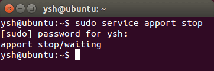

8- ضبط استهلاك البطارية والطاقة:

افتح الطرفية Terminal Ctrl+Alt+T واكتب الأوامر التالية بنفس ترتيبها:

```bash
sudo add-apt-repository ppa:linrunner/tlp
sudo apt-get update
sudo apt-get install tlp tlp-rdw
sudo tlp start
```

9- تثبيت البرامج التي تحتاج وهو ما سنتناوله في الحلقة القادمة إن شاء الله.

---

هذا الموضوع نُشر باﻷصل في مجلة لغة العصر العدد 184 شهر 04-2016 ويمكن الإطلاع عليه [هنا](https://drive.google.com/file/d/1sIvvKw3sT0bb4pqcGZ3ea7b6jsMqvm1H/view?usp=sharing).

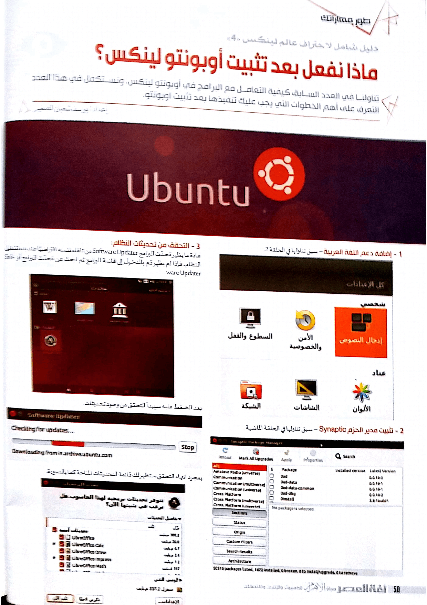

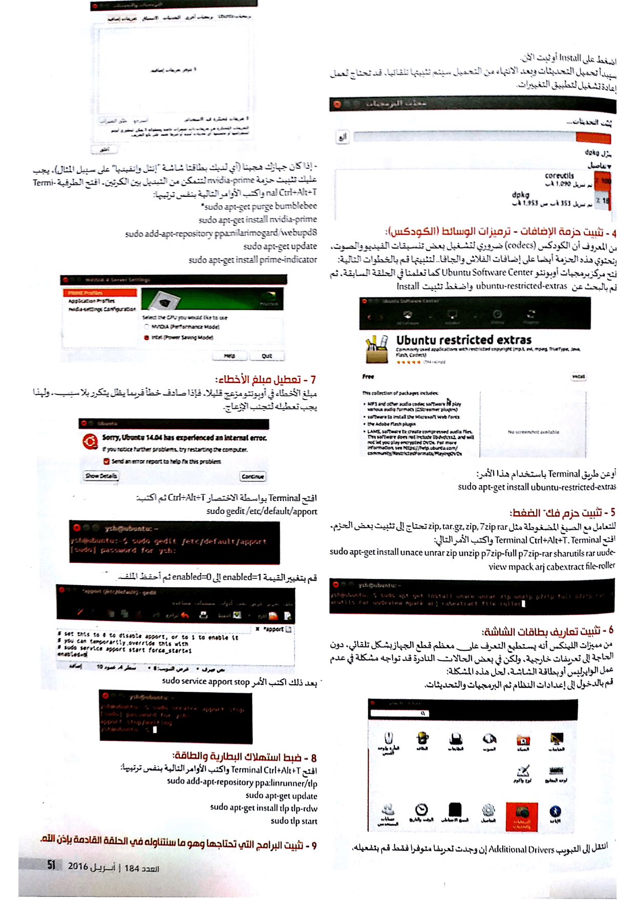

