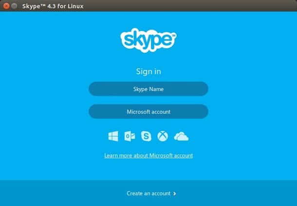
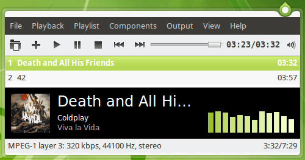

+++
title = "أهم برامج أوبنتو التي يجب عليك تجربتها"
date = "2016-05-01"
description = "تحدثنا في الحلقات السابقة عن كيفية التعامل مع البرامج في أوبنتو لينكس واكتشفنا معا مدى سهولة تثبيت برامج جديدة، وعن أهم الخطوات التي يجب عليك فعلها بعد تثبيت أوبنتو وتوقفنا عند تثبيت البرامج التي تحتاج، في حلقة هذا العدد سنواصل حديثنا وسنتعرف على أهم برامج أوبنتو التي يجب عليك تجربتها."
categories = ["لينكس",]
tags = ["مجلة لغة العصر"]
series = ["دليل لينكس"]
images = ["images/0.jpg"]

+++
تحدثنا في الحلقات السابقة عن كيفية التعامل مع البرامج في أوبنتو لينكس واكتشفنا معا مدى سهولة تثبيت برامج جديدة، وعن أهم الخطوات التي يجب عليك فعلها بعد تثبيت أوبنتو وتوقفنا عند تثبيت البرامج التي تحتاج، في حلقة هذا العدد سنواصل حديثنا وسنتعرف على أهم برامج أوبنتو التي يجب عليك تجربتها.


في البداية يجب أن أذكرك عزيزي القارئ بأن كل البرامج التي سيتم ذكرها في هذا الموضوع ستجدها على مركز برامج أوبنتو Ubuntu Software Center وفى حالة عدم وجود البرنامج على مركز البرامج سأذكر ذلك، أيضا ستجد بكل القسم العديد من البدائل اختر منها ما تريد فبالتأكيد لا تحتاج إلى تثبيتها جميعا.

## 1- متصفحات الملفات

1. Nautilus هو متصفح الملفات الافتراضي لواجهة جنوم Gnome ويأتي مثبتا تلقائيا على أوبنتو.
    يمكنك الوصول إليه عن طريق قائمة البرامج كما بالصورة.

  

2. Dolphin هو متصفح الملفات الرسمي لواجهة KDE، بالعديد العديد من الخواص مثلا Split لتقسيم النوافذ وبالتالي تصفح أكثر من ملف في نفس النافذة.

   

## 2- متصفحات الإنترنت

1. Firefox متصفح الإنترنت الشهير لا يحتاج لوصف، يأتي مثبتا تلقائيا على أوبنتو.

   

2. Google Chrome كما هو على ويندوز، لتثبيته قم بالدخول إلى 
    https://www.google.com/intl/en-US/chrome/browser/
    اضغط على Download ثم اختر نوع النظام الذي لديك Ubuntu 32 أو 64 واضغط Install.
    بعد انتهاء التحميل قم بفتح الملف وتثبيته بواسطة مركز برامج أوبنتو كما سبق شرحه.
  
  

أو يمكنك التثبيت بواسطة الطرفية terminal عن طريق الأوامر:
لنظام 32: 
`wget https://dl.google.com/linux/direct/google-chrome-stable_current_ i386.deb`
`sudo dpkg –I google-chrome-stable_current_ i386.deb`

لنظام 64:
`wget https://dl.google.com/linux/direct/google-chrome-stable_current_amd64.deb`
`sudo dpkg –I google-chrome-stable_current_amd64.deb`

3. ستجد أيضا أغلب متصفحات الانترنت المعروفة على نظام الويندوز مثل Chromium-Opera-Slimjet- Maxthone، وهناك متصفحات أخرى عديدة يمكن اكتشافها في مركز برمجيات أوبنتو تحت خانة Internet.

## 3- برامج الدردشة والمحادثات

1. Skype كما هو في ويندوز ولكن ليس بنفس التطور الذي نعرفه.
  يمكنك تحميله من موقعه الرسمي أو التثبيت بواسطة الطرفية terminal عن طريق الأمر:
  `sudo apt-get install skype`

  

2. Telegram يمكنك تحميله من موقعه الرسمي أو التثبيت بواسطة الطرفية terminal عن طريق الأمر:

```bash
sudo add-apt-repository ppa:atareao/telegram -y 
sudo apt-get update
sudo apt-get install telegram
```


3. Facebook Messenger: قم بتحميله من موقعه http://messengerfordesktop.com/ ثم ثبته باستخدام مركز برامج أوبنتو.

   

كما يتوفر العديد من البرامج مثل Pidgin وEmpathy (مثبت تلقائيا على أوبنتو)، و Kopete.

## 4- برامج إدارة الرسائل الإلكترونية

Mozilla Thunderbird تماما كما في ويندوز مع بعض الاختلافات البسيطة وهو مدير البريد الإلكتروني الافتراضي في أوبنتو.


كما يوجد أيضا Evolution-Kmail-Kontact يمكنك ايجادهم على مركز البرامج.

## 5- البرامج المكتبية - الأوفيس

يوجد العديد من البرامج المكتبية البديلة لمايكروسوفت أوفيس في ويندوز ولكن أفضلها هم:

1. Libreoffice.org المنافس الأقوى للأوفيس، يأتي مثبتا تلقائيا على أوبنتو.

   

2. openoffice.org يمكنك تحميله من الموقع الرسمي https://www.openoffice.org/download/other.html.

   

3. aBiword برنامج لتحرير النصوص، شبيه ب MS Word لكنه يضمن فقط أساسيات تحرير النصوص.

## 6- برامج قراءة ملفات PDF والتعديل عليها

Evince مدمج في أوبنتو تحت اسم Document viewer.


كما يوجد أيضا ePDFViewer - gscan2pdf - ViewPDF – xpdf - Xournal يمكنك ايجادهم على مركز البرامج.

## 7- برامج تشغيل الصوتيات

VLC Media Player كما هو في ويندوز – يمكنك تثبيته من مركز البرامج.


كما يوجد أيضا Rhythmbox و Banshee و Amarok و Clementine و Audacious (بديل Winamp)



## 8- برامج تشغيل ملفات الفيديو

VLC Media Player كما هو في ويندوز – يمكنك تثبيته من مركز البرامج.
كما يوجد أيضا Miro  - Totem - Smplayer - Umplayer - Kaffeine - Realplayer - MiniTube.


## 9- باقي البرامج

- Kdenlive-  - OpenShot - Kino - Avidemux - MKV Files Creator لتحرير و تحويل ملفات الفيديو.

  

- Audacity – Ardour – Rosegarden للتعديل على الصوت.

  

- GIMP كما في ويندوز. البرنامج موجه بالأساس للينكس ويعتبر بديل ممتاز ل Photoshop

  

- Inkscape برنامج مختص في التصميم الإشعاعي - Vectorial.

  

- Blender برنامج لتصميم الصور والحركة ب 3D.

  

- Brasero Disc Burning - K3B - Nautilus - GnomeBaker CD/DVD Writer – Xfburn لحرق الأسطوانات.

  

- Archive Manager - Ark – 7Zip للتعامل مع الملفات المضغوطة.
- Wink – screenshot – RecordmyDesktop – لتصوير الشاشة.

  

- BleachBit بديل لبرنامج CCleaner في ويندوز لتنظيف مخلفات النظام.

  

---

هذا الموضوع نُشر باﻷصل في مجلة لغة العصر العدد 185 شهر 05-2016 ويمكن الإطلاع عليه [هنا](https://drive.google.com/file/d/1QH89M5_xSqY5_q-wUvSV5gn4CK7kdkxq/view?usp=sharing).


