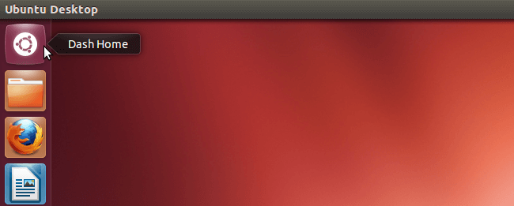
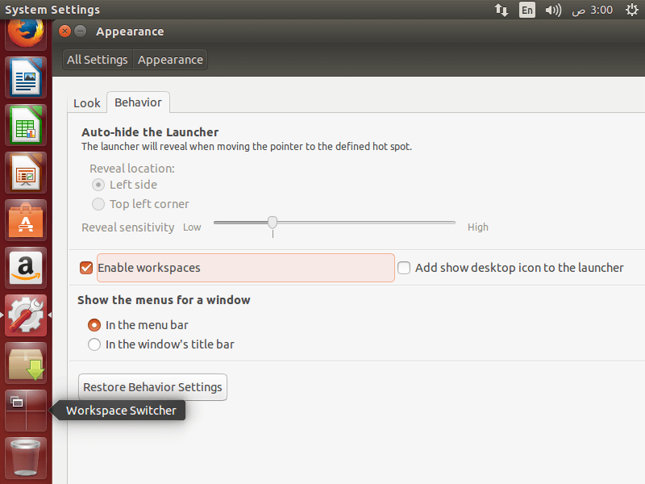
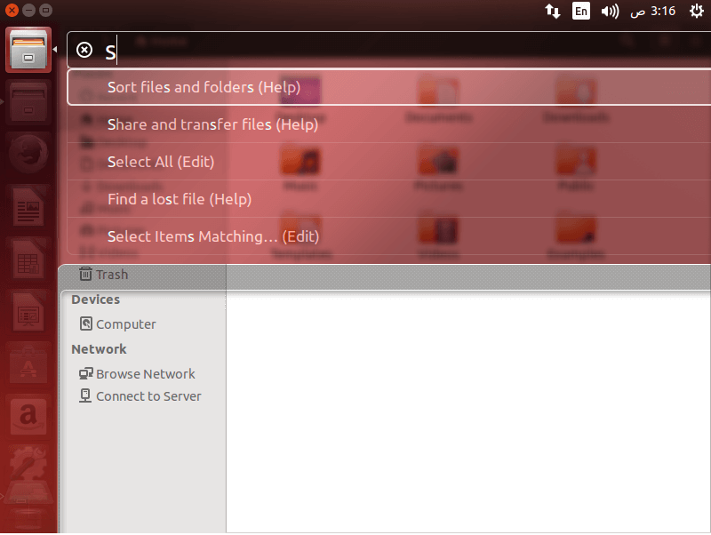

+++
title = "واجهة Unity.. من البداية وحتى الاحتراف"
date = "2016-06-01"
description = "في العدد السابق (الحلقة 5) تكلمنا عن أهم برامج أوبنتو التي يجب عليك تجربتها، واليوم نستكمل طريقنا لاحتراف أوبنتو، وسنتعرف على واجهة Unity الخاصة بتوزيعه أوبنتو ونكتشف خفاياها وأسرارها."
categories = ["لينكس",]
tags = ["مجلة لغة العصر"]
series = ["دليل لينكس"]

+++

في العدد السابق (الحلقة 5) تكلمنا عن أهم برامج أوبنتو التي يجب عليك تجربتها، واليوم نستكمل طريقنا لاحتراف أوبنتو، وسنتعرف على واجهة Unity الخاصة بتوزيعه أوبنتو ونكتشف خفاياها وأسرارها.

## أولا: ما هي واجهة Unity

-   في أي نظام تشغيل معتمد على واجهة المستخدم الرسومية توجد بيئة سطح مكتب (واجهة) مميزة له، وكل واجهة لديها عدد من الخصائص تميزها عن الأخرى مثل (مظهر النظام، طريقة تنظيم سطح المكتب، كيفية التنقل في سطح المكتب).
-   من مميزات نظام لينكس التي سبق وذكرناها هي تعدد واجهات سطح المكتب ومن أمثلتها (Gnome, Unity, XFCE, MATE, KDE)، كما أن المستخدم يستطيع التنقل بحرية بين واجهات سطح المكتب المختلفة، وكما رأيت عزيزي القارئ تعتبر واجهة Unity بيئة سطح المكتب الافتراضية لتوزيعه أوبنتو.

-   تم ابتكار واجهة Unity في 2010، وتم دمجها لأول مرة مع توزيعة أوبنتو في الإصدار Ubuntu 10.10، وحصلت خلال 5 أعوام على العديد من التطويرات الهائلة التي جعلت منها واحدة من أفضل واجهات سطح المكتب في لينكس (إصدار الواجهة في أوبنتو 16.04 هو 7.4).

## ثانيا: مكونات واجهة Unity وكيفية التعامل معها

### 1- المشغل (مُطلق التطبيقات) – Launcher

-   هو الشريط الجانبي الموجود أيسر الشاشة (تم إضافة إعدادات لتغيير مكانه في الإصدار 16.04 سنقوم بشرحها لاحقا)، ويحتوي على بعض البرامج والأقراص الموجودة في جهازك إلى جانب سلة المحذوفات والبرامج المشغلة (كما في شريط مهام الويندوز).

-   كل عنصر في المشغل الرئيسي هو مشغل مستقل بنفسه، عند الضغط على أي منها بزر الماوس الأيسر يتم فتح البرنامج ويظهر بجانبه سهم صغير للدلالة على أنه مستعمل حاليا، بينما عند الضغط بزر الماوس الأيمن على أي برنامج يظهر لنا القائمة السريعة الخاصة به (تختلف أوامرها من برنامج لأخر)، من هذه الأوامر أمران ثابتان مع أي برامج هما:
    اسم البرنامج: عند الضغط عليه سيتم فتح البرنامج.
    Lock to Launcher: لتثبيت التطبيق على المشغل، أوUnlock from Launcher: لحذف مشغل البرنامج من المشغل الرئيسي عندما لا يكون مستخدما.

كما تختلف أوامر القائمة السريعة عند تشغيل البرنامج، فيتم إضافة بعض الأوامر الخاصة بالبرنامج إلى جانب الأمر Quit الذي يقوم بغلق البرنامج.

-   في حال امتلاء الشريط الجانبي بالبرامج فإنها سوف تنطوي بشكل مائل ويمكنك التنقل بينها بسهولة من خلال تمرير مؤشر الماوس والتحريك حتى تظهر جميع البرامج.
-   حين نفتح أكثر من نافذة لنفس البرنامج يظهر عدة أسهم صغيرة بنفس عدد النوافذ المفتوحة، ويمكن الاختيار بينها بالضغط على المشغل، حيث تظهر نوافذه المفتوحة مصغرة ويمكن الاختيار بينها بالضغط عليها.

### 2- الداش (اللوحة الرئيسية) – The Dash

-   هي الجزء الرئيسي الثاني من واجهة Unity، وهي عبارة عن لوحة رئيسية يمكنك من خلالها الوصول لكل شيء والبحث عن أي شيء على جهازك، سواء كان برنامجا، ملف صوت، صورة، فيديو، مستند، الخ، أو إعدادات النظام دون أن تحتاج لمعرفة أين يوجد، كما يعرض أيضا آخر المجلدات المفتوحة، ويمكن من خلاله البحث في الإنترنت (تم تعطيل هذه الميزة افتراضيا في الإصدار 16.04)، وهو يشبه قائمة البداية في ويندوز كثيرا.

-   لفتح لوحة الداش: اضغط على شعار أوبنتو الموجود أعلى المشغل لتظهر لك الداش كما بالصورة.

-   ستجدها مقسمة إلى مجموعات تبويبات يمكن التبديل بينها عن طريق الضغط على أيقونة التبويب بالأسفل، فمثلا التبويب الرئيسي (أيقونة المنزل) يعرض أبزر وأحدث البرامج المفتوحة، التحميلات والملفات، بينما التبويب الثاني الخاص بالبرامج فهو بتواجد فيه كل البرامج المثبتة على جهازك، ونفس الشيء بالنسبة لباقي التبويبات.

-   للبحث عن أي شيء من خلال الداش: قم بالضغط على مربع البحث وكتابة ما تريد البحث عنه، لتظهر لك نتائج البحث مباشرة كما بالصورة.

### 3- الشريط العلوي (شريط القوائم) – Indicator Menu

-   يتكون هذا الشريط من مجموعات أيقونات وأزرار كل واحدة منهم لها وظيفة محددة:
    فمثلا يوجد زر للتبديل بين لغات الكتابة، وزر الشبكة لذي يسمح لك بالاتصال بشبكة الانترنت، وزر الساعة الذي يعرض الوقت، وآخر زر هو زر Session indicator الذي يحتوي على إعدادات ومعلومات النظام إلى جانب خيارات التحكم في الطاقة.

-   عندما تقوم بفتح أي برنامج ستجد أن القوائم الخاصة بالبرنامج مثل (File, Edit) تظهر في الشريط العلوى منفصلة عن البرنامج.

### 4- المكاتب الوهمية (مساحات العمل) – Workspaces

-   هي عبارة عن أسطح مكتب افتراضية Virtual Desktops، تسمح لك باستخدام عدة أسطح مكتب منفصلة عن بعضها من أجل تسهيل العمل وتنظيمه، هناك أربعة مكاتب وهمية على أوبنتو. يمكن العمل على كل واحد منها منفصلا عن الآخرين، كما يمكن أيضا نقل النوافذ والبرامج المفتوحة من مكتب لآخر بسهولة.

-   لتفعيل ميزة Workspaces: قم بالدخول إلى إعدادات النظام ثم قسم المظهر Appearance ثم التبويب Behavior بعد ذلك قم بتفعيل الاختيار Enable Workspaces بوضع علامة صح بمجرد وضع العلامة ستلاحظ ظهور أيقونة جديد في المشغل هي Workspace Switcher.

-   اضغط على زر Workspace Switcher للتبديل بين المكاتب الوهمية الأربعة، ستجد جميعها موجودة أمامك مع النوافذ بداخلها.

-   يمكنك نقل النوافذ بين المكاتب الوهمية عن طريق سحبها وافلاتها في مساحة العمل التي تريدها.

-   كما يمكنك أيضا استخدام الاختصار Ctrl+Alt+ سهم للتبديل بين المكاتب الوهمية، والاختصار Ctrl+Alt+Shift+ سهم لنقل النوافذ إلى مساحة عمل أخري.

### 5- The HUD

-   هي طريقة جديدة للوصول إلى أوامر شريط القوائم، فبدلا من الضغط على شريط القوائم واختيار أمر ما، كل ما تحتاج فعله هو الضغط على زر Alt والبدء بكتابة اسم الاختيار مباشرة، وبهذا تستطيع البحث عن الأوامر الموجودة في شريط القوائم واختيارها دون الحاجة لاستخدام الماوس.

### 6- اختصارات لوحة المفاتيح في واجهة Unity

وفى نهاية هذه الحلقة أتركك عزيزي القارئ مع القائمة الكاملة لاختصارات لوحة المفاتيح في واجهة Unity التي تختصر الوقت عليك في تأدية المهام، وإلى اللقاء في الحلقة القادمة.

---

هذا الموضوع نُشر باﻷصل في مجلة لغة العصر العدد 186 شهر 06-2016 ويمكن الإطلاع عليه [هنا](https://drive.google.com/file/d/1TdbDItdt3oW2spC75DIG-lEzQulReOE0/view?usp=sharing).

