+++
title = "كيفية تخصيص واجهة Unity – الجزء الأول"
date = "2016-07-01"
description = "تحدثنا في الحلقة السابقة عن واجهة Unity، وتعرفنا على مكوناتها وطريقة التعامل مها، واليوم نستكمل طريقنا لاحتراف أوبنتو، وسنتعرف على طريقة تخصيص واجهة Unity بدون استخدام برامج خارجية."
categories = ["لينكس",]
tags = ["مجلة لغة العصر"]
series = ["دليل لينكس"]

+++

تحدثنا في الحلقة السابقة عن واجهة Unity، وتعرفنا على مكوناتها وطريقة التعامل مها، واليوم نستكمل طريقنا لاحتراف أوبنتو، وسنتعرف على طريقة تخصيص واجهة Unity بدون استخدام برامج خارجية.

## 1- تغيير مكان شريط المشغل Launcher

كما أوضحنا في عدد سابق، توفر نسخة أوبنتو 16.04 إمكانية تغيير مكان المشغل ونقله إلى الجزء الأسفل من الشاشة (مثل شريط المهام) بدلا من الجزء الأيسر، وللقيام بذلك كل ما عليك هو فتح الطرفية Terminal ثم كتابة هذا الأمر:
`gsettings set com.canonical.Unity.Launcher launcher-position Bottom`
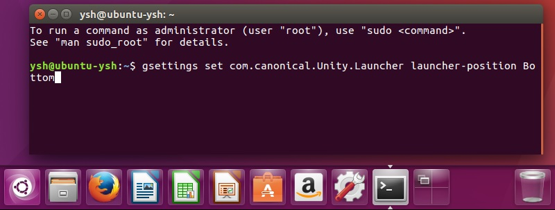
ولإعادة الشريط إلى مكانه الأصلي استخدم هذا الأمر:
`gsettings set com.canonical.Unity.Launcher launcher-position Left`

## 2- إزالة وضع "جلسة الضيف Guest Session"

حيث أنه بوجود هذا الاختيار يستطيع أي شخص الدخول إلى النظام بدون معرفة كلمة السر، بصلاحيات محدودة، فيضل إزالة هذا الوضع إذا كنت لا تستخدمه لضمان المزيد من الأمان.

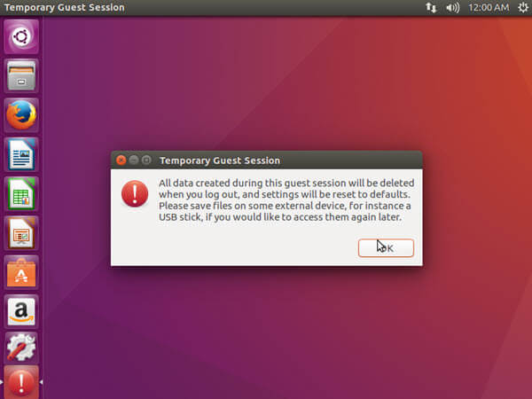

قم بفتح فتح الطرفية Terminal ثم اكتب الأمر التالي:
`sudo sh -c "echo 'allow-guest=false' >> /usr/share/lightdm/lightdm.conf.d/50-ubuntu.conf"`

## 3- إظهار اسم المستخدم على شريط Unity

قم بالدخول إلى إعدادات النظام System Settings ثم حسابات المستخدمين User Accounts بعد ذلك قم بوضع علامة على الاختيار Show my login name on the menu bar.

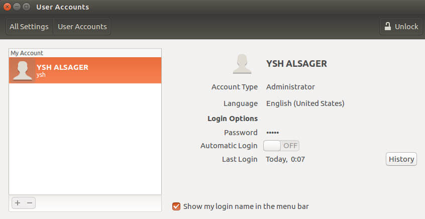

ستجد اسم المستخدم الخاص بك قد ظهر كم في صورة 4.

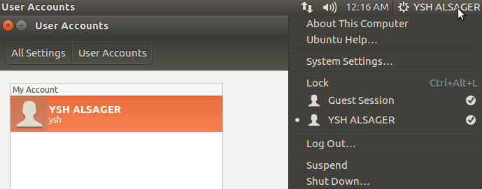

## 4- تفعيل خاصية التصغير بنقرة واحدة one-click minimize

هي الخاصية التي تمكنك من تصغير التطبيق المفتوح بنقرة واحدة بمجرد الضغط على الأيقونة الخاصة به من على المشغل، قم بكتابة هذا الأمر في الطرفية Terminal:
`gsettings set org.compiz.unityshell:/org/compiz/profiles/unity/plugins/unityshell/ launcher-minimize-window true`
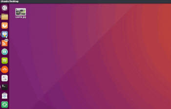

## 5- اختيار المكان الذي تظهر به القوائم

افتراضيا يظهر شريط القوائم في الشريط العلوي للواجهة، لكنه يختفي بعد عدة ثواني.

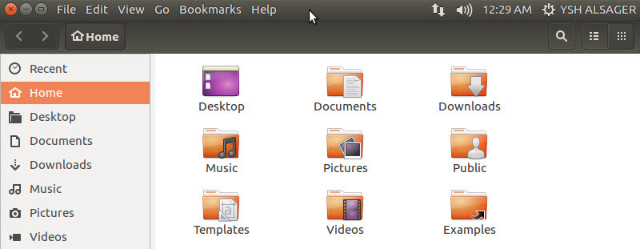

يمكننا التحكم في مكان ظهور شريط القوائم عن طريق الدخول إلى الإعدادات System Settings ثم المظهر Appearance واختيار التبويب Behavior
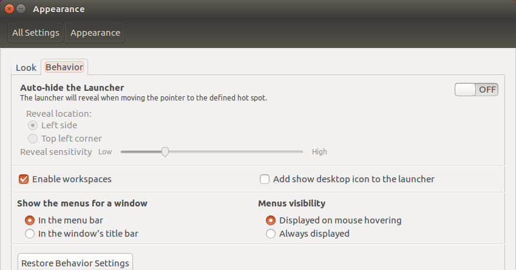

أسفل Show the Menus for a Window ستجد اختيارين:

-   In the menu bar وهو الاختيار الافتراضي الذي يجعل القوائم تظهر في الشريط العلوي.
-   In the window’s title bar وهو الاختيار الذي يجعل شريط القوائم يظهر في شريط العنوان الخاص بالتطبيق المفتوح (كما في الويندوز).

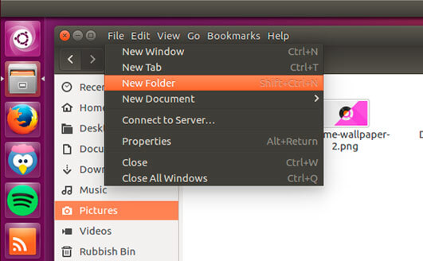

قم باختيار الإعداد الذي تفضله ثم أسفل Menus visibility ستجد اختيارين للتحكم في ظهور القوائم هما Always displayed لجعلها تظهر دائما، أو Displayed on mouse hovering لجعلها تظهر عند مرور الماوس عليها فقط، أيضا اختر ما يناسبك منهما.

## 6- التحكم في حجم شريط العنوان والقوائم

قم بالدخول إلى إعدادات النظام System Settings ثم Displays، أسفل Scale for menu and title bars ستجد شريط يمكنك من تغيير الحجم كما تريد.

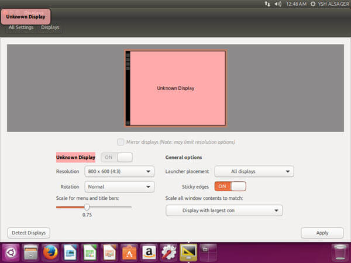

## 7- تفعيل البحث عبر الانترنت في ال Dash

أوضحنا في العدد السابق أنه تم تعطيل ميزة البحث عبر الانترنت من خلال ال Dash افتراضيا في أوبنتو 16.04، ولإعادة تفعيلها مرة أخري قم بالدخول إلى القسم Privacy & Security بداخل الاعدادات ثم انتقل إلى التبويب Search ستجد الاختيار Include online search result مغلقا، قم بتفعيله.

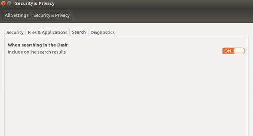

## 8- تفعيل ميزة البحث المتقدم في مدير الملفات Nautilus

إذا قمت بالبحث عن كلمة top بداخل مجلد home لن يظهر لك أي نتائج، حيث أن ميزة البحث المتقدم غير مفعله، ولكن بعد تفعيلها سيظهر لك كل الملفات والمجلدات التي تحتوي على المقطع top ومن ضمنها Desktop، ولتفعيل ميزة البحث المتقدم افتح لطرفية Terminal ثم اكتب الأمر:
`gsettings set org.gnome.nautilus.preferences enable-interactive-search false`

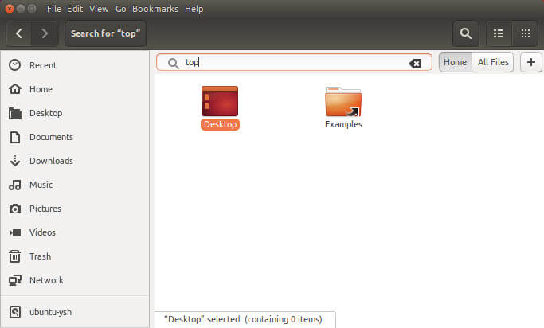

## 9- تغيير خلفية سطح المكتب

عن طريق الدخول إلى إعدادات النظام System Settings ثم المظهر Appearance.
يمكنك الاختيار من الخلفيات المتاحة أمامك أو الضغط على الزر + لاختيار الخلفية التي تريدها من على جهازك.

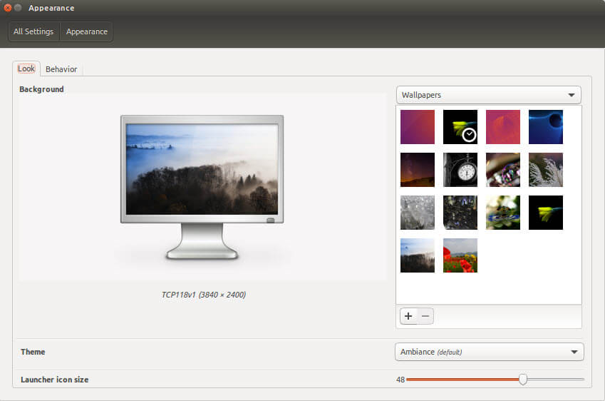

---

هذا الموضوع نُشر باﻷصل في مجلة لغة العصر العدد 187 شهر 07-2016 ويمكن الإطلاع عليه [هنا](https://drive.google.com/file/d/1CD9q3uUGvd28xniKBQ3SZyHiUCWtfvlJ/view?usp=sharing).

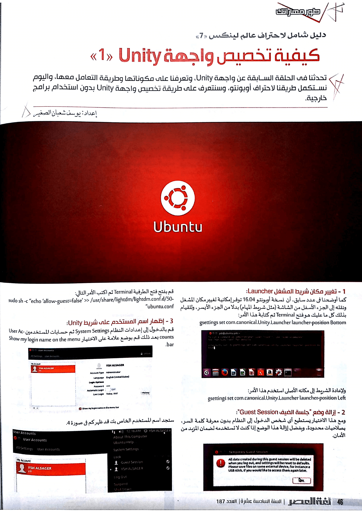

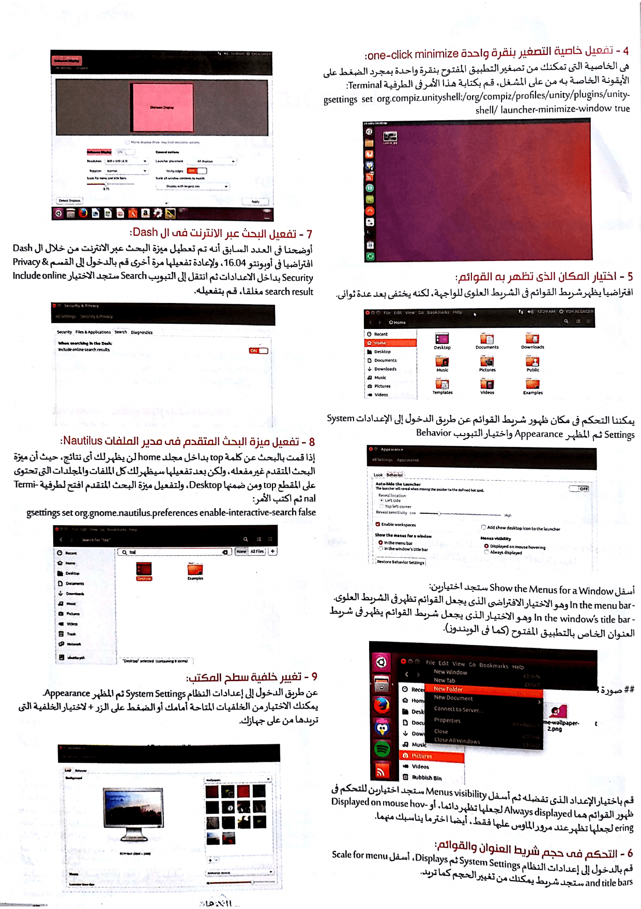
