+++
title = "كيفية تخصيص واجهة Unity – الجزء الثاني"
date = "2016-08-01"
description = "تحدثنا في الحلقة السابقة عن تخصيص واجهة Unity بدون استخدام برامج خارجية، وتعرفنا على كيفية تغيير مكان المشغل ومكان القوائم، وأيضا تغيير خلفية سطح المكتب، وفى حلقة هذا الشهر نستكمل طريقنا لاحتراف أوبنتو، وسنتعرف على طريقة تخصيص واجهة Unity باستخدام أداة Unity Tweak."
categories = ["لينكس",]
tags = ["مجلة لغة العصر"]
series = ["دليل لينكس"]

+++

تحدثنا في الحلقة السابقة عن تخصيص واجهة Unity بدون استخدام برامج خارجية، وتعرفنا على كيفية تغيير مكان المشغل ومكان القوائم، وأيضا تغيير خلفية سطح المكتب، وفى حلقة هذا الشهر نستكمل طريقنا لاحتراف أوبنتو، وسنتعرف على طريقة تخصيص واجهة Unity باستخدام أداة Unity Tweak.

## أولا: تثبيت أداة Unity Tweak

1- قم بفتح مركز البرمجيات Ubuntu Software.

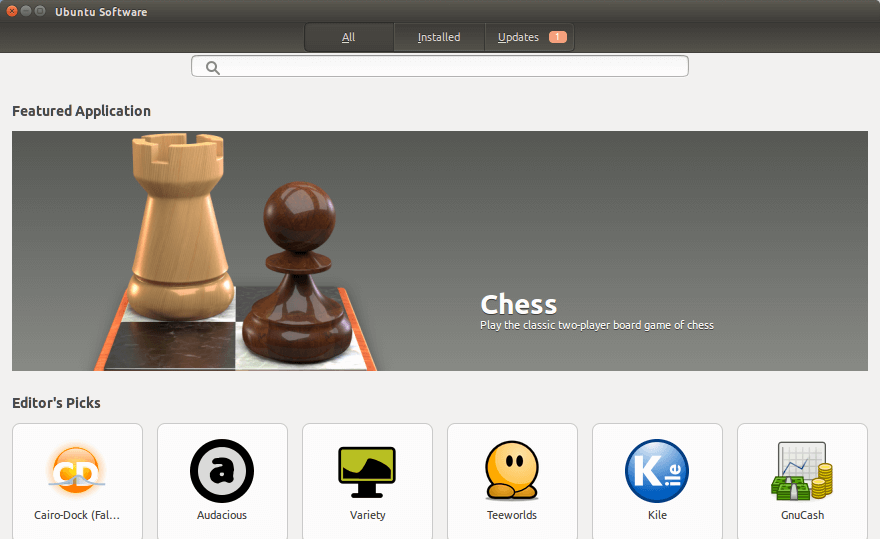

2- ابحث عن Unity Tweak Tool ستجد نتيجة بحث واحدة كما بالصورة، قم بفتحها.
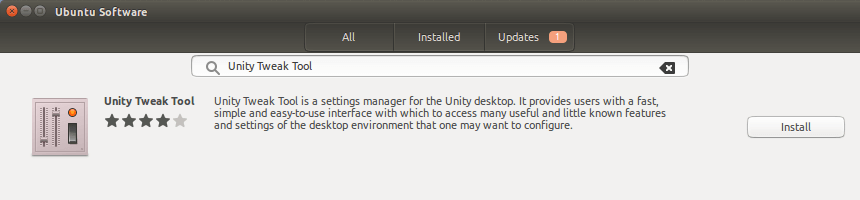

3- اضغط على Install لبدء التثبيت، سيطلب منك كلمة المرور، قم بإدخالها وانتظر حتى الانتهاء.

4- اضغط زر Launch لفتح الأداة.

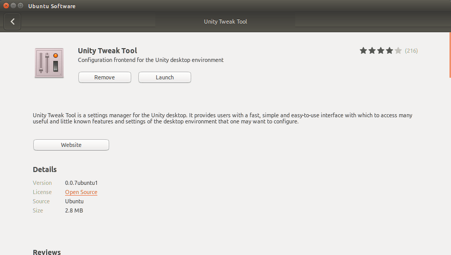

-   أو يمكنك تحميل الأداة مباشرة عن طريق هذا الرابط ثم تثبيتها يدويا كما وضحنا سابقا.
    هذه النسخة من الأداة خاصة بالإصدار Ubuntu 16.04 فقط.
    `https://launchpad.net/ubuntu/+source/unity-tweak-tool/0.0.7ubuntu1/+build/9561159/+files/unity-tweak-tool_0.0.7ubuntu1_all.deb`
-   كما يمكنك تثبيت الأداة على أي إصدار من أوبنتو عن طريق الطرفية Terminal باستخدام الأمر
    `sudo apt-get install unity-tweak-tool`

## ثانيا: تخصيص واجهة Unity باستخدام أداة Unity Tweak

-   بعد فتح الأداة ستجد الواجهة كما بالصورة:

    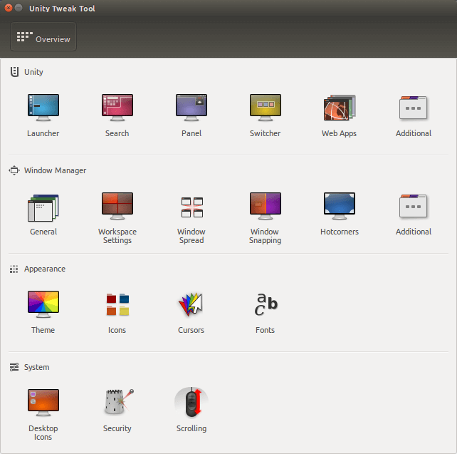

    لاحظ عزيزي القارئ أن الأداة مقسمة إلى أربعة أقسام لتبسيط التعامل معها وهي:
    1- Unity: القسم الخاص بالتعديل على الواجهة مثل المشغل، البحث، الشريط العلوي، والتبديل بين التطبيقات.
    2- Window Manager: من خلاله يمكننا التعديل على نوافذ التطبيقات، مساحات العمل (المكاتب الوهمية)، والـ Hot Corners.
    3- Appearance: القسم الخاص بالتعديلات العامة مثل تغيير سمة النظام، الأيقونات، شكل الماوس والخطوط.
    4- System: للتعديل على بعض إعدادات سطح المكتب، الحماية والتمرير Scrolling.

-   سنقوم الآن بالتعرف على كل قسم بالتفصيل لتخصيص واجهة Unity كما نريد.

### أولا: Unity

#### 1- التبويب Launcher

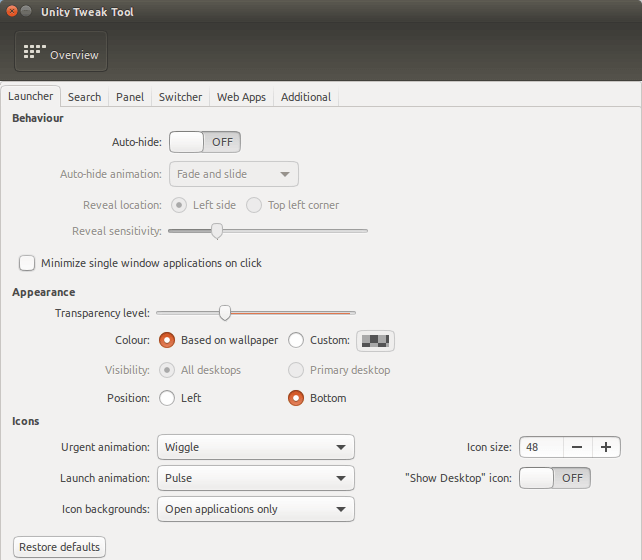

-   Behavior: يحتوي على إعدادات للتحكم في سلوك المشغل وهي الإخفاء التلقائي للشريط auto-hide، مؤثرات الإخفاء التلقائي، ومكان الإخفاء.
-   Appearance: للتحكم في شفافية شريط المشغل ولونه ومكانه (أسفل الشاشة أو الجانب الأيسر).
-   Icons: لتخصيص شكل أيقونات التطبيقات على الشريط وأثناء التشغيل، وأيضا لون الأيقونات على الشريط.

#### 2- التبويب Search

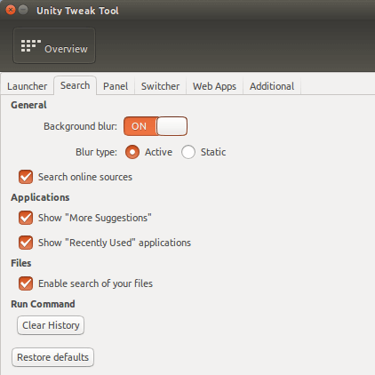

-   General: للتحكم في ضبابية خلفية البحث، والتحكم في تفعيل ميزة البحث عبر الإنترنت.
-   Applications: يحتوي على اختيارين: إظهار الاقتراحات في البحث، وإظهار العناصر المستخدمة حديثا.
-   Files: وهو اختيار لتفعيل البحث عن الملفات.
-   Run Command: ومن خلاله يمكن مسح سجل الأوامر في البحث.

#### 3- التبويب Panel

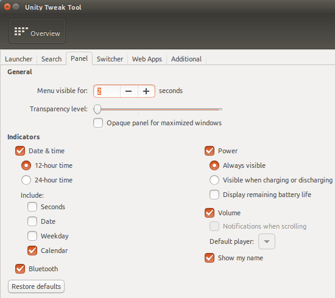

-   General: للتحكم في مدة ظهور القوائم، ومستوى شفافية الشريط العلوي.
-   Indicators: للتحكم في أزرار المؤشرات، مثل الطاقة والوقت والتاريخ والصوت.

#### 4- التبويب Switcher

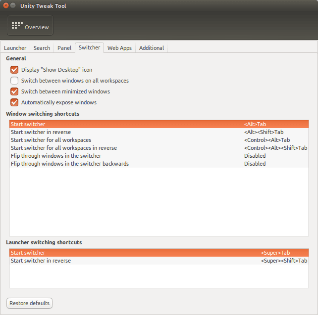

-   General: يحتوي على اختيارات متعددة للتعديل على مبدل التطبيقات (Alt+ Tab) مثل تفعيل أيقونة عرض سطح المكتب، التبديل بين جميع النوافذ على مساحات العمل، والتبديل بين النوافذ المصغرة.
-   Windows switching shortcuts: للتحكم في اختصارات التبديل بين النوافذ، لتغيير أي اختصار اضغط على الاختصار الموجود على اليمين ثم اكتب الاختصار الذي تريده.

#### 5- التبويب Additional

يحتوي على اختيارات للتعديل على HUD واختصاراتها

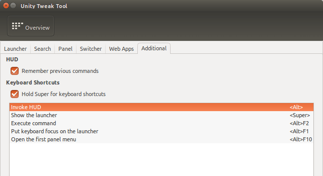

### ثانيا: Window Manager

#### 1- التبويب General

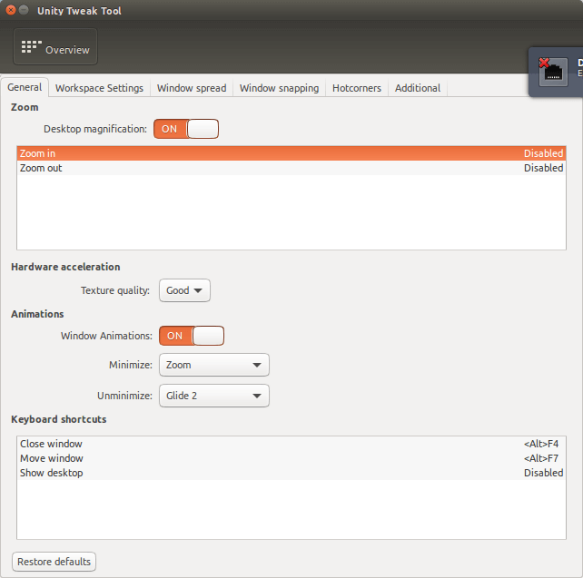

-   Zoom: يحتوي على إعدادات تكبير / تصغير سطح المكتب واختصاراتها.
-   Animation: للتحكم في مؤثرات النوافذ، أيضا يمكن من خلال Keyboard Shortcuts تغيير اختصارات إغلاق وتحريك النوافذ، وإظهار سطح المكتب.

#### 2- التبويب Workspace Settings

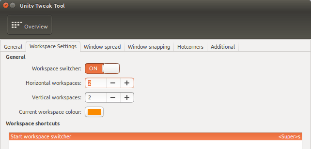

-   General: لتفعيل التبديل بين مساحات العمل واختيار عددها.
-   Workspace Shortcuts: اختيار اختصار التبديل بين مساحات العمل.

#### 3- التبويب Window Spread

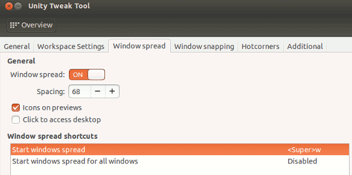

-   General: لتفعيل ميزة إظهار جميع النوافذ المفتوحة (Task Switch في الويندوز).
-   Window Spread Shortcuts: اختيار اختصار ميزة Window Spread.

#### 4- التبويب Window Snapping

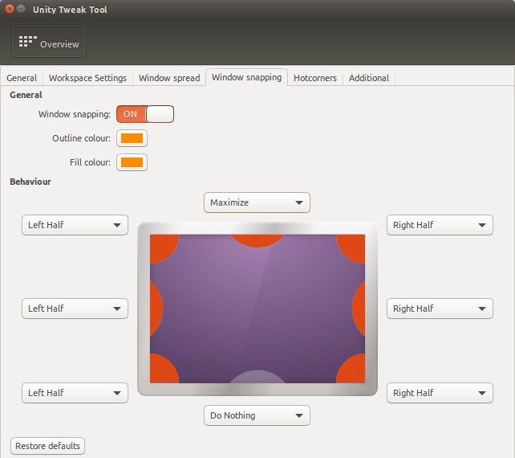

-   General: تفعيل خاصية Window Snapping (سحب النافذة إلى أحد جوانب الشاشة لتغيير حجمها).
-   Behavior: التحكم في سلوك كل جانب من الشاشة عند سحب النافذة اليه.

#### 5- التبويب Hotcorners

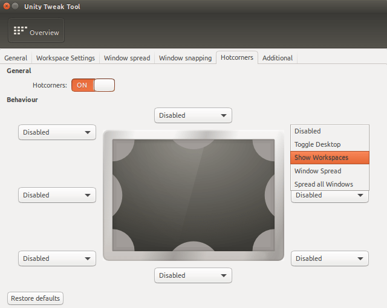

-   General: تفعيل ميزة Hotcorners (تنفيذ أمر معين عند تحريك مؤشر الماوس إلى زاوية معينة من الشاشة).
-   Behavior: التحكم في سلوك زوايا الشاشة، فعلى سبيل المثال يمكن ضبط الزاوية العليا من اليمين على اظهار مساحات العمل عند تحريك الماوس إليها.

#### 6- التبويب Workspace Additional

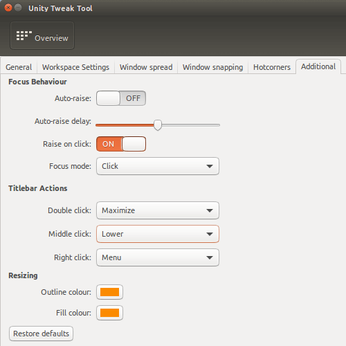

أهم الاختيارات الموجودة هنا هي Titlebar Actions وتسمح لك بالتحكم في تأثير الضغط بالماوس على النوافذ المختلفة.

### ثالثا: Appearance

#### 1- التبويب Theme

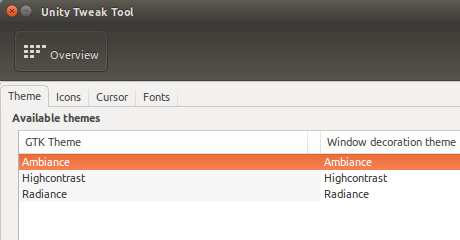

لتغيير السمة الخاص بالنظام، بمجرد الضغط على الثيم يتم تغييره، كما يمكنك إضافة ثيمات أخرى من الإنترنت واختيارها من هنا.

#### 2- التبويب Icons

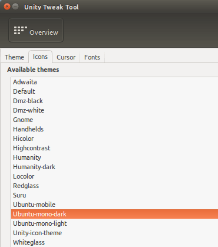

لتغيير أيقونات النظام بأكمله، بما في ذلك التطبيقات والشريط العلوي، أيضا يمكنك تحميل الأيقونات من الإنترنت واختيارها.

#### 3- التبويب Cursor

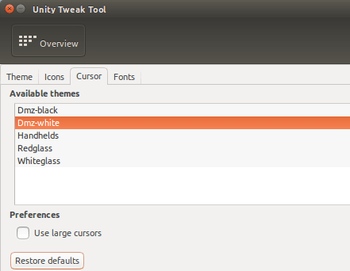

لتغيير شكل مؤشر الماوس والتحكم في حجم المؤشر.

#### 4- التبويب Fonts

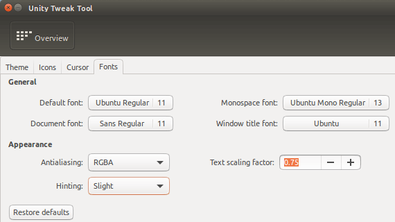

من خلاله يمكنك تغيير كل خطوط النظام، النوافذ، والمستندات، أيضا يمكن التحكم في مظهر الخطوط من خيارات Appearance.

### رابعا: System

#### 1- التبويب Desktop Icons:

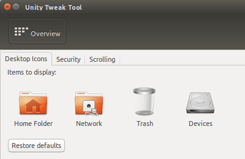

لاختيار الأيقونات التي ستظهر على سطح المكتب.

#### 2- التبويب Security

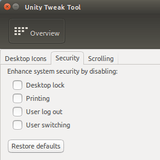

يحتوي على بعض الإعدادات المتعلقة بالحماية مثل إغلاق سطح المكتب، والتبديل بين المستخدمين.

#### 3- التبويب Scrolling:

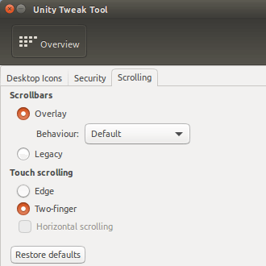

يحتوي على اختيارات للتحكم في التمرير بالماوس (خصوصا إذا كنت تستخدم لوحة اللمس في اللاب توب).

---

هذا الموضوع نُشر باﻷصل في مجلة لغة العصر العدد 188 شهر 08-2016 ويمكن الإطلاع عليه [هنا](https://drive.google.com/file/d/1P2m107ySRrnYB1tKOfZf5wgPJ0tWsoRZ/view?usp=sharing).

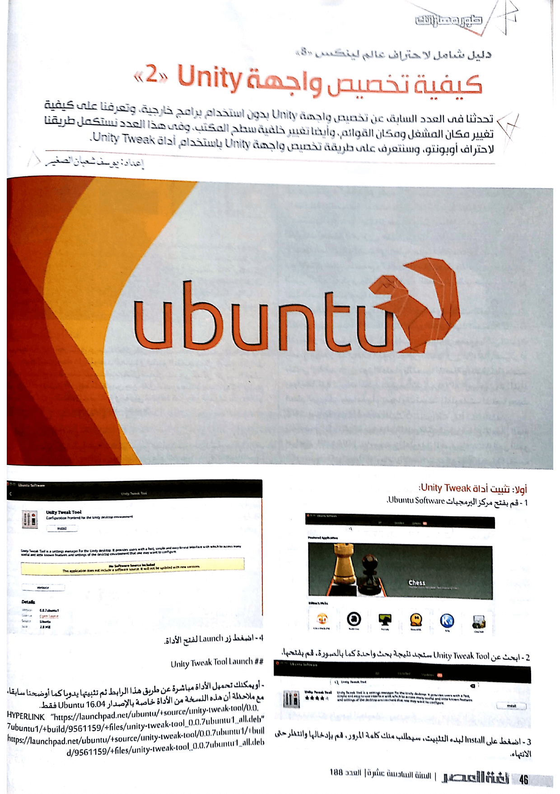

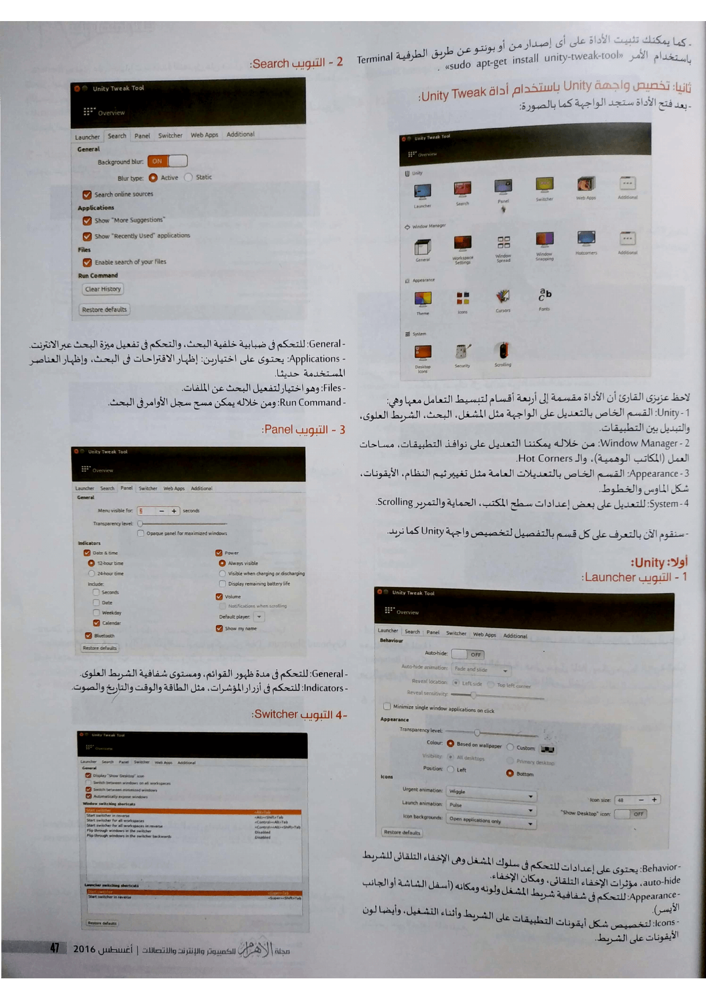

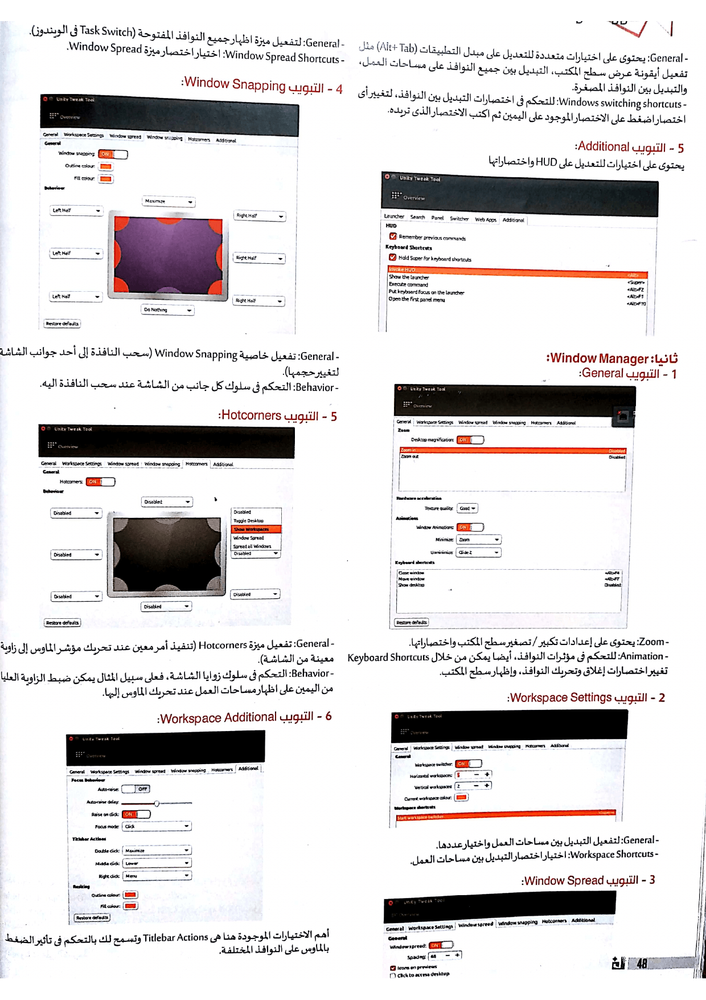

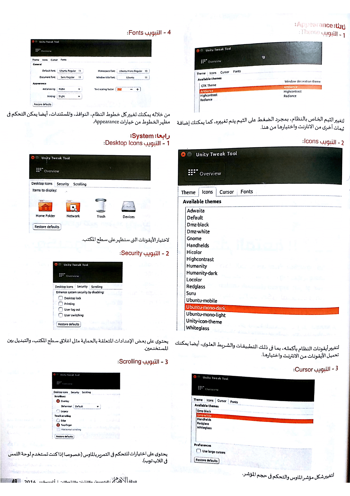
