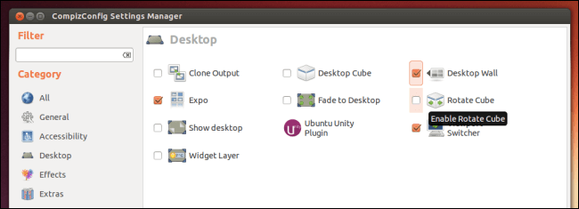

+++
title = "كيفية تخصيص واجهة Unity – الجزء الثالث"
date = "2016-09-01"
description = "تحدثنا في الحلقة السابقة عن تخصيص واجهة Unity باستخدام أداة Unity Tweak، وتعرفنا على كيفية تغيير ثيمات النظام والخطوط والأيقونات، وفى حلقة هذا الشهر نستكمل طريقنا لاحتراف أوبنتو، وسنتعرف على آخر مجموعة حيل لتخصيص واجهة Unity باستخدام بعض الأدوات."
categories = ["لينكس",]
tags = ["مجلة لغة العصر"]
series = ["دليل لينكس"]

+++
تحدثنا في الحلقة السابقة عن تخصيص واجهة Unity باستخدام أداة Unity Tweak، وتعرفنا على كيفية تغيير ثيمات النظام والخطوط والأيقونات، وفى حلقة هذا الشهر نستكمل طريقنا لاحتراف أوبنتو، وسنتعرف على آخر مجموعة حيل لتخصيص واجهة Unity باستخدام بعض الأدوات.


## أولا: أداة Docky

أداة Docky هي أداة لإضافة شريط البرامج Dock أسفل سطح المكتب مثل الموجود في نظام ماك من آبل، وظيفة الأداة هي التنقل بين البرامج المفتوحة بطريقة جميلة، مقدمة بذلك بديلا لشريط المهام الكلاسيكي (المشغل) في أوبنتو.


### - تثبيت الأداة

1- قم بفتح مركز البرمجيات Ubuntu Software.


2- ابحث عن Docky ستجد نتيجة بحث واحدة، قم بفتحها.

3- اضغط على Install لبدء التثبيت، سيطلب منك كلمة المرور، قم بإدخالها وانتظر حتى الانتهاء.


4- اضغط زر Launch لفتح الأداة.


- أو يمكنك تثبيت الأداة على أي إصدار من أوبنتو عن طريق الطرفية Terminal باستخدام الأمر

```
sudo apt-get install docky
```


### - استخدام الأداة

نحتاج أولا إلى تغيير إعدادات المشغل، بحيث يتم إخفاءه تلقائيا عند عدم استخدامه، ولفعل ذلك قم بفتح أداة Unity Tweak التي سبق شرحها في العدد الماضي.

قم بفتح الأداة ثم اختر Launcher من القسم Unity قم بتفعيل خاصية Auto-hide وتأكد من اختيار مكان المشغل يسار الشاشة Left.


بعد ذلك قم بفتح أداة Docky لتجد شريط البرامج قد ظهر كما بالصورة.


لإضافة برامج جديدة إلى الشريط كل ما عليك هو السحب والإفلات أو فتح البرنامج ثم الضغط على الأيقونة الخاصة به على الشريط بزر الماوس الأيمن واختيار Pin to dock.


### - إعدادات الأداة

لفتح الإعدادات اضغط على أيقونة Dock بزر الماوس الأيمن ثم اختر Settings.


تستطيع التحكم في شكل الأداة من الاختيار Theme، التحكم في اختفاء الشريط عند عندم استخدامه من الاختيار Hiding، وأيضا تغيير حجم الأيقونات من الاختيار Icon Size ومقدار الزووم من Zoom.


يوجد مجموعة أخري من الإعدادات هي Docklets:

وهي أدوات صغيرة يتم إضافتها إلى الشريط لتأدية وظائف معينة، لإضافة أي منها قم بتحديده ثم اضغط على رمز الإضافة كما بالصورة (ٍأقوم بإضافة أداة الطقس).


عند الضغط عليها بعد الإضافة ستظهر أداة الطقس بالشكل التالي.


## ثانيا: أداة Conky

أداة كونكي – Conky هي أداة رائعة تقوم بإظهار إحصائيات النظام كالتاريخ، نسب استهلاك المعالج والذاكرة وغيرها من المعلومات بطريقة تفاعلية. فبعد تخصيص هذه الأداة بسمات جميلة ستري أن سطح مكتبك يبدو رائعا.


### - تثبيت الأداة

عن طريق الطرفية Terminal باستخدام الأمر

```
sudo apt-get install conky-all
```


### - استخدام الأداة

لفتح الأداة قم بكتابة هذا الأمر في الطرفية conky ليظهر لنا الشكل الأساسي للأداة.


بالتأكد لا يعجبنا هذا الشكل، ولهذا توجد العديد من ثيمات Conky على الانترنت يمكنك البحث عنها.

أو يمكنك إيجاد العديد من الثيمات هنا http://browse.deviantart.com/customization/skins/linuxutil/applications/conky/

سأقوم انا بالتجربة على ثيم Conky-Vision.

كل ما تحتاج هو تحميل الثيم، ثم فك الضغط ونسخ الملفات الموجودة بداخله إلى المجلد Home.


بعد ذلك قم بكتابه الأمر `killall conky` لإيقاف الأداة، ثم الأمر Conky لتشغيلها مع الثيم الجديد.

ستجد الثيم قد ظهر على سطح المكتب كما بالصورة.


لتركيب ثيم جديد اتبع نفس الطريقة، ولكن ستحتاج إلى استخدام الأمر

```
conky -c /home/ThemePath/.conkyrc
```

مع تغيير ThemePath بمسار الثيم.

- إعداد الأداة لتعمل مع بدء التشغيل:

قم بالبحث عن Startup ثم اختر Startup Applications.


اضغط على Add ثم اكتب الاسم Conky والأمر `bash -c "sleep 40; conky"` بعد ذلك اضغط Add.


## ثالثا: أداة Compiz

هي أداة أكثر من رائعة تحتوي العديد من الخصائص المدهشة لتغيير كل التأثيرات في واجهة Unity، من هذه التأثيرات:

- تحويل سطح المكتب إلى ثلاثي الأبعاد 3D.

- إمكانية التنقل من سطح مكتب إلى آخر بتأثيرات واختصارات رائعة.

- إمكانية عمل ScreenSaver.

- إمكانية عرض كل النوافذ المفتوحة عن طريق Shift Switcher مثل Task Switch في ويندوز 10.

مؤثرات Compiz أو المؤثرات ثلاثية الأبعاد تتطلب أجهزة ذات مواصفات جيدة، لأنها تستهلك الكثير من موارد الجهاز، خصوصا كارت الشاشة.


### - تثبيت الأداة

قم بالبحث عن CompizConfig Settings manager في مركز البرمجيات Ubuntu Software

أو عن طريق الطرفية Terminal باستخدام الأوامر التالية:

```
sudo apt-get install compizconfig-settings-manager
sudo apt-get install compiz-plugins*
```

### - استخدام الأداة

بعد التثبيت قم بفتح الأداة CompizConfig Settings Manager.


ستفتح الواجهة الخاصة بالأداة كما بالصورة.


بالتأكيد لا يتسع الموضوع لشرح الأداة كاملة، لكن سأكتفي بذكر أهم التأثيرات التي يمكن تفعيلها من داخل Compiz وهي:

- Wobbly Windows أو النوافذ المتذبذبة: لتفعيل الإضافة اضغط على المربع الموجود بجانبها، ستظهر لك رسالة اختر Disable Snapping Windows، بعد ذلك قم بتجربة سحب أي نافذة من شريط العنوان لتفاجئ بتأثير المرونة للنافذة!


- Desktop Cube: لتحويل سطح المكتب إلى مكعب ثلاثي الأبعاد، ولكن تحتاج أولا إلى تفعيل ميزة Workspaces من الإعدادات ثم Appearance ثم التبويب Behavior.


بعد ذلك قم بالدخول إلى القسم General Options في Compiz ثم التبويب Desktop Size وقم بتغيير الإعدادات كما بالصورة.


وأخيرا قم بتفعيل الاختيار Rotate Cube ووافق على أي رسالة تعطيل إضافات أخرى تظهر لك.



الآن جرب الضغط على Ctrl+Alt+ السهم اليمين أو اليسار للتنقل بين أسطح المكتب على المكعب، أو يمكنك الضغط على Ctrl+Alt+ الضغط مع السحب بزر الماوس الأيسر على سطح المكتب إلى أي اتجاه.


- Shift Switcher: كما ذكرت بالأعلى، هي ميزة تتيح للمستخدم التنقل بين البرامج المفتوحة بطريقة أكثر جمالا مثل Task Switch في ويندوز 10، قم بتفعيلها ثم من الاختيار Initiate key قم باختيار الاختصار الذي تريده.


### إلغاء تغييرات Compiz وإعادتها إلى الوضع الافتراضي

قم بفتح Terminal واكتب هذا الأمر 	

```
dconf reset -f /org/compiz/
```

بعد ذلك قم بتسجيل الخروج وإعادة الدخول مرة أخرى.

إلى هنا نصل إلى نهاية مجموعة دروس تخصيص واجهة Unity، وإلى اللقاء في العدد القادم إن شاء الله.

---

هذا الموضوع نُشر باﻷصل في مجلة لغة العصر العدد 189 شهر 09-2016 ويمكن الإطلاع عليه [هنا](https://drive.google.com/file/d/1WBKras1BKaOibXCdGN1Np8GH8fYfMPhg/view?usp=sharing).


