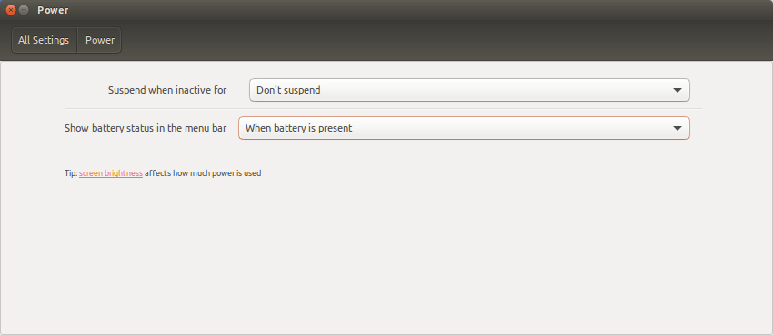

+++
title = "إعدادات نظام أوبنتو لينكس من الألف إلى الياء"
date = "2016-10-01"
description = "تحدثنا في الحلقة السابقة عن تخصيص واجهة Unity باستخدام أداة بعض الأدوات، وتعرفنا على كيفية تغيير المؤثرات وحركة النوافذ، وفى حلقة هذا الشهر نستكمل طريقنا لاحتراف أوبنتو، وسنتعرف على إعدادات النظام بشكل مفصل."
categories = ["لينكس",]
tags = ["مجلة لغة العصر"]
series = ["دليل لينكس"]
images = ["images/0.png"]
+++

تحدثنا في الحلقة السابقة عن تخصيص واجهة Unity باستخدام أداة بعض الأدوات، وتعرفنا على كيفية تغيير المؤثرات وحركة النوافذ، وفى حلقة هذا الشهر نستكمل طريقنا لاحتراف أوبنتو، وسنتعرف على إعدادات النظام بشكل مفصل.

إعدادات النظام في أوبنتو لينكس (أو أي توزيعة أخرى) تحتوي على أغلب التفضيلات التي يحتاج المستخدم إلى التحكم فيها، ويتميز تطبيق الإعدادات في لينكس بسهولة الواجهة وحسن التنظيم للإعدادات المختلفة.

## كيف تقوم بالدخول إلى إعدادات النظام

1- قم بالضغط على اسم المستخدم أو رمز الطاقة الموجود بالشريط العلوي ثم اختر System Settings.

2- أو يمكنك الضغط على زر Start ثم البحث عن Settings واختيار System Settings.

3- أو يمكنك كتابة الأمر unity-control-center في الطرفية Terminal.

بعد دخولك إلى إعدادات النظام ستجد الواجهة كما بالصورة.

تنقسم الإعدادات إلى ثلاثة تصنيفات:

- أولا: الإعدادات الشخصية: وتشمل المظهر والإضاءة وشاشة القفل واللغة والإدخال والحماية.
- ثانيا: إعدادات ال Hardware: وتشمل العرض والألوان، الماوس ولوحة المفاتيح، الشبكات والبلوتوث، الطاقة والصوت والطابعات.
- ثالثا: إعدادات النظام: وتشمل النسخ الاحتياطي، التفاصيل، التحديثات، الوقت والتاريخ وحسابات المستخدمين.

وسوف نقوم الآن بالتعرف على كل قسم بالتفصيل.

## أولا: الإعدادات الشخصية

### 1- إعدادات المظهر Appearance

يحتوي على الإعدادات المتعلقة بتغيير شكل النظام (ولكن ليس بكفاءة الأدوات التي تعرفنا إليها في الحلقات السابقة)، فمن خلال الاختيار Background يمكنك تغيير خلفية الشاشة، حيث يمكنك اختيار اما صورة واحدة أو مجلد صور أو ألوان وتدرجات لونية.

كما يمكنك تغيير ثيم النظام بأي ثيم من الثيمات المتاحة أمامك، (أما إذا أردت استخدام ثيمات خارجية عليك بأداة Unity Tweak التي سبق شرحها).
التبويب Behavior قد تعرضنا لمعظم إعداداته سابقا، وهى التحكم في الإخفاء التلقائي للشريط، ومكان استدعاؤه، تفعيل ميزة Workspaces واختيار مكان ظهور القوائم وطريقة ظهورها.

### 2- إعدادات السطوع وقفل الشاشة Brightness & Lock

يحتوي على خيارات التحكم بسلوك إضاءة الشاشة الخاصة بحاسوبك المحمول (لا يظهر هذا الإعداد إلا في الحواسيب المحمولة وليس المكتبية)، كما يمكنك من التحكم بإغلاق الشاشة عند تركها أو عدم العمل عليها.

أول اختيار هو الخاص بإغلاق الشاشة بعد مدة محددة من عدم الاستخدام، ثم لدينا الاختيار Lock الذي يتحكم في القفل التلقائي للجهاز، وأخيرا الاختيار Require my password لطلب كلمة السر عند إيقاظ الجهاز.

### 3- إعدادات دعم اللغات Language Support

يحتوي على خيارات التحكم بلغة عرض النظام واختيار تنسيق الأرقام وباقي إعدادات اللغات.
التبويب Language يمكنك من اختيار اللغة عن طريق سحب اللغة التي تريدها لأعلى القائمة، كما يمكنك إضافة لغات جديدة من الزر Install/Remove Languages.
وقد تعرفنا مسبقا في الحلقة 2 على كيفية إضافة اللغة العربية بالتفصيل.

أما التبويب Regional Formats فيحتوي على خيارات عرض الأرقام والعملات والتاريخ حسب اللغة التي تختارها.

### 4- إعدادات الحسابات Online Accounts

يحتوي على إعدادات الحسابات الأون لاين المرتبطة بالنظام، مثل جوجل وفيس بوك.

### 5- إعدادات الحماية والخصوصية Security & Privacy

يحتوي على خيارات التحكم بالحماية مثل:
التبويب Security ستجد به خيارات طلب كلمة السر.

التبويب File & Applications للتحكم في ظهور الملفات والبرامج المستخدمة حديثا في ال Dash.

التبويب Search وبه اختيار للتحكم في ظهور نتائج البحث الاون لاين في ال Dash.
التبويب Diagnostics يحتوي على إعدادات مشاركة البيانات مع شركة Canonical وسياسة الخصوصية.

### 6- إعدادات إدخال النصوص Text Entry

يحتوي على خيارات لغات الإدخال وطريقة التبديل بين اللغات، كما سبق وتعرفنا عليه.

## ثانيا: إعدادات ال Hardware

### 1- إعدادات البلوتوث Bluetooth

يحتوي على الإعدادات المتعلقة باتصال الأجهزة من خلال البلوتوث، كما يوجد اختيار للتحكم في ظهور الجهاز عبر بلوتوث.

### 2- إعدادات الألوان Color

يحتوي على إعدادات تغيير Color Profile وضع الألوان للشاشة.

### 3- إعدادات العرض Displays

يوجد بهذا القسم إعدادات العرض وتغيير دقة الشاشة ودورانها، وأيضا حجم القوائم وشريط العنوان.

### 4- إعدادات لوحة المفاتيح Keyboard

هنا ستجد بعض إعدادات الكتابة الخاصة بلوحة المفاتيح إلى جانب إعدادات الاختصارات المختلفة.

### 5- إعدادات الماوس ولوحة اللمس Mouse & Touchpad

يحتوي على خيارات التحكم في الماوس (اختيار الزر الرئيسي، سرعة المؤشر وسرعة ال click) ولوحة اللمس (لن تظهر في حالة الجهاز المكتبي).

### 6- إعدادات الشبكات Network:

يحتوي على الإعدادات المتعلقة بالاتصال بالإنترنت، الشبكات والاتصال اللاسلكي، وأيضا وضع الطيران.

### 7- إعدادات الطاقة Power:

يحتوي على إعدادات التحكم في ال Sleep وإظهار البطارية في الشريط العلوي.

### 8- إعدادات الطابعات Printers:

يحتوي على خيارات التحكم في الطابعات، وإضافة طابعة جديد.

### 9- إعدادات الصوت Sound

يحتوي على خيارات التحكم في مستوى الصوت، تغيير وضع الصوت، والتحكم في الميكروفون.

## ثالثا: إعدادات النظام

### 1- إعدادات النسخ الاحتياطي Backups

يحتوي على خيارات النسخ الاحتياطي ومكان الاحتفاظ بالنسخة الاحتياطية.

### 2- إعدادات التفاصيل Details

يحتوي على تفاصيل عن جهازك ومواصفاته وإصدار نسخة أوبنتو الموجودة على جهازك.

التبويب الثاني يحتوي على خيارات تغيير البرامج الافتراضية الخاصة بالأنترنت، البريد الإلكتروني، الصوت، الفيديو والصور.

أما التبويب الثالث فيحتوى على خيارات الوسائط القابلة للإزالة، يمكنك تغييرها حسب نوع كل واحدة.

### 3- إعدادات البرمجيات والتحديثات Software & Updates

هنا ستجد مجموعة هامة من الإعدادات وهي:
Ubuntu Software: خيارات التحكم في برمجيات أوبنتو، وكنا قد تعرفنا سابقا على اختيار Download from لتغيير سيرفر التحديثات.

يوجد أيضا التبويب Updates: ومن خلاله تستطيع التحكم في إعدادات التحديثات وطريقة التحقق من وجود تحديثات.

وأخيرا لدينا تبويب Additions Drivers الخاص باختيار التعريفات الإضافية للمكونات مثل كروت الجرافيك (كارت الشاشة).

### 4- إعدادات الوقت والتاريخ Time & Date

بعد ذلك لدينا مجموعة إعدادات الوقت والتاريخ، التبويب الأول ستجد به إعدادات اختيار مكان لتحديد المنطقة الزمنية، واختيار تهيئة الوقت والتاريخ يدويا أو من الإنترنت.

وفى التبويب الثاني ستجد خيارات ظهور الساعة في الشريط العلوي.

### 5- إعدادات الوصول الموحد Universal Access

يحتوي على خيارات العديد من الاختيارات للتعديل في النظام بما يناسب ذوي الاحتياجات الخاصة، مثل تكبير حجم النصوص أو تشغيل قارئ الشاشة، والعديد من الاختيارات الأخرى.

### 6- إعدادات حسابات المستخدمين User Accounts

هو آخر قسم من الإعدادات، أولا اضغط Unlock لتتمكن من التعديل على الإعدادات، ستجد به خيارات إنشاء حساب جديد، وتحديد صلاحيات الحسابات، وأيضا تفعيل تسجيل الدخول التلقائي للحساب.

---

هذا الموضوع نُشر باﻷصل في مجلة لغة العصر العدد 190 شهر 10-2016 ويمكن الإطلاع عليه [هنا](https://drive.google.com/file/d/11yob8vKTxY-Nk2c1KWJ3_-eO5ZXw-OlV/view?usp=sharing).

