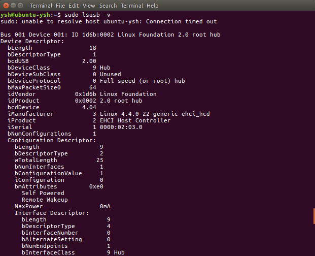

+++
title = "إدارة النظام في أوبنتو لينكس"
date = "2016-11-01"
description = "تحدثنا في الحلقة السابقة عن الإعدادات في أوبنتو، وتعرفنا على كل قسم من أقسام لوحة الإعدادات بالتفصيل، وفى حلقة هذا الشهر نستكمل طريقنا لاحتراف أوبنتو، وسنتعرف على كيفية إدارة النظام."
categories = ["لينكس",]
tags = ["مجلة لغة العصر"]
series = ["دليل لينكس"]

+++
تحدثنا في الحلقة السابقة عن الإعدادات في أوبنتو، وتعرفنا على كل قسم من أقسام لوحة الإعدادات بالتفصيل، وفى حلقة هذا الشهر نستكمل طريقنا لاحتراف أوبنتو، وسنتعرف على كيفية إدارة النظام.


## أولا: التعرف على معلومات الجهاز

تذكر معي عزيزي القارئ أننا قد تعرفنا سابقا على طريقة لمعرفة معلومات الجهاز من خلال الإعدادات.
1. من القائمة العلوية قم باختيار About This Computer.


2. ستظهر لك معلومات الجهاز، لكن كما تلاحظ فهي معلومات بسيطة جدا.


في بعض الحالات قد نحتاج إلى مزيد من التفاصيل عن النظام، لذلك سنقوم باستعراض أكثر من طريقة متاحة لمعرفة مزيد من المعلومات حول الجهاز.

### 1- عن طريق مراقب النظام - System Monitor

قم بالبحث عن System Monitor ثم اختره كما بالصورة.


ستلاحظ الشبه الكبير بينه وبين Task Manager في الويندوز، فتجد التبويب الأول Processes يحتوي على كل المليات التي تتم في النظام.


بعد ذلك لدينا التبويب Resources والذي يحتوي على نسبة استهلاك الجهاز لكل من الذاكرة والمعالج وأيضا الشبكة.


وأخيرا ستجد التبويب File Systems الذي يقوم بعرض مساحة كل جزء من أجزاء القرص الصلب.


فإذا كنت مثلا تعاني من بطء جهازك فيمكنك معرفة سبب المشكلة بعد مشاهدة نسبة الموارد التي يستهلك الجهاز، حينها ستعرف هل البطء بسبب قلة الذاكرة أو ضعف المعالج، أم أن الخلل يمكن أن يكون في الإعدادات.

### 2- عن طريق الطرفية Terminal

يوفر نظام لينكس العديد من الأوامر التي يمكن من خلالها معرفة معلومة تفصيلية عن جهازك منها:

- الأمر `sudo lshw –short` الذي يعرض معلومات أكثر بشكل مبسط.


- الأمر `sudo lshw` يعرض معلومات أكثر تفصيلا من سابقه.


- الأمر `cat /proc/cpuinfo` لعرض معلومات المعالج.


- الأمر `cat /proc/meminfo` لعرض معلومات الذاكرة.


- الأمر `sudo lspci -v` لعرض معلومات الأجهزة المتصلة مثل البطاقات والشرائح.


- الأمر `sudo lsusb -v` لعرض معلومات عن أجهزة USB المتصلة بالجهاز.



### 3- عن طريق برنامج I-Nex

وهو برنامج مفتوح المصدر يشبه كثيرا برنامج CPU-Z الشهير، يمكنك تحميله بواسطة كتابة الأوامر التالية في الطرفية Terminal 

```
sudo add-apt-repository ppa:i-nex-development-team/daily 
sudo add-apt-repository ppa:gambas-team/gambas3
sudo apt-get update    
sudo apt-get install i-nex
```


بعد ذلك قم بتشغيل البرنامج


سيظهر لك كما بالصورة


كما تري، يمكنك معرفة كل معلومات جهازك بطريقة رائعة، مقسمة إلى تبويبات ليسهل التعرف إليها.
حتى معلومات النظام يمكنك معرفتها، ولاحظ عزيزي القارئ الفرق بين هذه الطريقة وغيرها من الطرق.


## ثانيا: إدارة حسابات المستخدمين

في الدرس السابق تعرفنا على كيفية إضافة حسابات من خلال الإعدادات، لكن هناك المزيد، فقد نرغب أحيانا بمنع أحد المستخدمين من فعل شيء معين مثل تشغيل ذاكرة USB، لذلك سنقوم بالتحكم في صلاحيات المستخدمين.
قم بفتح الطرفية Terminal وكتابة هذا الأمر
`sudo apt-get install gnome-system-tools`


بعد اكتمال التثبيت قم بفتح البرنامج Users and Groups من اللوحة الرئيسية.


تظهر واجهة البرنامج كما بالصورة.


يمكن من خلال هذا البرنامج إضافة وحذف مستخدمين كما يمكن من خلال التبويب User Privileges الموجودة الإعدادات المتقدمة - Advanced Settings التحكم في صلاحيات المستخدمين.
فكما تري عزيزي القارئ يمكنك السماح أو عدم السماح للمستخدمين ب (استخدام الإنترنت، مشاركة الملفات الشبكة، استخدام أجهزة الصوت، استخدام الطابعات) والعديد من الخيارات الأخرى.


## ثالثا: استخدام النظام بأكثر من واجهة وأكثر من لغة

يمكن لينكس المستخدمين من التبديل بين اللغات أو الواجهات بكل سهولة، وذلك عن طريق شاشة القفل، فعند إدخال كلمة السر لأي مستخدم نلاحظ في الشريط العلوي أيقونة اللغات، التي يمكننا أن نختار منها اللغة التي نريد استخدام النظام بها، وذلك شرط أن تكون هذه اللغة قد تمت إضافتها سابقا داخل النظام (كما أضفنا اللغة العربية بعد التثبيت).
بعد الضغط على الأيقونة بكل بساطة اختر اللغة التي تريدها ثم قم بإكمال تسجيل الدخول.


وهكذا أيضا في حالة وجود أكثر من واجهة للنظام، يمكن للمستخدم التبديل بينها عن طريق شعار الواجهة الموجود بجانب اسم المستخدم.


أما بالنسبة لكيفية إضافة واجهات والتبديل بينها فهو موضوع سنتعرف عليه لاحقا إن شاء الله.

---

هذا الموضوع نُشر باﻷصل في مجلة لغة العصر العدد 191 شهر 11-2016 ويمكن الإطلاع عليه [هنا](https://drive.google.com/file/d/1qP7n18WmSXBm5DlzYEmU8MgPa_IjVHrP/view?usp=sharing).


