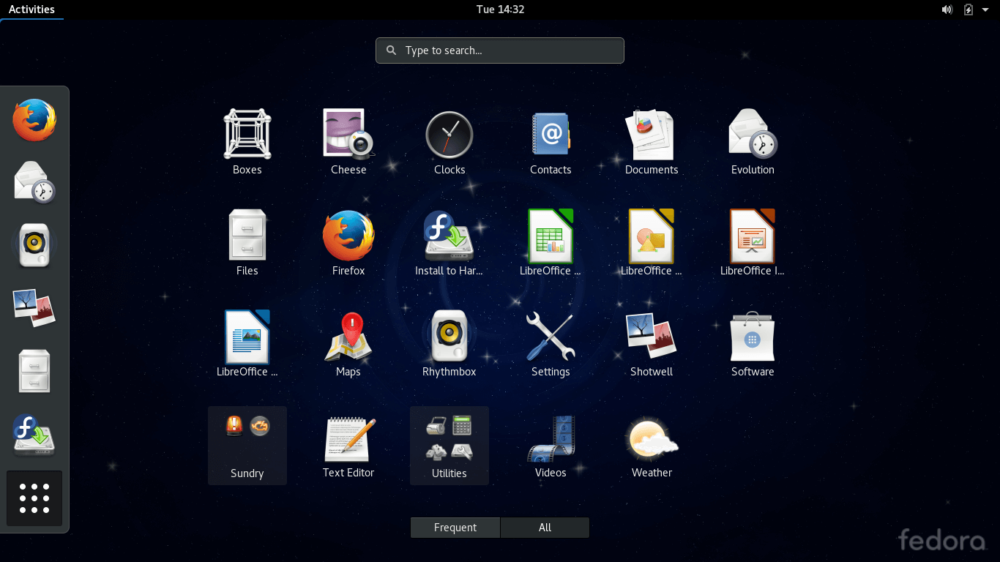

+++
title = "ما هي توزيعات لينكس وكيف تختار التوزيعة المناسبة لك؟"
date = "2016-12-01"
description = "تحدثنا في الحلقة السابقة عن كيفية إدارة النظام، وتعرفنا على أكثر من طريقة للحصول على معلومات تفصيلية عن الجهاز، وفى حلقة هذا الشهر نصل إلى نهاية دروس أساسيات لينكس، وسنتعرف على توزيعات لينكس المختلفة وكيفية اختيار التوزيعة التي تلائمك."
categories = ["لينكس",]
tags = ["مجلة لغة العصر"]
series = ["دليل لينكس"]

+++
تحدثنا في الحلقة السابقة عن كيفية إدارة النظام، وتعرفنا على أكثر من طريقة للحصول على معلومات تفصيلية عن الجهاز، وفى حلقة هذا الشهر نصل إلى نهاية دروس أساسيات لينكس، وسنتعرف على توزيعات لينكس المختلفة وكيفية اختيار التوزيعة التي تلائمك.

ذكرنا في الحلقة الأولى أن لينكس يتميز بوجود العديد من التوزيعات التي يمكنك اختيار ما يناسبك منها، وذلك لأن لينكس نظام مفتوح المصدر، فهناك أكثر من 300 توزيعة موجودة حاليا، فما هي "توزيعات لينكس"؟

## ما هي توزيعات لينكس؟

تعلم عزيزي القارئ أن لينكس ما هو إلا النواة، وباقي الأجزاء مثل المترجمات Compilers والواجهات المرئية ومدير النوافذ إضافة إلى تطبيقات المستخدم النهائي هي ما تكون جميعها نظام التشغيل المتكامل.
إذن التوزيعة هي مجموعة من البرامج والحزم التي تم اختيارها بعناية لتتوافق وتتكامل فيما بينها لتؤدي غرض معين.
وتنقسم التوزيعات إلى نوعين:

- توزيعات مصدرية وتكون مبنية من الصفر مثل توزيعة Arch Linux.
- توزيعات مبنية على توزيعة أخري مثل توزيعة Ubuntu المبنية على توزيعة Debian.

أما بيئات سطح المكتب: هي كل المكونات الرسومية التي تراها أمامك، من برامج وأدوات وإضافات ومتصفح الملفات…الخ. وتتكون من عدد من البرامج والمكتبات والحزم الصغيرة التي تكون بيئة كبيرة لتشغيل البرامج الرسومية، مثل:

- KDE: تصميم بصري جذاب، قدرة هائلة على التخصيص، أكثر الواجهات تطلبًا للموارد.
- Gnome: تصميم غير تقليدي، تجربة أفضل لشاشات اللمس، بساطة في الإعدادات.
- XFCE: تصميم تقليدي، واجهة خفيفة للأجهزة القديمة، لكنها لا تزال تدعم التأثيرات البصرية والتخصيص العالي.
- LXDE: تصميم تقليدي، أخف واجهة يمكن استخدامها للأجهزة الأكثر قدمًا، إمكانية تخصيص متوسطة.
- Unity: تصميم غير تقليدي، قدرة تخصيص متوسطة، لا يمكن استخدامها سوى مع Ubuntu.

واجهة التوزيعة: هي الشيء الذي تراه أمامك مباشرة وتتعامل معه وتستخدمه للتحكم بالنظام وتشغيله رسومياً.
مثل Unity- Mate – Cinnamon – Openbox – Gnome Shell.

## كيف تختار التوزيعة المناسبة لك؟

بالطبع لاحظت عزيزي القارئ أنني قد اخترت توزيعة أوبنتو لينكس لتعلم الأساسيات
 من خلالها في الحلقات السابقة، وقد ذكرت أن توزيعة أوبنتو تعد من أفضل التوزيعات للمستخدمين الجدد، لكنك الآن قد وصلت لمرحلة الاحتراف فيجب عليك اختيار التوزيعة التي تناسبك حتى تستقر عليها، واختيار التوزيعة يعتمد على عدة أمور:

### 1- الدعم ومجتمع مستخدمي التوزيعة

ففي حالة حدوث أي مشكلة في النظام أو أردت السؤال عن بعض الاستفسارات التي تدور في ذهنك ستلجأ إما إلى موقع التوزيعة للحصول على الدعم الفني أو مجتمعات مستخدمي التوزيعة مثل المنتديات ومواقع الدعم.
فعند اختيارك لتوزيعة ما تأكد من أنها دعم فني وانتشار كبير ووجود دعم مسبق على الإنترنت لها، ولعل أبرز التوزيعات التي تتميز بوجود دعم كبير لها توزيعة Ubuntu وتوزيعة OpenSuse.

### 2- صعوبة أو سهولة تثبيت التوزيعة

هناك بعض التوزيعات التي تكون عملية تثبيتها بسيطة جدا مثل Ubuntu بينما هناك توزيعات أخري تكون عملية التثبيت بها أكثر صعوبة وتعقيدا مثل Arch Linux، لذلك لا ينصح باستخدامها في بداية رحلتك مع لينكس.

### 3- سياسة تثبيت البرنامج في التوزيعة

تختلف سياسات البرامج من توزيعة لأخري، فنجد مثلا في توزيعة Ubuntu أنها تدعم البرامج غير مفتوحة المصدر، بينما توزيعة Fedora لا تدعم ذلك وستجد الموقع الرسمي الخاص بها يمنع الإشارة لمثل تلك البرامج عليه أو ذكر طرق تثبيتها.

### 4- واجهة النظام / بيئة سطح المكتب

توجد العديد من بيئات سطح المكتب في لينكس مثل Unity – Gnome – KDE – Mate – XFCE – LXDE، ولكل واجهة طريقة تعامل مختلفة ومميزات وعيوب.

### 5- البرامج المدمجة مع التوزيعة

هناك بعض التوزيعات التي تحتوي برامج جاهزة للاستخدام، بينما هناك توزيعات أخري خفيفة تترك مهمة تثبيت البرامج على المستخدم، فهذه النقطة عائدة إليك إذا كنت تفضل تثبيت البرامج تلقائيا أو يدويا.

### 6- الإعدادات الافتراضية لنواة التوزيعة

ستجد بعض التوزيعات لا تعمل بشكل سليم أو لا تدعم بعض قطع الهارد وير الخاصة بجهازك أو تعاملها مع قطع الهارد وير بشكل مبسط وليس بشكل متقدم واحترافي.

### 7- توفر البرامج في التوزيعة

كل توزيعة لها متجر خاص بها، لذلك احرص على تثبيت توزيعة يتوفر بها العديد من البرامج والتطبيقات حتى يسهل عليك الاختيار بين البرامج وإيجاد ما تريد منها بدون البحث طويلا.

### 8- إدارة البرامج في التوزيعة

وهي من أكبر نقاط الاختلاف في التوزيعات، فتجد في توزيعة Debian والتوزيعات المبينة عليها مثل أوبنتو أن البرامج الخاصة بها أو الحزم من نوع Deb والأمر المستخدم لإدارة الحزم هو apt-get والواجهة الرسومية الخاصة به هي Synaptic.

وفى توزيعة Fedora والتوزيعات المبنية عليها أيضاً ستجد أمر إدارة الحزم هو yum وتعتمد على نوع حزم rpm.
وتوزيعة OpenSuse تعتمد حزم من نوع rpm ومدير الحزم هو zypper والواجهة الرسومية الخاصة به هي yast.
وأخيرا توزيعة أرش تعتمد حزم من نوع TAR.GZ ومدير الحزم هو yaourt ويوجد مدير أخر بواجهة رسومية Pacman.

### 9- تحديثات التوزيعة

فيجب عليك الانتباه عند اختيار توزيعة ما هل يتم إصدار تحديثات لها بشكل مستمر أو لا، وبالطبع تتفوق التوزيعات الأكثر شهرة في هذه النقطة.

### 10- ثبات واستقرار التوزيعة

فبعض التوزيعات تصدر التحديثات سريع جدا، وقد يكون ذلك على حساب الاستقرار، وأيضا التوزيعات ذات الدعم الأكبر هي التي تتفوق في هذه النقطة.

- يمكنك استخدام هذا الموقع https://distrochooser.de/?l=2 للإجابة عن بعض الأسئلة التي تحدد توزيعة لينكس المناسبة لك.

## أشهر التوزيعات التي يمكنك الاختيار منها

### 1- الأفضل للمستخدمين الجدد Ubuntu

توزيعة مبنية على Debian وتعتمد على واجهة Unity كما سبق وعرفنا، ومدير الملفات apt-get وتتميز بالدعم الواسع ووجود مجتمع كبير على الإنترنت.
لتحميل التوزيعة http://www.ubuntu.com/download/

### 2- البساطة والاستقرار Linux Mint

توزيعة مبنية على Ubuntu، لها أكثر من نسخة بأكثر من سطح مكتب، يفضلها العديد من المستخدمين لقرب واجهتها من شكل الويندوز التقليدي.	
لتحميل التوزيعة http://www.linuxmint.com/download.php

### 3- الأفضل لمحبي الاستقرار Debian:

تعبر الأب الروحي للعديد من التوزيعات كما عرفنا، لذلك تتميز بالاستقرار الكبير جدا، حيث يتم تجربة كل البرمجيات الجديدة قبل إصدار أي تحديث، وهي تلائم السيرفرات الشخصية كثيرا.
لتحميل التوزيعة http://www.debian.org/distrib/ftplist

### 4- التوزيعة الأكثر جمالا elementary OS

توزيعة مبنية على أوبنتو، تعتمد على سطح مكتب خاص بها هو Pantheon كما تحتوي على العديد من البرمجيات الخاصة بها، وشكلها يشبه نظام OS X كثيرا.
لتحميل التوزيعة http://elementary.io

### 5- التوزيعة الأكثر مناسبة للجهاز المكتبي OpenSUSE:

توزيعة تصلح للاستخدام المكتبي والمستمر، تحتوي على مجموعة كبيرة من البرامج المدمجة ولها أكثر من نسخة بواجهات مختلفة.
لتحميل التوزيعة http://software.opensuse.org/

### 6- الأفضل لمحبي التحديثات Fedora

توزيعة رائعة تحتوي دائما على أحدث المميزات، وتحظى بدعم غير رسمي من شركة RedHat، سطح المكتب الافتراضي بها هو Gnome لكن يجب الانتباه عند استخدامها أنها لا تدعم البرامج مغلقة المصدر.
لتحميل التوزيعة https://getfedora.org/

### 7- الأفضل للأجهزة الضعيفة وأجهزة اللاب توب Lubuntu:

توزيعة مبنية على أوبنتو، تعتمد على سطح مكتب LXDE وواجهة Openbox، وهي أقل التوزيعات حاجة للموارد، تعمل بكفاءة كبيرة على كل الأجهزة الضعيفة، وهي الأفضل لتوفير بطارية أجهزة اللاب توب.
لتحميل التوزيعة https://help.ubuntu.com/community/Lubuntu/GetLubuntu

إلى هنا نصل عزيزي القارئ إلى نهاية سلسلة "دليل شامل لاحتراف عالم لينكس" على أن نلتقي مجددا في موضوعات أخري تتضمن مزيدا من أسرار وخفايا لينكس، دمتم في أمان الله.

---

هذا الموضوع نُشر باﻷصل في مجلة لغة العصر العدد 192 شهر 12-2016 ويمكن الإطلاع عليه [هنا](https://drive.google.com/file/d/1Xzc9cwIG-yZ3uKDy_hr_XdjdBVWnRYHO/view?usp=sharing).

